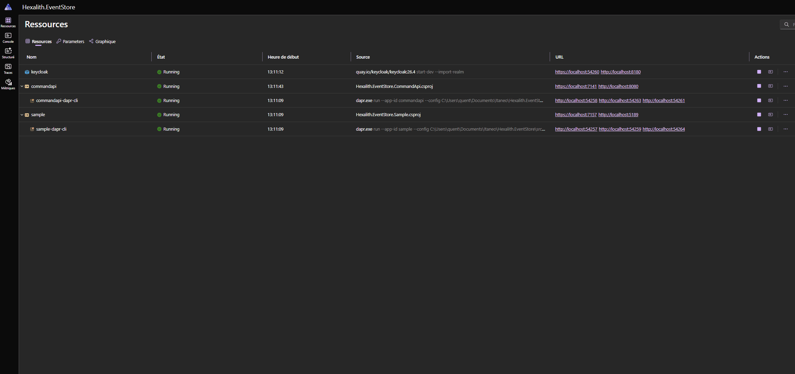
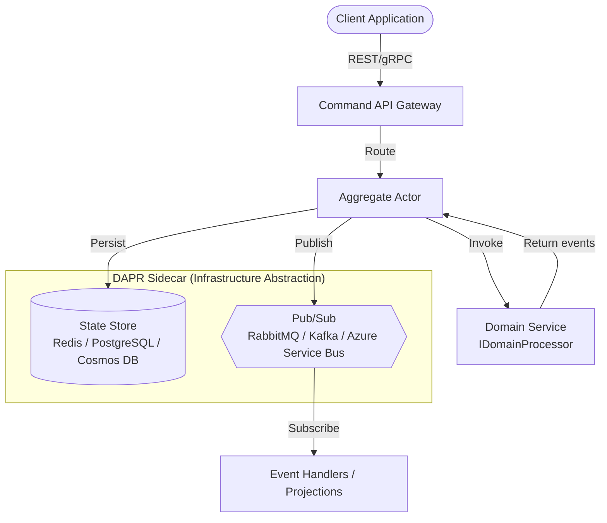

# Hexalith.EventStore — DAPR-native event sourcing server for .NET

[](https://github.com/Hexalith/Hexalith.EventStore/stargazers)
[](https://www.nuget.org/packages/Hexalith.EventStore.Contracts)
[](https://github.com/Hexalith/Hexalith.EventStore/actions/workflows/ci.yml)
[](LICENSE)

If you've spent weeks wiring up an event store, a message broker, and multi-tenant isolation — only to realize you'll do it again for your next project — we built this for you. Hexalith.EventStore is a distributed, CQRS and DDD-ready event sourcing framework that handles command routing, event persistence, snapshots, and pub/sub delivery so you can focus on domain logic. Built on DAPR for infrastructure portability.

**Get started in under 10 minutes:** [Quickstart Guide](docs/getting-started/quickstart.md)

## The Programming Model

Your domain logic is conceptually a pure function: $(Command, CurrentState?) \rightarrow List<DomainEvent>$. The runtime contract uses `Task<DomainResult>` so Hexalith can carry success/rejection outcomes alongside emitted events.

```csharp
// (Command, CurrentState?) → List<DomainEvent>
public interface IDomainProcessor {
    Task<DomainResult> ProcessAsync(CommandEnvelope command, object? currentState);
}

public class CounterProcessor : IDomainProcessor {
    public Task<DomainResult> ProcessAsync(CommandEnvelope cmd, object? state) => Task.FromResult(cmd.CommandType switch {
        "Increment" => DomainResult.Success(new[] { new CounterIncremented() }),
        "Decrement" when (int)(state ?? 0) > 0 => DomainResult.Success(new[] { new CounterDecremented() }),
        "Decrement" => DomainResult.Rejection(new[] { new CannotGoNegative() }),
        _ => throw new InvalidOperationException($"Unknown: {cmd.CommandType}")
    });
}
```

## Why Hexalith?

| Feature | Hexalith | Marten | EventStoreDB | Custom |
| --------- | ---------- | -------- | -------------- | -------- |
| Infrastructure portability | Any store/broker, zero-code swap | PostgreSQL only | Dedicated server | You build it |
| Multi-tenant isolation | Built-in: data, topics, access | Manual | Manual | You build it |
| CQRS/ES framework | Complete, infra-agnostic | Complete, PG-coupled | Storage only, BYO framework | You build it |
| Deployment | DAPR sidecar: Docker, K8s, ACA | App library | Server + clients | You build it |
| Database lock-in | None (Redis, PG, Cosmos, etc.) | PostgreSQL | EventStoreDB | Chosen DB |

> **Note:** Hexalith is not the right tool for every scenario. If you need raw event stream performance or already run PostgreSQL everywhere, see the [decision aid](docs/concepts/choose-the-right-tool.md).

## Get Started

**Get started in under 10 minutes** — follow the [Quickstart Guide](docs/getting-started/quickstart.md).

Prerequisites: [.NET SDK](https://dotnet.microsoft.com/download), [Docker Desktop](https://www.docker.com/products/docker-desktop/), [DAPR CLI](https://docs.dapr.io/getting-started/install-dapr-cli/)

## Architecture



<details>
<summary>Architecture diagram text description</summary>

The system follows a command-event architecture: Client applications send commands via REST/gRPC to the Command API Gateway, which routes them to Aggregate Actors. Each actor invokes the domain service (your IDomainProcessor implementation) and persists resulting events to a state store. Events are published to a pub/sub system for downstream consumers. DAPR provides the infrastructure abstraction layer, allowing you to swap state stores (Redis, PostgreSQL, Cosmos DB) and message brokers (RabbitMQ, Kafka, Azure Service Bus) without changing application code.

</details>

## Documentation

### Getting Started

- [Quickstart Guide](docs/getting-started/quickstart.md) — up and running in under 10 minutes
- [Prerequisites](docs/getting-started/prerequisites.md) — required tools and environment setup

### Concepts

- [Architecture Overview](docs/concepts/architecture-overview.md) — system topology and design decisions
- [Choose the Right Tool](docs/concepts/choose-the-right-tool.md) — when Hexalith is (and isn't) the right fit

### Guides

- [Deployment Guides](docs/guides/) — Docker Compose, Kubernetes, Azure Container Apps

### Reference

- [API Reference](docs/reference/) — command API endpoints and configuration
- [NuGet Packages](https://www.nuget.org/packages?q=Hexalith.EventStore) — available packages on NuGet

### Community

- [GitHub Discussions](https://github.com/Hexalith/Hexalith.EventStore/discussions) — questions, ideas, and community support
- [Issue Tracker](https://github.com/Hexalith/Hexalith.EventStore/issues) — bug reports and feature requests

## Contributing

Contributions are welcome! Please read the [Contributing Guide](CONTRIBUTING.md) and [Code of Conduct](CODE_OF_CONDUCT.md) before submitting a pull request.

## License

This project is licensed under the [MIT License](LICENSE).

See the [Changelog](CHANGELOG.md) for release history and notable changes.
