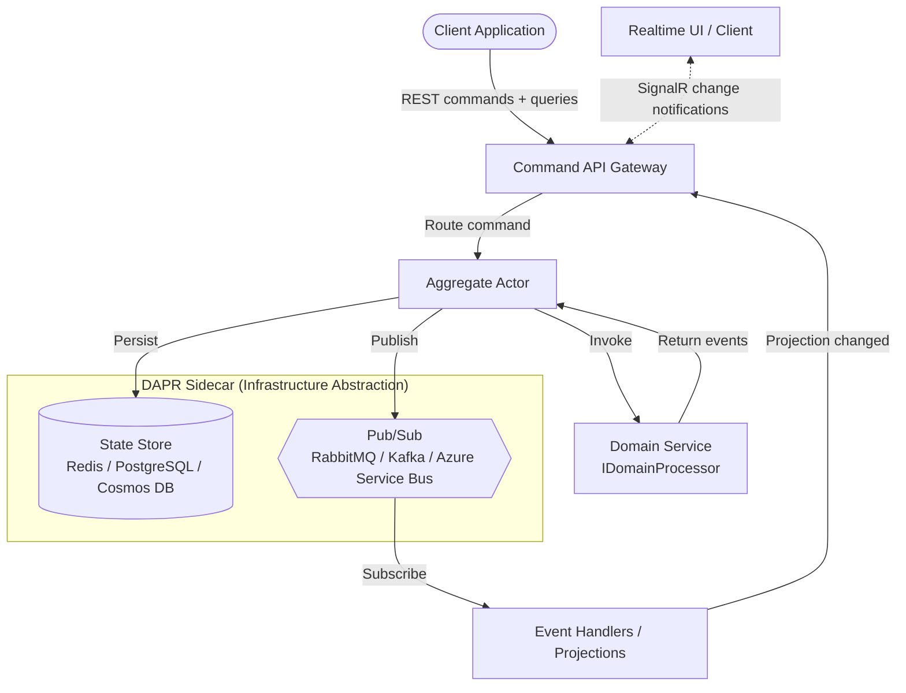

# Hexalith.EventStore — DAPR-native event sourcing server for .NET

[](https://github.com/Hexalith/Hexalith.EventStore/stargazers)
[](https://www.nuget.org/packages/Hexalith.EventStore.Contracts)
[](https://github.com/Hexalith/Hexalith.EventStore/actions/workflows/ci.yml)
[](https://github.com/Hexalith/Hexalith.EventStore/actions/workflows/docs-validation.yml)
[](LICENSE)

If you've spent weeks wiring up an event store, a message broker, multi-tenant isolation, and a read-model refresh story — only to realize you'll do it again for your next project — we built this for you. Hexalith.EventStore is a distributed, CQRS and DDD-ready event sourcing framework that handles command routing, event persistence, snapshots, query execution, and pub/sub delivery so you can focus on domain logic. Built on DAPR for infrastructure portability.

## The Programming Model

Your domain logic lives in an aggregate class with typed `Handle` methods — conceptually a pure function: $(Command, CurrentState?) \rightarrow List<DomainEvent>$. Each `Handle` method receives a specific command and the current state, then returns a `DomainResult` carrying success events or rejections.

```csharp
public sealed class CounterAggregate : EventStoreAggregate<CounterState>
{
    public static DomainResult Handle(IncrementCounter command, CounterState? state)
        => DomainResult.Success(new IEventPayload[] { new CounterIncremented() });

    public static DomainResult Handle(DecrementCounter command, CounterState? state)
    {
        if ((state?.Count ?? 0) == 0)
            return DomainResult.Rejection(new IRejectionEvent[] { new CounterCannotGoNegative() });
        return DomainResult.Success(new IEventPayload[] { new CounterDecremented() });
    }

    public static DomainResult Handle(ResetCounter command, CounterState? state)
    {
        if ((state?.Count ?? 0) == 0)
            return DomainResult.NoOp();
        return DomainResult.Success(new IEventPayload[] { new CounterReset() });
    }
}

public sealed class CounterState
{
    public int Count { get; private set; }
    public void Apply(CounterIncremented e) => Count++;
    public void Apply(CounterDecremented e) => Count--;
    public void Apply(CounterReset e) => Count = 0;
}
```

> Under the hood, `EventStoreAggregate<TState>` implements `IDomainProcessor` — you can still use that interface directly for advanced scenarios (see the legacy [`CounterProcessor`](samples/Hexalith.EventStore.Sample/Counter/CounterProcessor.cs) example).

## Why Hexalith?

| Feature                    | Hexalith                         | Marten               | EventStoreDB                | Custom       |
| -------------------------- | -------------------------------- | -------------------- | --------------------------- | ------------ |
| Infrastructure portability | Any store/broker, zero-code swap | PostgreSQL only      | Dedicated server            | You build it |
| Multi-tenant isolation     | Built-in: data, topics, access   | Manual               | Manual                      | You build it |
| CQRS/ES framework          | Complete, infra-agnostic         | Complete, PG-coupled | Storage only, BYO framework | You build it |
| Deployment                 | DAPR sidecar: Docker, K8s, ACA   | App library          | Server + clients            | You build it |
| Database lock-in           | None (Redis, PG, Cosmos, etc.)   | PostgreSQL           | EventStoreDB                | Chosen DB    |

> **Note:** Hexalith is not the right tool for every scenario. If you need raw event stream performance or already run PostgreSQL everywhere, see the [decision aid](docs/concepts/choose-the-right-tool.md).

## Get Started

Register the event store in two lines — `AddEventStore()` scans your assembly for aggregate types, no manual registration needed:

```csharp
builder.Services.AddEventStore();  // Auto-discovers CounterAggregate
// ...
app.UseEventStore();               // Activates domains with convention-derived names
```

Today the sample topology also includes a query endpoint, preflight authorization endpoints, projection invalidation hooks, and optional SignalR notifications for real-time read-model refresh.

**Get started in under 10 minutes** — follow the [Quickstart Guide](docs/getting-started/quickstart.md).

Prerequisites: [.NET SDK](https://dotnet.microsoft.com/download), [Docker Desktop](https://www.docker.com/products/docker-desktop/), [DAPR CLI](https://docs.dapr.io/getting-started/install-dapr-cli/)

## Architecture



<details>
<summary>Architecture diagram text description</summary>

The system follows a command-event architecture with a built-in read-model refresh path: client applications send commands and queries via REST to the Command API Gateway, which routes commands to Aggregate Actors and queries to projection handlers. Each actor invokes the domain service (your `IDomainProcessor` implementation) and persists resulting events to a state store. Events are published to a pub/sub system for downstream consumers, and projection changes can be surfaced back to clients through HTTP cache validators and optional SignalR notifications. DAPR provides the infrastructure abstraction layer, allowing you to swap state stores (Redis, PostgreSQL, Cosmos DB) and message brokers (RabbitMQ, Kafka, Azure Service Bus) without changing application code.

</details>

## Documentation

Full documentation index: [Documentation](docs/index.md)

### Getting Started

- [Quickstart Guide](docs/getting-started/quickstart.md) — up and running in under 10 minutes
- [Prerequisites](docs/getting-started/prerequisites.md) — required tools and environment setup

### Concepts

- [Architecture Overview](docs/concepts/architecture-overview.md) — system topology and design decisions
- [Choose the Right Tool](docs/concepts/choose-the-right-tool.md) — when Hexalith is (and isn't) the right fit
- [Event Versioning & Schema Evolution](docs/concepts/event-versioning.md) — safely evolving event schemas over time

### Guides

- [Upgrade Path](docs/guides/upgrade-path.md) — migrating between versions
- [DAPR FAQ Deep Dive](docs/guides/dapr-faq.md) — honest answers about DAPR dependency, risks, and operational costs
- [Deployment Guides](docs/guides/) — Docker Compose, Kubernetes, Azure Container Apps
- [Production Deployment Configuration](deploy/README.md) — DAPR component configs, backend swap, secret management

### Reference

- [Command API Reference](docs/reference/command-api.md) — command submission, status, replay, and preflight validation
- [Query & Projection API Reference](docs/reference/query-api.md) — query execution, ETag caching, projection notifications, and SignalR
- [NuGet Packages Guide](docs/reference/nuget-packages.md) — package roles, dependencies, and installation guidance
- [Generated API Reference](docs/reference/api/) — auto-generated public type documentation

### Community

- [Product Roadmap](docs/community/roadmap.md) — planned features and project direction
- [Awesome Event Sourcing](docs/community/awesome-event-sourcing.md) — curated ecosystem resources
- [GitHub Discussions](https://github.com/Hexalith/Hexalith.EventStore/discussions) — questions, ideas, and community support
- [Issue Tracker](https://github.com/Hexalith/Hexalith.EventStore/issues) — bug reports and feature requests

## Contributing

Contributions are welcome! Please read the [Contributing Guide](CONTRIBUTING.md) and [Code of Conduct](CODE_OF_CONDUCT.md) before submitting a pull request.

## License

This project is licensed under the [MIT License](LICENSE).

See the [Changelog](CHANGELOG.md) for release history and notable changes.
