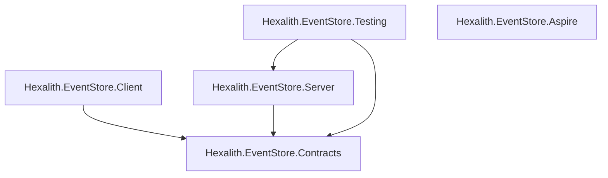

# Story 12.8: NuGet Packages Guide & Dependency Graph

Status: done

## Story

As a developer adding Hexalith packages to their project,
I want to know which NuGet package to install for my use case and see the dependency relationships,
So that I install only what I need.

## Acceptance Criteria

1. Given a developer navigates to `docs/reference/nuget-packages.md`, when they read the page, then it lists all 5 public NuGet packages with: package name, description, primary use case, and when to install it
2. The page includes an inline Mermaid flowchart showing package dependency relationships (FR20) with `<details>` text description for accessibility (NFR7)
3. Package descriptions use terminology consistent with the documentation (NFR28)
4. The page follows the standard page template (back-link, H1, summary, prerequisites, Next Steps)

## Tasks / Subtasks

- [x] Task 1: Create `docs/reference/nuget-packages.md` with page template structure (AC: #1, #4)
    - [x] 1.1 Add back-link `[← Back to Hexalith.EventStore](../../README.md)` using Unicode arrow
    - [x] 1.2 Add H1 title "NuGet Packages Guide"
    - [x] 1.3 Add one-paragraph summary: guide to the 5 published NuGet packages, their purposes, dependencies, and which ones to install for each use case. Audience: .NET developers integrating Hexalith.EventStore into their projects.
    - [x] 1.4 Add prerequisites callout: `> **Prerequisites:** [Architecture Overview](../concepts/architecture-overview.md)` — reader should understand the system topology
    - [x] 1.5 Add Next Steps footer:
        - "**Next:** [Command API Reference](command-api.md) — look up REST endpoints with request/response examples"
        - "**Related:** [Architecture Overview](../concepts/architecture-overview.md), [First Domain Service](../getting-started/first-domain-service.md), [Quickstart](../getting-started/quickstart.md)"

- [x] Task 2: Write "Package Overview" section — table of all 5 packages (AC: #1, #3)
    - [x] 2.1 Create a table with columns: Package, Description, When to Install
    - [x] 2.2 Hexalith.EventStore.Contracts — Domain types: commands, events, results, identities. Install: always required (foundational types for any Hexalith integration)
    - [x] 2.3 Hexalith.EventStore.Client — Client abstractions, domain processor contract, and DI registration. Install: in your domain service project to register domain processors
    - [x] 2.4 Hexalith.EventStore.Server — Server-side domain processors, aggregate actors, DAPR state/pub-sub integration. Install: in the hosting project that runs the event store server
    - [x] 2.5 Hexalith.EventStore.Testing — In-memory fakes, builders, and test helpers for unit/integration testing. Install: in your test projects
    - [x] 2.6 Hexalith.EventStore.Aspire — .NET Aspire hosting extensions for DAPR topology orchestration. Install: in your AppHost project for local development orchestration

- [x] Task 3: Write "Dependency Graph" section with Mermaid diagram (AC: #2, #3)
    - [x] 3.1 Create a Mermaid flowchart showing inter-package dependencies:
        - Contracts has no dependencies (root node)
        - Client depends on Contracts
        - Server depends on Contracts
        - Testing depends on Contracts + Server
        - Aspire is independent (no project references to other packages)
    - [x] 3.2 Wrap the Mermaid diagram in proper markdown code fence with `mermaid` language tag
    - [x] 3.3 Add `<details><summary>Text description of the dependency graph</summary>` block (NFR7 accessibility) describing the relationships in prose
    - [x] 3.4 Add a brief note: "All 5 packages always ship at the same semantic version. Install matching versions to avoid compatibility issues."

- [x] Task 4: Write "Which Packages Do I Need?" section — scenario-based guide (AC: #1, #3)
    - [x] 4.1 Scenario: "Building a domain service" — install Contracts + Client. Explain: Contracts gives you the types, Client gives you `AddEventStore` registration and the domain processor contract
    - [x] 4.2 Scenario: "Running the event store server" — install Contracts + Server. Explain: Server provides the aggregate actors, command routing, and DAPR integration
    - [x] 4.3 Scenario: "Testing your domain service" — install Testing (transitively pulls Contracts + Server). Explain: provides in-memory implementations, fake state stores, and test builders
    - [x] 4.4 Scenario: "Local development with Aspire" — install Aspire in your AppHost. Explain: provides `AddEventStore` hosting extension for DAPR topology orchestration
    - [x] 4.5 Scenario: "Full stack (domain service + hosting + testing)" — install Contracts + Client + Aspire + Testing across your projects. Include a brief project-to-package mapping table

- [x] Task 5: Write "Package Details" section — one subsection per package (AC: #1, #3)
    - [x] 5.1 For each package, document:
        - Key namespaces and types
        - External dependencies (DAPR SDK, MediatR, FluentValidation, etc. with versions from Directory.Packages.props)
        - Install command: `dotnet add package Hexalith.EventStore.<Name>`
    - [x] 5.2 Contracts: pure domain types — CommandEnvelope, EventEnvelope, DomainResult, identity types. No external dependencies.
    - [x] 5.3 Client: DI registration, domain processor abstractions. External deps: Dapr.Client, Microsoft.Extensions.Configuration.Binder, Microsoft.Extensions.Hosting.Abstractions
    - [x] 5.4 Server: aggregate actors, command routing, state/pub-sub. External deps: Dapr.Client, Dapr.Actors, Dapr.Actors.AspNetCore, MediatR
    - [x] 5.5 Testing: test helpers and fakes. External deps: Shouldly, NSubstitute, xunit.assert
    - [x] 5.6 Aspire: hosting extensions. External deps: Aspire.Hosting, CommunityToolkit.Aspire.Hosting.Dapr

- [x] Task 6: Write "Versioning" section (AC: #3)
    - [x] 6.1 Explain MinVer-based SemVer: versions derived from git tags with `v` prefix
    - [x] 6.2 Explain centralized package management: all versions defined in `Directory.Packages.props` at repo root
    - [x] 6.3 Note: all 5 packages always ship at the same version — no mix-and-match versions
    - [x] 6.4 Link to NuGet.org: `https://www.nuget.org/packages?q=Hexalith.EventStore`

- [x] Task 7: Verify page compliance (AC: #4)
    - [x] 7.1 No YAML frontmatter
    - [x] 7.2 All links use relative paths
    - [x] 7.3 Second-person tone, present tense, professional-casual
    - [x] 7.4 All code blocks have language tags (`bash`, `json`, `csharp`, `mermaid`)
    - [x] 7.5 Terminal commands prefixed with `$`
    - [x] 7.6 One H1 per page
    - [x] 7.7 Back-link with Unicode `←`
    - [x] 7.8 Run `markdownlint-cli2 docs/reference/nuget-packages.md` to verify lint compliance
    - [x] 7.9 Self-containment test: page understandable with Architecture Overview as only prerequisite

## Dev Notes

### Implementation Approach — New Reference Page (MUST follow)

**This story creates `docs/reference/nuget-packages.md` — a NEW file.** This is a reference page, not a tutorial. It goes in `docs/reference/` alongside `command-api.md` (from story 12-7, may or may not exist yet).

The reference folder exists at `docs/reference/` but currently contains only `.gitkeep`.

### Content Source — The Actual Codebase

All package details, dependencies, and metadata come from the actual source code. Do NOT invent or guess package behavior. The following source files are authoritative:

**Package .csproj Files (5 published packages):**

- `src/Hexalith.EventStore.Contracts/Hexalith.EventStore.Contracts.csproj` — pure domain types, zero dependencies
- `src/Hexalith.EventStore.Client/Hexalith.EventStore.Client.csproj` — depends on Contracts + Dapr.Client + Microsoft.Extensions.\*
- `src/Hexalith.EventStore.Server/Hexalith.EventStore.Server.csproj` — depends on Contracts + Dapr.\* + MediatR
- `src/Hexalith.EventStore.Testing/Hexalith.EventStore.Testing.csproj` — depends on Contracts + Server + Shouldly + NSubstitute + xunit
- `src/Hexalith.EventStore.Aspire/Hexalith.EventStore.Aspire.csproj` — depends on Aspire.Hosting + CommunityToolkit.Aspire.Hosting.Dapr

**Centralized Version Management:**

- `Directory.Packages.props` — all package versions centralized here

**Non-packable projects (DO NOT document as NuGet packages):**

- `Hexalith.EventStore.CommandApi` (IsPackable=false, API gateway web app)
- `Hexalith.EventStore.AppHost` (IsPackable=false, Aspire orchestrator)
- `Hexalith.EventStore.ServiceDefaults` (IsPackable=false, shared Aspire config)

**Release Validation:**

- `.github/workflows/release.yml` — validates exactly 5 .nupkg files, all at same version

### Dependency Graph (Exact Project References)

```
Contracts (no project references, no package references)
  ├→ Client (ProjectReference: Contracts)
  │    External: Dapr.Client, Microsoft.Extensions.Configuration.Binder, Microsoft.Extensions.Hosting.Abstractions
  ├→ Server (ProjectReference: Contracts)
  │    External: Dapr.Client, Dapr.Actors, Dapr.Actors.AspNetCore, MediatR
  └→ Testing (ProjectReference: Contracts + Server)
       External: Shouldly, NSubstitute, xunit.assert

Aspire (no project references to other Hexalith packages)
  External: Aspire.Hosting, CommunityToolkit.Aspire.Hosting.Dapr
```

**Key insight:** Testing depends on Server (not just Contracts) because it provides fake implementations of server-side components (fake state stores, test builders). This is intentional for integration testing.

**Key insight:** Aspire is fully independent — it provides hosting extensions and has no dependency on any other Hexalith.EventStore package. It only depends on Aspire hosting libraries.

### Key External Dependency Versions (from Directory.Packages.props)

| Category | Package                                   | Version |
| -------- | ----------------------------------------- | ------- |
| DAPR     | Dapr.Client                               | 1.16.1  |
| DAPR     | Dapr.Actors                               | 1.16.1  |
| DAPR     | Dapr.Actors.AspNetCore                    | 1.16.1  |
| Pipeline | MediatR                                   | 14.0.0  |
| Aspire   | Aspire.Hosting                            | 13.1.x  |
| Aspire   | CommunityToolkit.Aspire.Hosting.Dapr      | 13.0.0  |
| Testing  | Shouldly                                  | 4.3.0   |
| Testing  | NSubstitute                               | 5.3.0   |
| Testing  | xunit.assert                              | 2.9.3   |
| Config   | Microsoft.Extensions.Configuration.Binder | 10.0.0  |
| Hosting  | Microsoft.Extensions.Hosting.Abstractions | 10.0.0  |

### Mermaid Diagram Requirements

The Mermaid dependency graph MUST include a `<details>` accessibility description (NFR7). Example structure:

````markdown

````

<details>
<summary>Text description of the dependency graph</summary>
(Prose description of all dependency relationships)
</details>
```

### Page Conventions (MUST follow)

From `docs/page-template.md`:

- Back-link: `[← Back to Hexalith.EventStore](../../README.md)` — use Unicode `←`
- One H1 per page
- Max 2 prerequisites
- Code blocks with language tags (`bash`, `csharp`, `mermaid`)
- Terminal commands prefixed with `$`
- No YAML frontmatter
- No hard-wrap in markdown source
- Relative links only
- Second-person tone, present tense
- Next Steps footer with "Next:" and "Related:" links

### Content Tone (MUST follow)

Reference page style — factual, direct, scannable:

- **Tables for package listings** — not inline prose descriptions
- **Install commands as copy-pasteable snippets** — `dotnet add package ...`
- **Concise explanations** — reference pages are for looking things up, not teaching concepts
- **Cross-references** to concept pages for deeper understanding (don't duplicate concept page content)

### What NOT to Do

- Do NOT fabricate package contents — all details must match the codebase
- Do NOT document non-packable projects (CommandApi, AppHost, ServiceDefaults) as NuGet packages
- Do NOT document internal implementation details beyond what a consumer needs
- Do NOT add YAML frontmatter
- Do NOT hard-wrap markdown source lines
- Do NOT duplicate architecture overview content — cross-reference it
- Do NOT include specific version numbers in the install commands (let NuGet resolve latest)

### Relationship to Adjacent Stories

- **Story 12-1 (Architecture Overview):** Concept page with system topology. This page's prerequisite. Cross-link for understanding where packages fit.
- **Story 12-7 (Command API Reference):** Previous reference page. Its Next Steps link points to this page (`nuget-packages.md`).
- **Story 12-9 (Awesome Event Sourcing Ecosystem):** Next story in epic. Could reference NuGet packages in ecosystem context.
- **Story 15-1 (Configuration Reference):** Future reference page. This page may link to it for configuration details.

### Previous Story (12-7) Intelligence

**Patterns established in 12-1 through 12-7:**

- Second-person tone, present tense, professional-casual
- Counter domain as running example across concept pages
- Self-containment with inline concept explanations
- No YAML frontmatter
- Unicode `←` in back-links
- Reference pages use tables for structured data, code examples for copy-paste
- `docs/reference/` folder for reference pages (12-7 creates `command-api.md`)

**12-7 status:** ready-for-dev (story file created but not yet implemented). 12-7's Next Steps footer should link to this page as "Next: NuGet Packages Guide".

**Key distinction:** Stories 12-1 through 12-5 are concept pages. Story 12-6 is a tutorial. Stories 12-7 and 12-8 are REFERENCE pages — lookup resources, not teaching documents.

### Git Intelligence

Recent commits:

- Epic 11 (docs CI pipeline) completed — `markdownlint-cli2` and lychee link checking available
- Epic 16 (fluent client SDK) completed — all packages now use fluent API patterns (`AddEventStore`, `UseEventStore`)
- Concept pages (12-1 through 12-5) done — cross-reference targets exist
- Story 12-6 (first domain service tutorial) in progress — shows package usage in practice
- Fluent API changes the Client package significantly — `AddEventStore()` extension method, assembly scanning, cascading configuration

### File to Create

- **Create:** `docs/reference/nuget-packages.md` (new file in `docs/reference/` folder)

### Project Structure Notes

- File path: `docs/reference/nuget-packages.md`
- The `docs/reference/` folder exists but contains only `.gitkeep` (unless 12-7 has been implemented)
- Adjacent reference pages: `command-api.md` (12-7), future configuration reference (15-1)
- Concept pages to cross-reference: `docs/concepts/architecture-overview.md`
- Getting started pages to cross-reference: `docs/getting-started/first-domain-service.md`, `docs/getting-started/quickstart.md`

### References

- [Source: _bmad-output/planning-artifacts/epics.md, Story 5.8 — NuGet Packages Guide & Dependency Graph]
- [Source: _bmad-output/planning-artifacts/prd-documentation.md, FR20 — Package dependency graph]
- [Source: src/Hexalith.EventStore.Contracts/Hexalith.EventStore.Contracts.csproj — Contracts package structure]
- [Source: src/Hexalith.EventStore.Client/Hexalith.EventStore.Client.csproj — Client package dependencies]
- [Source: src/Hexalith.EventStore.Server/Hexalith.EventStore.Server.csproj — Server package dependencies]
- [Source: src/Hexalith.EventStore.Testing/Hexalith.EventStore.Testing.csproj — Testing package dependencies]
- [Source: src/Hexalith.EventStore.Aspire/Hexalith.EventStore.Aspire.csproj — Aspire package dependencies]
- [Source: Directory.Packages.props — centralized version management]
- [Source: .github/workflows/release.yml — release validation (5 packages)]
- [Source: docs/page-template.md — page structure rules]
- [Source: docs/concepts/architecture-overview.md — system topology reference]
- [Source: _bmad-output/implementation-artifacts/12-7-command-api-reference.md — previous story context]

## Dev Agent Record

### Agent Model Used

Claude Opus 4.6

### Debug Log References

### Completion Notes List

- Created `docs/reference/nuget-packages.md` — complete NuGet packages reference page
- All 5 published packages documented with descriptions, use cases, dependency tables, and install commands
- Mermaid dependency graph with `<details>` accessibility description (NFR7)
- Scenario-based "Which Packages Do I Need?" guide with project-to-package mapping table
- Per-package detail sections with external dependencies and exact versions from `Directory.Packages.props`
- Versioning section explaining MinVer, centralized package management, and same-version shipping
- Page follows standard template: back-link with Unicode `←`, H1, summary, prerequisites, Next Steps
- All dependency data verified against actual `.csproj` files and `Directory.Packages.props`
- markdownlint-cli2: 0 errors
- All 465 Tier 1 tests pass — no regressions
- Post-review update: added explicit **Primary Use Case** coverage in the Package Overview table to fully satisfy AC #1
- Post-review update: added **Key namespaces and types** for all 5 packages to satisfy Task 5.1 completely
- Review scope note: repository working tree contained unrelated in-progress files from adjacent stories; this story remains scoped to `docs/reference/nuget-packages.md`

### File List

- **Created:** `docs/reference/nuget-packages.md`
- **Updated (post-review):** `docs/reference/nuget-packages.md`

## Senior Developer Review (AI)

### Reviewer

GPT-5.3-Codex (Senior Developer Review)

### Findings Summary

- High issues fixed: 2/2
    - Added explicit **Primary Use Case** field to the package overview table (AC #1 completeness)
    - Added **Key namespaces and types** for all packages (Task 5.1 completeness)
- Medium issues fixed/addressed: 2/2
    - Story traceability updated with explicit post-review file update and completion notes
    - Working-tree scope transparency documented (unrelated in-progress files acknowledged and excluded from story scope)

### Validation Performed

- `docs/reference/nuget-packages.md` reviewed against acceptance criteria and task checklist
- Package dependencies and versions cross-checked against `.csproj` files and `Directory.Packages.props`
- `markdownlint-cli2 docs/reference/nuget-packages.md` executed successfully (0 errors)

## Change Log

- 2026-03-01: Created NuGet Packages Guide & Dependency Graph reference page (Story 12.8)
- 2026-03-01: Senior code review applied — AC #1 and Task 5.1 completeness fixes added; story marked done
