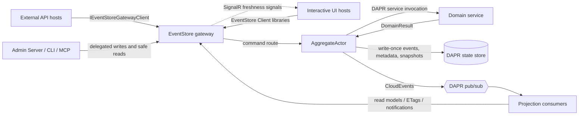
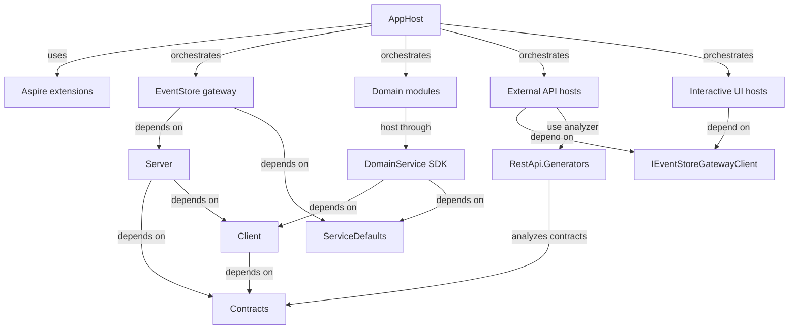
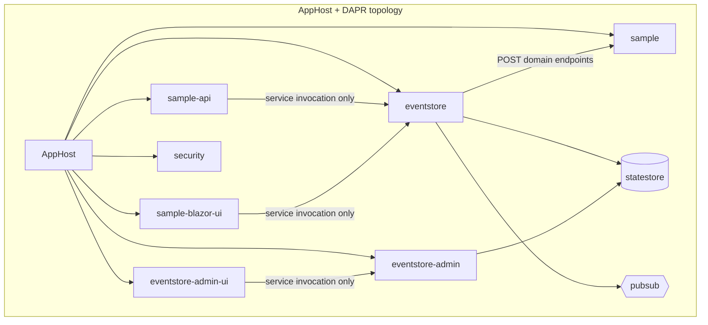

# Architecture Spine - eventstore Phase 4 Implementation Readiness Recovery

## Design Paradigm

Hexalith.EventStore is a DAPR-backed hexagonal event-sourcing platform. The EventStore gateway is the policy edge; DAPR actors own aggregate write serialization; domain services are pure domain adapters; generated REST hosts, interactive UI hosts, Admin surfaces, CLI, and MCP are external adapters that call platform seams instead of owning domain persistence.



## Invariants And Rules

### AD-1 - DAPR-Backed Hexagonal Event Sourcing [ADOPTED]

- **Binds:** all Phase 4 epics, FR1-FR35, NFR1-NFR18
- **Prevents:** one team treating EventStore as a CRUD web API while another builds actor-owned event sourcing.
- **Rule:** The system remains CQRS plus DDD plus event sourcing on DAPR state, actors, pub/sub, and service invocation, with Aspire owning local orchestration and deployable topology seed.

### AD-2 - Domain Modules Stay Domain-Centric [ADOPTED]

- **Binds:** FR1-FR10, FR33
- **Prevents:** Sample, Tenants, and future domains choosing incompatible hosting, query, projection, cursor, telemetry, health, or Aspire plumbing.
- **Rule:** Domain modules contain only domain behavior and contracts: aggregates, commands, events, projections, query handlers, validators, domain options, and contract types. Reusable hosting and infrastructure live in EventStore platform libraries. A conforming domain-service host calls `AddEventStoreDomainService()` and `UseEventStoreDomainService()`.

### AD-3 - Gateway Is The Command And Query Policy Boundary [ADOPTED]

- **Binds:** FR11-FR16, FR23-FR32, NFR1-NFR4, NFR14
- **Prevents:** generated APIs, UI hosts, Admin code, or domain services bypassing authorization, tenant validation, idempotency, status/archive, ETag, problem-details, and observability behavior.
- **Rule:** External command/query entry points delegate to the EventStore gateway. They do not call MediatR handlers, domain services, DAPR actors, state stores, projection actors, or query dispatchers directly.

### AD-4 - Generated REST Lives In Dedicated External API Hosts [ADOPTED]

- **Binds:** FR11-FR15, NFR12-NFR14
- **Prevents:** interactive UI hosts becoming accidental public API/BFF hosts with their own controller semantics.
- **Rule:** `Hexalith.EventStore.RestApi.Generators` emits controllers only into dedicated external-facing API hosts. Generated controllers delegate to `IEventStoreGatewayClient`. Interactive UI hosts consume EventStore Client libraries directly and host no generated or hand-written per-message MVC command/query controllers.

### AD-5 - AggregateActor Owns Durable Event Mutation [ADOPTED]

- **Binds:** FR23, FR27, FR29-FR31, NFR7
- **Prevents:** split-brain persistence where domain code, projections, or external hosts write events or command state independently.
- **Rule:** `AggregateActor` is the durable mutation coordinator. It invokes pure domain processors/domain services, persists write-once events and metadata, records recovery state, manages snapshots through platform services, and publishes CloudEvents. Domain code returns `DomainResult`; it never writes EventStore state directly.

### AD-6 - Persisted Event Identity Is Stable [ADOPTED]

- **Binds:** FR23, FR24, FR27, NFR6-NFR7
- **Prevents:** subscribers, duplicate command handling, and replay tooling choosing incompatible event identity or ordering semantics.
- **Rule:** Aggregate sequence is gapless per aggregate. `GlobalPosition` is non-zero and currently allocated by the DAPR-backed global allocator. CloudEvent id uses the persisted event `MessageId`. Duplicate command replies preserve the original result fields. Any future global-position sharding first updates the frozen global-ordering spec.

### AD-7 - Read Models And Cursors Use Platform Seams [ADOPTED]

- **Binds:** FR5-FR6, FR9, FR33, NFR8
- **Prevents:** each domain inventing its own DAPR state wrapper, optimistic-concurrency policy, cursor format, or cursor protection scope.
- **Rule:** Persisted read models use `IReadModelStore` plus `ReadModelWritePolicy`. Paging cursors use `IQueryCursorCodec` plus `QueryCursorScope`. Cursors are opaque, DataProtection-backed, scope-validated, bounded, and fail safe on tamper, malformed payloads, wrong scope, wrong query type, or key rotation.

### AD-8 - Projection Delivery Is A Freshness Signal [ADOPTED]

- **Binds:** FR7, FR16, FR34, NFR5-NFR6, NFR12, NFR15
- **Prevents:** UI or subscribers treating SignalR/DAPR notifications, HTTP 202, or command acceptance as proof of projection-confirmed success.
- **Rule:** DAPR pub/sub and projection notifications are at-least-once and unordered. Consumers deduplicate by EventStore `MessageId`. SignalR detail notifications are additive, group-scoped, metadata-only, bounded, and backward compatible with signal-only clients. User-visible success requires projection/read-model evidence.

### AD-9 - AppHost And DAPR YAML Change Together [ADOPTED]

- **Binds:** FR8, FR19-FR20, FR32, NFR2, NFR17
- **Prevents:** local AppHost, tests, and production deployment templates asserting different app IDs, sidecar resources, ACLs, key-prefix posture, topics, or placement/scheduler behavior.
- **Rule:** Runtime topology is one unit owned by AppHost plus DAPR component/configuration YAML. App IDs, sidecar options, state-store scopes, pub/sub scopes, ACL files, resiliency paths, placement/scheduler endpoints, publish targets, and topology tests change in the same slice.

### AD-10 - Security Fails Closed Above Infrastructure Scoping [ADOPTED]

- **Binds:** FR26, FR28, FR32, FR34, NFR1-NFR4, NFR15, NFR17
- **Prevents:** endpoints trusting network location, DAPR ACLs, caller-supplied administrator flags, or committed secrets as the whole security model.
- **Rule:** Public, internal, domain-service, projection-notification, and admin-computation endpoints require application-layer credentials and tenant authorization before disclosing data. Admin state mutations are attributable and support-safe. Deferred or unavailable admin operations are hidden, disabled, or return `501`.

### AD-11 - Release Is Manifest-Governed [ADOPTED]

- **Binds:** FR10, FR21-FR22, FR25, NFR9-NFR11
- **Prevents:** local submodule checkout state, Debug source references, or hard-coded package loops changing released package output.
- **Rule:** `tools/release-packages.json` is the EventStore release inventory. Release/package validation uses package-reference mode by default. Source project references require explicit `UseHexalithProjectReferences=true` and are never used for package publication. Submodule packages are not produced by EventStore release jobs.

### AD-12 - High-Risk Verification Requires Persisted Evidence [ADOPTED]

- **Binds:** NFR7, NFR10, NFR16, SM-C2
- **Prevents:** API smoke responses or mock call counts being accepted as integration proof for data-loss, topology, tenant isolation, release, or delivery behavior.
- **Rule:** Tier 2/3 and readiness-critical tests inspect persisted Redis/state-store/read-model/CloudEvent bodies, topology YAML or sidecar arguments, package outputs, and security denials where applicable. `202`, `200`, and mock calls are smoke signals only.

### AD-13 - Cost And Evolution Changes Are Spec-First

- **Binds:** FR24, FR33, FR35, NFR8, NFR18
- **Prevents:** story-local choices silently changing snapshot format, replay cost, projection ordering, event schema evolution, cancellation contracts, or global position meaning.
- **Rule:** Folded snapshots, projection delivery cost, projection sequence guards, event versioning/upcasting, event identity metadata validation, cancellation-token public seams, and global-position sharding require approved specs at named paths before implementation stories start. AOT/trimming remains out of target while reflection conventions are load-bearing.

### AD-14 - Query Evidence Crosses The Gateway As Platform Metadata

- **Binds:** FR4-FR6, FR15, FR34, NFR8, NFR15
- **Prevents:** domain handlers, gateway routing, generated APIs, and UI hosts disagreeing about freshness, projection version, paging, ETag, or projection-confirmed state.
- **Rule:** Query/read-model evidence metadata is carried through `QueryResponseMetadata` and HTTP response headers owned by the gateway, not ad hoc payload fields. The canonical flow is:

Domain/projection query result -> `QueryResult.Metadata` -> `QueryRouterResult.Metadata` -> `SubmitQueryResult.Metadata` -> `SubmitQueryResponse.Metadata` -> `EventStoreQueryResult.Metadata` -> generated external API headers or UI client state.

Merge rules are explicit:

- Domain/projection metadata is authoritative for freshness, projection version, paging, degraded state, and warning codes.
- The gateway is authoritative for the HTTP ETag header and may fill `QueryResponseMetadata.ETag` from the selected strong validator when the producer omitted it, but only for `ProjectionBacked` routes and only as an opaque cache validator — never as projection-version or freshness evidence (see AD-15).
- The gateway fills `ServedAt` only when absent.
- `IsNotModified` is derived from the HTTP outcome.
- Missing freshness is unknown, not current.
- ETag and projection version are distinct unless a projection explicitly defines them as equivalent.
- Paging metadata is evidence only when produced by the query handler/projection; request paging echoed by the gateway is not proof of total count, next cursor, or page completeness.

Generated REST controllers may forward metadata through support-safe headers such as `ETag`, `X-Hexalith-Projection-Version`, `X-Hexalith-Served-At`, `X-Hexalith-Is-Stale`, `X-Hexalith-Is-Degraded`, `X-Hexalith-Warning-Codes`, `X-Hexalith-Page-Size`, `X-Hexalith-Page-Offset`, `X-Hexalith-Next-Cursor`, `X-Hexalith-Total-Count`, and `X-Hexalith-Has-More` only when those metadata values are present and bounded. Cursors and ETags remain opaque and must not be parsed, displayed as support text, or logged as diagnostic detail.



### AD-15 - Query Response Provenance Is Explicit And Route-Bound

- **Binds:** FR4, FR12, FR15, FR34, NFR8, NFR15, NFR16
- **Prevents:** generated REST or UI code treating a gateway ETag, or a gateway-attached projection validator, as projection-backed current/stale evidence for a response no projection produced.
- **Rule:** Every query response carries an explicit provenance classification — `ProjectionBacked`, `HandlerComputed`, or `Unknown` — set by the route that produced it and preserved across `QueryResult.Metadata -> QueryRouterResult.Metadata -> SubmitQueryResult.Metadata -> SubmitQueryResponse.Metadata -> EventStoreQueryResult.Metadata`.

1. The HTTP / `QueryResponseMetadata.ETag` is an opaque cache validator only. It is a per-`(projectionType, tenant)` random change token (`SelfRoutingETag.GenerateNew`), not a content hash, and is never evidence of projection version, freshness, or projection-confirmed success.
2. The gateway must not attach a projection-actor ETag, projection version, or freshness to a response whose provenance is not `ProjectionBacked`. Handler-computed routes (`HandlerAwareQueryRouter`, which leaves `ProjectionType` null) are `HandlerComputed`; the gateway must not back-fill a projection ETag from `request.Domain` / `request.ProjectionType` for them.
3. `ProjectionVersion` and `IsStale` are authoritative only when provenance is `ProjectionBacked` and the value is sourced from persisted read-model freshness (`IReadModelFreshness` via `ReadModelFreshnessExtensions.ToQueryResponseMetadata`). A producer must not alias `ProjectionVersion := ETag`.
4. Consumers (generated REST headers, UI freshness indicators) render `Current` / `Stale` only for `ProjectionBacked` provenance. `HandlerComputed` and `Unknown` render as `Unknown` and must not claim projection-confirmed state. Missing provenance is `Unknown`, never `Current`.
5. Guardrail evidence is persisted-path, not mock (AD-12 / NFR16): a handler route must be asserted to carry no projection ETag/version on the real gateway path, and a projection-backed route to carry a genuine one.

AD-15 extends AD-14: AD-14 defines *what* metadata crosses and *how it merges*; AD-15 defines *whether* the ETag / projection validator legitimately belongs to the response path.

### AD-16 - Health And Probe Endpoints Are Explicitly Anonymous And Fail-Closed-Compatible [ADOPTED]

- **Binds:** FR26, FR28, FR34, NFR1, NFR3, NFR17
- **Prevents:** (a) a global fallback authorization policy silently blocking liveness/readiness/DAPR app-health probes, and (b) the inverse regression where a broken probe is "fixed" by weakening or removing the fallback policy, re-opening fail-open across every endpoint.
- **Rule:** The health/liveness/readiness probe endpoints mapped by `ServiceDefaults.MapDefaultEndpoints` — `/health`, `/alive`, `/ready` — are the *only* explicit anonymous exception to AD-10 fail-closed. They are:
  1. **Pinned anonymous by contract**: each probe endpoint declares explicit `AllowAnonymous()` (or an equivalent auth-exempt convention) so it does not depend on the absence of a fallback policy. Anonymity is intentional metadata, not an accident of configuration.
  2. **Support-safe**: anonymous probe responses expose only status (`Healthy`/`Degraded`/`Unhealthy`) and probe outcome. Component names, dependency detail, connection targets, versions, tenant data, and exception text are never disclosed to anonymous callers outside Development (the `DevelopmentHealthResponseWriter` remains Development-only).
  3. **Ordering-gated**: any host that introduces a global fallback authorization policy (or any default-deny endpoint convention) introduces the explicit probe-anonymity contract in the **same or an earlier** slice — never after. The fallback policy is the fail-closed default; the probe exemption is explicit `AllowAnonymous`. Neither the fallback policy nor the deny-by-default posture is weakened, scoped down, or removed to make probes reachable.
- **Evidence:** A test asserts, on the real host pipeline, that (i) `/health`, `/alive`, `/ready` return their health status to an **unauthenticated** caller, and (ii) a representative protected endpoint on the same host **denies** an unauthenticated caller — proving the fallback/deny default is enforced elsewhere and was not weakened to unblock probes (AD-12 / NFR16: persisted-path, not mock).

AD-16 refines AD-10: AD-10 makes every disclosing endpoint fail closed; AD-16 defines the single support-safe anonymous probe exemption and forbids using that need as a reason to weaken the fail-closed default.

### AD-17 - Generated Command-Status Location Is Absolute, Gateway-Authoritative, And Fail-Closed

- **Binds:** FR11-FR15, FR27, NFR12-NFR14, NFR16
- **Prevents:** generated external API hosts advertising a command-status `Location` they do not serve, that resolves against the wrong authority, or that pins the status key to a pre-FR27 identifier.
- **Rule:** The `202 Accepted` command-status `Location` a generated command controller emits is a gateway-owned affordance, never an external-host-owned route (AD-3, AD-4). The generated host maps no command-status endpoint of its own.

1. When a gateway command-status base URI is configured for the host, the generated controller emits an **absolute** `Location` (RFC 7231): `{gatewayStatusBase}/api/v1/commands/status/{statusKey}`, resolved at request time from a runtime option — never a compile-time constant.
2. When no gateway status base is configured, the generated controller emits **no** `Location` header. It never emits a relative or dangling status URL. Fail-closed (AD-10 posture); the `202` body still carries the tracking key.
3. `statusKey` is the single gateway-owned command-status tracking field surfaced on `SubmitCommandResponse` (today `CorrelationId`). The policy references that one field and does not assume `CorrelationId == MessageId`; re-keying command status/archive to `MessageId` is owned by FR27 / Epic 4 and changes the value transparently without changing this policy.
4. `Location` is emitted only on the `202 Accepted` success path; mapped gateway command failures emit no `Location`.
5. Guardrail evidence is generator-output plus runtime tests (AD-12): absolute-when-configured, header-absent-when-unconfigured, and never a relative status URL.

AD-17 complements AD-4: AD-4 says generated REST is a thin gateway delegator; AD-17 says the one cross-host affordance a generated command emits — the status `Location` — points at the gateway that owns the resource, or nothing.

### AD-18 - Outbound Sidecar Control-Plane Headers Are Handler-Owned [ADOPTED]

- **Binds:** FR13, FR14, FR26, FR28, NFR3, NFR17
- **Prevents:** a caller- or inbound-forwarded `dapr-app-id` / `dapr-api-token` duplicating or hijacking DAPR sidecar service-invocation routing, or leaking / mis-sending the sidecar token.
- **Rule:** Outbound DAPR service invocation from any host client sets the sidecar control-plane headers `dapr-app-id` and `dapr-api-token` authoritatively through a single platform-owned `DelegatingHandler` in `Hexalith.EventStore.Client`, wired by `AddEventStoreGatewayClient`.

1. **Replace, never append**: the handler removes any pre-existing `dapr-app-id`, then sets the configured app id as the single value (`Headers.Remove` + `TryAddWithoutValidation`, never a bare `TryAddWithoutValidation`).
2. The handler removes any pre-existing `dapr-api-token` and sets the configured token only when one is present; when no token is configured it strips any pre-existing `dapr-api-token`.
3. The handler is the innermost (last-run) handler in the gateway-client chain, so it has the final say after any inbound bearer / header-forwarding handler.
4. Caller- or inbound-forwarded values never influence sidecar routing or the sidecar token.
5. Hosts must not define their own DAPR routing-header handler (AD-2). A structural guardrail test fails if a host declares a local DAPR routing-header handler or uses `TryAddWithoutValidation` for `dapr-app-id` / `dapr-api-token`.

Guardrail evidence (AD-12): a unit test seeds a pre-existing `dapr-app-id` / `dapr-api-token` on the outbound request and asserts the sidecar receives exactly one authoritative value (the injected value is discarded) — single-value assertion, not only the happy path.

AD-18 extends AD-3 (gateway is the command/query policy boundary) and AD-10 (security fails closed), applied to the client-to-sidecar transport boundary, and is enforced through the platform per AD-2 (domain modules stay domain-centric; no per-host transport boilerplate).

## Consistency Conventions

| Concern | Convention |
| --- | --- |
| Identity | EventStore message, correlation, causation, and aggregate identifiers use ULID-safe handling where envelope semantics require sortable ids. `Guid.TryParse` is forbidden for those fields. Domain-specific ids may be caller-supplied only where that domain contract says so. |
| Domain naming | Domains, command types, query types, projection types, state stores, topics, and app IDs use existing EventStore naming conventions and kebab-case where the convention engine owns names. |
| State keys | Tenant, domain, and aggregate identity remain explicit in actor IDs, state keys, topic names, query scopes, SignalR groups, and admin filters. |
| Mutation | Commands produce events through pure aggregate/domain handlers. No code edits, deletes, or rewrites persisted events to repair business state; use compensating commands and verify projection evidence. |
| Errors | External failures use safe problem details or structured rejection events. Business failures are domain results/rejections, not infrastructure exceptions. |
| Command status | The generated `202` command-status `Location` is gateway-authoritative and fail-closed (AD-17): absolute to the configured gateway status base, or omitted. External API hosts map no command-status route. |
| Health probes | `/health`, `/alive`, `/ready` (from `ServiceDefaults.MapDefaultEndpoints`) are explicitly `AllowAnonymous` and support-safe. They are the only anonymous exception to fail-closed (AD-16); a fallback/deny-by-default policy is never weakened to reach them. |
| Serialization | Command, rehydrate, project, and pub/sub payloads use shared platform serialization paths once Story 4.3 lands; no story introduces a private JSON option set for the same payload family. |
| Cursors and ETags | Cursors and ETags are opaque implementation details. They are not parsed, displayed, logged, or exposed as support text. An ETag is a cache validator, not projection evidence; version/freshness claims require `ProjectionBacked` route provenance (AD-15). |
| Sidecar control-plane headers | Outbound `dapr-app-id` / `dapr-api-token` are handler-owned, **replaced not appended**, set authoritatively from config by the single platform handler; caller/inbound-forwarded values are never routed (AD-18). |
| UI | Module UI uses FrontComposer and Fluent UI Blazor V5. UI success is projection-confirmed, support-safe, accessible, and localized; detailed UX flows live in `ux.md`. |
| Runtime topology | AppHost resource names, DAPR app IDs, component scopes, ACL policies, pub/sub topics, and deployment overlays remain aligned by tests. |
| Release | Restore/build use `Hexalith.EventStore.slnx`; unit tests run per project; package versions live in central props; release output is manifest-driven. |

## Stack

| Name | Version |
| --- | --- |
| .NET SDK | 10.0.301 (`rollForward: latestPatch`) |
| Target framework | net10.0 |
| Aspire.Hosting | 13.4.6 |
| Aspire.Hosting.Keycloak / Kubernetes | 13.4.6-preview.1.26319.6 |
| CommunityToolkit.Aspire.Hosting.Dapr | 13.4.0-preview.1.260602-0230 |
| Dapr .NET SDK packages | 1.18.4 |
| MediatR | 14.2.0 |
| FluentValidation | 12.1.1 |
| ASP.NET Core / SignalR packages | 10.0.9 |
| Microsoft.CodeAnalysis packages | 5.6.0 |
| Microsoft.FluentUI.AspNetCore.Components | 5.0.0-rc.4-26180.1 |
| OpenTelemetry exporter/hosting/ASP.NET/HTTP packages | 1.16.0 |
| OpenTelemetry runtime instrumentation | 1.15.1 |
| Hexalith.Commons.UniqueIds | 2.26.0 |
| xUnit v3 | 3.2.2 |
| Shouldly | 4.3.0 |
| NSubstitute | 6.0.0-rc.1 |

## Structural Seed

```text
src/
  Hexalith.EventStore.Contracts/        # stable command, event, query, REST, result, security contracts
  Hexalith.EventStore.Client/           # aggregate/projection bases, gateway client, read-model/cursor seams
  Hexalith.EventStore.Server/           # DAPR actors, command routing, persistence, publishing, projections
  Hexalith.EventStore/                  # gateway host and public command/query/stream APIs
  Hexalith.EventStore.Gateway/          # reusable gateway host components
  Hexalith.EventStore.DomainService/    # domain-service host SDK and canonical endpoints
  Hexalith.EventStore.RestApi.Generators/ # analyzer-only typed REST controller generator
  Hexalith.EventStore.Aspire/           # Aspire EventStore and domain-module topology extensions
  Hexalith.EventStore.ServiceDefaults/  # telemetry, health, discovery, resilience defaults
  Hexalith.EventStore.Admin.*/          # admin abstractions, server, UI, CLI, MCP
samples/
  Hexalith.EventStore.Sample/           # domain-centric reference service
  Hexalith.EventStore.Sample.Contracts/ # sample public contracts
  Hexalith.EventStore.Sample.Api/       # generated external REST host
  Hexalith.EventStore.Sample.BlazorUI/  # interactive UI client host
tests/
  */                                    # per-project tests; Tier 2/3 assert persisted evidence
```



## Capability To Architecture Map

| Capability / Area | Lives in | Governed by |
| --- | --- | --- |
| FR1-FR10 Domain author self-service | `Client`, `DomainService`, `ServiceDefaults`, `Aspire`, domain modules | AD-1, AD-2, AD-7, AD-9, AD-11, AD-14, AD-15 |
| FR11-FR16 External integration surfaces | `RestApi.Generators`, external API hosts, `IEventStoreGatewayClient`, SignalR | AD-3, AD-4, AD-8, AD-10, AD-15, AD-18 |
| FR17-FR22, FR25 Release and repository reliability | `.github/workflows`, `tools/release-packages.json`, central props, `references/` layout | AD-9, AD-11, AD-12 |
| FR23-FR24, FR27, FR29-FR31 Event correctness and recovery | `Server` actors, persisters, publishers, replay, status/archive, recovery | AD-5, AD-6, AD-12, AD-13 |
| FR26, FR28, FR32 Security and tenant isolation | gateway auth, Admin.Server auth, DAPR ACLs, AppHost, deployment templates | AD-3, AD-9, AD-10, AD-12, AD-16, AD-18 |
| FR33 Bounded cost and event evolution | spec artifacts, `Client`/`Server` public seams, snapshots, projections, upcasters | AD-6, AD-7, AD-13 |
| FR34-FR35 Operator trust and backlog | Admin surfaces, delivery docs, deployment hardening, integration lanes, backlog artifacts | AD-8, AD-10, AD-12, AD-13, AD-14, AD-15, AD-16 |

## Deferred

| Deferred item | Why it can wait |
| --- | --- |
| `ux.md` user journeys, screen states, component-level patterns, accessibility, and localization evidence | PRD makes UX a separate readiness artifact. This spine binds UI-host boundaries and support-safe/projection-confirmed rules only. |
| Story splitting for 1.3, 1.6, 2.4, 3.7, 5.6, 7.2, 7.3, 7.4, and 7.5 | Readiness report owns implementation slicing defects; this spine supplies shared invariants for the split stories. |
| Exact tenant-vs-domain global-position sharding design | FR24 requires renegotiating the frozen global-ordering spec before implementation. AD-6 preserves current semantics until then. |
| Folded snapshot payload shape, projection sequence guard algorithm, event upcaster ordering, and cancellation contract details | FR33 explicitly requires spec-first stories 6.1, 6.3, and 6.5 before implementation. |
| Production mTLS trust domain, namespace values, secret-store provider, and deployment overlay specifics | The invariant is topology parity and fail-closed app-layer security. Environment-specific values belong in deployment hardening stories and deploy templates. |
| GDPR erasure/tombstoning, Admin interactive OIDC login, aggregate test kit, and REST generator hardening backlog | PRD marks these as backlog artifacts for Phase 4 MVP, not implementation scope. |
