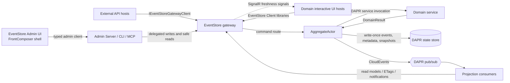
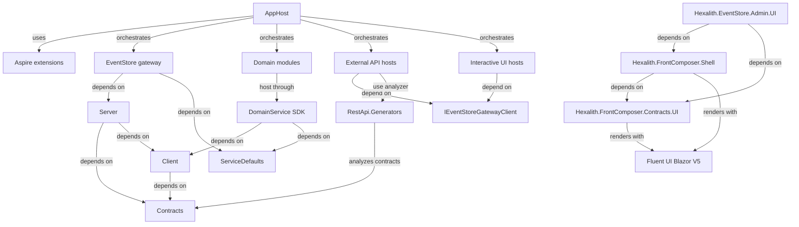
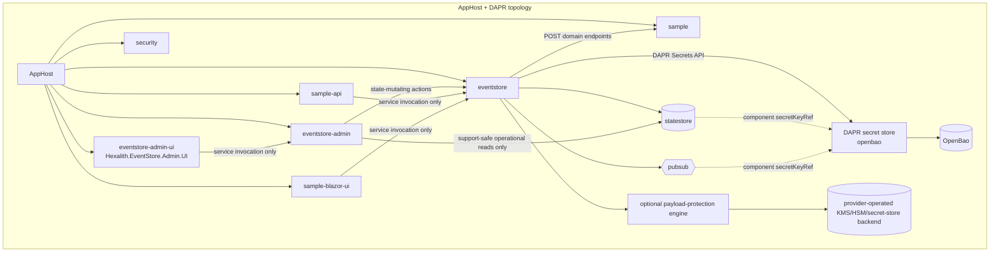

# Architecture Spine - eventstore Phase 4 Implementation Readiness Recovery

## Design Paradigm

Hexalith.EventStore is a DAPR-backed hexagonal event-sourcing platform. The EventStore gateway is the policy edge; DAPR actors own aggregate write serialization; domain services are pure domain adapters; generated REST hosts, interactive UI hosts, Admin surfaces, CLI, and MCP are external adapters that call platform seams instead of owning domain persistence.



## Invariants And Rules

### AD-1 - DAPR-Backed Hexagonal Event Sourcing [ADOPTED]

- **Binds:** all current epics, FR1-FR37, NFR1-NFR19
- **Prevents:** one team treating EventStore as a CRUD web API while another builds actor-owned event sourcing.
- **Rule:** The system remains CQRS plus DDD plus event sourcing on DAPR state, actors, pub/sub, and service invocation, with Aspire owning local orchestration and deployable topology seed.

### AD-2 - Domain Modules Stay Domain-Centric [ADOPTED]

- **Binds:** FR1-FR10, FR33
- **Prevents:** Sample, Tenants, and future domains choosing incompatible hosting, query, projection, cursor, telemetry, health, or Aspire plumbing.
- **Rule:** Domain modules contain only domain behavior and contracts: aggregates, commands, events, projections, query handlers, validators, domain options, and contract types. Reusable hosting and infrastructure live in EventStore platform libraries. A conforming domain-service host calls `AddEventStoreDomainService()` and `UseEventStoreDomainService()`.

### AD-3 - Gateway Is The Command And Query Policy Boundary [ADOPTED]

- **Binds:** FR11-FR16, FR23-FR32, NFR1-NFR4, NFR14
- **Prevents:** generated APIs, UI hosts, Admin code, or domain services bypassing authorization, tenant validation, idempotency, status/archive, ETag, problem-details, and observability behavior.
- **Rule:** External command/query entry points delegate to the EventStore gateway. They do not call MediatR handlers, domain services, DAPR actors, state stores, projection actors, or query dispatchers directly.

### AD-4 - Generated REST Lives In Dedicated External API Hosts [ADOPTED]

- **Binds:** FR11-FR15, NFR12-NFR14
- **Prevents:** interactive UI hosts becoming accidental public API/BFF hosts with their own controller semantics.
- **Rule:** `Hexalith.EventStore.RestApi.Generators` emits controllers only into dedicated external-facing API hosts. Generated controllers delegate to `IEventStoreGatewayClient`. Interactive UI hosts consume EventStore Client libraries directly and host no generated or hand-written per-message MVC command/query controllers.

### AD-5 - AggregateActor Owns Durable Event Mutation [ADOPTED]

- **Binds:** FR23, FR27, FR29-FR31, NFR7
- **Prevents:** split-brain persistence where domain code, projections, or external hosts write events or command state independently.
- **Rule:** `AggregateActor` is the durable mutation coordinator. It invokes pure domain processors/domain services, persists write-once events and metadata, records recovery state, manages snapshots through platform services, and publishes CloudEvents. Domain code returns `DomainResult`; it never writes EventStore state directly.

### AD-6 - Persisted Event Identity Is Stable [ADOPTED]

- **Binds:** FR23, FR24, FR27, NFR6-NFR7
- **Prevents:** subscribers, duplicate command handling, and replay tooling choosing incompatible event identity or ordering semantics.
- **Rule:** Aggregate sequence is gapless per aggregate. `GlobalPosition` is non-zero and currently allocated by the DAPR-backed global allocator. CloudEvent id uses the persisted event `MessageId`. Duplicate command replies preserve the original result fields. Any future global-position sharding first updates the frozen global-ordering spec.

### AD-7 - Read Models And Cursors Use Platform Seams [ADOPTED]

- **Binds:** FR5-FR6, FR9, FR33, FR36, NFR8, NFR16
- **Prevents:** each domain inventing its own DAPR state wrapper, optimistic-concurrency policy, cursor format, or cursor protection scope.
- **Rule:** Persisted read models use platform-owned lifecycle and write contracts. Erasure removes selected read-model keys and companion delivery/rebuild sequence or checkpoint keys as one logical tenant/domain/aggregate/projection-scoped operation. Detail/index changes use a generic same-store batch transaction or an explicitly approved resumable equivalent defining atomicity boundaries, partial-failure recovery, idempotency, optimistic concurrency, ordering, and flush completion; DAPR and in-memory implementations expose equivalent observable semantics. Paging cursors use `IQueryCursorCodec` plus `QueryCursorScope`. Cursors are opaque, DataProtection-backed, scope-validated, bounded, and fail safe on tamper, malformed payloads, wrong scope, wrong query type, or key rotation.

### AD-8 - Projection Delivery Is A Freshness Signal [ADOPTED]

- **Binds:** FR7, FR16, FR34, FR36, NFR5-NFR6, NFR12, NFR15-NFR16
- **Prevents:** UI or subscribers treating SignalR/DAPR notifications, HTTP 202, or command acceptance as proof of projection-confirmed success.
- **Rule:** DAPR pub/sub and projection notifications are at-least-once and unordered. Duplicate and out-of-order safety is enforced and proven through the production projection dispatcher, handler, persistence, marker, and checkpoint path. Deduplication uses EventStore `MessageId`; sequence guards are scoped to tenant/domain/aggregate/projection identity and never treat sequence numbers as globally ordered. Completed duplicates are idempotent no-ops, in-progress duplicates are retryable/deferred, and gaps do not advance checkpoints. SignalR detail notifications are additive, group-scoped, metadata-only, bounded, and backward compatible with signal-only clients. User-visible success requires projection/read-model evidence.

### AD-9 - AppHost And DAPR YAML Change Together [ADOPTED]

- **Binds:** FR8, FR19-FR20, FR32, NFR2, NFR17
- **Prevents:** local AppHost, tests, and production deployment templates asserting different app IDs, sidecar resources, ACLs, key-prefix posture, topics, or placement/scheduler behavior.
- **Rule:** Runtime topology is one unit owned by AppHost plus DAPR component/configuration YAML. App IDs, sidecar options, state-store scopes, pub/sub scopes, ACL files, resiliency paths, placement/scheduler endpoints, publish targets, and topology tests change in the same slice.

### AD-10 - Security Fails Closed Above Infrastructure Scoping [ADOPTED]

- **Binds:** FR26, FR28, FR32, FR34, NFR1-NFR4, NFR15, NFR17
- **Prevents:** endpoints trusting network location, DAPR ACLs, caller-supplied administrator flags, or committed secrets as the whole security model.
- **Rule:** Public, internal, domain-service, projection-notification, and admin-computation endpoints require application-layer credentials and tenant authorization before disclosing data. Admin state mutations are attributable and support-safe. Deferred or unavailable admin operations are hidden, disabled, or return `501`.

### AD-11 - Release Is Manifest-Governed [ADOPTED]

- **Binds:** FR10, FR21-FR22, FR25, NFR9-NFR11, NFR16-NFR17
- **Prevents:** local submodule checkout state, Debug source references, or hard-coded package loops changing released package output; and single-platform or otherwise nonconforming container registry objects being reported as successful releases.
- **Rule:** `tools/release-packages.json` is the EventStore release inventory. Release/package validation uses package-reference mode by default. Source project references require explicit `UseHexalithProjectReferences=true` and are never used for package publication. Unset or explicit `UseHexalithProjectReferences=false` is package intent in every configuration, including Debug. Explicit `true` is source intent, but each external edge still requires its root-declared source path to exist; missing source falls back to the centrally pinned package edge. Empty or unset configuration remains package-safe. Submodule packages are not produced by EventStore release jobs. `references/Hexalith.Builds/Props/Directory.Packages.props` is the sole source-owned NuGet version catalog for Hexalith repositories; consumer props only configure CPM and import it. The catalog moves to latest validated compatible versions using configured-source evidence, grouped restore/build/test validation, and representative-consumer proof. Hexalith release families, .NET/ASP.NET patch bands, OpenTelemetry packages, test adapters, and other coupled sets move coherently. Major upgrades and channel changes require explicit proof. Compatibility exceptions record rationale and a removal trigger; missing, unlisted, or older search results never cause a downgrade. The repository SDK seed and verified security baseline are `10.0.302` and ASP.NET `10.0.10` respectively.

The EventStore container release is one immutable OCI image index. Released container repositories are exactly the release workflow's `container-projects` mapping - currently the single `eventstore` repository. Any future externally released container image, including `eventstore-admin-ui`, adopts this same index/platform/validation contract and an AD-22 identity mapping before its first release; until then AD-21's `eventstore-admin-ui` is an AppHost/deployment topology identity, not a released registry artifact, and deployment profiles must not require a platform of any released registry image that no release evidence proves. The conforming registry shape has one authority - the SHA-pinned shared Hexalith.Builds publisher/validator the release workflow consumes; neither Builds nor the EventStore caller reinterprets it locally, and shape changes route through an approved proposal and a Builds change, never a validation weakening. That shape: the release version tag resolves to media type `application/vnd.oci.image.index.v1+json` (a Docker manifest list or single-image manifest served for the tag is nonconforming) containing exactly one descriptor per supported platform - `linux/amd64` and `linux/arm64` - each directly referencing an image manifest (nested indexes are nonconforming), with no duplicate, extra, or `unknown` platform and no non-empty platform `variant` value. Index-level annotations and repository co-objects outside the validated descriptor graph confer no release evidence. Platform children are produced by .NET SDK container support, never Dockerfiles. Release validation reads the raw registry bytes, binds their SHA-256 and byte length to the registry-reported index digest and to every descriptor, resolves every descriptor, verifies each child config's `os`/`architecture` equals its descriptor, and runs the same bounded support-safe health smoke on both immutable child digests under the declared minimal configuration of the smoke contract, which is owned by that same shared publisher/validator authority; a dependency absent from the declared configuration is part of the contract, not grounds to skip or substitute the check. Every validation failure fails the release evidence gate closed - wrong media type, platform-set mismatch, digest or size mismatch, unresolved descriptor, config mismatch, or product smoke failure - and emulation or environment setup failure is classified separately from a product-image failure but blocks the gate equally: a platform whose smoke cannot run is unproven, not passed. Published artifacts are immutable: release tags, conforming and failed, are never re-pointed or deleted; a nonconforming release (v3.75.0) remains resolvable as non-authorizing failed evidence and is corrected only by a conforming later semantic version. Tag resolution never authorizes deployment; only the recorded validated index digest does (AD-22).

### AD-12 - High-Risk Verification Requires Persisted Evidence [ADOPTED]

- **Binds:** NFR7, NFR10, NFR16, SM-C2
- **Prevents:** API smoke responses or mock call counts being accepted as integration proof for data-loss, topology, tenant isolation, release, or delivery behavior.
- **Rule:** Tier 2/3 and readiness-critical tests inspect persisted Redis/state-store/read-model/CloudEvent bodies, topology YAML or sidecar arguments, package outputs, container release registry and smoke evidence, and security denials where applicable. `202`, `200`, and mock calls are smoke signals only.

### AD-13 - Cost And Evolution Changes Are Spec-First

- **Binds:** FR24, FR33, FR35, NFR8, NFR18
- **Prevents:** story-local choices silently changing snapshot format, replay cost, projection ordering, event schema evolution, cancellation contracts, or global position meaning.
- **Rule:** Folded snapshots, projection delivery cost, projection sequence guards, event versioning/upcasting, event identity metadata validation, cancellation-token public seams, and global-position sharding require approved specs at named paths before implementation stories start. AOT/trimming remains out of target while reflection conventions are load-bearing.

Stories 1.18 and 1.19 own the minimum projection correctness baseline for production-path idempotency and replay-equivalent paged rebuilds. Stories 6.3/6.4 may optimize checkpoint, tail-delivery, and replay cost only after that baseline exists and must not redefine or weaken duplicate, gap, page-safety, staging, promotion, or replay-equivalence guarantees.

### AD-14 - Query Evidence Crosses The Gateway As Platform Metadata

- **Binds:** FR4-FR6, FR15, FR34, FR36, NFR8, NFR15-NFR16
- **Prevents:** domain handlers, gateway routing, generated APIs, and UI hosts disagreeing about freshness, projection version, paging, ETag, or projection-confirmed state.
- **Rule:** Query/read-model evidence metadata is carried through `QueryResponseMetadata` and HTTP response headers owned by the gateway, not ad hoc payload fields. The canonical flow is:

Domain/projection query result -> `QueryResult.Metadata` -> `QueryRouterResult.Metadata` -> `SubmitQueryResult.Metadata` -> `SubmitQueryResponse.Metadata` -> `EventStoreQueryResult.Metadata` -> generated external API headers or UI client state.

Merge rules are explicit:

- Domain/projection metadata is authoritative for freshness, projection version, paging, degraded state, and warning codes.
- The gateway is authoritative for the HTTP ETag header and may fill `QueryResponseMetadata.ETag` from the selected strong validator when the producer omitted it, but only for `ProjectionBacked` routes and only as an opaque cache validator — never as projection-version or freshness evidence (see AD-15).
- The gateway fills `ServedAt` only when absent.
- `IsNotModified` is derived from the HTTP outcome.
- Missing freshness is unknown, not current.
- ETag and projection version are distinct unless a projection explicitly defines them as equivalent.
- Paging metadata is evidence only when produced by the query handler/projection; request paging echoed by the gateway is not proof of total count, next cursor, or page completeness.

Generated REST controllers may forward metadata through support-safe headers such as `ETag`, `X-Hexalith-Projection-Version`, `X-Hexalith-Served-At`, `X-Hexalith-Is-Stale`, `X-Hexalith-Is-Degraded`, `X-Hexalith-Warning-Codes`, `X-Hexalith-Page-Size`, `X-Hexalith-Page-Offset`, `X-Hexalith-Next-Cursor`, `X-Hexalith-Total-Count`, and `X-Hexalith-Has-More` only when those metadata values are present and bounded. Cursors and ETags remain opaque and must not be parsed, displayed as support text, or logged as diagnostic detail.



### AD-15 - Query Response Provenance Is Explicit And Route-Bound

- **Binds:** FR4, FR12, FR15, FR34, FR36, NFR8, NFR15, NFR16
- **Prevents:** generated REST or UI code treating a gateway ETag, or a gateway-attached projection validator, as projection-backed current/stale evidence for a response no projection produced.
- **Rule:** Every query response carries an explicit provenance classification — `ProjectionBacked`, `HandlerComputed`, or `Unknown` — set by the route that produced it and preserved across `QueryResult.Metadata -> QueryRouterResult.Metadata -> SubmitQueryResult.Metadata -> SubmitQueryResponse.Metadata -> EventStoreQueryResult.Metadata`.

1. The HTTP / `QueryResponseMetadata.ETag` is an opaque cache validator only. It is a per-`(projectionType, tenant)` random change token (`SelfRoutingETag.GenerateNew`), not a content hash, and is never evidence of projection version, freshness, or projection-confirmed success.
2. The gateway must not attach a projection-actor ETag, projection version, or freshness to a response whose provenance is not `ProjectionBacked`. Handler-computed routes (`HandlerAwareQueryRouter`, which leaves `ProjectionType` null) are `HandlerComputed`; the gateway must not back-fill a projection ETag from `request.Domain` / `request.ProjectionType` for them.
3. `ProjectionVersion` and `IsStale` are authoritative only when provenance is `ProjectionBacked` and the value is sourced from persisted read-model freshness (`IReadModelFreshness` via `ReadModelFreshnessExtensions.ToQueryResponseMetadata`). A producer must not alias `ProjectionVersion := ETag`.
4. Consumers (generated REST headers, UI freshness indicators) render `Current` / `Stale` only for `ProjectionBacked` provenance. `HandlerComputed` and `Unknown` render as `Unknown` and must not claim projection-confirmed state. Missing provenance is `Unknown`, never `Current`.
5. Guardrail evidence is persisted-path, not mock (AD-12 / NFR16): a handler route must be asserted to carry no projection ETag/version on the real gateway path, and a projection-backed route to carry a genuine one.

AD-15 extends AD-14: AD-14 defines *what* metadata crosses and *how it merges*; AD-15 defines *whether* the ETag / projection validator legitimately belongs to the response path.

Projection lifecycle and query provenance are orthogonal. Only `ProjectionBacked` responses may carry authoritative lifecycle evidence. The platform lifecycle representation preserves `Current`, `Stale`, `Rebuilding`, `Degraded`, `Unavailable`, and `LocalOnly` without collapsing transitional or restrictive states into a stale Boolean. `HandlerComputed`, missing, or invalid provenance remains `Unknown`, and lifecycle is never inferred from ETags, HTTP success, payload fields, or SignalR.

### AD-16 - Health And Probe Endpoints Are Explicitly Anonymous And Fail-Closed-Compatible [ADOPTED]

- **Binds:** FR26, FR28, FR34, NFR1, NFR3, NFR17
- **Prevents:** (a) a global fallback authorization policy silently blocking liveness/readiness/DAPR app-health probes, and (b) the inverse regression where a broken probe is "fixed" by weakening or removing the fallback policy, re-opening fail-open across every endpoint.
- **Rule:** The health/liveness/readiness probe endpoints mapped by `ServiceDefaults.MapDefaultEndpoints` — `/health`, `/alive`, `/ready` — are the *only* explicit anonymous exception to AD-10 fail-closed. They are:
  1. **Pinned anonymous by contract**: each probe endpoint declares explicit `AllowAnonymous()` (or an equivalent auth-exempt convention) so it does not depend on the absence of a fallback policy. Anonymity is intentional metadata, not an accident of configuration.
  2. **Support-safe**: anonymous probe responses expose only status (`Healthy`/`Degraded`/`Unhealthy`) and probe outcome. Component names, dependency detail, connection targets, versions, tenant data, and exception text are never disclosed to anonymous callers outside Development (the `DevelopmentHealthResponseWriter` remains Development-only).
  3. **Ordering-gated**: any host that introduces a global fallback authorization policy (or any default-deny endpoint convention) introduces the explicit probe-anonymity contract in the **same or an earlier** slice — never after. The fallback policy is the fail-closed default; the probe exemption is explicit `AllowAnonymous`. Neither the fallback policy nor the deny-by-default posture is weakened, scoped down, or removed to make probes reachable.
- **Evidence:** A test asserts, on the real host pipeline, that (i) `/health`, `/alive`, `/ready` return their health status to an **unauthenticated** caller, and (ii) a representative protected endpoint on the same host **denies** an unauthenticated caller — proving the fallback/deny default is enforced elsewhere and was not weakened to unblock probes (AD-12 / NFR16: persisted-path, not mock).

AD-16 refines AD-10: AD-10 makes every disclosing endpoint fail closed; AD-16 defines the single support-safe anonymous probe exemption and forbids using that need as a reason to weaken the fail-closed default.

### AD-17 - Generated Command-Status Location Is Absolute, Gateway-Authoritative, And Fail-Closed

- **Binds:** FR11-FR15, FR27, NFR12-NFR14, NFR16
- **Prevents:** generated external API hosts advertising a command-status `Location` they do not serve, that resolves against the wrong authority, or that pins the status key to a pre-FR27 identifier.
- **Rule:** The `202 Accepted` command-status `Location` a generated command controller emits is a gateway-owned affordance, never an external-host-owned route (AD-3, AD-4). The generated host maps no command-status endpoint of its own.

1. When a gateway command-status base URI is configured for the host, the generated controller emits an **absolute** `Location` (RFC 7231): `{gatewayStatusBase}/api/v1/commands/status/{statusKey}`, resolved at request time from a runtime option — never a compile-time constant.
2. When no gateway status base is configured, the generated controller emits **no** `Location` header. It never emits a relative or dangling status URL. Fail-closed (AD-10 posture); the `202` body still carries the tracking key.
3. `statusKey` is the single gateway-owned command-status tracking field surfaced on `SubmitCommandResponse` (today `CorrelationId`). The policy references that one field and does not assume `CorrelationId == MessageId`; re-keying command status/archive to `MessageId` is owned by FR27 / Epic 4 and changes the value transparently without changing this policy.
4. `Location` is emitted only on the `202 Accepted` success path; mapped gateway command failures emit no `Location`.
5. Guardrail evidence is generator-output plus runtime tests (AD-12): absolute-when-configured, header-absent-when-unconfigured, and never a relative status URL.

AD-17 complements AD-4: AD-4 says generated REST is a thin gateway delegator; AD-17 says the one cross-host affordance a generated command emits — the status `Location` — points at the gateway that owns the resource, or nothing.

### AD-18 - Outbound Sidecar Control-Plane Headers Are Handler-Owned [ADOPTED]

- **Binds:** FR13, FR14, FR26, FR28, NFR3, NFR17
- **Prevents:** a caller- or inbound-forwarded `dapr-app-id` / `dapr-api-token` duplicating or hijacking DAPR sidecar service-invocation routing, or leaking / mis-sending the sidecar token.
- **Rule:** Outbound DAPR service invocation from any host client sets the sidecar control-plane headers `dapr-app-id` and `dapr-api-token` authoritatively through a single platform-owned `DelegatingHandler` in `Hexalith.EventStore.Client`, wired by `AddEventStoreGatewayClient`.

1. **Replace, never append**: the handler removes any pre-existing `dapr-app-id`, then sets the configured app id as the single value (`Headers.Remove` + `TryAddWithoutValidation`, never a bare `TryAddWithoutValidation`).
2. The handler removes any pre-existing `dapr-api-token` and sets the configured token only when one is present; when no token is configured it strips any pre-existing `dapr-api-token`.
3. The handler is the innermost (last-run) handler in the gateway-client chain, so it has the final say after any inbound bearer / header-forwarding handler.
4. Caller- or inbound-forwarded values never influence sidecar routing or the sidecar token.
5. Hosts must not define their own DAPR routing-header handler (AD-2). A structural guardrail test fails if a host declares a local DAPR routing-header handler or uses `TryAddWithoutValidation` for `dapr-app-id` / `dapr-api-token`.

Guardrail evidence (AD-12): a unit test seeds a pre-existing `dapr-app-id` / `dapr-api-token` on the outbound request and asserts the sidecar receives exactly one authoritative value (the injected value is discarded) — single-value assertion, not only the happy path.

AD-18 extends AD-3 (gateway is the command/query policy boundary) and AD-10 (security fails closed), applied to the client-to-sidecar transport boundary, and is enforced through the platform per AD-2 (domain modules stay domain-centric; no per-host transport boilerplate).

### AD-19 - Projection Dispatch Is Asynchronous And One-To-Many [ADOPTED]

- **Binds:** FR7, FR36, NFR6-NFR8, NFR12, NFR16
- **Prevents:** a synchronous domain-only handler contract, ambiguous result alternatives, or inconsistent checkpoint interpretation from blocking durable one-to-many persistence or advancing failed work as though it succeeded.
- **Rule:** Projection handlers are identified by `(Domain, ProjectionType)`, not by domain alone. A domain may register multiple named handlers. Dispatch and persistence are asynchronous and cancellation-aware. The additive `/project/v2` wire contract remains `ProjectionDispatchResponse(Version, Outcomes)` with `Version = 2`; its serialized members stay frozen. The server then emits one exact normalized result: `ProjectionDispatchResult(Version, Entries)` with `Version = 1`, where every `ProjectionDispatchResultEntry` contains `Domain`, `ProjectionType`, the stable `ProjectionDispatchStatus` outcome code, and `ProjectionCheckpointAdvanceState` (`NotAdvanced = 0`, `Advanced = 1`).

  1. `Entries` is bounded by the validated positive `ProjectionDispatchOptions.MaxOutcomes` value (default `32`), ordered by admitted `ProjectionType` using ordinal comparison, and contains exactly one entry for each admitted `(Domain, ProjectionType)` route.
  2. `ProjectionDispatchStatus` is the closed stable outcome code: `Completed = 0`, `AlreadyCompleted = 1`, `Retryable = 2`, `Indeterminate = 3`, and `Failed = 4`.
  3. The server records `Advanced` only after the route reports `Completed` or `AlreadyCompleted`, all required durable persistence and any legacy actor write succeed, and the route checkpoint save completes. Every other status and every missing, malformed, duplicate, unrequested, or transport-failed outcome normalizes to `NotAdvanced`; cancellation emits no fabricated result and advances nothing.
  4. Partial success preserves independently durable sibling work and keeps failed work retryable under the same dispatch identity.
  5. No equivalent or alternative normalized result shape is accepted. Changing the v2 wire envelope or the normalized result requires a new contract version and architecture decision.

The status/checkpoint normalization matrix is binding:

| Observed condition | Normalized outcome code | Checkpoint state |
| --- | --- | --- |
| Wire `Completed` or `AlreadyCompleted`; required persistence, legacy actor write when applicable, and checkpoint save all complete | Preserve wire code | `Advanced` |
| Wire `Completed` or `AlreadyCompleted`, but a required post-handler persistence, actor-write, or checkpoint-save step fails or cannot be proved | `Indeterminate` | `NotAdvanced` |
| Wire `Retryable` or a known optimistic conflict/incomplete operation | `Retryable` | `NotAdvanced` |
| Wire `Indeterminate`; transport interruption/timeout; unexpected handler exception; or missing, duplicate, unrequested, malformed, or over-limit outcome | `Indeterminate` | `NotAdvanced` |
| Wire `Failed` or deterministic request, registration, configuration, catalog/fingerprint, or unsupported-route validation failure | `Failed` | `NotAdvanced` |
| Request cancellation | No fabricated normalized result | No advancement |

Existing synchronous single-projection consumers continue through an explicitly registered compatibility adapter or an approved breaking-version and migration plan. No consuming-domain-specific logic enters EventStore.

### AD-20 - Paged Rebuilds Are Replay-Equivalent [ADOPTED]

- **Binds:** FR7, FR33, FR36, NFR7-NFR8, NFR16
- **Prevents:** a later rebuild page replacing a correct live model with page-only state or a checkpoint reporting completion before every required projection is durably complete.
- **Rule:** Every handler declares or is adapted to explicit full-replay or incremental semantics. Paging is an event-read optimization, never a semantic projection boundary: a page is not passed to a full-replay handler as the complete stream. Rebuild work uses operation-scoped staging or equivalent non-live isolation, preserves the last complete live model on cancel/failure, resumes from a safe boundary, and promotes detail/index outputs only after all required projections complete. Rebuild output, projection versions, and checkpoints must equal canonical aggregate replay for the same event prefix, including streams longer than the configured page size.

### AD-21 - The Existing Admin UI Is The Consolidated EventStore UI [ADOPTED]

- **Binds:** FR13, FR15, FR34, NFR14-NFR15, Story 7.14
- **Prevents:** parallel EventStore UI hosts choosing different shells, resource identities, module navigation, client boundaries, or legacy-route behavior.
- **Rule:** `src/Hexalith.EventStore.Admin.UI` evolves in place into the consolidated EventStore UI service. Its AppHost resource and container identity remain `eventstore-admin-ui`; no additional EventStore UI host is created. The UI composes `Hexalith.FrontComposer.Shell` and `Hexalith.FrontComposer.Contracts.UI` plus Fluent UI Blazor V5. Every consumed FrontComposer package resolves from the Builds catalog's single `HexalithFrontComposerVersion` variable (current value in the Stack table), so all FrontComposer packages move together; a consumed package absent from the catalog (`Contracts.UI` today) is added there under that variable before adoption, never pinned locally. Debug source and Release package modes resolve the same package boundary at the same version. `Admin.UI` owns one canonical dashboard route table and the stable FrontComposer module identity `event-store-admin` with label **Event Store Admin**. Existing canonical deep links remain; every other legacy route redirects to a canonical dashboard deep link rather than preserving a second page implementation, and the `event-store-admin` entry stays selected. UI command/query flows remain typed-client consumers and do not acquire generated or hand-written per-message MVC controllers.

### AD-22 - Consumer Infrastructure Removal Requires Owner-Approved Exact-SHA Parity [ADOPTED]

- **Binds:** FR36, NFR12, NFR16
- **Prevents:** persisted evidence from one EventStore runtime authorizing a consuming module to delete local projection/query infrastructure against a different source commit, package build, or deployed image.
- **Rule:** A consuming module removes local projection/query infrastructure only after an EventStore-owner-reviewed parity packet marks every required capability `available`, cites persisted production-path evidence, records the exact approved EventStore source/runtime commit SHA, and maps that SHA to the released artifact identities: exact consumed package versions and hashes plus, when applicable, the deployed EventStore container identity, which is the validated OCI image index digest under AD-11.

  - Source mode proves the checked-out **EventStore submodule** SHA equals the approved EventStore SHA.
  - Package mode proves the resolved EventStore package versions and hashes equal the packet's manifest-governed artifacts.
  - Deployed mode proves the running EventStore image maps through release provenance to the approved EventStore SHA. The approved container identity is the OCI image index digest recorded by the AD-11 release evidence gate; the packet records the full identity chain - index digest, both child manifest digests, and both child config digests. A deployed-mode verifier may observe any chain member and maps it to the approved index digest only through that recorded chain; it never re-derives identity from an alternate representation of the tag, and an observed identity absent from the chain fails closed.

The consuming repository's own commit SHA is never compared to the EventStore SHA. Without owner approval or a matching dependency/runtime identity, the consumer keeps its local infrastructure and the adoption child remains non-`done`; generic EventStore platform work may continue independently.

### AD-23 - EventStore Owns The Optional Shared Payload-Protection Engine [ADOPTED]

- **Binds:** FR37, NFR1-NFR4, NFR7, NFR9-NFR12, NFR16-NFR17, NFR19
- **Prevents:** consuming domains implementing reusable cryptography and key lifecycle independently, or operators mistaking provider-neutral hooks, an interface-only backend, or an in-memory backend for production payload protection.
- **Rule:** EventStore owns the optional `Hexalith.EventStore.PayloadProtection` engine, stable `pdenc-v2` envelope and byte-stable AAD contract, backward readers, `IPersonalDataPolicy` and `IErasureStateProvider` seams, shared key mechanics, backend abstraction, production-backend conformance, goldens, release provenance, and Parties G5 proof. Provider/operators own production root-key and key-encryption-key custody, credentials, KMS/HSM/secret-store service operation, and environment policy. Parties retains domain legal policy, erasure orchestration semantics, certificates/reports, and UX/copy unless a separately approved ADR moves a named concern.

At least one Story 8.1-selected non-development backend adapter must be implemented and integration-proven by Story 8.2. An interface, LocalDev provider, or in-memory implementation cannot satisfy production proof. The security specification may place an adapter in a companion package when dependency or credential boundaries require it, but it may not move the stable engine contract back into a consuming domain or silently create a second contract authority.

Implementation is blocked until `_bmad-output/implementation-artifacts/spec-shared-payload-protection-engine.md` records named architecture and security approval for package boundaries; the canonical `pdenc-v2` envelope and AAD bytes; `json+pdenc-v1`, `json-redacted`, legacy-unprotected, metadata, and snapshot reads; policy/discovery seams; key paths; state keys; actor/reminder/metric names; backend restrictions; versioning; rollout; mixed history; downgrade; and rollback after v2 writes.

### AD-24 - Production DAPR Secrets Use OpenBao [ADOPTED]

- **Binds:** FR34, NFR4, NFR17, Story 7.6
- **Prevents:** deployment slices choosing incompatible secret providers, component identities, provider metadata owners, logical secret catalogs, access scopes, direct provider SDKs, plaintext credentials, or circular bootstrap lookup.
- **Rule:** Production deployment and application secrets are resolved through the DAPR secrets building block backed by OpenBao. The canonical DAPR component is named `openbao` and uses `type: secretstores.hashicorp.vault` with `version: v1`; the official DAPR catalog lists OpenBao as Stable v1 since runtime 1.16. Production profiles pin a compatible DAPR runtime explicitly; the repository CI/deployment seed is `1.18.0`, while DAPR .NET SDK package versions are not runtime evidence. Dependent DAPR components use `auth.secretStore: openbao` and `secretKeyRef`; application code uses the DAPR Secrets API and does not import an OpenBao or Vault client.

The platform deployment overlay is the sole owner and composer of the singleton `Component/openbao`, every per-app DAPR `Configuration`, and the value-free contract at `deploy/dapr/openbao-secret-contract.yaml`; state-store, pub/sub, application, and deployment slices do not author competing copies. The contract records each logical secret's store-relative name, embedded map keys, consumer app IDs, dependent component/host, `startup-only` or `runtime-required` retrieval lifecycle, matching OpenBao policy path, and runtime-required generation/cache/rotation bounds. The component fixes `vaultValueType: map` and `vaultKVUsePrefix: true`; the overlay alone supplies `vaultAddr`, `enginePath`, `vaultKVPrefix`, and TLS metadata. Exact environment values may differ, but logical names, embedded keys, value shapes, consumers, lifecycle, and rotation-unit boundaries stay identical.

The `openbao` component scopes, per-app DAPR secret scopes (`defaultAccess: deny` plus explicit `allowedSecrets`), and least-privilege OpenBao ACL policies derive from that contract. Where DAPR automatically provisions the `kubernetes` secret store, every application's DAPR Configuration also applies `defaultAccess: deny` to that store. No application may retrieve secrets from the Kubernetes store unless a separately approved bootstrap-only exception identifies the exact consumer and key. A deployment validation gate rejects any missing or extra grant and any mismatch between the contract, scopes, and policies. Non-development deployments use HTTPS with certificate verification enabled. The OpenBao bootstrap token, DAPR API token, and TLS trust material are bootstrap-class inputs supplied directly by the hosting platform; they never depend on a DAPR API or component, are never committed, and are never resolved from OpenBao. Production prefers `vaultTokenMountPath` backed by a platform-projected, least-privilege token file. A Kubernetes Secret may hold only this bootstrap credential when no approved mounted or projected mechanism is available; it never holds downstream application, database, broker, signing, or operational secrets. Committed inline `vaultToken` values are forbidden. The Vault-compatible component reads its token at initialization, so planned token rotation performs a controlled DAPR sidecar rollout/restart before expiry or revocation and never assumes automatic renewal or reload; emergency replacement keeps readiness false until sidecars restart with the replacement credential.

Every host validates its declared secrets through DAPR before becoming ready. Missing stores, bootstrap inputs, or `startup-only` secrets fail deployment/startup. Runtime-required consumers call `GetSecret` for one logical map; they do not use `BulkGetSecret` or pin `metadata.version_id` on the serving path. Values that must rotate atomically share that map and carry a required non-secret generation marker. A successful value may exist only in process memory for the cataloged `maxAge`, which is shorter than its rotation overlap window; consumers do not persist it, merge generations, or use it after expiry or a failed refresh. A lookup failure fails closed, disables the dependent operation, and keeps readiness false until a bounded successful recheck; no plaintext or alternate-provider fallback is allowed.

Rotation is publish-overlap-acknowledge-revoke: publish the new OpenBao version/generation, keep old and new credentials accepted for the cataloged overlap, wait until every cataloged runtime consumer acknowledges the new generation while ready and every startup-only component completes its sidecar rollout/component initialization, then revoke the old material. Failure before complete acknowledgement retains the old credential and rolls back by publishing a restored generation; early revocation is forbidden. `startup-only` component credentials may continue operating from their initialized component until their controlled rotation rollout. Diagnostics identify only the logical configuration key and non-secret generation.

The Aspire AppHost provisions a pinned official OpenBao container for local development, exposes a health-checked endpoint, waits for it before starting dependent sidecars, and makes the canonical `openbao` DAPR component available only to sidecars that require secrets. OpenBao development mode is explicitly non-production. Its bootstrap token is supplied through an Aspire secret parameter or protected temporary token file and is never committed or logged. Unit tests may use fakes, but integration and release evidence exercise real OpenBao through DAPR.

Azure Container Apps managed DAPR is not a conforming production profile because its supported component set excludes OpenBao and it does not support DAPR Configuration secret scopes. That target requires a separately approved profile proving OpenBao component support and equivalent least-privilege scoping before it can claim AD-24 compliance.

AD-24 governs operational and application secret retrieval. It does not approve, replace, or modify AD-23 or the draft-not-authorized payload-protection specification's proposed Azure Key Vault Premium RSA-HSM KEK wrap/unwrap backend; a DAPR secret store is not production `pdenc-v2` key custody.

## Consistency Conventions

| Concern | Convention |
| --- | --- |
| Identity | EventStore message, correlation, causation, and aggregate identifiers use ULID-safe handling where envelope semantics require sortable ids. `Guid.TryParse` is forbidden for those fields. Domain-specific ids may be caller-supplied only where that domain contract says so. |
| Domain naming | Domains, command types, query types, projection types, state stores, topics, and app IDs use existing EventStore naming conventions and kebab-case where the convention engine owns names. |
| State keys | Tenant, domain, and aggregate identity remain explicit in actor IDs, state keys, topic names, query scopes, SignalR groups, and admin filters. |
| Mutation | Commands produce events through pure aggregate/domain handlers. No code edits, deletes, or rewrites persisted events to repair business state; use compensating commands and verify projection evidence. |
| Errors | External failures use safe problem details or structured rejection events. Business failures are domain results/rejections, not infrastructure exceptions. |
| Command status | The generated `202` command-status `Location` is gateway-authoritative and fail-closed (AD-17): absolute to the configured gateway status base, or omitted. External API hosts map no command-status route. |
| Health probes | `/health`, `/alive`, `/ready` (from `ServiceDefaults.MapDefaultEndpoints`) are explicitly `AllowAnonymous` and support-safe. They are the only anonymous exception to fail-closed (AD-16); a fallback/deny-by-default policy is never weakened to reach them. |
| Serialization | Command, rehydrate, project, and pub/sub payloads use shared platform serialization paths once Story 4.3 lands; no story introduces a private JSON option set for the same payload family. |
| Cursors and ETags | Cursors and ETags are opaque implementation details. They are not parsed, displayed, logged, or exposed as support text. An ETag is a cache validator, not projection evidence; version/freshness claims require `ProjectionBacked` route provenance (AD-15). |
| Projection lifecycle | `Current`, `Stale`, `Rebuilding`, `Degraded`, `Unavailable`, and `LocalOnly` are preserved only as projection-backed evidence. Handler-computed or unknown provenance renders `Unknown`; lifecycle is not inferred from ETags or SignalR. |
| Projection persistence | Read-model/checkpoint erasure and detail/index batches follow AD-7; async named fan-out follows AD-19; the normalized `ProjectionDispatchResult` makes each route's `Advanced`/`NotAdvanced` checkpoint decision explicit after required durable work. |
| Projection rebuild | Full/incremental semantics are explicit; paged work stays staged and replay-equivalent per AD-20. |
| Payload protection | EventStore owns the optional engine, stable formats, shared mechanics, production-backend conformance, and G5 proof; provider/operators own production key custody and credentials; domains retain legal policy per AD-23. The no-op provider remains the default until the optional engine is explicitly registered. |
| Secrets | Production operational/application secrets resolve through the DAPR `openbao` component and `secretKeyRef`; application code uses the DAPR Secrets API. The platform overlay owns provider metadata and logical names. Component/app access is allowlisted and default-deny, production TLS verification is enabled, bootstrap-token rotation rolls the sidecar, required-secret validation gates readiness, and payload-protection KEK custody remains separate per AD-24. |
| Sidecar control-plane headers | Outbound `dapr-app-id` / `dapr-api-token` are handler-owned, **replaced not appended**, set authoritatively from config by the single platform handler; caller/inbound-forwarded values are never routed (AD-18). |
| UI | `src/Hexalith.EventStore.Admin.UI` is the single consolidated EventStore UI and retains the `eventstore-admin-ui` resource/container identity. It composes FrontComposer Shell/Contracts.UI dependencies at the Builds catalog's single `HexalithFrontComposerVersion` and Fluent UI Blazor V5. `Admin.UI` owns the canonical dashboard route table; non-canonical legacy routes redirect to canonical deep links under the selected `event-store-admin` / **Event Store Admin** module entry. UI success is projection-confirmed, support-safe, accessible, and localized; detailed UX flows live in the canonical UX artifacts. |
| Runtime topology | AppHost resource names, DAPR app IDs, component scopes, secret scopes, ACL policies, pub/sub topics, and deployment overlays remain aligned by tests. Deployment profiles reference the released EventStore image by its validated OCI image index digest, not by a mutable tag (AD-11, AD-22). |
| Release | Restore/build use `Hexalith.EventStore.slnx`; unit tests run per project; every source-owned NuGet dependency version resolves from `references/Hexalith.Builds/Props/Directory.Packages.props`; release output is manifest-driven. Catalog families and central .NET/ASP.NET security patch pins move together under the latest-compatible evidence rules in AD-11. The inventory remains 14 packages until Story 8.2 creates an approved packable engine project; engine and any approved companion adapter then update the manifest, inventory guidance, package governance, and package-only consumer validation atomically. Released container repositories are exactly the release workflow's `container-projects` mapping (currently the single `eventstore`); each publishes as one immutable OCI image index containing exactly `linux/amd64` and `linux/arm64` children built with .NET SDK container support and validated fail-closed by the SHA-pinned shared Builds validator (AD-11). |

## Stack

The table records the current planning baseline. Story 3.11 updates version rows only from accepted shared-catalog and compatibility evidence.

| Name | Version |
| --- | --- |
| .NET SDK | Repository seed `10.0.302`; required security baseline `10.0.302` (`rollForward: latestPatch`) |
| Target framework | net10.0 |
| Aspire.Hosting | 13.4.6 |
| Aspire.Hosting.Keycloak / Kubernetes | 13.4.6-preview.1.26319.6 |
| CommunityToolkit.Aspire.Hosting.Dapr | 13.4.1-beta.686 |
| DAPR runtime | Repository CI/deployment seed `1.18.0`; production profiles pin a compatible 1.18.x release |
| Dapr .NET SDK packages | 1.18.4 |
| DAPR OpenBao secret store | Stable component v1 since DAPR runtime 1.16; `secretstores.hashicorp.vault` |
| MediatR | 14.2.0 |
| FluentValidation | 12.1.1 |
| ASP.NET Core / SignalR packages | `10.0.10` (catalog and security baseline aligned) |
| Microsoft.CodeAnalysis packages | 5.6.0 |
| Microsoft.FluentUI.AspNetCore.Components | 5.0.0-rc.4-26180.1 |
| Hexalith.FrontComposer packages | Catalog `HexalithFrontComposerVersion` `4.0.1`; matching root-declared source in Debug and centrally pinned NuGet packages in Release |
| OpenTelemetry exporter/hosting/ASP.NET/HTTP packages | 1.17.0 |
| OpenTelemetry runtime instrumentation | 1.17.0 (StackExchangeRedis instrumentation `1.16.0-beta.1`) |
| Hexalith.Commons.UniqueIds | 2.28.2 |
| xUnit v3 | 3.2.2 |
| Shouldly | 4.3.0 |
| NSubstitute | 6.0.0 |

## Structural Seed

```text
src/
  Hexalith.EventStore.Contracts/        # stable command, event, query, REST, result, security contracts
  Hexalith.EventStore.Client/           # aggregate/projection bases, gateway client, read-model/cursor seams
  Hexalith.EventStore.Server/           # DAPR actors, command routing, persistence, publishing, projections
  Hexalith.EventStore/                  # gateway host and public command/query/stream APIs
  Hexalith.EventStore.Gateway/          # reusable gateway host components
  Hexalith.EventStore.DomainService/    # domain-service host SDK and canonical endpoints
  Hexalith.EventStore.RestApi.Generators/ # analyzer-only typed REST controller generator
  Hexalith.EventStore.Aspire/           # Aspire EventStore and domain-module topology extensions
  Hexalith.EventStore.ServiceDefaults/  # telemetry, health, discovery, resilience defaults
  Hexalith.EventStore.PayloadProtection/ # optional shared engine and approved production-backend boundary
  Hexalith.EventStore.Admin.*/          # admin abstractions, server, CLI, MCP; Admin.UI is the consolidated EventStore UI
samples/
  Hexalith.EventStore.Sample/           # domain-centric reference service
  Hexalith.EventStore.Sample.Contracts/ # sample public contracts
  Hexalith.EventStore.Sample.Api/       # generated external REST host
  Hexalith.EventStore.Sample.BlazorUI/  # interactive UI client host
tests/
  */                                    # per-project tests; Tier 2/3 assert persisted evidence
deploy/dapr/
  openbao-secret-contract.yaml          # value-free source for logical names, scopes, ACL paths, and retrieval lifecycle
```



## Capability To Architecture Map

| Capability / Area | Lives in | Governed by |
| --- | --- | --- |
| FR1-FR10, FR36 Domain author self-service and consumer parity closure | `Contracts`, `Client`, `DomainService`, `Server`, `Testing`, domain modules | AD-1, AD-2, AD-7, AD-8, AD-9, AD-11, AD-12, AD-14, AD-15, AD-19, AD-20, AD-22 |
| FR11-FR16 External integration surfaces | `RestApi.Generators`, external API hosts, `IEventStoreGatewayClient`, SignalR, consolidated EventStore UI boundary | AD-3, AD-4, AD-8, AD-10, AD-15, AD-18, AD-21 |
| FR17-FR22, FR25 Release and repository reliability | `.github/workflows`, `tools/release-packages.json`, central props, `references/` layout | AD-9, AD-11, AD-12 |
| FR23-FR24, FR27, FR29-FR31 Event correctness and recovery | `Server` actors, persisters, publishers, replay, status/archive, recovery | AD-5, AD-6, AD-12, AD-13 |
| FR26, FR28, FR32 Security and tenant isolation | gateway auth, Admin.Server auth, DAPR ACLs, AppHost, deployment templates | AD-3, AD-9, AD-10, AD-12, AD-16, AD-18 |
| FR33 Bounded cost and event evolution | spec artifacts, `Client`/`Server` public seams, snapshots, projections, upcasters | AD-6, AD-7, AD-13, AD-20 |
| FR34-FR35 Operator trust and backlog | Admin surfaces, consolidated EventStore UI, delivery docs, deployment hardening, integration lanes, backlog artifacts | AD-8, AD-10, AD-12, AD-13, AD-14, AD-15, AD-16, AD-21, AD-24 |
| FR37 Optional shared payload protection and Parties G5 parity | `Contracts`, optional `PayloadProtection` engine, ADR-approved production adapter, `Server` hook integration, `Testing`, release evidence, Parties consumer proof | AD-5, AD-9, AD-10, AD-11, AD-12, AD-13, AD-22, AD-23 |

## Deferred

| Deferred item | Why it can wait |
| --- | --- |
| `ux.md` user journeys, screen states, component-level patterns, accessibility, and localization evidence | PRD makes UX a separate readiness artifact. This spine binds UI-host boundaries and support-safe/projection-confirmed rules only. |
| Story splitting, renumbering, evidence crosswalks, and sprint-status migration under the approved 2026-07-15 proposal | `epics.md`, active story specs, and sprint planning own implementation identity and sequencing; this spine supplies the shared invariants for every resulting slice. |
| Quantitative EventStore UI performance budgets | No production baseline supports a numerical release gate yet. A future UX-performance backlog item may establish measured budgets without weakening accessibility, responsive layout, evidence-state, or support-safety rules. |
| Exact tenant-vs-domain global-position sharding design | FR24 requires renegotiating the frozen global-ordering spec before implementation. AD-6 preserves current semantics until then. |
| Folded snapshot payload shape, projection sequence guard algorithm, event upcaster ordering, and cancellation contract details | FR33 explicitly requires spec-first stories 6.1, 6.3, and 6.5 before implementation. |
| Production mTLS trust domain, namespace values, OpenBao server release/HA/storage topology, provider endpoint and engine/prefix values, bootstrap-token acquisition/TTL, logical secret catalog entries, rotation maintenance window, and deployment overlay specifics | AD-24 fixes OpenBao, assigns these values to the platform overlay, and binds DAPR access/scoping/TLS/bootstrap rotation/readiness invariants. The exact environment values and operations belong in deployment hardening stories and deploy templates. |
| Full aggregate/event GDPR tombstoning, broker-history deletion, physical backup erasure, audit-record deletion, provider/operator key-custody operations, Admin interactive OIDC login, aggregate test kit, and REST generator hardening backlog | These remain outside Phase 4 MVP. Generic projection read-model/checkpoint erasure is active FR5/Story 1.14 scope. The optional EventStore-owned shared payload-protection engine is separately committed as post-MVP Epic 8 and remains unavailable until its ADR, implementation, production backend, release, G5 proof, and consumer rollback complete. |
