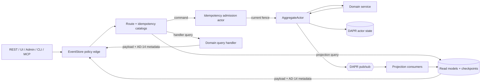
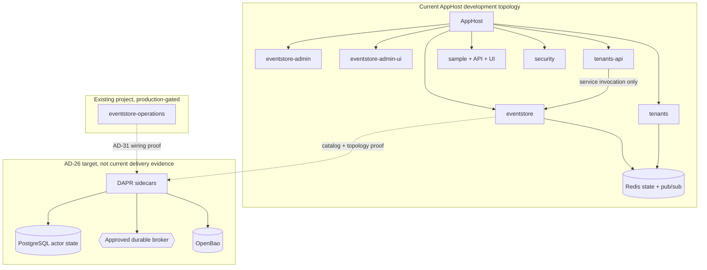

# Architecture Spine - eventstore Phase 4 Implementation Readiness Recovery

## Design Paradigm

Hexalith.EventStore is a DAPR-backed hexagonal event-sourcing platform. The EventStore host is the command and query policy edge; DAPR actors serialize aggregate writes; domain services remain pure domain adapters; generated REST hosts, interactive clients, Admin surfaces, CLI, and MCP use platform seams rather than owning domain persistence.

OQ8 admission follows the content-bound authority recorded in AD-25. EventStore does not retain the governing bytes, so readiness fails closed unless Folders makes the bound identity available and verifies it.


```mermaid
flowchart LR
    Client[REST / UI / Admin / CLI / MCP] --> Edge[EventStore policy edge]
    Edge --> Catalog[Route + idempotency catalogs]
    Catalog -->|command| Admission[Idempotency admission actor]
    Catalog -->|projection query| Read[(Read models + checkpoints)]
    Catalog -->|handler query| Query[Domain query handler]
    Admission -->|current fence| Aggregate[AggregateActor]
    Aggregate --> Domain[Domain service]
    Domain --> Aggregate
    Aggregate --> State[(DAPR actor state)]
    Aggregate --> PubSub{{DAPR pub/sub}}
    PubSub --> Projection[Projection consumers]
    Projection --> Read
    Read -->|payload + AD-14 metadata| Edge
    Query -->|payload + AD-14 metadata| Edge
```

> **Implementation status:** Adopted decisions are not delivery evidence. Production workload promotion, traffic, consumer migration, and production-readiness claims remain prohibited until the final Implementation Status and Production Gates table is satisfied.

## Invariants And Rules

`[ADOPTED]` records an accepted architecture decision, not an implemented or proven capability. Each rule and the final gate table continue to govern brownfield gaps and production-evidence requirements.

| Theme | Decisions |
| --- | --- |
| Platform core and module boundaries | AD-1 through AD-4 |
| Mutation, delivery, and query correctness | AD-5 through AD-8, AD-14 through AD-15, AD-19 through AD-20, AD-25, AD-30 |
| Runtime, security, and identity | AD-9 through AD-10, AD-16 through AD-18, AD-24, AD-26 through AD-29, AD-31 through AD-33 |
| Release, evidence, evolution, and UI | AD-11 through AD-13, AD-21 through AD-23 |

### AD-1 - DAPR-Backed Hexagonal Event Sourcing [ADOPTED]

- **Binds:** FR1-FR37, NFR1-NFR19
- **Prevents:** incompatible CRUD and event-sourcing implementations.
- **Rule:** The platform uses CQRS, DDD, and event sourcing over DAPR state, actors, pub/sub, and service invocation. Aspire owns the local orchestration seed; production is governed by AD-26.

### AD-2 - Domain Modules Stay Domain-Centric [ADOPTED]

- **Binds:** FR1-FR10, FR33
- **Prevents:** domains choosing incompatible hosting, persistence, query, cursor, health, or telemetry infrastructure.
- **Rule:** Domain modules contain behavior and contracts only. Reusable infrastructure lives in EventStore libraries. A conforming host calls `AddEventStoreDomainService()` and `UseEventStoreDomainService()`.

### AD-3 - Gateway Is The Command And Query Policy Boundary [ADOPTED]

- **Binds:** FR11-FR16, FR23-FR32, NFR1-NFR4, NFR14
- **Prevents:** external adapters bypassing authorization, tenant validation, idempotency, status, ETag, error, and observability policy.
- **Rule:** External command and query entry points delegate to EventStore platform APIs. Direct state-store reads are allowed only through named, tenant-authorized, support-safe adapters over platform-owned operational state. External code never performs generic-key reads or direct mutations.

### AD-4 - Generated REST Lives In Dedicated External API Hosts [ADOPTED]

- **Binds:** FR11-FR15, NFR12-NFR14
- **Prevents:** interactive UI hosts acquiring a second controller policy surface.
- **Rule:** `Hexalith.EventStore.RestApi.Generators` emits controllers only into external API hosts. Those controllers use `IEventStoreGatewayClient`; interactive UI hosts use EventStore client libraries and host no per-message MVC command/query controllers.

### AD-5 - Admission Precedes AggregateActor-Owned Durable Event Mutation [ADOPTED]

- **Binds:** FR23, FR27, FR29-FR31, NFR7
- **Prevents:** split-brain persistence and mutation without a durable execution authority.
- **Rule:** Every production aggregate mutation or side effect requires a non-empty opaque idempotency key, a successful AD-25 admission, and the current nonzero fence. `null`, empty, unknown, or stale fences never authorize work. `AggregateActor` is the sole event-append coordinator and accepts only an internal fenced execution context before domain invocation or any append, recovery, snapshot, projection, audit, provider, repository, or scheduling effect. Existing unfenced entry points are compatibility seams only: they fail closed or remain unmapped outside Development. This requirement does not apply to reads or cataloged non-aggregate maintenance. Physical provider write-once enforcement remains an unsatisfied NFR7 gate; the current fence is not a substitute.

### AD-6 - Persisted Event Identity Is Stable [ADOPTED]

- **Binds:** FR23-FR24, FR27, NFR6-NFR7
- **Prevents:** incompatible event identity and ordering semantics.
- **Rule:** Aggregate sequence is gapless per aggregate. `GlobalPosition` is non-zero and allocated by the DAPR-backed global allocator. CloudEvent `id` is the persisted event `MessageId`. Duplicate replies preserve the original result. Sharding requires an approved revision to the frozen global-ordering spec.

### AD-7 - Read Models And Cursors Use Platform Seams [ADOPTED]

- **Binds:** FR5-FR6, FR9, FR33, FR36, NFR8, NFR16
- **Prevents:** per-domain concurrency, cursor, and erasure semantics.
- **Rule:** Read models use platform lifecycle and write contracts. MVP projection read-model/checkpoint erasure is typed, tenant/domain/aggregate/projection-scoped, idempotent, and read-back-proven; it reports only projection removal and makes no broader GDPR, event, broker, backup, or cryptographic-erasure claim. Multi-key changes use a same-store batch transaction or an approved resumable equivalent with explicit atomicity, recovery, idempotency, concurrency, ordering, and completion. Cursors use `IQueryCursorCodec` plus `QueryCursorScope`; they are opaque, bounded, protected, scope-validated, and fail safe.

### AD-8 - Projection Delivery Is A Freshness Signal [ADOPTED]

- **Binds:** FR7, FR16, FR34, FR36, NFR5-NFR6, NFR12, NFR15-NFR16
- **Prevents:** transport acknowledgement being presented as projection-confirmed success.
- **Rule:** Pub/sub and notifications are at-least-once and unordered. Consumers deduplicate by `MessageId`; sequence guards are scoped to tenant/domain/aggregate/projection. Completed duplicates are no-ops, in-progress duplicates retry, and gaps do not advance checkpoints. SignalR carries metadata-only freshness notifications. Each notification is limited to 16 entries and 2,048 serialized bytes. User-visible success requires read-model evidence.

**Delivery failure.** Every production subscriber, including the generic domain-event endpoint, acknowledges a poison or terminally rejected message only after a tenant/domain-scoped durable record keyed by stable `MessageId` is accepted by the configured AD-31 sink. Timeout, cancellation, hash conflict, capture failure, unretainable, unknown, or unsupported outcome remains retryable or enters a separately proven durable quarantine. `SkippedUnknownEventType` and `SkippedNoHandlers` require an explicit cataloged policy; silent drop is not the default. DAPR subscription/dead-letter configuration, sink contract, and route-catalog fingerprint form one evidence unit.

### AD-9 - AppHost And DAPR YAML Change Together [ADOPTED]

- **Binds:** FR8, FR19-FR20, FR32, NFR2, NFR17
- **Prevents:** local, test, and deployment topology drift.
- **Rule:** App IDs, service methods, route-catalog fingerprints, sidecar options, component scopes, ACLs, resiliency, placement/scheduler endpoints, topics, topology tests, deploy/operator documentation, and machine-checkable examples change in one slice across AppHost and deployment assets. This spine and content-bound profile/catalog artifacts are authoritative over stale deployment prose; CI rejects documented CloudEvent identity, secret-store, or topology examples that diverge from them.

### AD-10 - Security Fails Closed Above Infrastructure Scoping [ADOPTED]

- **Binds:** FR26, FR28, FR32, FR34, NFR1-NFR4, NFR15, NFR17
- **Prevents:** trusting network location, DAPR ACLs, or caller-supplied roles as application authorization.
- **Rule:** Public and internal endpoints authenticate and authorize tenant and operation before disclosure or admission-state access. Every later mutation disposition re-evaluates current authorization. Caller app ID, mTLS, and ACLs provide attribution and transport constraints, not human or tenant authorization. Sensitive payloads, plaintext, ciphertext, credentials, keys, tokens, unbounded claims, and PII never enter telemetry, support output, or evidence; tenant IDs are not metric labels.

**JWT contract.** `Hexalith.EventStore.ServiceDefaults.Authentication.JwtBearerAuthenticationContract` owns the versioned JWT validation contract for EventStore, Admin Server Host, Sample API, and every future JWT-binding host. Issuer, audience, signature, lifetime, roles, and tenant validation are mandatory with 60-second clock skew. Authority mode requires HTTPS metadata outside Development and a non-empty explicit allowlist drawn only from RS256/384/512, PS256/384/512, and ES256/384/512. Symmetric mode accepts HS256 only, is rejected in Production even when break-glass is enabled, and is available only in Development or an explicitly enabled environment that is neither Development nor Production. Hosts consume this shared contract rather than reimplementing it; contract/config fingerprint mismatch fails readiness. AD-28 remains a distinct authentication scheme.

### AD-11 - Release Is Manifest-Governed [ADOPTED]

- **Binds:** FR10, FR21-FR22, FR25, NFR9-NFR11, NFR16-NFR17
- **Prevents:** checkout state or mutable registry tags changing released artifacts.
- **Rule:** `tools/release-packages.json` is the package inventory; `references/Hexalith.Builds/Props/Directory.Packages.props` is the source-owned version catalog. Package mode is default; source mode requires explicit `UseHexalithProjectReferences=true` and a root-declared available source. Coupled versions move coherently with restore/build/test and representative-consumer evidence.

**Release evidence.** Container releases are immutable OCI image indexes containing exactly `linux/amd64` and `linux/arm64` image manifests. The SHA-pinned shared Builds publisher/validator owns the shape, raw-byte digest chain, provenance labels, `ReleaseEvidenceCodec`, and bounded smoke contract. Deployment is authorized only by a validated index digest, never by a mutable tag, lifecycle label, or prior pass flag. The current release mapping contains only `eventstore`; any additional image first receives an explicit release identity and the same validation contract.

### AD-12 - High-Risk Verification Requires Persisted Evidence [ADOPTED]

- **Binds:** NFR7, NFR10, NFR16, SM-C2
- **Prevents:** mocks and HTTP smoke being accepted as data-loss, isolation, topology, delivery, or release proof.
- **Rule:** Readiness-critical tests inspect persisted state/read-model/CloudEvent data, topology and sidecar arguments, package output, immutable registry evidence, security denials, and restart/concurrency behavior. Environment failure blocks the gate as unproven but is classified separately from product failure.

### AD-13 - Cost And Evolution Changes Are Spec-First [ADOPTED]

- **Binds:** FR33, NFR8
- **Prevents:** incompatible snapshot, projection, and upcaster formats.
- **Rule:** Snapshot folding, projection sequence/cost guards, and upcaster ordering require an approved versioned spec and compatibility vectors before runtime work. An approved spec authorizes the next slice; it does not prove delivery.

### AD-14 - Query Evidence Crosses The Gateway As Platform Metadata [ADOPTED]

- **Binds:** FR5-FR6, FR9, FR14, FR16, FR33-FR34, NFR8, NFR14-NFR16
- **Prevents:** gateway policy depending on domain body shape or handler conventions.
- **Rule:** Query dispatch returns payload plus platform-owned metadata: route provenance, lifecycle, optional AD-15 token, ETag, and cursor. Only persisted projection-backed routes may assert authoritative freshness; handler-computed or unknown provenance becomes `Unknown`.

### AD-15 - Query Response Provenance Is Explicit And Route-Bound [ADOPTED]

- **Binds:** FR5-FR6, FR9, FR14, FR16, FR33-FR34, NFR8, NFR14-NFR16
- **Prevents:** interpreting arbitrary versions or ETags as ordered projection progress.
- **Rule:** `ProjectionVersion` is an optional, bounded, header-safe, opaque equality token scoped to tenant/domain/projection/read-model lineage. Consumers may compare tokens only for equality within that scope; they never parse, order, or increment a token or treat it as schema, event position, or progress. Rebuild equivalence is established from output and persisted checkpoints and may issue a new token.

### AD-16 - Health And Probe Endpoints Are Explicitly Anonymous And Fail-Closed-Compatible [ADOPTED]

- **Binds:** FR26, FR34, NFR1-NFR3, NFR17
- **Prevents:** endpoint mapping order silently exposing hosts.
- **Rule:** Every HTTP host configures an authenticated fallback authorization policy. Only `/health`, `/alive`, and `/ready` carry explicit `AllowAnonymous` metadata. Endpoint metadata tests enumerate exactly those support-safe exceptions; no probe exposes secret or tenant data. Any future anonymous asset or callback first requires a governed PRD change.

### AD-17 - Generated Command-Status Location Is Absolute, Gateway-Authoritative, And Fail-Closed [ADOPTED]

- **Binds:** FR11-FR13, FR15, FR27, NFR12-NFR14
- **Prevents:** generated hosts advertising dead or ambiguous status routes.
- **Rule:** On `202`, emit an absolute `Location` URI built from trusted gateway configuration when a valid target exists; otherwise omit it. This is Hexalith's stricter contract within RFC 9110. Generated API hosts do not map command-status endpoints. `MessageId` is the sole status identity; `CorrelationId` remains diagnostic compatibility metadata and never selects a command record.

### AD-18 - Outbound Sidecar Control-Plane Headers Are Handler-Owned [ADOPTED]

- **Binds:** FR26, FR28, FR32, NFR1-NFR4, NFR17
- **Prevents:** inbound headers steering DAPR service invocation.
- **Rule:** One platform handler replaces, never appends, outbound `dapr-app-id` and `dapr-api-token` from trusted configuration. Caller-provided and forwarded control-plane headers are discarded.

### AD-19 - Projection Dispatch Is Asynchronous And One-To-Many [ADOPTED]

- **Binds:** FR5-FR8, FR16, FR33-FR34, NFR5-NFR8, NFR14-NFR16
- **Prevents:** synchronous or single-target projection assumptions and phantom cross-service contracts.
- **Rule:** The cross-service v2 carrier is `ProjectionDispatchResponse` with `ProjectionDispatchOutcome`. The server persists a normalized per-route result and checkpoint matrix after required durable work. Each configured route records one outcome—advanced, not advanced, retry, or failure—without hiding partial fan-out. Internal boolean coordinators never cross the service contract.

### AD-20 - Paged Rebuilds Are Replay-Equivalent [ADOPTED]

- **Binds:** FR5-FR7, FR33, NFR5-NFR8, NFR16
- **Prevents:** a page-local model replacing a complete live model.
- **Rule:** Paged rebuild stages state and publishes only an output equivalent to canonical replay. Rebuild resumption and progress use persisted checkpoints, never the ordering of AD-15 tokens. Failure leaves the last complete live model intact.

### AD-21 - The Existing Admin UI Is The Consolidated EventStore UI [ADOPTED]

- **Binds:** FR16, FR34-FR35, NFR12, NFR15-NFR17
- **Prevents:** a parallel UI with conflicting routes and evidence semantics.
- **Rule:** `Hexalith.EventStore.Admin.UI` remains the FrontComposer-based EventStore UI and owns the canonical dashboard routes. It uses typed Admin APIs, accessible/localized support-safe presentation, and projection-confirmed success. The UI hides or disables unavailable operations, or the API returns `501`; the UI never presents those operations as successful or actionable.

### AD-22 - Consumer Infrastructure Removal Requires Owner-Approved Exact-SHA Parity [ADOPTED]

- **Binds:** FR36, NFR9-NFR11, NFR16-NFR17
- **Prevents:** consumers removing local infrastructure from package or image existence alone.
- **Rule:** A consumer may remove infrastructure only when supported by a content-bound parity packet. The packet records the authoritative capability catalog; the applicable source, package, and deployed-mode matrix; persisted production-path evidence; the exact EventStore source SHA and package or image digest chain; configuration; platforms; topology; smoke results; rollback; the consumer repository and commit; and the exact removal-subject digest. The authenticated Consumer owner issues an immutable receipt binding those digests, its owner-role registry identity, outcome `consumer-removal-authorized`, timestamp, and validity. Every applicable mode must pass against the same packet. Any bound change or expiry invalidates the receipt. Booleans, free-form or self-declared approval, EventStore-side acceptance alone, planning status, and mutable tags confer no removal authority. Shared release validators remain owned by Hexalith.Builds and are consumed at a pinned SHA.

### AD-23 - EventStore Owns The Optional Shared Payload-Protection Engine [ADOPTED]

- **Binds:** FR37, NFR1-NFR4, NFR6-NFR7, NFR9-NFR10, NFR12, NFR16-NFR17, NFR19, Parties G5
- **Prevents:** domain-specific incompatible envelope encryption and key custody.
- **Rule:** EventStore owns the optional `pdenc-v2` format, byte-stable authenticated data, mechanics, provider registry, conformance tests, and release proof. Backward readers preserve `json+pdenc-v1`, `json-redacted`, legacy, and snapshot compatibility. Domain extensions use `IPersonalDataPolicy` and `IErasureStateProvider`; domains own legal policy and operators own production key custody. The no-op provider remains default until registration. Typed failures, key-buffer zeroing, cache invalidation, a non-Development backend, historical-read and rollout evidence, consumer parity, and rollback are mandatory gates. The prerequisite specification is approved-authorized at SHA-256 `0f841d5a72a0d0b10fa42a7e765b7282a810f3a5a2aa2b41da2001d17a054ae7` by `AR-20260801-01`; successor gates still apply.

### AD-24 - Production DAPR Secrets Use OpenBao [ADOPTED]

- **Binds:** FR26, FR28, FR32, FR37, NFR1-NFR4, NFR17
- **Prevents:** plaintext production configuration and mixed secret custody.
- **Rule:** Production uses the DAPR component named `openbao`, type `secretstores.hashicorp.vault`, backed by OpenBao. Applications read logical names only through the DAPR Secrets API; DAPR components use `auth.secretStore: openbao` and `secretKeyRef`. Access is scoped default-deny and TLS verification is mandatory. Kubernetes Secrets may contain only documented bootstrap material when no approved mounted or projected mechanism exists; they are not an application-secret backend. The DAPR app-channel token is startup-loaded, so rotation requires a controlled sidecar/workload rollout. Required-secret and key-generation checks gate readiness; payload KEK custody remains separate under AD-23. A digest-key generation may be retired only after operational acknowledgment and an AD-25 catalog proves that no live references remain.

**Secret contract and rotation.** The Platform deployment owner is the sole composer of the singleton component, every per-app DAPR `Configuration`, and the value-free `deploy/dapr/openbao-secret-contract.yaml`. That canonical contract inventories logical name and map keys, consumer app and dependent component/host, retrieval lifecycle, OpenBao policy path, generation, cache bound, overlap, acknowledgment, and rotation unit. Component scopes, `defaultAccess: deny` plus `allowedSecrets`, and least-privilege OpenBao policies derive from it. The publish, overlap, acknowledge, and revoke rotation sequence fails closed until every cataloged runtime consumer and startup-only rollout acknowledges the new generation. Missing contract, grant, policy, generation, or digest match blocks non-Development readiness.

### AD-25 - Durable Idempotency Admission Precedes Mutation Execution [ADOPTED]

- **Binds:** FR23, FR27, FR29-FR31, NFR1-NFR4, NFR7, NFR16
- **Prevents:** duplicate side effects, raw-key disclosure, collision ambiguity, and stale authority execution.
- **Authority:** OQ8 is governed by version `1.0.0` of the external Hexalith.Folders design in repository `github.com/Hexalith/Hexalith.Folders`, at path `docs/exit-criteria/oq8-idempotency-design.md`, commit `a9cfea91c8a987ef7a836c216e633a92321fc3c2`, with SHA-256 `1a55b0302e91233e12db91e6e245f0a22d6bf13fcf6cdf5ee0cbe5759f08dcd8`.
- **Rule:** EventStore owns a tenant/key admission actor partitioned by managed tenant, digest-key version, and domain-separated HMAC-SHA-256 of the opaque key. A verification tag detects collisions. Raw keys and protected intent never enter actor IDs, persistence, envelopes, status/archive, telemetry, errors, or evidence.

**Admission lifecycle.** The admission actor owns reservation, canonical descriptor comparison, monotonically increasing fence issuance, recovery, terminal replay, inclusive expiry, compaction, and a minimized expired tombstone. Digest rotation uses a tenant-scoped directory with one canonical actor and an idempotent prepare/copy/redirect/flip protocol. Legacy migration uses a versioned inventory and the same single-authority rule. Unknown, corrupt, ambiguous, unsupported, or uninventoried evidence fails closed.

**Expiry.** The expired tombstone contains only schema version, expired state, tenant partition, key digest, verification tag, digest-key version, retention class, first-consumed time, replay-expired time, and monotonic last-observed time; it never retains the fence, result, or intent. Expiry atomically replaces replay payload and live intent with that tombstone. Equivalent and different expired requests return the same `idempotency_key_expired` outcome before intent comparison or downstream work.

**Rotation and legacy migration.** Digest promotion keeps the source authoritative through prepare and copy; the target remains non-executable until durable import acknowledgment, then the source persists a redirect, and only then may the directory flip. Every phase is persisted and idempotent. Legacy inventory binds source aggregate identity, schema, protected aliases, exact logical result, and phase; its target is prepared non-executable, the source redirects only after acknowledgment, and inventory flips last. Source evidence remains until target and redirect are durable. Mixed versions without directory routing fail readiness.

**Deployment catalog.** Every compatible host loads the idempotency facet of the AD-33 catalog envelope, keyed by stable route-entry ID and `(Domain, CommandType)`. Each entry binds the trusted adapter, operation, canonical descriptor schema and digest, retention tier, active and reader digest-key generations, OpenBao logical map, consumer identity, and content digest. Readiness fails on missing entries, duplicate keys, unsupported generations, or root/facet fingerprint drift. Retirement is refused while records, tombstones, aliases, migration entries, legal holds, or catalog references remain.

### AD-26 - Production Runs Only On A Proven Fail-Closed Profile [ADOPTED]

- **Binds:** FR8, FR19-FR20, FR26-FR28, FR32, NFR2-NFR4, NFR7, NFR16-NFR17
- **Prevents:** local convenience topology being promoted as production evidence.
- **Rule:** The self-managed Kubernetes production profile uses independent DAPR sidecars, component `statestore` with stable `state.postgresql` v1 and `actorStateStore: true`, the production resiliency policy, an approved durable broker, AD-24 OpenBao, and OQ8 profile `oq8-postgresql-v1`. Redis is Development/test only; Cosmos templates are alternatives, not authorizing evidence.

**Production proof.** The Platform deployment owner publishes one versioned, canonical `deploy/dapr/production-profile.yaml`. Its canonical-byte digest binds the exact DAPR runtime image and CLI compatibility, Kubernetes/sidecar mode, PostgreSQL and broker components, app IDs, scopes and ACLs, resiliency, OpenBao contract digest, route/idempotency catalog digests, restore posture, and required evidence. A separately authorized immutable candidate may be published under AD-11 solely to produce deployment evidence; candidate publication never grants production authority. Production promotion, traffic, consumer migration, readiness claims, and an approved production identity are prohibited until a validator binds the candidate digest to this profile digest and all two-host/shared-backend and production-path gates pass.

### AD-27 - Tenant Identity Has One Canonical Boundary Contract [ADOPTED]

- **Binds:** FR26, FR28, FR32, FR34, NFR1-NFR4, NFR14-NFR15
- **Prevents:** mixed-case, defaulted, or conflicting tenants crossing security boundaries.
- **Rule:** `Contracts` owns the canonicalizer. Each boundary requires exactly one explicit tenant and normalizes the tenant values from the request and `eventstore:tenant` grants to lowercase using the `AggregateIdentity` grammar: 1-64 characters, `^[a-z0-9]([a-z0-9-]*[a-z0-9])?$`. Missing, duplicate, conflicting, or invalid tenants fail before routing or state access. `system` is never a managed or provisionable tenant and every public tenant boundary rejects it. Internal platform-operation scope uses a distinct cataloged namespace plus AD-28 authentication/authorization; a `system:*` subject never synthesizes tenant or global-administrator grants. Wildcards are never inferred from caller identity.

### AD-28 - DAPR App Endpoints Authenticate The App Channel [ADOPTED]

- **Binds:** FR26, FR28, FR32, NFR1-NFR4, NFR17
- **Prevents:** forging `dapr-caller-app-id` to gain internal or administrator authority.
- **Rule:** Every non-Development DAPR app endpoint validates `dapr-api-token` against the startup secret supplied through `APP_API_TOKEN`, using shared platform middleware and constant-time comparison. Missing configuration makes readiness fail. Operation authorization requires the authenticated channel plus sidecar-established caller attribution and catalog/ACL authorization. The token alone does not authenticate a claimed caller app ID; mTLS, ACLs, and caller app ID never create global administrator or tenant claims. Rotation follows AD-24 rollout semantics.

### AD-29 - Admin Mutations Preserve Human And Service Attribution [ADOPTED]

- **Binds:** FR28, FR34-FR35, NFR1-NFR4, NFR15-NFR17
- **Prevents:** anonymous, manufactured, or caller-app principals authorizing operational mutations.
- **Rule:** Admin preserves either an authenticated operator identity from end to end or a validated, bounded delegation that binds the human subject, service principal, tenant, operation, reason, request, correlation, and message IDs, credential issuer, and expiry. Each mutation and its audit record form one versioned, resumable unit with explicit prepare/effect/commit/recovery states. Audit failure cannot silently permit the mutation; support output remains AD-10-safe.

### AD-30 - Domain Policy Owns Erasure; EventStore Owns Fenced Mechanics [ADOPTED]

- **Binds:** FR27, FR33, FR37, NFR1-NFR4, NFR7-NFR8, NFR16, NFR19
- **Prevents:** one subsystem declaring erasure complete while recoverable projections or payload keys remain.
- **Rule:** AD-7 owns the MVP projection read-model/checkpoint operation: typed, idempotent, read-back-proven removal with no claim of GDPR, event, broker, backup, or cryptographic erasure. AD-30 owns the post-MVP full workflow. Its domain legal-policy owner assigns a stable erasure workflow ID and EventStore performs typed, idempotent, fenced steps: freeze subject mutation, relate the AD-7 operation by ID, invalidate the payload key where applicable, publish a watermark and typed `Erased` delivery, and record separate logical, projection, cryptographic, broker, backup, restore-point, cache, export, replica, and legal-hold facets. Overall completion is never inferred while any required facet is pending, unknown, or failed. Story 1.14, FR5, a projection-erasure response, or approval of the Epic 8 specification alone neither authorizes nor delivers AD-30.

### AD-31 - Operations Owns Dead-Letter Recovery But Is Not Yet Production-Wired [ADOPTED]

- **Binds:** FR34-FR35, NFR5-NFR7, NFR15-NFR17
- **Prevents:** dead-letter loss and an undeployed project being treated as an operational capability.
- **Rule:** `Hexalith.EventStore.Operations` owns the AD-8 durable poison sink and replay under app ID `eventstore-operations`. It is non-production until AppHost, deployment/subscription wiring, immutable release identity, AD-28 authentication, AD-29 audit, tenant/target validation, common catalog fingerprint, and capture-before-ack evidence exist. A capture with an unknown, failed, hash-conflicting, or unretainable outcome is retried or durably quarantined and must not be acknowledged as successful.

### AD-32 - Correlation Is One Bounded Diagnostic Contract [ADOPTED]

- **Binds:** FR11-FR16, FR27-FR31, FR34, NFR12-NFR15
- **Prevents:** downstream reminting and incompatible GUID-only validation.
- **Rule:** `Contracts` owns `X-Correlation-ID`: 1-128 ASCII alphanumeric or hyphen characters. The first public boundary accepts a valid value or mints one; every downstream hop propagates it and rejects invalid replacements. It is never reminted, parsed as a GUID, used for status identity, or substituted for W3C `traceparent`.

### AD-33 - One Route Catalog Binds Messages To Runtime Topology [ADOPTED]

- **Binds:** FR1-FR16, FR19-FR20, FR32-FR34, NFR2, NFR14-NFR17
- **Prevents:** gateway, adapter, DAPR ACL, and projection routing selecting different services.
- **Rule:** `Hexalith.EventStore.Contracts` owns the schema and versioned canonical codec for one deployable envelope, `deploy/dapr/eventstore-routing-catalog.json`; the Platform deployment owner owns its signed/content-bound instance. Stable route-entry IDs join route and AD-25 idempotency facets under one root digest and generation. Commands/queries map by `(Domain, MessageType)` and projections by `(Domain, ProjectionType)` to exactly one app ID, method, and contract version. Exact keys precede catalog-declared bounded fallbacks; runtime overrides are forbidden outside Development.

**Activation.** Canonical retained UTF-8 bytes are hashed without consumer reserialization. Activation is prepare/ready/commit: every required host loads and validates the same root/facet digests before the deployment owner commits the generation; failure rolls back to the prior complete generation. Any duplicate, missing, or ambiguous entry; unsupported override; partial generation; signature or trust failure; or fingerprint mismatch causes readiness to fail. AppHost, deployment ACLs, gateway, admission, domain and projection dispatchers compare the same root digest.

## Consistency Conventions

| Concern | Convention |
| --- | --- |
| Identity | `MessageId`, correlation, causation, and aggregate envelope IDs use the shared ULID-safe contract where sortable IDs are required; `Guid.TryParse` is not a validator for them. See AD-6 and AD-32. |
| Naming | Domains, message and projection types, component names, topics, and app IDs follow platform conventions; tenant/domain identity follows AD-27. |
| Mutation | Business correction uses compensating commands, never event edits or deletes. See AD-5 and AD-25. |
| Errors | External failures are safe problem details or typed rejections; domain failures are results, not infrastructure exceptions. |
| Serialization | Each payload family uses one shared platform serialization path and version policy. |
| Query evidence | Cursors, ETags, lifecycle, and projection tokens follow AD-7, AD-14, and AD-15. |
| Delivery and rebuild | Deduplication, fan-out, checkpoints, and replay equivalence follow AD-8, AD-19, and AD-20. |
| HTTP security | Authentication, anonymous exceptions, DAPR tokens, and control-plane headers follow AD-10, AD-16, AD-18, and AD-28. |
| UI and Admin | The consolidated UI and attributed support operations follow AD-21 and AD-29. |
| Secrets and payloads | OpenBao and optional payload protection follow AD-23 and AD-24. |
| Runtime and release | Topology, production profile, parity, and immutable release evidence follow AD-9, AD-11, AD-22, AD-26, AD-31, and AD-33. |

## Stack

This is the repository state observed on 2026-09-09. The Builds catalog remains dependency authority; current upstream versions are inputs to a tested refresh, not permission to edit dependencies.

| Name | Repository value | Current evidence / posture |
| --- | --- | --- |
| .NET SDK | `10.0.400`, `rollForward: latestPatch` | .NET 10.0.12 / SDK 10.0.401 security release; update through the shared catalog workflow |
| Target framework | `net10.0` | Retain |
| ASP.NET Core / SignalR | `10.0.11` | Move coherently with the .NET 10.0.12 security baseline after validation |
| Aspire.Hosting | `13.5.3` | Repository authority |
| CommunityToolkit Aspire DAPR | `13.5.0-preview.1.260825-0345` | Preview-channel exception remains explicit |
| DAPR runtime | CI `1.18.2`; deployment examples `1.18.0` | DAPR `1.18.3` exists; AD-26 requires one tested production pin |
| Dapr .NET SDK | `1.18.5` | Repository authority |
| PostgreSQL state component | stable `state.postgresql` v1 | v2 is incompatible and has no v1 migration path; AD-26 retains v1 pending a separate migration |
| OpenBao secret store | `secretstores.hashicorp.vault` v1 | Required only in the AD-26 production profile |
| MediatR / FluentValidation | `14.2.0` / `12.1.1` | Repository authority |
| FrontComposer / Fluent UI | `4.4.0` / `5.0.0-rc.5-26219.1` | Fluent UI remains an explicit RC exception |
| OpenTelemetry | `1.18.0` | Exporter and cardinality budgets remain deployment-gated |
| Code coverage | `18.10.0` | Current public NuGet version; retain until the next tested catalog refresh |
| Test stack | xUnit `4.0.0`, Shouldly `4.3.0`, NSubstitute `6.2.0` | Repository authority |

## Structural Seed

Current repository structure; a listed project is not evidence that it is deployed or released.

```text
src/
  Hexalith.EventStore.Contracts/          # shared message, security, routing, and metadata contracts
  Hexalith.EventStore.Client/             # client, aggregate/projection, cursor, and read-model seams
  Hexalith.EventStore.Server/             # admission/directory, actors, dispatch, persistence, publishing
  Hexalith.EventStore/                    # EventStore policy-edge host
  Hexalith.EventStore.Gateway/            # reusable HTTP gateway and released package seam
  Hexalith.EventStore.DomainService/      # domain-service host SDK and endpoints
  Hexalith.EventStore.RestApi.Generators/ # typed external REST generator
  Hexalith.EventStore.Aspire/             # Aspire topology extensions
  Hexalith.EventStore.AppHost/             # current local distributed-app composition
  Hexalith.EventStore.ServiceDefaults/    # telemetry, health, discovery, resilience
  Hexalith.EventStore.SignalR/            # notification infrastructure
  Hexalith.EventStore.Operations/         # dead-letter/recovery service; AD-31 gated
  Hexalith.EventStore.Admin.*/            # abstractions, server/host, CLI, MCP, consolidated UI
  Hexalith.EventStore.Testing/             # reusable test support
  Hexalith.EventStore.Testing.Integration/ # live integration support
samples/                                  # sample domain, contracts, API, and Blazor UI
tests/                                    # per-project unit and integration tests
deploy/                                   # DAPR and target-environment assets
```

The approved future package boundary is `Hexalith.EventStore.PayloadProtection` for the provider-neutral engine and `Hexalith.EventStore.PayloadProtection.AzureKeyVault` for the selected adapter. Neither project currently exists; both remain non-authorizing until the AD-23 implementation and atomic release-inventory gates are met.


```mermaid
flowchart TB
    subgraph Current[Current AppHost development topology]
        AppHost[AppHost]
        ES[eventstore]
        Admin[eventstore-admin]
        UI[eventstore-admin-ui]
        Tenants[tenants]
        TenantsApi[tenants-api]
        Sample[sample + API + UI]
        Security[security]
        Redis[(Redis state + pub/sub)]
        AppHost --> ES
        AppHost --> Admin
        AppHost --> UI
        AppHost --> Tenants
        AppHost --> TenantsApi
        AppHost --> Sample
        AppHost --> Security
        ES --> Redis
        Tenants --> Redis
        TenantsApi -->|service invocation only| ES
    end
    subgraph ExistingNotWired[Existing project, production-gated]
        Operations[eventstore-operations]
    end
    subgraph ProductionTarget[AD-26 target, not current delivery evidence]
        Sidecars[DAPR sidecars]
        PostgreSQL[(PostgreSQL actor state)]
        Broker{{Approved durable broker}}
        OpenBao[(OpenBao)]
        Sidecars --> PostgreSQL
        Sidecars --> Broker
        Sidecars --> OpenBao
    end
    ES -. catalog + topology proof .-> Sidecars
    Operations -. AD-31 wiring proof .-> Sidecars
```

## Capability To Architecture Map

| Capability / area | Primary components | Decisions |
| --- | --- | --- |
| Domain authoring and consumer parity | `Contracts`, `Client`, `DomainService`, `Testing`, domain modules | AD-1, AD-2, AD-7, AD-11, AD-13, AD-22 |
| External API, UI, queries, and status | `RestApi.Generators`, EventStore host, SignalR, Admin UI | AD-3, AD-4, AD-14 through AD-17, AD-21, AD-32 through AD-33 |
| Event correctness and recovery | `Server`, actors, admission/directory, persistence, publishing | AD-5 through AD-8, AD-12, AD-19 through AD-20, AD-25, AD-30 |
| Tenant, service, and operator security | `Contracts`, hosts, Admin, DAPR configuration | AD-9 through AD-10, AD-16, AD-18, AD-24, AD-27 through AD-29, AD-33 |
| Runtime operations | AppHost, deployment assets, `Operations`, telemetry | AD-9, AD-12, AD-26, AD-29, AD-31, AD-33 |
| Release and repository reliability | workflows, release manifest, Builds catalog, root submodules | AD-11 through AD-12, AD-22, AD-26 |
| Optional payload protection and erasure | `Contracts`, payload engine/adapters, `Server`, `Testing` | AD-5, AD-23 through AD-25, AD-30 |

## Implementation Status And Production Gates

Deferral never authorizes production. AD-26 prohibits production workload promotion, traffic, consumer migration, and production-readiness claims until every applicable gate is selected, implemented, and supported by evidence; separately authorized candidate/package/image publication remains governed by AD-11.

| Item | Safe posture | Owner and trigger |
| --- | --- | --- |
| Durable production broker and delivery retention | No production deployment; Redis pub/sub is Development/test only | Platform Operations, before an AD-26 profile can pass |
| Canonical production-profile identity and exact DAPR runtime pin | Candidate publication is non-authorizing; no production promotion, traffic, migration, or readiness claim | Platform deployment owner, create and validate `deploy/dapr/production-profile.yaml` before AD-26 proof |
| Canonical routing/idempotency catalog envelope | Runtime overrides remain Development-only; production readiness fails without one activated root digest | Contracts and Platform deployment owners, create `deploy/dapr/eventstore-routing-catalog.json` and prove prepare/ready/commit/rollback before AD-25/AD-33 proof |
| RTO/RPO, retention, backup/restore, and environment promotion | No availability or recoverability claim; retain data and immutable release evidence | Platform Operations with data owner, before production readiness |
| Multi-region, partition scale, and global-position sharding | Single approved region/topology only; preserve current ordering semantics | Platform architect, before multi-region or scale SLO commitment |
| OpenBao HA/storage, trust domain, endpoints, bootstrap TTL, rotation window, engine/prefix values | Fail required-secret readiness; never disable TLS verification or scope checks | Security and Platform Operations, before production overlay approval |
| Telemetry exporters, sampling, redaction verification, and cardinality budgets | AD-10 data prohibition; bounded local telemetry only | Observability owner, before production telemetry export |
| Provider-portable append fencing/write-once guard | NFR7 append-race class remains unmet; current OQ8 fence must not be represented as storage fencing | EventStore persistence owner, before MVP completion, release, or deployment |
| Projection cost/sequence guard and upcaster details | No runtime implementation before approved specs and vectors | Epic 6 owner, before dependent implementation |
| Native AOT and trimming posture (NFR18) | AOT/trimming is outside the supported target while reflection conventions remain load-bearing | Platform maintainer, produce `docs/reference/aot-and-trimming-posture.md` before NFR18 coverage or readiness |
| Operations release and dead-letter acknowledgement | Service remains unwired/non-production; never acknowledge unretained data | Operations owner, before AD-31 production use |
| Deployment-guide contradictions | This spine and the content-bound catalogs take precedence; `deploy/README.md` does not authorize deployment while it conflicts with them on CloudEvent `MessageId` and OpenBao | Platform deployment/documentation owner, reconcile guide and add CI checks before AD-26 proof |
| Full erasure facets including broker history, backups, legal holds, and provider key custody | Report each facet separately; never claim complete erasure | Domain legal-policy, data, and operations owners, before an erasure SLA |
| UI quantitative performance budgets | Preserve accessibility and support-safe behavior without a numerical claim | UX/performance owner, before a numerical release gate |
| Dependency patch/preview exits | Keep repository pins; do not infer update authorization from availability | Builds/catalog owner, at the next tested dependency refresh |
