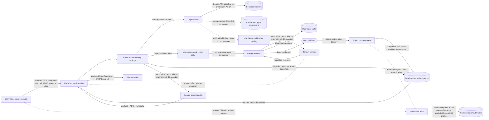
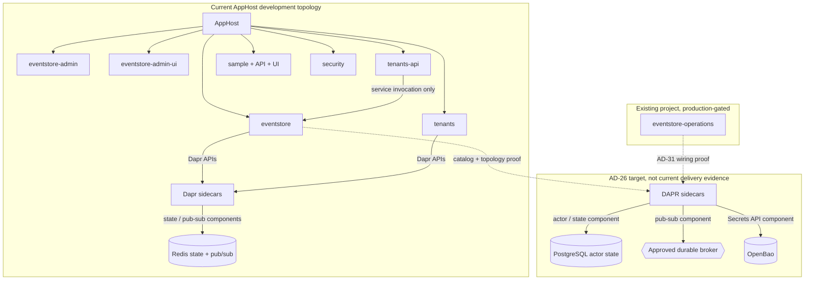

# Architecture Spine - eventstore Phase 4 Implementation Readiness Recovery

## Design Paradigm

Hexalith.EventStore is a DAPR-backed hexagonal event-sourcing platform. The EventStore host is the command and query policy edge; DAPR actors serialize aggregate writes; domain services remain pure domain adapters; generated REST hosts, interactive clients, Admin surfaces, and the Hexalith.McpCli CLI/MCP heads (AD-35) use platform seams rather than owning domain persistence. Dapr is the infrastructure boundary (AD-1, AD-34); sidecar-routed calls arrive with the receiver's channel token plus exactly one AD-36 credential kind, a delegated human bearer or a scoped workload assertion (AD-28, AD-36).

OQ8 admission follows the content-bound authority recorded in AD-25. Until EventStore retains the governing design in one permitted, re-verified form, broader OQ8 authority and readiness fail closed.


```mermaid
flowchart LR
    Client[REST / UI / Admin / McpCli] -->|public HTTP or delegated-user call; AD-10 bearer at edge| Edge[EventStore policy edge]
    Client <-.->|browser SignalR; scoped groups| Hub[Notification hubs]
    Edge --> Catalog[Route + idempotency catalogs]
    Catalog -->|catalog activation; AD-33| Sidecar[Dapr sidecar]
    Catalog -->|Dapr actor invocation| Admission[Idempotency admission actor]
    Catalog -->|projection query via actor / Dapr state| Read[(Read models + checkpoints)]
    Catalog -->|service invocation; AD-28 channel + AD-36 assertion| Query[Domain query handler]
    Admission -->|current fence; actor invocation| Aggregate[AggregateActor]
    Aggregate -->|service invocation; AD-28 channel + AD-36 assertion| Domain[Domain service]
    Domain -->|invocation response| Aggregate
    Domain -.->|trusted effect; AD-36 assertion| Edge
    Aggregate -->|IActorStateManager| State[(Dapr actor state)]
    Aggregate -->|Dapr publish API| PubSub{{Dapr pub/sub}}
    PubSub -->|sidecar subscription delivery| Projection[Projection consumers]
    Projection -->|Dapr state API; AD-34 qualified transactions| Read
    Projection -.->|freshness signal; Direct default, AD-8| Hub
    Read -->|payload + AD-14 metadata| Edge
    Query -->|payload + AD-14 metadata| Edge
    Sidecar -->|Secrets API; openbao in production, AD-24| Secrets[(Secret component)]
    Sidecar -.->|key operations; Story 8.6 unresolved| Crypto[(Candidate crypto component)]
    Sidecar -.->|notification binding; Story 2.13 unresolved| Binding[Candidate notification binding]
    Hub -.->|direct backplane; AD-34 non-conformance, excluded from AD-26 profiles| Redis[(Redis backplane, Dev/test)]
    Edge -->|governed OpenTelemetry / OTLP transport| Telemetry[Telemetry sink]
```

> **Implementation status:** Adopted decisions are not delivery evidence. Production workload promotion, traffic, consumer migration, and production-readiness claims remain prohibited until the final Implementation Status and Production Gates table is satisfied.

## Invariants And Rules

`[ADOPTED]` records an accepted architecture decision, not an implemented or proven capability. Each rule and the final gate table continue to govern brownfield gaps and production-evidence requirements. `[ASSUMPTION]` marks a decision that awaits owner ratification; only the AD-26 production target carries it, and the tag on the AD-26 heading marks that target alone, so the rest of AD-26 binds as adopted. An `[ASSUMPTION]` is open only as a tag on an AD heading or clause, never as a quoted mention inside a rule.

| Theme | Decisions |
| --- | --- |
| Platform core and module boundaries | AD-1 through AD-4, AD-34, AD-35 |
| Mutation, delivery, and query correctness | AD-5 through AD-8, AD-14 through AD-15, AD-19 through AD-20, AD-25, AD-30 |
| Runtime, security, and identity | AD-9 through AD-10, AD-16 through AD-18, AD-24, AD-26 through AD-29, AD-31 through AD-33, AD-36 |
| Release, evidence, evolution, and UI | AD-11 through AD-13, AD-21 through AD-23 |

### AD-1 - DAPR-Backed Hexagonal Event Sourcing [ADOPTED]

- **Binds:** FR1-FR37, NFR1-NFR19
- **Prevents:** incompatible CRUD and event-sourcing implementations.
- **Rule:** The platform uses CQRS, DDD, and event sourcing with Dapr as the required infrastructure boundary for every EventStore runtime package and host, including samples, linked source, and generated-host inputs, under PRD §8.4. An operation that a suitable Dapr API or component supports is reached only through the highest applicable Dapr abstraction; for it, application code adds no database driver, broker client, cloud SDK, direct provider HTTP call, provider connection string or credential, or provider schema. An operation Dapr cannot supply requires an AD-34 accepted exception decided before the dependency is introduced. Unknown suitability stays unresolved; convenience, familiarity, a missing SDK helper, or unmeasured performance is not a capability gap; a generic binding carrying application-owned SQL or provider protocols is not portability evidence and cannot bypass actor ownership; and a Dapr failure never falls back to direct infrastructure. Aggregate/event/snapshot and existing actor drain-registration mutations remain solely `IActorStateManager`-owned, actor-owned state is addressed only through its actor boundary, application code never reads or writes Dapr private actor-state keys, tables, or caches, and domain modules receive no direct persistence authority. Aspire owns the local orchestration seed and production is governed by AD-26. Story 6.6's stricter Dapr-only amendment, which supersedes the 2026-10-04 PostgreSQL metadata-adapter permission, is recorded under AD-13.

### AD-2 - Domain Modules Stay Domain-Centric [ADOPTED]

- **Binds:** FR1-FR10, FR33
- **Prevents:** domains choosing incompatible hosting, persistence, query, cursor, health, or telemetry infrastructure.
- **Rule:** Domain modules contain behavior and contracts only. Reusable infrastructure lives in EventStore libraries. A conforming host calls `AddEventStoreDomainService()` and `UseEventStoreDomainService()`.

### AD-3 - Gateway Is The Command And Query Policy Boundary [ADOPTED]

- **Binds:** FR11-FR16, FR23-FR32, NFR1-NFR4, NFR14
- **Prevents:** external adapters bypassing authorization, tenant validation, idempotency, status, ETag, error, and observability policy.
- **Rule:** External command and query entry points delegate to EventStore platform APIs. Reads of platform-owned operational state use named, tenant-authorized, support-safe adapters through Dapr APIs. This permits neither provider drivers nor reads of Dapr private actor-state keys/tables. Actor-owned state is addressed through its actor boundary. External callers never receive generic-key access or direct mutation authority.

### AD-4 - Generated REST Lives In Dedicated External API Hosts [ADOPTED]

- **Binds:** FR11-FR15, NFR12-NFR14
- **Prevents:** interactive UI hosts acquiring a second controller policy surface.
- **Rule:** `Hexalith.EventStore.RestApi.Generators` emits controllers only into external API hosts. Those controllers use `IEventStoreGatewayClient`; interactive UI hosts use EventStore client libraries and host no per-message MVC command/query controllers.

### AD-5 - Admission Precedes AggregateActor-Owned Durable Event Mutation [ADOPTED]

- **Binds:** FR23, FR27, FR29-FR31, NFR7
- **Prevents:** split-brain persistence and mutation without a durable execution authority.
- **Rule:** Every production aggregate mutation or side effect requires a non-empty opaque idempotency key, a successful AD-25 admission, and the current nonzero fence. `null`, empty, unknown, or stale fences never authorize work. `AggregateActor` is the sole event-append coordinator and accepts only an internal fenced execution context before domain invocation or any append, recovery, snapshot, projection, audit, provider, repository, or scheduling effect. Existing unfenced entry points are compatibility seams only: they fail closed or remain unmapped outside Development. This requirement does not apply to reads or cataloged non-aggregate maintenance.

**Append race (NFR7 class (c)).** The owner-selected path (2026-10-07, G-APPEND) is envelope first: the class is satisfied only by a mechanically enforced no-second-writer operating envelope bound into the AD-26 profile digest. The envelope covers the actor-only `IActorStateManager` write path, component scopes and ACLs, and single activation through placement failover, and each mechanism must be falsifiable and proven on the production path. Provider-portable append fencing requires a separately approved scope change; if the envelope cannot be enforced mechanically, the G-APPEND work stops for correct-course. Neither the current OQ8 fence nor routing writes through Dapr substitutes for the envelope or for fencing, and the class remains unmet until that proof passes. Component scopes and ACLs act per component, not per key, so they cannot alone exclude a second writer: each actor-hosting app ID that the AD-34 inventory enumerates has its own `actorStateStore: true` component scoped to it alone in every profile. In a PostgreSQL profile the component declares its physical target (`host`, `port`, `database`, `tableName`, and its own `metadataTableName`) as plain metadata and takes only credentials through `secretKeyRef`, and its app ID, namespace, and physical target are bound into the AD-26 digest. Dapr `keyPrefix` never applies to actor state and actor keys carry no namespace, so no other component in any profile names that physical target, and database credentials for it are granted to one app ID in one namespace of one environment. The G-APPEND proof shows both beside a positive control: the rendered components and the AD-34 inventory name no second component on the target, and a sidecar with the same app ID in another namespace or environment is refused by the database. EventStore's component keeps the name `statestore`; every other component name follows one convention, unique per namespace and identical in the AppHost and production, and no SDK or host default names another app's component. An app that hosts actors reaches no other app's actor-state component, and its other state, such as `IReadModelStore` read models, lives in separately scoped components. State that any other app reads lives in separately scoped components, the AD-26 profile and the AD-34 inventory enumerate them with their data migration, and AD-9 parity is reached by moving the AppHost to that posture, never by widening production. Any remaining writer is proven absent at code level through the AD-34 inventory, and the envelope is re-proven on every DAPR runtime minor-version change because placement and scheduler authority are runtime-specific.

### AD-6 - Persisted Event Identity Is Stable [ADOPTED]

- **Binds:** FR23-FR24, FR27, NFR6-NFR7
- **Prevents:** incompatible event identity and ordering semantics.
- **Rule:** Aggregate sequence is gapless per aggregate. `GlobalPosition` is non-zero and allocated by the DAPR-backed global allocator. CloudEvent `id` is the persisted event `MessageId`. Duplicate replies preserve the original result. Sharding requires an approved revision to the frozen global-ordering spec.

### AD-7 - Read Models And Cursors Use Platform Seams [ADOPTED]

- **Binds:** FR5-FR6, FR9, FR33, FR36, NFR8, NFR16
- **Prevents:** per-domain concurrency, cursor, and erasure semantics.
- **Rule:** Read models use platform lifecycle and write contracts. MVP projection read-model/checkpoint erasure is typed, tenant/domain/aggregate/projection-scoped, idempotent, and read-back-proven; it reports only projection removal and makes no broader GDPR, event, broker, backup, or cryptographic-erasure claim. Multi-key changes use one AD-34-qualified transaction within a single Dapr state component, never spanning actor-owned state, another component, pub/sub, or external effects, or an approved resumable equivalent with explicit atomicity, recovery, idempotency, concurrency, ordering, and completion. Cursors use `IQueryCursorCodec` plus `QueryCursorScope`; they are opaque, bounded, protected, scope-validated, and fail safe.

### AD-8 - Projection Delivery Is A Freshness Signal [ADOPTED]

- **Binds:** FR7, FR16, FR34, FR36, NFR5-NFR6, NFR12, NFR15-NFR16
- **Prevents:** transport acknowledgement being presented as projection-confirmed success.
- **Rule:** Domain-event pub/sub delivery is at-least-once and unordered. Consumers deduplicate by `MessageId`; sequence guards are scoped to tenant/domain/aggregate/projection. Completed duplicates are no-ops, in-progress duplicates retry, and gaps do not advance checkpoints. SignalR carries metadata-only freshness notifications whose detail metadata is limited to 16 entries and 2,048 total UTF-8 bytes of keys plus values, with opaque keys and values logged only at Debug or below. Those limits are `Contracts`-owned ceilings read by both notifier and hub; options may lower but never raise them, the receiver rejects an oversized notification, and the broadcaster clips. User-visible success requires read-model evidence.

**Freshness signals.** Projection-change signals (ETag-validator regeneration and SignalR notifications) are best-effort hints whose redelivery depends on transport. `Direct`, the default and today the only production-eligible transport (owner decision 2026-10-07), is one Dapr actor invocation plus broadcast from the replica that runs the projection actor, with no redelivery; `PubSub` is at-least-once and permitted only with AD-36 resource-bound provenance. `PubSub` and any Story 2.13 fan-out become production-eligible only through an AD-26 profile change that names a binding-capable issuer. Consumers tolerate lost, duplicated, and reordered signals; neither a signal nor its absence is completion or freshness evidence, and a forged, unbound, or mismatched callback changes no ETag, freshness, or broadcast state. A denied, expired, or unbound freshness signal follows this cataloged freshness-only policy: it is acknowledged and dropped with a bounded metric, never captured with its credential, and never replayed. Multi-replica distribution remains unresolved under Story 2.13, and the retained Redis backplane is not an accepted exception.

**Delivery failure.** Every production subscriber, including the generic domain-event endpoint, acknowledges a poison or terminally rejected message only after a tenant/domain-scoped durable record keyed by stable `MessageId` is accepted by the configured AD-31 sink. Timeout, cancellation, hash conflict, capture failure, unretainable, unknown, or unsupported outcome remains retryable or enters a separately proven durable quarantine. `SkippedUnknownEventType`, `SkippedNoHandlers`, and the freshness-only policy below require an explicit cataloged policy; silent drop is not the default. DAPR subscription/dead-letter configuration, sink contract, and route-catalog fingerprint form one evidence unit.

### AD-9 - AppHost And DAPR YAML Change Together [ADOPTED]

- **Binds:** FR8, FR19-FR20, FR32, NFR2, NFR17
- **Prevents:** local, test, and deployment topology drift.
- **Rule:** App IDs, service methods, route-catalog fingerprints, sidecar options, component scopes, ACLs, resiliency, placement/scheduler endpoints, topics, topology tests, deploy/operator documentation, and machine-checkable examples change in one slice across AppHost and deployment assets. This spine and content-bound profile/catalog artifacts are authoritative over stale deployment prose; CI rejects documented CloudEvent identity, secret-store, or topology examples that diverge from them.

### AD-10 - Security Fails Closed Above Infrastructure Scoping [ADOPTED]

- **Binds:** FR26, FR28, FR32, FR34, NFR1-NFR4, NFR15, NFR17
- **Prevents:** trusting network location, DAPR ACLs, or caller-supplied roles as application authorization.
- **Rule:** Public and internal endpoints authenticate and authorize tenant and operation before disclosure or admission-state access. Every later mutation disposition re-evaluates current authorization. Caller app ID, mTLS, and ACLs provide attribution and transport constraints, not human or tenant authorization. Sensitive payloads, plaintext, ciphertext, credentials, keys, tokens, unbounded claims, and PII never enter telemetry, support output, or evidence; tenant IDs are not metric labels.

**JWT contract.** `Hexalith.EventStore.ServiceDefaults.Authentication.JwtBearerAuthenticationContract` owns the versioned JWT validation contract for EventStore, Admin Server Host, Admin UI host, Sample API, Sample Blazor UI host, Sample domain service, Tenants domain-service host, Tenants API, every DomainService SDK host that validates AD-36 workload assertions, generated REST API host fixtures, and every future externally reachable or JWT-binding application host. The contract defines versioned validation profiles, each with its own fingerprint registered per host and profile, mandatory and forbidden claims, audience rule, skew, and lifetime ceiling: human bearer, including AD-29 delegation; AD-36 workload assertion (tenant, role, and administrator claims forbidden); and resource-bound delegation, which covers projection provenance and trusted-effect delegation. A host validates a credential only through a registered profile, so a validator outside them, including the trusted-effect delegation verifier until it is registered, fails the host gate; the human-bearer operation claim this contract owns is a claim type distinct from the AD-36 workload operation claim. For the human-bearer profile, issuer, audience, signature, lifetime, roles, and tenant validation are mandatory with 60-second clock skew. Authority mode requires HTTPS metadata outside Development and a non-empty explicit allowlist drawn only from RS256/384/512, PS256/384/512, and ES256/384/512. Symmetric mode accepts HS256 only, is rejected in Production even when break-glass is enabled, and is available only in Development or an explicitly enabled environment that is neither Development nor Production. ServiceDefaults owns the versioned host/config fingerprint inventory. Every named or future externally reachable or JWT-binding application host consumes this contract and passes positive and negative conformance against each of its registered profile fingerprints; the generated-host proof must exercise a runnable host fixture, not generated source alone. A host exposing no protected REST controller still belongs to the inventory if externally reachable; absent inbound authentication is a failing conformance result, not an exclusion. A missing host, locally reimplemented validator, or contract/config fingerprint mismatch fails the host gate and non-Development readiness. AD-36 workload assertions are validated through this contract with the receiver's own audience, and a workload principal never satisfies a human-authorization policy. AD-28 remains a distinct authentication scheme. This is a required host boundary, not evidence that the named hosts have adopted it.

### AD-11 - Release Is Manifest-Governed [ADOPTED]

- **Binds:** FR10, FR21-FR22, FR25, FR36, NFR9-NFR12, NFR16-NFR17
- **Prevents:** checkout state or mutable registry tags changing released artifacts, and approval labels exceeding their evidence.
- **Rule:** `tools/release-packages.json` is the package inventory; `references/Hexalith.Builds/Props/Directory.Packages.props` is the source-owned version catalog. Package mode is default; source mode requires explicit `UseHexalithProjectReferences=true` and a root-declared available source. Coupled versions move coherently with restore/build/test and representative-consumer evidence.

**Compatibility authority.** One manifest-backed inventory of every NFR12 public surface, with checked source/binary and wire baselines, is the sole compatibility authority (Story 3.18). The release lane fails on an unclassified or incompatible change unless an approved SemVer-major proposal is bound, and other stories' classifications, such as Story 2.15's MessageId versions, are written into its schema rather than a second manifest. Until the Story 3.18 schema exists, Story 2.15's manifest is a projection derived from the `Contracts` declarations with no compatibility authority; Story 3.18 imports and retires it, and the release lane reads only the Story 3.18 inventory.

**Epic 3 lineage.** Story 3.13 is the rejected `v3.94.1` disposition, Story 3.14 the corrective release, and Story 3.15 a bounded FR36-C2 closure that reaches `evidence-validated` only; G-RUNTIME-PARITY stays blocked. Epic 3 remains open for Story 3.16 maintenance and backlog Stories 3.17-3.20. Planning or story status never authorizes release, deployment, consumer removal, or positive `v3.94.1` closure.

**Package inventory.** The inventory remains **14 packages** until Story 8.8 atomically creates the
approved packable engine/adapter package set and updates `tools/release-packages.json`, inventory tests,
package metadata, SBOM/provenance, and package-only consumer validation from 14 to 16. The count is
derived from `tools/release-packages.json`, and every addition or retirement, including Story 8.8's and an
AD-35 retirement, passes the same atomic inventory gate and compatibility classification. Assistant
instruction entry points are never package inventory. Unset or explicit `UseHexalithProjectReferences=false`
is package intent in every configuration, including Debug.

**Release evidence.** Container releases are immutable OCI image indexes containing exactly `linux/amd64` and `linux/arm64` image manifests. The SHA-pinned shared Builds publisher/validator owns the shape, raw-byte digest chain, provenance labels, `ReleaseEvidenceCodec`, and bounded smoke contract. `ReleaseEvidenceCodec` does not yet exist in EventStore or in Builds at the pinned gitlink, so no record that depends on it can validate until it is delivered as a Story 3.19 prerequisite. A validated index digest is the required artifact identity for deployment; a mutable tag, lifecycle label, or prior pass flag never supplies authority. Production deployment additionally requires the separate publication-lifecycle and AD-26 gates below. The current release mapping contains only `eventstore`; any additional image first receives an explicit release identity and the same validation contract. Published artifacts are immutable: release tags, conforming and failed, are never re-pointed or deleted; nonconforming releases such as `v3.75.0` and `v3.94.1` remain resolvable as non-authorizing failed evidence and are corrected only by a conforming later semantic version.

**Publication lifecycle.** One immutable subject advances only through `built` → `evidence-candidate-published` → `evidence-validated` → `release-available` → `production-promoted`. `built` grants no external authority. The bounded Story 3.14 publication authority permits an immutable candidate solely to collect evidence; Story 3.15's exact-subject validator and three packet-bound receipts may establish only `evidence-validated`. `release-available` requires a separate authenticated release-owner record, and each `production-promoted` profile requires a separate authenticated deployment-owner record under AD-26. Versioned, content-bound authority records bind schema/version, exact subject digest and source SHA, Story 3.14 packet and package/OCI identities, Story 3.15 validator identity/result and receipt-set digest, predecessor-state record digest, issuer identity and authentication-evidence digest, role-registry identity, state-specific outcome, issuance, expiry, revocation, and invalidation rules; promotion also binds the complete canonical profile inventory, exact profile digest, environment, and immutable deployment identity. The validator rejects missing, duplicate, unknown, skipped, expired, revoked, wrong-role, or mismatched records. No state is inferred from tags, story status, or a passing packet; any subject change restarts at `built`. Role separation is by role-registry entry and separate content-bound records, not by distinct humans, so one owner holding several roles issues one record per role. A `production-promoted` deployment identity is the content digest of the rendered deployment (OCI index, profile digest, rendered manifests) recorded before traffic is enabled. Story 3.19 builds the record schema and exact-subject validator and ends on a truthful FAIL until the owner issues the records. The current-subject authority record and validator remain absent, so neither later state is authorized.

**Assurance level.** Every gate result, authority record, ratification, and receipt under AD-11, AD-22, and AD-26 binds its required PRD Assurance Control level and its achieved level, which for an owner attestation or ratification is the level the consuming AD-12 sealed run computes: `single-maintainer-attested` while the owner-role registry names exactly one human, and `independent` once it names two or more. Tool personas and CI identities never count as humans, and a downstream record (`READY`, `release-available`, `production-promoted`, consumer removal) carries the lowest level of its inputs. Validators reject an overstated or below-required label, an owner attestation created less than 24 hours after the last authored change to its subject, and a validator result not retrieved from a sealed AD-12 CI run.

### AD-12 - High-Risk Verification Requires Persisted Evidence [ADOPTED]

- **Binds:** NFR7, NFR10, NFR16, SM-C2
- **Prevents:** mocks and HTTP smoke being accepted as data-loss, isolation, topology, delivery, or release proof.
- **Rule:** Readiness-critical tests inspect persisted state/read-model/CloudEvent data, topology and sidecar arguments, package output, immutable registry evidence, security denials, and restart/concurrency behavior. Persisted state is read through its owning Dapr state or actor boundary; direct backend reads are labelled diagnostics and never substitute for Dapr-path evidence. Environment failure blocks the gate as unproven but is classified separately from product failure.

**Gate validators (truthful-FAIL rule, owner 2026-10-07).** Each gate validator has a required fixture job that blocks merges, whose negative fixtures are observed failing beside a positive control, and a non-required live-evaluation job, in a new workflow file or the Story 9.1 workflow, that publishes a retrievable, content-bound PASS or FAIL on every push to `main` without blocking merges. Live-evaluation results are evidence only and never seal. A seal, under the PRD Assurance Control, is the gate validator's result retrieved from the CI platform for a required run of a dedicated transition workflow on the exact head SHA and workflow-file digest under the platform's authenticated CI identity, never an author-supplied file. Story 9.2 owns that workflow beside its truthful-FAIL matrix validator; each run is triggered for one guarded transition (a high-risk gate result to PASS, a story recorded against a high-risk NFR to `done`, readiness, `release-available`, `production-promoted`, or consumer removal), so a truthful FAIL blocks only that transition and never `main`. Required means the guarded transition is effective only when its validator finds that sealed run; it is never a branch-protection or ruleset check on `main`, which a bypass push skips. A seal attaches to a transition, never to an owner record: an attestation or ratification, including an AD-26 record, binds its required level and attestation evidence, and the sealed run of the transition that consumes it checks the record and computes and labels its achieved level. A predecessor validator result that a guarded transition consumes, such as `evidence-validated`, is re-run inside that transition's sealed run with the validator identity its record binds, retrieved from that identity's pinned commit; a mismatch voids the predecessor.

### AD-13 - Cost And Evolution Changes Are Spec-First [ADOPTED]

- **Binds:** FR33, NFR8
- **Prevents:** incompatible snapshot, projection, and upcaster formats.
- **Rule:** Snapshot folding, projection sequence/cost guards, and upcaster ordering require an approved versioned spec and compatibility vectors before runtime work. An approved spec authorizes the next slice; it does not prove delivery.
- **Story 6.6 Dapr-only amendment (owner, 2026-10-05):** The [Dapr-only amendment](../implementation-artifacts/story-6-6-dapr-only-amendment.md) controls Story 6.6 wherever the approved spec conflicts. The [2026-10-04 metadata-adapter contract](../implementation-artifacts/6-5-integration/metadata-adapter-contract.md) is historical approval evidence only and grants no application SQL, schema, credential, direct-adapter fallback, or provider-proof authority to any story. Story 6.6 permits no application SQL, Npgsql, PostgreSQL schema, Dapr private actor key, or provider fork, and has no AD-34 exception path without a separate owner decision. Events, metadata, snapshots, command results, and outbox are staged under `AggregateActor` and saved once through `IActorStateManager`; an ambiguous save is reconciled by a fresh addressed Dapr actor read before retry or acknowledgment, and a new non-actor control record uses an AD-34-qualified Dapr state operation or a dedicated actor. Readback proves only the logical value Dapr returns, never physical bytes, a provider receipt, or an older committed generation, and an operation whose safety needs an unavailable provider proof stays disabled with a typed unavailable or hold outcome. One shared allow-listed evolution service serves actor replay, projections, subscriptions, reconstruction, and inspection: a missing or ambiguous mapping, corrupt digest, unreadable protected payload, unsupported version, or incomplete contiguous prefix fails closed before domain code, checkpoint, publication marker, or handler effect, and the V2 admission fence stays until the writer and every serving reader and consumer are compatible.
- **Story 6.6 loader policy (owner, 2026-10-06):** Catalog implementations and their transitive dependencies are trusted, deployer-reviewed application code; tenant input never supplies executable code, assembly paths, or CLR type selection, and a deployment that cannot meet this assumption keeps evolution capability unavailable. Before a catalog route runs, its immutable manifest, options, and artifact bytes are admitted against gateway and serving-peer pins, execution uses those same artifacts, and a missing, changed, ambiguous, mismatched, or undeclared dynamic load refuses admission before catalog callbacks. An observed loader-policy violation removes that process's evolution capability: later calls are refused, an in-flight route refuses uncommitted success, and committed truth keeps Dapr reconciliation and idempotency. Per the [reviewed trusted-code amendment](../implementation-artifacts/story-6-6-trusted-code-amendment.md), this replaces the AD-13 spec's universal before-effect loader assurance and grants neither activation nor hostile-code confinement.

### AD-14 - Query Evidence Crosses The Gateway As Platform Metadata [ADOPTED]

- **Binds:** FR5-FR6, FR9, FR14, FR16, FR33-FR34, NFR8, NFR14-NFR16
- **Prevents:** gateway policy depending on domain body shape or handler conventions.
- **Rule:** Query dispatch returns payload plus platform-owned metadata: route provenance, lifecycle, optional AD-15 token, ETag, and cursor. Only persisted projection-backed routes may assert authoritative freshness; handler-computed or unknown provenance becomes `Unknown`.

### AD-15 - Query Response Provenance Is Explicit And Route-Bound [ADOPTED]

- **Binds:** FR5-FR6, FR9, FR14, FR16, FR33-FR34, NFR8, NFR14-NFR16
- **Prevents:** interpreting arbitrary versions or ETags as ordered projection progress.
- **Rule:** `ProjectionVersion` is an optional, bounded, header-safe, opaque equality token scoped to tenant/domain/projection/read-model lineage. Consumers may compare tokens only for equality within that scope; they never parse, order, or increment a token or treat it as schema, event position, or progress. Rebuild equivalence is established from output and persisted checkpoints and may issue a new token.

### AD-16 - Health And Probe Endpoints Are Explicitly Anonymous And Fail-Closed-Compatible [ADOPTED]

- **Binds:** FR26, FR34, NFR1-NFR3, NFR17
- **Prevents:** endpoint mapping order silently exposing hosts.
- **Rule:** Every HTTP host configures an authenticated fallback authorization policy. Only `/health`, `/alive`, and `/ready` carry explicit `AllowAnonymous` metadata. Endpoint metadata tests enumerate exactly those support-safe exceptions; no probe exposes secret or tenant data. Any future anonymous asset or callback first requires a governed PRD change.

### AD-17 - Generated Command-Status Location Is Absolute, Gateway-Authoritative, And Fail-Closed [ADOPTED]

- **Binds:** FR11-FR13, FR15, FR27, NFR12-NFR14
- **Prevents:** generated hosts advertising dead or ambiguous status routes.
- **Rule:** On `202`, emit an absolute `Location` URI built from trusted gateway configuration when a valid target exists; otherwise omit it. This is Hexalith's stricter contract within RFC 9110. Generated API hosts do not map command-status endpoints. `MessageId` is the sole status identity; `CorrelationId` remains diagnostic compatibility metadata and never selects a command record.

**MessageId contract version.** `Contracts` owns the PRD's two MessageId grammars: v2, the canonical round-trip ULID, and v1, the preserved legacy form. Each command contract declares exactly one version in its `Contracts` declaration, the only source of that version. The AD-33 route entry, generator metadata, and AD-11 compatibility-inventory entry are derived from it mechanically and carry its digest, and activation fails when a generated host's declaration digest differs from the activated entry. The declaration digest is the SHA-256 of the declaration's canonical bytes from the Story 5.12 `Contracts` codec, and every consumer obtains it from that codec; a generated host computes its declaration digests at startup through the codec, because the `netstandard2.0` generator cannot call it at compile time, and never re-implements it. Callers never select the grammar, `Location` is emitted only for a MessageId valid under the declared version, and no path falls back from `MessageId` to `CorrelationId` (Story 2.15). Retiring v1 follows NFR12 through the AD-11 compatibility inventory.

### AD-18 - Outbound Sidecar Control-Plane Headers Are Handler-Owned [ADOPTED]

- **Binds:** FR26, FR28, FR32, NFR1-NFR4, NFR17
- **Prevents:** inbound headers steering DAPR service invocation.
- **Rule:** One platform handler replaces, never appends, outbound `dapr-app-id` and `dapr-api-token` from trusted configuration; that outbound token is the caller's own `DAPR_API_TOKEN` for its sidecar, never the receiver's AD-28 `APP_API_TOKEN`. Caller-provided and forwarded control-plane headers are discarded.

The handler is registered last on the gateway `IHttpClientBuilder` so it remains innermost and has the
final say after any inbound bearer or header-forwarding handler. Hosts must not define their own DAPR
routing-header handler, and must not use a bare `TryAddWithoutValidation` for these headers (AD-2).

Omitting `.AddEventStoreDaprServiceInvocation(appId, apiToken)` is **currently fail-open**: it produces no
compile error, startup validation, or runtime diagnostic. Structural host scans therefore require the
explicit final chained call for every sidecar-routed client.

The same ownership applies to the AD-36 workload-assertion header. The platform outbound handler attaches
the assertion for the exact receiver audience and operation, replacing and never appending, and discards
caller-supplied or forwarded assertions. Internal workload calls never forward an inbound `Authorization`
bearer, and hosts never mint or attach assertions outside the platform handlers. The platform handler for each AD-36 call kind strips the other kind's credential, so a host-added forwarder cannot put a bearer on a workload call or an assertion on a delegated-user call.

### AD-19 - Projection Dispatch Is Asynchronous And One-To-Many [ADOPTED]

- **Binds:** FR5-FR8, FR16, FR33-FR34, NFR5-NFR8, NFR14-NFR16
- **Prevents:** synchronous or single-target projection assumptions and phantom cross-service contracts.
- **Rule:** The cross-service v2 carrier is `ProjectionDispatchResponse` with `ProjectionDispatchOutcome`. The server persists a normalized per-route result and checkpoint matrix after required durable work. Each configured route records one outcome—advanced, not advanced, retry, or failure—without hiding partial fan-out. Internal boolean coordinators never cross the service contract.

### AD-20 - Paged Rebuilds Are Replay-Equivalent [ADOPTED]

- **Binds:** FR5-FR7, FR33, NFR5-NFR8, NFR16
- **Prevents:** a page-local model replacing a complete live model.
- **Rule:** Paged rebuild stages state and publishes only an output equivalent to canonical replay. Rebuild resumption and progress use persisted checkpoints, never the ordering of AD-15 tokens. Failure leaves the last complete live model intact.

### AD-21 - The Existing Admin UI Is The Consolidated EventStore UI [ADOPTED]

- **Binds:** FR16, FR34-FR35, NFR12, NFR15-NFR17
- **Prevents:** a parallel UI with conflicting routes and evidence semantics.
- **Rule:** `Hexalith.EventStore.Admin.UI` remains the FrontComposer-based EventStore UI and owns the canonical dashboard routes. It uses typed Admin APIs, accessible/localized support-safe presentation, and projection-confirmed success. The UI hides or disables unavailable operations, or the API returns `501`; the UI never presents those operations as successful or actionable.

### AD-22 - Consumer Infrastructure Removal Requires Owner-Approved Exact-SHA Parity [ADOPTED]

- **Binds:** FR36, NFR9-NFR11, NFR16-NFR17
- **Prevents:** consumers removing local infrastructure from package or image existence alone.
- **Rule:** A consumer may remove infrastructure only after the same immutable subject has passed source/package capability, exact deployed-runtime evidence, AD-11 `release-available`, and AD-26 `production-promoted` for the canonical profile digest, followed by per-consumer authorization. A deterministic consumer-removal manifest at `_bmad-output/implementation-artifacts/evidence/consumer-removal-manifest.json` enumerates every root-declared or Phase-4-referenced consumer, including entries with no proposed removal; a new consumer or removal proposal is registered there before any consumer code change, and a removal proposal is never `N/A`. `tools/validate-consumer-removal-authority.py` must pass on that complete manifest, and an absent, unknown, under-declared, or self-only profile/consumer entry fails. The content-bound parity packet records the authoritative capability catalog; the applicable source, package, and deployed-mode matrix; persisted production-path evidence; the exact EventStore source SHA and package or image digest chain; canonical production-profile digest; configuration; platforms; topology; smoke results; rollback; the consumer repository and commit; and the exact removal-subject digest. The authenticated Consumer owner issues an immutable receipt binding those digests, its owner-role registry identity, required and achieved AD-11 assurance level, outcome `consumer-removal-authorized`, timestamp, and validity. Every applicable mode must pass against the same packet; `N/A` requires a bound no-removal consumer diff plus owner and validator attestation. Any bound change or expiry invalidates the receipt. Booleans, free-form, unauthenticated, or registry-unbound approval, EventStore-side acceptance alone, planning status, and mutable tags confer no removal authority. Shared release validators remain owned by Hexalith.Builds and are consumed at a pinned SHA.

### AD-23 - EventStore Owns The Optional Shared Payload-Protection Engine [ADOPTED]

- **Binds:** FR37, NFR1-NFR4, NFR6-NFR7, NFR9-NFR10, NFR12, NFR16-NFR17, NFR19, Parties G5
- **Prevents:** domain-specific incompatible envelope encryption and key custody.
- **Rule:** EventStore owns the optional `pdenc-v2` format, byte-stable authenticated data, mechanics, provider registry, conformance tests, and release proof. Backward readers preserve `json+pdenc-v1`, `json-redacted`, legacy, and snapshot compatibility. Domain extensions use `IPersonalDataPolicy` and `IErasureStateProvider`; domains own legal policy and operators own production key custody. The no-op provider remains default until registration. Typed failures, key-buffer zeroing, cache invalidation, a non-Development backend, historical-read and rollout evidence, consumer parity, and rollback are mandatory gates. The current replacement prerequisite specification is approved-authorized at normative SHA-256 `de9ba8866fd98a480629890ee2b89a492fbad96d4d5a927388e6aaa0fdd72b4e` (full-file SHA-256 `542f0b6e4ebe24c02a403ed7af511a03d1a4b6ef5c83b789254fbb055a563c82`) by `AR-20260913-01`. `AR-20260914-01` approves Story 8.2 and authorizes Story 8.3; its existing in-progress lifecycle and frozen intent remain unchanged. Historical `AR-20260801-01` applies only to its original `0f841d5a72a0d0b10fa42a7e765b7282a810f3a5a2aa2b41da2001d17a054ae7` bytes. PRD §8.4 requires Dapr key-operation qualification before provider SDK selection. The [detached Dapr amendment](../implementation-artifacts/spec-shared-payload-protection-dapr-amendment-2026-10-05.md) is draft/unapproved: it rewrites no shared authority bytes, conveys no implementation authority, and cannot reuse old approvals for new bytes. Unsupported operations return to Architecture/Security for a compatible design, separately reviewed format migration, or exact-path exception. Preserve `pdenc-v2`/AAD, custody, typed failures, historical reads, rollback, successor approvals, and Story 8.8 atomic package inventory; Dapr Crypto Scheme v1 never replaces `pdenc-v2` or its AAD bytes, and a Dapr secret store is not a cryptographic key-operation component.

### AD-24 - Production DAPR Secrets Use OpenBao [ADOPTED]

- **Binds:** FR26, FR28, FR32, FR34, FR37, NFR1-NFR4, NFR17
- **Prevents:** plaintext production configuration and mixed secret custody.
- **Rule:** Production uses the DAPR component named `openbao`, type `secretstores.hashicorp.vault`, backed by OpenBao. Applications read logical names only through the DAPR Secrets API; DAPR components use `auth.secretStore: openbao` and `secretKeyRef`. Access is scoped default-deny and TLS verification is mandatory. Kubernetes Secrets may contain only documented bootstrap material when no approved mounted or projected mechanism exists; they are not an application-secret backend. The DAPR app-channel token is startup-loaded, so rotation requires a controlled sidecar/workload rollout. Required-secret and key-generation checks gate readiness; payload KEK custody remains separate under AD-23. A digest-key generation may be retired only after operational acknowledgment and an AD-25 catalog proves that no live references remain.

**Secret contract and rotation.** The Platform deployment owner is the sole composer of the singleton component, every per-app DAPR `Configuration`, and the value-free `deploy/dapr/openbao-secret-contract.yaml`. That canonical contract inventories logical name and map keys, consumer app and dependent component/host, retrieval lifecycle, OpenBao policy path, generation, cache bound, overlap, acknowledgment, and rotation unit. Component scopes, `defaultAccess: deny` plus `allowedSecrets`, and least-privilege OpenBao policies derive from it. The publish, overlap, acknowledge, and revoke rotation sequence fails closed until every cataloged runtime consumer and startup-only rollout acknowledges the new generation. The contract also inventories each app's `DAPR_API_TOKEN` and `APP_API_TOKEN` and each AD-36 workload-issuer client credential, for EventStore and every trusted-effect submitter; the symmetric JWT signing key is Development or break-glass material and never a production secret. Every internal proof uses dedicated keys inventoried here, never the AD-25 digest ring: today the AD-5 fenced and AD-28 execution contexts, signed with each issuing app's own key and verified with verification-only material, the trusted-effect gateway proof, and the trusted-effect erasure capability. A digest-key generation retires only after every registered consumer, including any internal proof not yet moved to its dedicated key, shows no live reference. Missing contract, grant, policy, generation, or digest match blocks non-Development readiness.

### AD-25 - Durable Idempotency Admission Precedes Mutation Execution [ADOPTED]

- **Binds:** FR23, FR27, FR29-FR31, NFR1-NFR4, NFR7, NFR16
- **Prevents:** duplicate side effects, raw-key disclosure, collision ambiguity, and stale authority execution.
- **Authority:** OQ8 is governed by version `1.0.0` of the external Hexalith.Folders design in repository `github.com/Hexalith/Hexalith.Folders`, at path `docs/exit-criteria/oq8-idempotency-design.md`, commit `a9cfea91c8a987ef7a836c216e633a92321fc3c2`, with SHA-256 `1a55b0302e91233e12db91e6e245f0a22d6bf13fcf6cdf5ee0cbe5759f08dcd8`.
- **Rule:** EventStore owns a tenant/key admission actor partitioned by managed tenant, digest-key version, and domain-separated HMAC-SHA-256 of the opaque key. A verification tag detects collisions. Raw keys and protected intent never enter actor IDs, persistence, envelopes, status/archive, telemetry, errors, or evidence.

**Admission lifecycle.** The admission actor owns reservation, canonical descriptor comparison, monotonically increasing fence issuance, recovery, terminal replay, inclusive expiry, compaction, and a minimized expired tombstone. Digest rotation uses a tenant-scoped directory with one canonical actor and an idempotent prepare/copy/redirect/flip protocol. Legacy migration uses a versioned inventory and the same single-authority rule. Unknown, corrupt, ambiguous, unsupported, or uninventoried evidence fails closed.

**Expiry.** The expired tombstone contains only schema version, expired state, tenant partition, key digest, verification tag, digest-key version, retention class, first-consumed time, replay-expired time, and monotonic last-observed time; it never retains the fence, result, or intent. Expiry atomically replaces replay payload and live intent with that tombstone. Equivalent and different expired requests return the same `idempotency_key_expired` outcome before intent comparison or downstream work.

**Rotation and legacy migration.** Digest promotion keeps the source authoritative through prepare and copy; the target remains non-executable until durable import acknowledgment, then the source persists a redirect, and only then may the directory flip. Every phase is persisted and idempotent. Legacy inventory binds source aggregate identity, schema, protected aliases, exact logical result, and phase; its target is prepared non-executable, the source redirects only after acknowledgment, and inventory flips last. Source evidence remains until target and redirect are durable. Mixed versions without directory routing fail readiness.

**Evidence ownership.** Stories 4.14-4.15 assemble the EventStore platform packet at
`_bmad-output/implementation-artifacts/4-8-eventstore-oq8-platform-evidence.yaml`; Folders retains
ownership of the canonical `oq8-idempotency-evidence.yaml` and of OQ8 closure. EventStore platform
completion is a source-only handoff and confers no release approval, Folders closure, package or pin
authority, or consumer-migration authority. EventStore retains the governing design in exactly one
permitted form, re-verified inside the repository: an immutable copy with recorded owner permission,
verified by file SHA-256; a complete approved normative projection, binding the source SHA-256 plus its
own normative digest; or a signed or content-addressed Folders attestation over the source SHA-256. All
three bind repository, path, and commit (Story 4.17, G-OQ8). Absence or mismatch fails G-OQ8, and the sealed OQ8 v3 gate inputs
(`v3.py`, `.github/workflows/ci.yml`, `docs/ci.md`) change only inside a planned Story 4.15 reseal.

**Deployment catalog.** Every compatible host loads the idempotency facet of the AD-33 catalog envelope, keyed by stable route-entry ID and `(Domain, CommandType)`. Each entry binds the trusted adapter, operation, canonical descriptor schema and digest, retention tier, active and reader digest-key generations, OpenBao logical map, consumer identity, and content digest. Readiness fails on missing entries, duplicate keys, unsupported generations, or root/facet fingerprint drift. Retirement is refused while records, tombstones, aliases, migration entries, legal holds, or catalog references remain.

### AD-26 - Production Runs Only On A Proven Fail-Closed Profile [ASSUMPTION]

- **Binds:** FR8, FR19-FR20, FR26-FR28, FR32, FR36, NFR2-NFR4, NFR7, NFR16-NFR17
- **Prevents:** local convenience topology being promoted as production evidence.
- **Rule:** The self-managed Kubernetes production profile uses per-application DAPR sidecars, one stable `state.postgresql` v1 component with `actorStateStore: true` per actor-hosting app ID, scoped to that app alone (AD-5), the production resiliency policy, an approved durable broker, AD-24 OpenBao, and OQ8 profile `oq8-postgresql-v1`. Redis is Development/test only, including the SignalR backplane; Cosmos templates are alternatives, not authorizing evidence. The profile binds no application-owned database schema, DDL, or provider credential; event-evolution control state follows AD-13 and every infrastructure operation follows AD-34. The target selection in this Rule (deployment mode, components, broker, OQ8 profile, and the Redis and Cosmos exclusions) binds only through the Ratification below; the no-schema sentence and the Ratification and Production proof mechanics bind now.

**Ratification.** The target binds only once the owner, holding the Architecture and Platform deployment roles, records one authenticated, content-bound ratification or approved replacement per role under the AD-11 assurance level, naming the broker, DAPR runtime pin, restore posture, and NFR7 class (c) envelope path. Each record binds the ratification subject digest, the SHA-256 of these UTF-8 lines, each ending in exactly one LF and otherwise unnormalized: the line beginning `**Append race (NFR7 class (c)).**` through the line before the next empty line; then, with no separator, the line beginning `### AD-26 ` with its trailing status tag (` [ASSUMPTION]` or ` [ADOPTED]`) removed, through the last non-empty line before the next line beginning `### ` or `## `, with the empty lines between them included. A record also binds the whole-file digest at issuance, for traceability only. The G-BASELINE planning-baseline manifest records the subject digest, checks each record against it rather than the whole-file digest, and never redefines it. An edit outside the subject leaves a record valid, so each architecture update records in its memlog whether a change outside the subject changes what AD-26 requires, and such a change edits this section in the same change. The AD-11 24-hour window starts at the time the repository's push-activity record gives for the latest push to `main` that changed the subject digest to its current value; for AD-26 records that push is AD-11's last authored change. Tool-persona reviews are bound as evidence only.

**Production proof.** The G-PUBLICATION-AUTH work drafts, and the owner acting in the Platform deployment role publishes, one versioned, canonical `deploy/dapr/production-profile.yaml`. This path is the sole declared production-profile inventory slot; its canonical-byte SHA-256, computed by the publication-authority validator from retained file bytes, is the complete authorizing inventory. Its digest must bind the exact DAPR runtime image (at least `1.18.3`, which carries the reminder-name and placement fixes the actor model depends on) and CLI compatibility, Kubernetes/sidecar mode, scheduler and placement configuration, PostgreSQL and broker components with every actor-state component's app ID, namespace, and physical target, app IDs, scopes and ACLs, `DAPR_API_TOKEN` enablement, resiliency, OpenBao contract digest and server floor, route/idempotency catalog digests, the digest of its profile-scoped projection of the AD-34 inventory and register, the AD-5 append operating-envelope identity with its writer inventory and placement/failover configuration, the production AD-36 workload-assertion issuer and global-administrator bootstrap credential, the replica posture for freshness signals (one EventStore replica, or no multi-replica freshness claim), restore posture, and required evidence. The broker, DAPR runtime pin, activated AD-33 catalog envelope, and restore posture are each proven before any `production-promoted` record is issued. The restore posture covers every state component the profile binds (actor state, admission and fence state, read models, checkpoints, and command status) and scheduler state, with one consistency point or a declared restore order under which no restored checkpoint passes an event its read model lacks. Cosmos and Development/test profiles are excluded; adding, replacing, or retiring an authorizing profile requires approved architecture change and a new canonical digest. A separately authorized immutable candidate may be published under AD-11 solely to produce evidence; candidate publication and `evidence-validated` never grant `release-available` or `production-promoted`. A validator must bind the same immutable subject's authenticated release-owner and deployment-owner predecessor records to the exact canonical profile digest and all two-host/shared-backend and production-path gates. Production promotion, traffic, consumer migration, readiness claims, and an approved production identity remain prohibited while any record, profile, proof, or AD-26 owner ratification is missing.

### AD-27 - Tenant Identity Has One Canonical Boundary Contract [ADOPTED]

- **Binds:** FR12, FR15, FR26, FR28, FR32, FR34, NFR1-NFR4, NFR14-NFR15
- **Prevents:** mixed-case, defaulted, or conflicting tenants crossing security boundaries.
- **Rule:** `Contracts` owns the canonicalizer. Each boundary requires exactly one explicit scope: one canonical tenant, or, on a route cataloged in the platform-operation namespace, that namespace and no tenant; the scope comes from the request route, body, or headers, and a request naming both a tenant and the platform namespace fails. A workload assertion carries no scope, tenant grants in a credential authorize but never set the scope, and AD-28 contexts bind the request scope. The boundary normalizes the tenant values from the request and `eventstore:tenant` grants to lowercase using the `AggregateIdentity` grammar: 1-64 characters, `^[a-z0-9]([a-z0-9-]*[a-z0-9])?$`. Missing, duplicate, conflicting, or invalid tenants fail before routing or state access. `system` is never a managed or provisionable tenant and every public tenant boundary rejects it. Internal platform-operation scope uses a distinct cataloged namespace plus AD-28 channel authentication and the AD-36 credential kind the route admits; a `system:*` subject never synthesizes tenant or global-administrator grants. That namespace is declared once in `Contracts`, cataloged in the AD-33 envelope with a grammar disjoint from AggregateIdentity, authorized externally only through the AD-10 human-bearer operation claim, and never forwarded as a request tenant (Story 2.14). Resource bindings carry the canonical tenant. Wildcards are never inferred from caller identity.

### AD-28 - DAPR App Endpoints Authenticate The App Channel [ADOPTED]

- **Binds:** FR26, FR28, FR32, NFR1-NFR4, NFR17
- **Prevents:** forging `dapr-caller-app-id` to gain internal or administrator authority.
- **Rule:** Every non-Development DAPR app endpoint validates `dapr-api-token` against the startup secret supplied through `APP_API_TOKEN`, using shared platform middleware and constant-time comparison. Missing configuration makes readiness fail. The receiver's sidecar stamps this token on every request it delivers, and callers never hold or present another app's `APP_API_TOKEN`. The token proves only that a request crossed the receiver's own sidecar, which includes a peer's service invocation, so it never distinguishes sidecar delivery from peer invocation. Service-invocation operations additionally require the AD-36 credential the route admits plus catalog/ACL authorization, and sidecar caller attribution, when present, must match the asserted caller and otherwise serves only to deny. Channel-admitted Dapr routes (subscription discovery, pub/sub delivery, actor callbacks) carry an explicit sidecar-channel policy that the channel scheme alone satisfies; they confer no workload identity, operation, tenant, or administrator authority, and the AD-16 fallback is never satisfiable by the channel scheme. A public route that is also reachable through the sidecar is checked against the AD-36 credential kind it admits, never as channel-only. Service-invocation access control, the API allowlist, and workflow access policies do not restrict invocation of a user-defined actor type, and DAPR 1.18 offers no control that does. Until an AD-34 inventory row for the profile and runtime shows each hosted actor type denied by the receiving runtime to every app ID not allow-listed for it, including other actor hosts, with caller-side allowlists, ACLs, and network policy excluded as evidence, every actor method that discloses, admits, or mutates validates one execution context bound to tenant and operation. The invoking app signs it with its own dedicated AD-24 key; the hosting app verifies it with verification-only material and accepts only issuers allow-listed for that actor type (EventStore for EventStore-hosted actors and for the tenant and RBAC validator actors it calls; a self-hosted reminder or drain actor only its own host), so no verifier can mint one. For mutating aggregate methods it is the AD-5 fenced context; admission, read, and freshness methods validate it without a fence; and no method accepts a synthesized fence. The channel alone admits only Dapr runtime callbacks (actor configuration, activation, deactivation, timers, reminders), subscription discovery, and subscription delivery. mTLS, ACLs, and caller app ID never create global administrator or tenant claims. Rotation follows AD-24 rollout semantics.

### AD-29 - Admin Mutations Preserve Human And Service Attribution [ADOPTED]

- **Binds:** FR28, FR34-FR35, NFR1-NFR4, NFR15-NFR17
- **Prevents:** anonymous, manufactured, or caller-app principals authorizing operational mutations.
- **Rule:** Admin preserves either an authenticated operator identity from end to end or a validated, bounded delegation that binds the human subject, service principal, tenant, operation, reason, request, correlation, and message IDs, credential issuer, and expiry. Each mutation and its audit record form one versioned, resumable unit with explicit prepare/effect/commit/recovery states. Audit failure cannot silently permit the mutation; support output remains AD-10-safe.

### AD-30 - Domain Policy Owns Erasure; EventStore Owns Fenced Mechanics [ADOPTED]

- **Binds:** FR27, FR33, FR37, NFR1-NFR4, NFR7-NFR8, NFR16, NFR19
- **Prevents:** one subsystem declaring erasure complete while recoverable projections or payload keys remain.
- **Rule:** AD-7 owns the MVP projection read-model/checkpoint operation: typed, idempotent, read-back-proven removal with no claim of GDPR, event, broker, backup, or cryptographic erasure. AD-30 owns the post-MVP full workflow. Its domain legal-policy owner assigns a stable erasure workflow ID and EventStore performs typed, idempotent, fenced steps: freeze subject mutation, relate the AD-7 operation by ID, invalidate the payload key where applicable, publish a watermark and typed `Erased` delivery, and record separate logical, projection, cryptographic, broker, backup, restore-point, cache, export, replica, and legal-hold facets. Overall completion is never inferred while any required facet is pending, unknown, or failed. Story 1.14, FR5, a projection-erasure response, or approval of the Epic 8 specification alone neither authorizes nor delivers AD-30. The existing MVP Contracts and Admin crypto-shredding and backup seams are claim-bounded by AD-7 and assert no cryptographic, physical, or key-custody erasure; Story 7.21 documents and guards that boundary, and Epic 8 cannot substitute for it.

### AD-31 - Operations Owns Dead-Letter Recovery But Is Not Yet Production-Wired [ADOPTED]

- **Binds:** FR34-FR35, NFR5-NFR7, NFR15-NFR17
- **Prevents:** dead-letter loss and an undeployed project being treated as an operational capability.
- **Rule:** `Hexalith.EventStore.Operations` owns the AD-8 durable poison sink and replay under app ID `eventstore-operations`. It is non-production until AppHost, deployment/subscription wiring, immutable release identity, AD-28 channel authentication and the AD-36 credential kind each invoked route admits, AD-29 audit, tenant/target validation, common catalog fingerprint, and capture-before-ack evidence exist. A capture with an unknown, failed, hash-conflicting, or unretainable outcome is retried or durably quarantined and must not be acknowledged as successful.

### AD-32 - Correlation Is One Bounded Diagnostic Contract [ADOPTED]

- **Binds:** FR11-FR16, FR27-FR31, FR34, NFR12-NFR15
- **Prevents:** downstream reminting and incompatible GUID-only validation.
- **Rule:** `Contracts` owns `X-Correlation-ID`: 1-128 ASCII alphanumeric or hyphen characters. The first public boundary accepts a valid value or mints one; every downstream hop propagates it and rejects invalid replacements. It is never reminted, parsed as a GUID, used for status identity, or substituted for W3C `traceparent`.

### AD-33 - One Route Catalog Binds Messages To Runtime Topology [ADOPTED]

- **Binds:** FR1-FR16, FR19-FR20, FR32-FR34, NFR2, NFR14-NFR17
- **Prevents:** gateway, adapter, DAPR ACL, and projection routing selecting different services.
- **Rule:** `Hexalith.EventStore.Contracts` owns the schema and versioned canonical codec for one deployable envelope, `deploy/dapr/eventstore-routing-catalog.json`; the Platform deployment owner owns its signed/content-bound instance. Stable route-entry IDs join route and AD-25 idempotency facets under one root digest and generation. Commands/queries map by `(Domain, MessageType)` and projections by `(Domain, ProjectionType)` to exactly one app ID, method, and contract version. Exact keys precede catalog-declared bounded fallbacks; runtime overrides are forbidden outside Development. Each receiver's AD-36 workload audience is its activated catalog app ID and the issuer takes the audience from the same entry; host-derived audience fallbacks are Development-only. Each route entry also declares exactly one admitted credential kind, delegated-user or workload, and the operation it requires from that kind's vocabulary (the AD-10 human-bearer operation claim or the AD-36 workload operation), so catalog, ACL, and credential compare one value. A route entry's kind and operation govern only the hop into its target app ID and method, so message and projection entries admit the workload kind; a capability both kinds need is cataloged as two operations with distinct keys, and no two entries share a key. A resource-bound delegation is a binding carried inside a call of one kind, never a third kind, and the endpoint or entry that admits the call names the resource-bound family it requires. Until the owner decides whether sidecar-reachable ingress endpoints are cataloged, an ingress endpoint's kind, operation, and required resource-bound family are endpoint metadata (Story 5.14). Like the AD-17 MessageId version, kind and operation are declared in the `Contracts` route declaration and derived into the entry. The schema and codec do not yet exist in `Contracts`; until the envelope activates, production readiness fails and Development resolves routes from the `Contracts` declarations.

**Activation.** Canonical retained UTF-8 bytes are hashed without consumer reserialization. Activation is prepare/ready/commit: every required host, including each generated API host that the AD-26 profile's app-ID list enumerates, loads and validates the same root/facet digests before the deployment owner commits the generation; failure rolls back to the prior complete generation. Any duplicate, missing, or ambiguous entry; unsupported override; partial generation; signature or trust failure; or fingerprint mismatch causes readiness to fail. AppHost, deployment ACLs, gateway, generated API hosts, admission, domain and projection dispatchers compare the same root digest.

### AD-34 - Infrastructure Operations Are Dapr-Qualified [ADOPTED]

- **Binds:** FR5, FR8, FR16, FR32, FR34, FR37, NFR7, NFR12, NFR17, NFR19
- **Prevents:** hosts choosing direct provider clients, assuming guarantees a component does not supply, or inferring atomicity from a shared backend.
- **Rule:** Every supported profile, Development and test included, maps each runtime infrastructure operation to the Dapr API or component that performs it, with its required correctness, security, compatibility, and operational guarantees, exact runtime/client/component versions, and observed acceptance evidence, or to an entry in the accepted-exception register `docs/architecture/dapr-infrastructure-exceptions.yaml`. The Story 3.17 inventory (`docs/architecture/dapr-infrastructure-inventory.yaml`) is the only operation/component matrix: it enumerates the supported profiles, so a template it does not list is unsupported, and it is keyed by profile and bound to the Builds gitlink, so a gitlink change that alters a bound version fails the Story 3.17 guard until requalified. An entry records the missing guarantee and evidence, alternatives considered, isolated adapter, owner, exact purpose and paths, review/removal trigger, and the architecture-owner decision taken before the dependency is introduced; unknown, missing, stale, or overbroad rows stay unresolved and confer no conformance. ETags, transactional scope, TTL, ordering, cancellation, retries, and failure classification are qualified per component; a shared physical backend implies no transaction across actors, state components, pub/sub, or external systems, so those boundaries use durable intent, idempotency, and fresh addressed Dapr readback, and a cancellation, timeout, or unavailable readback never establishes absence or authorizes a second effect. A backend, component, or catalog-version change requires configuration, data migration where needed, and requalification even when application code is unchanged, and never establishes an exception by itself. Provider credentials never reach application processes for an operation Dapr supplies; provisioning, component configuration, test doubles, and diagnostics are classified separately, never expose a bypass to application code, receive no blanket test-folder or provider-namespace exemption, and never substitute for Dapr-path evidence; envelope-falsification writers are fault-injection rows confined to exact test paths and never packable.

**Current state.** The register is empty. Known non-conformances, which are not exceptions and may not be extended or selected before their owning qualification, include the retained direct Redis SignalR backplane, production payload key operations (the Dapr Cryptography API is alpha and exact-version wrap/unwrap exists only as `Subtle*Alpha1` operations), and Admin's `DaprInfrastructureQueryService` reads of Dapr private actor-state keys. The list is non-exhaustive until the Story 3.17 inventory completes. This rule accepts no exception, records no qualification, and changes no readiness verdict; AD-26 ratification and production gates still fail closed.

### AD-35 - Hexalith.McpCli Is The Target CLI/MCP Surface; EventStore Keeps Admin Semantics [ADOPTED]

- **Binds:** FR26, FR34-FR35, NFR1-NFR4, NFR15-NFR17
- **Prevents:** a second permanent EventStore CLI/MCP transport, and McpCli re-implementing, weakening, or bypassing EventStore admin authorization, confirmation, and audit.
- **Rule:** `Hexalith.McpCli` is the sole target Hexalith-owned CLI/MCP surface for EventStore (Platform course correction, 2026-09-27). `Hexalith.EventStore.Admin.Cli` and `.Admin.Mcp` are obsolete migration sources, including for infrastructure administration, limited to safety and continuity fixes, and no new EventStore CLI or MCP surface is created. EventStore keeps the administration semantics and server-side checks: the AD-3 policy edge, AD-10 and AD-27 authorization, AD-29 attribution and audit, and destructive-operation confirmation and role gates. McpCli reaches gateway-ready domain operations only through decorated Contracts and the EventStore gateway over the public AD-3 edge, and admin operations only through Admin Server over the public AD-21 edge, in both cases with the end user's AD-10 bearer or an AD-29 delegation; it reaches no stream, subscription, cluster, destructive, UI-only, or confirmation-required operation until an approved generic McpCli administration contract and transport decision preserves those checks. Each legacy operation is removed only after the owner-approved McpCli inventory records its replacement or withdrawal and positive and negative parity, authorization, and denial evidence passes; an unsupported operation is never reported as migrated, and AD-21 and the Admin Server are unaffected.

### AD-36 - Internal Callers Prove Workload Identity With Scoped Assertions [ADOPTED]

- **Binds:** FR13-FR16, FR28, FR34, NFR1-NFR4, NFR12, NFR17
- **Prevents:** a caller header, network position, app-channel token, or broadly shared token standing in for an internal caller's identity, audience, operation, or resource scope, and a human relay being forced into a workload credential or a workload into a human one.
- **Rule:** Every sidecar-routed call into a protected EventStore or domain-service endpoint is either a delegated-user call or a workload call. A delegated-user call, made for an authenticated human by a generated REST host, Admin, a UI host, the Tenants API, or McpCli, forwards only that human's AD-10 bearer, or an AD-29 delegation from the AD-10 issuer, for the receiver's human audience and carries no workload assertion. A workload call, such as EventStore invoking a domain service, a domain service submitting a trusted effect, or any future internal caller, carries no human credential and exactly one short-lived workload assertion; receivers reject a request carrying both kinds or the kind its route does not admit. Either kind reaches the receiver through its own sidecar, which stamps the AD-28 channel token, while the caller authenticates to its own sidecar with its `DAPR_API_TOKEN` under AD-18. The assertion comes from the trusted issuer of the AD-10 JWT contract, is validated through that contract with the receiver's own audience, and names one caller workload, the receiver's AD-33 app ID as audience, and the one operation the call performs; a token is never broadened across audiences or operations. Receivers deny a missing, duplicate, conflicting, expired, over-lifetime, wrong-issuer, wrong-audience, non-allow-listed, attribution-conflicting, or operation-mismatched assertion before binding or downstream work, and fail closed when verification is unavailable. The rebuilt principal holds only the workload identity and its granted operations, never satisfies a human-authorization policy, and never carries tenant, role, or administrator claims; wire administrator flags are untrusted hints that only a domain's verification of current human authority may honor. `Hexalith.EventStore.ServiceDefaults` owns the versioned assertion contract (header, claim types, operation vocabulary, lifetime ceiling, bounded reason codes), and hosts never define their own signing protocol, issuer, or certificate platform.

**Resource binding (owner decision 2026-10-07).** A credential that authorizes a tenant- or topic-scoped effect outside a live request belongs to an enumerated resource-bound family with a named issuer, mode, audience, and binding claims; today the families are projection-change provenance and trusted-effect delegation. Projection provenance carries tenant, projection-type, and topic bindings that exactly match the AD-27-canonical notification. Unbound or partially bound credentials are denied, and an issuer that cannot embed per-request bindings refuses the bound request rather than issuing an unbound assertion. Only the AD-10 symmetric mode, never admitted in Production, can bind projection provenance today, and trusted-effect delegation has no production token provider, so both families stay non-production until an owner-approved binding-capable issuer exists. The literal header, claim names, lifetime value, pub/sub body carrier, and issuer mechanics remain Story 5.5 contract detail until that story reaches `done`; this is a required boundary, not evidence that any host has adopted it.

## Consistency Conventions

| Concern | Convention |
| --- | --- |
| Identity | `MessageId` follows the AD-17 versioned grammar; ULID-safe handling applies to v2 MessageIds and to sortable aggregate and causation IDs. Correlation follows AD-32 and is never validated as a ULID or GUID; AD-32 overrides generic identifier guidance. `Guid.TryParse` validates none of them. See AD-6, AD-17, and AD-32. |
| Infrastructure access | Dapr boundary, operation qualification, and accepted exceptions follow AD-1 and AD-34. |
| Approval and assurance | Every owner record, ratification, receipt, and approval carries the AD-11 assurance level computed from the owner-role registry (`single-maintainer-attested` while one human holds every role); a downstream record carries the lowest level of its inputs. Tool-persona reviews are evidence, never approval identities, and are never labelled `independent`. |
| Naming | Domains, message and projection types, component names, topics, and app IDs follow platform conventions; tenant/domain identity follows AD-27. |
| Mutation | Business correction uses compensating commands, never event edits or deletes. See AD-5 and AD-25. |
| Errors | External failures are safe problem details or typed rejections; domain failures are results, not infrastructure exceptions. |
| Serialization | Command, rehydration, projection, and pub/sub payloads use the one shared `Contracts` path, `EventStorePayloadSerialization`, and its version policy. |
| Query evidence | Cursors, ETags, lifecycle, and projection tokens follow AD-7, AD-14, and AD-15. |
| Delivery and rebuild | Deduplication, fan-out, checkpoints, and replay equivalence follow AD-8, AD-19, and AD-20. |
| HTTP security | Authentication, anonymous exceptions, DAPR tokens, workload assertions, and control-plane headers follow AD-10, AD-16, AD-18, AD-28, and AD-36. |
| UI and Admin | The consolidated UI, attributed support operations, and the McpCli migration follow AD-21, AD-29, and AD-35. |
| Secrets and payloads | OpenBao and optional payload protection follow AD-23 and AD-24. |
| Runtime and release | Topology, production profile, parity, and immutable release evidence follow AD-9, AD-11, AD-22, AD-26, AD-31, and AD-33. |

## Stack

This is the repository state observed on 2026-10-07 at Builds gitlink `397c94a4`. The Builds catalog at the root-declared gitlink remains the sole dependency authority; availability never authorizes an upgrade, and upstream versions require a separately tested refresh.

| Name | Repository value | Current evidence / posture |
| --- | --- | --- |
| .NET SDK | `10.0.401`, `rollForward: latestPatch` | Current SDK for the 10.0.12 security release (2026-09-08) |
| Target framework | `net10.0` | Retain |
| ASP.NET Core / SignalR | `10.0.12` | Current security servicing release |
| Aspire.Hosting / AppHost SDK | `13.6.0` | `13.6.1` published 2026-10-07; Keycloak and Kubernetes hosting remain preview |
| CommunityToolkit Aspire DAPR | `13.6.0-preview.1.261001-0243` | Preview-channel exception remains explicit; upstream has no later stable release |
| DAPR runtime | CI `1.18.2` (CLI `1.18.0`); deployment examples `1.18.0`; Kubernetes guide `1.14.4` | Stable DAPR `1.18.4` (2026-09-09); `1.14.x` is unsupported, `1.18.0` predates the 1.18.2 CVE and reminder-name fixes, and `1.18.3` fixed a placement mass-disconnect, so AD-26 requires one tested pin of at least `1.18.3` |
| Dapr .NET SDK | `1.18.10` | Repository catalog pin; current |
| PostgreSQL state component | stable `state.postgresql` v1 | Stable with no deprecation plan; v2 is incompatible and has no v1 migration path, so AD-26 retains v1 |
| OpenBao secret store | Specified `secretstores.hashicorp.vault` v1; no committed component or contract | Required only in the AD-26 production profile, which must bind an OpenBao server floor of `2.7.1` / `2.6.4` (2026-10-01 security releases); the component authenticates by token only and resolves component secrets at initialization |
| MediatR / FluentValidation | `14.2.0` / `12.1.1` | Repository authority; MediatR is RPL-1.5 or commercial licensed and referenced by released packages, so its license posture needs an owner decision before release |
| FrontComposer / Fluent UI | `4.5.0` / `5.0.0` | Fluent UI v5 is GA, so the RC exception is retired; FrontComposer `4.5.0` was built against rc.5, `4.6.0` targets GA, and the realignment is Builds-owned |
| OpenTelemetry | `1.19.1` (instrumentation `1.19.0`) | Exporter and cardinality budgets remain deployment-gated |
| Code coverage | `18.12.0` | Repository catalog pin |
| Test stack | xUnit `4.0.1`, Shouldly `4.3.0`, NSubstitute `6.2.0` | Repository catalog pin |

## Structural Seed

Current repository structure; a listed project is not evidence that it is deployed or released.

```text
src/
  Hexalith.EventStore.Contracts/          # shared message, security, routing, and metadata contracts
  Hexalith.EventStore.Client/             # client, aggregate/projection, cursor, and read-model seams
  Hexalith.EventStore.Server/             # admission/directory, actors, dispatch, persistence, publishing
  Hexalith.EventStore/                    # EventStore policy-edge host
  Hexalith.EventStore.Gateway/            # reusable HTTP gateway and released package seam
  Hexalith.EventStore.DomainService/      # domain-service host SDK and endpoints
  Hexalith.EventStore.RestApi.Generators/ # typed external REST generator
  Hexalith.EventStore.Aspire/             # Aspire topology extensions
  Hexalith.EventStore.AppHost/             # current local distributed-app composition
  Hexalith.EventStore.ServiceDefaults/    # telemetry, health, discovery, resilience
  Hexalith.EventStore.SignalR/            # notification infrastructure
  Hexalith.EventStore.Operations/         # dead-letter/recovery service; AD-31 gated
  Hexalith.EventStore.Admin.*/            # abstractions, server/host, consolidated UI; CLI/MCP are obsolete compatibility pending AD-35 McpCli migration
  Hexalith.EventStore.Testing/             # reusable test support
  Hexalith.EventStore.Testing.Integration/ # live integration support
samples/                                  # sample domain, contracts, API, and Blazor UI
tests/                                    # per-project unit and integration tests
deploy/                                   # DAPR and target-environment assets
```

The frozen package boundary names `Hexalith.EventStore.PayloadProtection` for the provider-neutral engine and `Hexalith.EventStore.PayloadProtection.AzureKeyVault` for the production adapter. The non-packable core exists under in-progress Story 8.3; the adapter remains absent and backlog. PRD §8.4 and AD-34 require Dapr key-operation qualification before the adapter dependency choice. The released `Gateway` package compiles the linked SignalR Redis registration, a Story 2.13 and Story 3.17 subject that blocks any package-level AD-34 conformance claim. Any package identity/count change requires reapproval and Story 8.8’s atomic release-inventory gate; no package or release authority changes here.


```mermaid
flowchart TB
    subgraph Current[Current AppHost development topology]
        AppHost[AppHost]
        ES[eventstore]
        Admin[eventstore-admin]
        UI[eventstore-admin-ui]
        Tenants[tenants]
        TenantsApi[tenants-api]
        Sample[sample + API + UI]
        Security[security]
        Redis[(Redis state + pub/sub)]
        AppHost --> ES
        AppHost --> Admin
        AppHost --> UI
        AppHost --> Tenants
        AppHost --> TenantsApi
        AppHost --> Sample
        AppHost --> Security
        DevSidecars[Dapr sidecars]
        ES -->|Dapr APIs| DevSidecars
        Tenants -->|Dapr APIs| DevSidecars
        DevSidecars -->|state / pub-sub components| Redis
        TenantsApi -->|service invocation only| ES
    end
    subgraph ExistingNotWired[Existing project, production-gated]
        Operations[eventstore-operations]
    end
    subgraph ProductionTarget[AD-26 target, not current delivery evidence]
        Sidecars[DAPR sidecars]
        PostgreSQL[(PostgreSQL actor state)]
        Broker{{Approved durable broker}}
        OpenBao[(OpenBao)]
        Sidecars -->|actor / state component| PostgreSQL
        Sidecars -->|pub-sub component| Broker
        Sidecars -->|Secrets API component| OpenBao
    end
    ES -. catalog + topology proof .-> Sidecars
    Operations -. AD-31 wiring proof .-> Sidecars
```

## Capability To Architecture Map

| Requirements / capability area | Primary components | Decisions |
| --- | --- | --- |
| FR1-FR10, FR36 — Domain authoring and consumer parity | `Contracts`, `Client`, `DomainService`, `Testing`, domain modules | AD-1, AD-2, AD-7, AD-11, AD-13, AD-22, AD-34 |
| FR11-FR16 — External API, UI, queries, and status | `RestApi.Generators`, EventStore host, SignalR, Admin UI | AD-3, AD-4, AD-8, AD-14 through AD-17, AD-21, AD-32 through AD-34, AD-36 |
| FR23-FR24, FR27, FR29-FR31 — Event correctness and recovery | `Server`, actors, admission/directory, persistence, publishing | AD-5 through AD-8, AD-12, AD-19 through AD-20, AD-25, AD-30, AD-34 |
| FR26, FR28, FR32 — Tenant, service, and operator security | `Contracts`, `ServiceDefaults`, hosts, Admin, DAPR configuration | AD-9 through AD-10, AD-16, AD-18, AD-24, AD-27 through AD-29, AD-33 through AD-36 |
| FR34-FR35 — Runtime operations | AppHost, deployment assets, `Operations`, telemetry, McpCli migration | AD-9, AD-12, AD-26, AD-29, AD-31, AD-33 through AD-35 |
| FR17-FR22, FR25 — Release and repository reliability | workflows, release manifest, Builds catalog, root submodules | AD-11 through AD-12, AD-22, AD-26 |
| FR37, FR33 — Optional payload protection, erasure, and event evolution | `Contracts`, payload engine/adapters, `Server`, `Testing` | AD-5, AD-13, AD-23 through AD-25, AD-30, AD-34 |

## Implementation Status And Production Gates

Deferral never authorizes production. AD-26 prohibits production workload promotion, traffic, consumer migration, and production-readiness claims until every applicable gate is selected, implemented, and supported by evidence; separately authorized candidate/package/image publication remains governed by AD-11. Every corrective story also needs its Story 9.1 authorization record before handoff, and Architecture and Security participate wherever an AD names them. Story constraint lists in `epics.md` do not yet cite AD-34 through AD-36; Story 9.3's repin change propagates every new AD ID into the affected constraint lists, starting from the staged table in `sprint-change-proposal-2026-10-07-architecture-routing.md` (Group 5).

| Item | Safe posture | Owner and trigger |
| --- | --- | --- |
| Architecture baseline approval (G-BASELINE input) | The spine is `draft` with the AD-26 target marked `[ASSUMPTION]`; the epics architecture digest is stale and hash-only refresh is prohibited | Owner, after reviewer closure and AD-26 ratification, approves the final spine digest under the AD-11 assurance level; Story 9.3 binds it and refreshes digests |
| Story texts that wait on the inline assumptions | The owner resolved all eleven on 2026-10-07; Story 5.12's assumption boundary, Story 2.15's interim carrier clause in its 'until' framing only (its manifest stays derived from the `Contracts` declarations), Story 5.7's neutral actor-invocation criterion and its `keyPrefix: none` and zero-actor-state targets, Story 5.13's host set without generated API hosts, Story 5.14's either-kind Operations routes, and Story 7.22's `statestore`-only restore scope are superseded and do not bind | Correct-course updates each listed story before its spec freezes, Story 5.12 first |
| Seal workflow and AD-26 record checks (AD-12, AD-26) | Story 9.2 builds one blocking required check on `main`; PRD Assurance Control (1) still says "required, blocking run"; Story 9.3 binds only whole-file digests and would reject AD-26 records after any spine edit | Product owner applies routing item 7.1 through `bmad-prd`; correct-course extends Story 9.2 (transition workflow beside the matrix validator) and Story 9.3 (AD-26 subject digest, the memlog AD-26-impact record, and an open-`[ASSUMPTION]` check that reads tags, not quoted mentions), before either spec freezes |
| Per-app actor-state components (AD-5, AD-26) | `statestore` is scoped to `eventstore` and `eventstore-admin` in `deploy/dapr`, and also to `tenants` in the AppHost with `keyPrefix: none`; readers of EventStore-written state (Admin Server, command status, checkpoints, DataProtection keys) have no migration; the sealed OQ8 v1 evidence binds the shared component | No owning story; correct-course extends Stories 5.6 and 5.7 to one component per actor-hosting app with plain-metadata physical targets and one-app-ID database grants, and assigns the reader data migration, the `oq8-postgresql-v1` requalification, and the `statestore` default-name changes in released SDK and host options (NFR12-classified through Story 3.18), with Story 3.17 enumerating hosts and readers, before Story 4.16 |
| Actor execution contexts and internal-proof keys (AD-28, AD-24) | Only fenced command paths carry a context, protected with the AD-25 digest ring; `GetEventsAsync` and `RegenerateAsync` take none; the gateway proof and erasure capability also use the digest ring | No owning story; correct-course assigns the signed, allow-listed context on every disclosing, admitting, or mutating actor method and the move of every internal proof to dedicated keys, NFR12-classified through Story 3.18 because released `Server` actor interfaces change, before readiness |
| Durable production broker and delivery retention | No production deployment; Redis pub/sub is Development/test only | Story 3.21 qualifies broker candidates on the candidate DAPR runtime and binds the selection; the Platform deployment owner selects it only in the AD-26 record; Story 5.7 takes the selected component for production parity; a prerequisite of the Story 3.19 issue step |
| Canonical production-profile identity, exact DAPR runtime pin, and AD-26 ratification | No profile currently authorizes promotion; candidate publication and evidence validation are non-authorizing; no production promotion, traffic, migration, or readiness claim; the 2026-09-23 handoff packet binds superseded spine bytes | Owner, holding the Architecture and Platform deployment roles, ratifies or replaces AD-26 against its ratification subject digest, with Story 3.21 supplying the runtime-pin evidence; this unblocks Stories 3.19 and 4.16, and Story 3.19 then authors `deploy/dapr/production-profile.yaml` and its validator with Story 5.7 component contents |
| Shared JWT host conformance | Both Tenants hosts, Admin UI, Sample Blazor UI, domain-service hosts, and runnable generated-host adoption are unproven; NFR3 all-host gate remains blocked | Story 5.11 (G-AUTH-HOSTS), after Story 5.3, proves AD-10 conformance for every inventoried host against its registered validation profiles, including domain-service hosts using AD-36 assertions and a runnable generated-host fixture, before readiness; correct-course extends its scope to build and fingerprint each AD-10 validation profile per host |
| Internal workload assertions and bound projection provenance (AD-36) | Projection-change `PubSub` is non-production; no FR28 or NFR1 internal-slice readiness claim; literal contract still in Story 5.5 review | Security with Story 5.5, before FR28 closure; reconcile AD-36 against the stable contract when Story 5.5 exits review |
| Authenticated fallback, Dapr framework routes, and actor invocation (AD-16, AD-28) | The fallback policy exists only in the DomainService SDK; the gateway and Operations map `MapSubscribeHandler` and `MapActorsHandlers` without authorization; `/**` ACLs let peers reach channel-only routes and actor methods; Operations dead-letter endpoints authorize by caller app ID plus an unvalidated bearer; UI static assets and login callbacks conflict with the PRD NFR1 anonymous-endpoint rule, which the product owner decides | Story 5.14 owns the fallback on every HTTP host, the Dapr framework-route policies, and Operations endpoint authorization; Story 5.7 owns peer ACL deny rules and, on the Story 3.21 runtime, AD-34 qualification of actor-invocation restriction; interactive UI hosts wait for the product-owner decision, after which AD-16 is amended; before readiness |
| ETag validator after a lost regeneration (AD-8, AD-14) | Under `Direct`, a lost regeneration may return `304 Not Modified` on changed data; no freshness claim beyond read-model evidence | Story 5.5 owner confirms by test, then routes retry or repair, a checkpoint-derived validator, or an accepted risk through correct-course |
| Production workload issuer and administrator bootstrap (AD-36, AD-26) | No production issuer narrows assertions per audience and operation within a contract lifetime ceiling; the local global-administrator bootstrap is Development-only | Security owner, bound into the AD-26 profile before production |
| Release evidence codec (AD-11) | `ReleaseEvidenceCodec` is absent, so no record that depends on it validates | The Hexalith.Builds owner delivers it in the SHA-pinned shared publisher/validator and EventStore consumes it at a pinned gitlink; Story 3.19's validator fails every record beyond `evidence-validated` until it resolves |
| MediatR license posture | Released `Server` and `Gateway` packages reference MediatR `14.2.0` (RPL-1.5 or commercial) while the host suppresses its license log | Owner, before the next release |
| Publication authority transitions | No current-subject authority record or validator; `evidence-validated` does not authorize release or promotion | Story 3.19 (G-PUBLICATION-AUTH) builds the schema and validator and ends on a truthful FAIL; the owner then issues `release-available` and `production-promoted` per role, after AD-26 ratification, Story 5.7, and every AD-26 production-path gate including Story 4.16 |
| Consumer infrastructure removal (AD-22) | No consumer removes local projection or query infrastructure; Parties is applicable and fails, never `N/A` | Story 3.20 (G-CONSUMER), after Story 3.19, builds the manifest and validator and ends on a truthful FAIL; each consumer owner issues a receipt before any removal |
| Public-surface compatibility (G-COMPAT, NFR12) | No compatibility claim beyond the existing package tests; an incompatible change requires an approved SemVer-major proposal | Story 3.18 builds the inventory, API and wire baselines, and release-lane SemVer gate, fed by Story 2.15's classifications, before compatibility or release claims |
| Canonical tenant boundary (AD-27) | Generated and Tenants paths still route raw or synthetic tenants; the gateway `ClaimsTenantValidator` and Admin Server's tenant checks compare tenants without canonicalizing, and Admin Server fills a missing tenant from the caller's first tenant claim; earlier `done` labels do not authorize the corrected contract | Story 2.14 (G-TENANT), after Story 5.12 and as extended on 2026-10-07, proves it across compiled generated controllers, the Tenants runtime, the gateway `ClaimsTenantValidator`, and Admin Server's tenant checks, and migrates existing `system` usage and `RestTenantSource.System` into the platform-operation namespace under an owner-approved, NFR12-classified plan |
| Command-status identity (AD-17) | The `MessageId ?? CorrelationId` fallback remains in the generator and its tests; no external API release claim | Story 2.15 (G-STATUS-ID) delivers the versioned grammar assignment and removes every fallback |
| OQ8 governing-design authority (AD-25) | Governing bytes are absent from EventStore; Story 4.15's source-only closure grants no broader OQ8 authority | Story 4.17 (G-OQ8) imports one permitted form without editing sealed v3 inputs |
| Dapr boundary inventory and guard (AD-34) | No PRD §8.4 conformance claim; the register is empty and unresolved rows block conformance | EventStore maintainer with Story 3.17, before any infrastructure dependency change is accepted or conformance is claimed |
| SignalR cross-replica distribution | The direct Redis backplane is an AD-34 non-conformance, not extended and excluded from every AD-26 profile; no production multi-replica notification claim, so under `Direct` only the projection-actor replica broadcasts; the production pub/sub freshness path has no binding-capable issuer | SignalR transport owner with Story 2.13, before backplane extension or retirement or AD-26 profile proof; a Dapr pub/sub fan-out design must also settle AD-8/AD-31 poison handling |
| Production payload key operations | No provider SDK or Dapr crypto component is selected; the detached amendment stays draft and non-authorizing | Payload owner with Story 8.6, before adapter dependency selection |
| Canonical routing/idempotency catalog envelope | Runtime overrides remain Development-only; production readiness fails without one activated root digest | Story 5.12 delivers the `Contracts` schema, codec, validator, and Development/test envelope ahead of Stories 2.14 and 2.15; Story 5.13 proves prepare/ready/commit/rollback activation and topology binding; the Platform deployment owner signs the production instance at the Story 3.19 issue step; it feeds AD-17, AD-27, AD-36, and the AD-26 digest. Its fields include each command's MessageId version and declaration digest, the platform-operation namespace, and each entry's credential kind and operation; before the Story 5.12 spec freezes the owner decides the single owner of the operation vocabularies (ServiceDefaults does not reference `Contracts`), the AD-10 human-bearer operation claim type, and whether sidecar-reachable ingress endpoints are cataloged |
| RTO/RPO, retention, backup/restore, and environment promotion | No availability or recoverability claim; retain data and immutable release evidence | Story 7.22 writes and drills the restore posture for every state component the profile binds and scheduler state, a prerequisite of the Story 3.19 issue step; numeric RTO/RPO, retention, and environment promotion stay with Platform Operations and the data owner, before production readiness |
| Multi-region, partition scale, and global-position sharding | Single approved region/topology only; preserve current ordering semantics | Platform architect, before multi-region or scale SLO commitment |
| OpenBao HA/storage, trust domain, endpoints, bootstrap TTL, rotation window, engine/prefix values | Fail required-secret readiness; never disable TLS verification or scope checks | Security and Platform Operations, before production overlay approval |
| Telemetry exporters, sampling, redaction verification, and cardinality budgets | AD-10 data prohibition; bounded local telemetry only | Observability owner, before production telemetry export |
| NFR7 class (c) append race (AD-5) | Unmet; neither the OQ8 fence nor risk acceptance counts as storage fencing or envelope proof | Story 4.16 (G-APPEND), after Stories 3.17 and 3.21 and AD-26 ratification, proves the no-second-writer envelope on the AD-26 profile or stops for a fencing scope change; required before MVP completion, release, or deployment |
| Projection cost/sequence guard and upcaster details | No runtime implementation before approved specs and vectors | Story 6.3 obtains approval of the projection cost/sequence guard spec (G-NFR8) before Story 6.4; upcaster details stay under the approved Story 6.6 spec and its AD-13 amendments |
| Native AOT and trimming posture (NFR18) | AOT/trimming is outside the supported target while reflection conventions remain load-bearing | Story 6.7 produces `docs/reference/aot-and-trimming-posture.md` and a release-package guard rejecting `IsAotCompatible` or `IsTrimmable` set to true, before NFR18 coverage or readiness |
| Operations release and dead-letter acknowledgement | Service remains unwired/non-production; never acknowledge unretained data | Operations owner, before AD-31 production use |
| Deployment-guide contradictions | This spine and the content-bound catalogs take precedence; `deploy/README.md` does not authorize deployment while it conflicts with them on CloudEvent `MessageId` and OpenBao, pins `daprd` `1.18.0` below the 1.18.2 CVE fixes, while the Kubernetes guide pins unsupported `1.14.4`, while the Docker Compose guide uses mutable `latest` runtime and placement tags, or while `deploy/dapr/*.yaml` components use non-Dapr `{env:...}` interpolation instead of `secretKeyRef` | Platform deployment/documentation owner, reconcile guide and add CI checks before AD-26 proof |
| Full erasure facets including broker history, backups, legal holds, and provider key custody | Report each facet separately; never claim complete erasure | Story 7.21 guards the MVP crypto-shred claim boundary; full facets remain with domain legal-policy, data, and operations owners under AD-30 and Epic 8, before an erasure SLA |
| McpCli generic administration contract and transport decision (AD-35) | Admin.Cli and Admin.Mcp remain compatibility only; no stream, subscription, cluster, destructive, UI-only, or confirmation operation through McpCli | McpCli and EventStore maintainers, before any legacy CLI/MCP removal |
| UI quantitative performance budgets | Preserve accessibility and support-safe behavior without a numerical claim | UX/performance owner, before a numerical release gate |
| Dependency patch/preview exits | Keep repository pins; do not infer update authorization from availability; a catalog upgrade never establishes an AD-34 exception or a direct provider integration | Builds/catalog owner, at the next tested dependency refresh (Story 3.16) |
