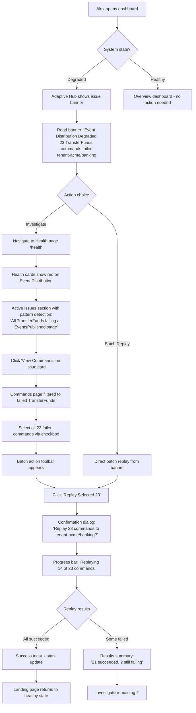
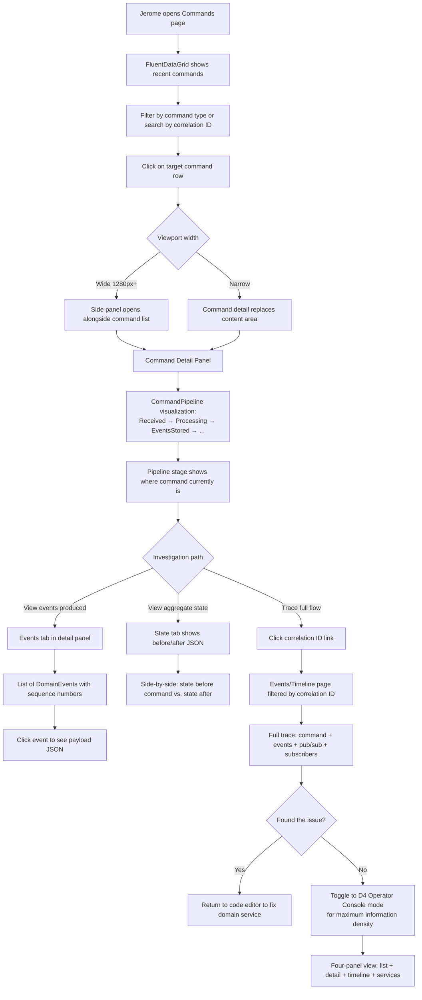

# UX Design Specification Hexalith.EventStore

**Author:** Jerome
**Date:** 2026-02-12

---

## Executive Summary

### Project Vision

Hexalith.EventStore is a DAPR-native event sourcing server for .NET 10 that provides a complete command-to-event pipeline for Domain-Driven Design applications. From a UX perspective, this is a multi-modal infrastructure platform -- not a single-UI product -- with four distinct interaction surfaces that must deliver a unified experience:

1. **Developer SDK Experience** (v1) -- NuGet packages with a pure function programming model `(Command, CurrentState?) -> List<DomainEvent>`, where infrastructure concerns are entirely invisible
2. **REST API Consumer Experience** (v1) -- Clean command submission API with JWT auth, async `202 Accepted` model, correlation-based status tracking, and RFC 7807 error responses that never leak event sourcing internals
3. **CLI/Operator Experience** (v1) -- Aspire-powered single-command startup (`dotnet aspire run`), OpenTelemetry traces for full pipeline visibility, structured logs with correlation/causation IDs, dead-letter topics for failure investigation
4. **Blazor Dashboard Experience** (v2) -- Fluent UI operational control plane for system health monitoring, tenant/domain management, event stream time-travel exploration, and self-service incident resolution

The core UX principle is **"zero infrastructure code"** -- developers write pure business logic functions and the platform handles command routing, event persistence, pub/sub distribution, multi-tenant isolation, and observability. The "aha moment" is seeing a command flow through the entire pipeline without writing any infrastructure code.

### Target Users

**Primary -- Domain Service Developers (v1):**

- **Jerome (DDD Platform Developer)**: Senior .NET developer building multiple DDD applications on the Hexalith platform. Interacts via NuGet packages, REST API, Aspire CLI, and DAPR configuration. Success: new applications plug into the EventStore backbone in hours, not weeks.
- **Marco (Curious .NET Developer)**: Senior developer evaluating event sourcing solutions. Needs a 10-minute first experience (clone-to-running via Aspire) and a 1-hour path to first domain service with maximum 3 documentation pages.

**Secondary -- Infrastructure and API Users (v1):**

- **Priya (DevOps Engineer)**: Deploys and configures EventStore across environments. Interacts via Aspire publishers, DAPR component YAML files, and OpenTelemetry exporters. Success: production deployment in a day, infrastructure swap with zero code changes.
- **Sanjay (API Consumer)**: External system integrating via REST Command API. Zero knowledge of event sourcing internals. Interacts via standard REST patterns with JWT authentication. Success: integration built in two days using only API documentation.

**Tertiary -- Operational Users (v2):**

- **Alex (Support Engineer)**: First-responder for production incidents. Interacts via the Blazor Fluent UI dashboard. Does not write code. Success: diagnoses failure point in under 2 minutes, resolves common incidents without developer escalation.

### Key Design Challenges

1. **Multi-modal UX coherence**: Four distinct interaction surfaces (SDK, REST API, CLI, Blazor dashboard) must feel like one product with consistent design language, error patterns, terminology, and mental models.
2. **Infrastructure invisibility vs. operational visibility**: The platform must simultaneously hide complexity for developers (pure function abstraction) and reveal it for operators (full pipeline tracing), without these goals contradicting each other.
3. **Progressive complexity across personas**: From Marco's 3-page linear onboarding to Jerome's deep configuration to Alex's full pipeline dashboard -- one product serving radically different depth levels without overwhelming newcomers or frustrating power users.
4. **Async-first mental model**: The `202 Accepted` command model with correlation ID-based status tracking is architecturally correct but unfamiliar. The UX must make the async pattern feel natural across both REST API responses and the v2 dashboard's command lifecycle visualization.
5. **Platform model communication**: Unlike library-based event stores (Marten, Equinox), Hexalith uses a platform model where domain services register with EventStore. This inversion of control must be clearly communicated in documentation, API design, and the Blazor dashboard's domain service management interface.

### Design Opportunities

1. **"Aha moment" engineering**: Three designable moments -- (a) first `dotnet aspire run` showing the full topology, (b) first command flowing through OpenTelemetry traces end-to-end, (c) first infrastructure swap with zero code changes. Each can be amplified through documentation narrative and Aspire dashboard integration.
2. **Event stream as time machine** (v2): The event stream explorer enabling "what was the state at time T?" queries is a standout differentiator. No competitor offers an integrated temporal exploration tool -- this can be Alex's superpower for incident resolution.
3. **API-as-UX excellence**: Since v1 has no graphical UI, the REST API IS the primary consumer UX. RFC 7807 errors with correlation IDs, clear 8-state command lifecycle progression, and clean payload schema can set the standard for event store API design.
4. **Self-service operations** (v2): The Blazor dashboard enabling domain service version rollback, dead-letter replay, and tenant management without developer involvement transforms the support engineer role from "escalation relay" to "empowered operator."

## Core User Experience

### Defining Experience

The core experience of Hexalith.EventStore is **persona-specific** -- each user role has a distinct defining moment that establishes trust in the platform:

| Persona | Defining Moment | Emotional Response |
|---------|----------------|-------------------|
| Marco (Evaluator) | First command flows end-to-end via OpenTelemetry trace | Relief -- "I don't have to build this myself" |
| Jerome (Daily Developer) | Domain service hot reload without topology restart | Flow -- "My inner loop is fast and predictable" |
| Priya (DevOps) | Same tests pass on Redis and PostgreSQL backends | Confidence -- "This portability is real" |
| Sanjay (API Consumer) | Opens Swagger UI and sends first command in 5 minutes | Ease -- "This is just a standard REST API" |
| Alex (Operator, v2) | Resolves 200 failed commands via batch replay in dashboard | Empowerment -- "I handled this without a developer" |

The fundamental interaction loop is:
1. Developer writes a pure function: `(Command, CurrentState?) -> List<DomainEvent>`
2. Developer registers the domain service via DAPR configuration
3. Consumer sends a command via REST API, receives `202 Accepted` + correlation ID
4. Platform handles everything: routing, concurrency, persistence, distribution, observability
5. Consumer tracks command lifecycle via correlation ID (polling with `Retry-After` header, or webhook callback in future versions)

This loop must feel effortless at every step. The platform's job is to be invisible during development and transparent during operations.

### Platform Strategy

**Surface Priority Ranking (v1 investment order):**

1. **REST API** -- The primary product interface. Every external interaction flows through it. Highest UX investment.
2. **Developer SDK** (NuGet packages) -- The programming model that developers live in daily. Second highest investment.
3. **CLI/Aspire** -- The onboarding ramp and local development experience. Third priority.
4. **Blazor Dashboard** (v2) -- Deferred but designed for. v2 UX investment.

| Surface | Platform | Input Model | Rendering | Connectivity |
|---------|----------|------------|-----------|-------------|
| Developer SDK | .NET cross-platform (NuGet) | IDE/keyboard | N/A | Requires DAPR sidecar |
| REST API | HTTP (any client/language) | Programmatic | JSON + OpenAPI/Swagger UI | Server-side, always online |
| CLI/Aspire | Terminal cross-platform | Keyboard | Console output + Aspire dashboard | Orchestrates local services |
| Blazor Dashboard (v2) | Web browser, desktop-first | Mouse/keyboard | Blazor Server (SignalR) | Real-time live system data |

**Platform decisions:**
- Desktop-only: No mobile considerations -- developer/operator tool used at a desk
- Blazor Server rendering for v2 dashboard: Real-time SignalR connection to live system state, no offline support needed
- Responsive for laptop screens (v2): Minimum 1280px width, optimized for 1920px
- DAPR sidecar as hard runtime dependency: All interactions require the DAPR runtime
- OpenAPI specification with interactive Swagger UI included in v1 EventStore for API discoverability
- Domain service hot reload supported by architecture: domain services restart independently via DAPR service invocation while EventStore continues running

### Effortless Interactions

**What Hexalith makes effortless that competitors do not:**

- **First run experience**: `dotnet aspire run` starts the complete system. Competitors require installing separate databases, message brokers, and manual wiring. **When prerequisites are missing**, clear error messages identify exactly what's needed (Docker, .NET 10 SDK) with installation links.
- **Domain service creation**: Implement one pure function, register via config, done. No event store client library initialization, no connection string management, no pub/sub subscription setup.
- **Development inner loop**: Domain services restart independently via DAPR service invocation -- changing domain logic does NOT require restarting the EventStore or the full Aspire topology. Edit, restart domain service, test -- under 5 seconds.
- **Infrastructure portability**: Change a DAPR component YAML file, restart. Same behavior on Redis, PostgreSQL, Cosmos DB, or any of DAPR's 135 components. No code changes, no recompilation.
- **Multi-tenant isolation**: Baked into the addressing scheme (`tenant:domain:aggregate-id`). No tenant isolation code to write.
- **API discoverability**: OpenAPI spec with interactive Swagger UI at `/swagger`. Sanjay can explore and test the API without reading separate documentation.
- **Observability**: OpenTelemetry traces, structured logs with correlation IDs, and health endpoints are automatic. No instrumentation code to write.

**Effortless = predictable outcomes + clear recovery:**
The goal is not to eliminate steps, but to ensure every action has an obvious outcome and an obvious recovery path when it fails. Deployment has multiple steps and that's fine -- each step is clear, each outcome is predictable, and failures identify root cause.

**What happens automatically without user intervention:**
- Correlation ID generation and propagation (if not provided by the caller)
- All 11 event envelope metadata fields populated by EventStore (SEC-1)
- Snapshot creation at configurable intervals (default every 100 events)
- Dead-letter routing for infrastructure failures after DAPR retry exhaustion
- Command status lifecycle tracking (Received -> Processing -> EventsStored -> EventsPublished -> Completed)

### Critical Success Moments

**First-time success moments (in chronological order):**

1. **"It just runs"** -- Marco runs `dotnet aspire run` and the full system topology appears in the Aspire dashboard within minutes. This must succeed on the first attempt. **When it fails**, prerequisite errors must be clear and actionable (not stack traces).
2. **"I already know this API"** -- Sanjay opens `/swagger`, sees the OpenAPI spec, sends a test command from Swagger UI, and gets `202 Accepted` in under 5 minutes. The API feels like a standard REST API, not an event sourcing system.
3. **"Zero infrastructure code"** -- Marco/Jerome sends a first command and watches the OpenTelemetry trace show the complete lifecycle. This is the "aha moment" that converts evaluators into adopters.
4. **"My inner loop is fast"** -- Jerome modifies a domain processor, restarts only the domain service (~2 seconds), sends a test command, and sees the updated behavior. No full topology restart required.
5. **"Genuinely portable"** -- Jerome/Priya changes a DAPR component YAML from Redis to PostgreSQL and runs the same tests. Everything passes.
6. **"I found the pattern"** (v2) -- Alex opens the Blazor dashboard, filters 200 overnight failures by domain service version, identifies the common cause, rolls back the version, and batch-replays the failed commands. The dashboard supports **batch triage and pattern detection**, not just individual command tracing.

**Make-or-break flows:**

- **Onboarding (clone -> run -> first command)**: Must complete in under 10 minutes. Clear prerequisite error messages prevent abandonment.
- **Error response clarity**: When a command fails validation, the RFC 7807 response must tell the developer exactly what's wrong and how to fix it. Ambiguous errors destroy API trust.
- **Development inner loop**: If changing domain logic requires restarting the full topology (30+ seconds), daily developer experience suffers. Domain service hot reload is architectural requirement.
- **Incident triage (v2)**: When 200 commands fail overnight, Alex needs filtering, grouping, and batch operations -- not just single-command tracing. The dashboard must support aggregate views.

### Experience Principles

1. **"Write logic, not plumbing"** -- Every interaction reinforces that the developer's job is domain logic only. Infrastructure concerns are invisible during development, configurable during deployment, and visible only to operators who need them. *Emotional target: Developer feels focused and productive, never distracted by infrastructure.*

2. **"Minimum friction to next step"** -- Each action has a clear outcome and a clear recovery path. Whether it's a single command (`dotnet aspire run`) or a multi-step deployment, each step is predictable. We don't pretend complex operations are simple -- we make each step obvious. *Emotional target: User feels confident they know what happens next.*

3. **"Consistent mental model, surface-appropriate rendering"** -- The same terminology (command, event, aggregate, tenant, domain, correlation ID), the same lifecycle states (Received -> Processing -> Completed), and the same error semantics appear across all surfaces. But each surface renders appropriately: JSON for the API, traces for the CLI, visual dashboards for operators. Consistency is conceptual, not visual. *Emotional target: User never feels lost when switching surfaces.*

4. **"Organized depth, not hidden complexity"** -- New users see simplicity (pure function, one API endpoint). Power users discover depth (snapshot configuration, rate limiting, DAPR policies). Complexity is accessible and navigable, never absent or locked away. No persona is overwhelmed by complexity meant for another, but no persona is blocked from finding what they need. *Emotional target: User feels the system respects their expertise level.*

5. **"The trace tells the story"** -- Every command is traceable from submission to completion (or failure) via a single correlation ID, across every interaction surface. For single commands, this is end-to-end lifecycle visibility. For batch incidents, this extends to filtering, grouping, and pattern detection across hundreds of traces. *Emotional target: User feels they can always find the answer.*

## Desired Emotional Response

### Primary Emotional Goals

Infrastructure platforms have a distinct emotional palette -- developers don't seek delight from their event store; they seek **trust, competence, and flow**. The primary emotional goal of Hexalith.EventStore is:

**"I found it."** -- The moment a developer realizes this is the event sourcing solution they've been looking for. This emotion is triggered by the combination of: it works on first try, it does what it promises, and it respects my time.

| Persona | Primary Emotion | Trigger | Expression |
|---------|----------------|---------|------------|
| Marco (Evaluator) | **Relief** | First command flows end-to-end without infrastructure code | "I don't have to build this myself" |
| Jerome (Daily Developer) | **Flow** | Fast inner loop: edit domain logic, restart service, test in seconds | "My tools stay out of my way" |
| Priya (DevOps) | **Confidence** | Same tests pass on different backends with zero code changes | "This portability is real, not marketing" |
| Sanjay (API Consumer) | **Familiarity** | Standard REST API patterns, OpenAPI spec, clear error responses | "This is just a well-designed API" |
| Alex (Operator, v2) | **Empowerment** | Self-service incident resolution via dashboard without developer help | "I can handle this" |

### Emotional Journey Mapping

| Stage | Desired Emotion | Emotion to Avoid | Design Implication |
|-------|----------------|------------------|-------------------|
| **Discovery** | Curiosity + Recognition | Skepticism | README communicates DAPR-native differentiation immediately, not generic feature lists |
| **First Run** | Surprise + Relief | Anxiety | Single-command success. Clear prerequisite errors with installation links when setup fails |
| **First Command** | Awe + Trust | Confusion | OpenTelemetry trace makes the invisible visible -- the full pipeline completing is the proof |
| **Daily Development** | Flow + Competence | Frustration | Hot reload, fast feedback, predictable outcomes. The system never interrupts the developer's thought process |
| **Error Encounter** | Understanding + Guidance | Helplessness | RFC 7807 with actionable detail. Correlation ID as the universal debugging handle. Every error points toward resolution |
| **Infrastructure Change** | Confidence + Liberation | Fear | Same tests pass, same behavior, different backend. The DAPR abstraction delivers on its promise |
| **Production Incident** (v2) | Control + Clarity | Panic | Dashboard surfaces the pattern. Batch operations resolve the incident. No developer escalation needed |
| **Return Visit** | Familiarity + Ease | Disorientation | Consistent mental model minimizes relearning. Swagger UI as always-available reference |

### Micro-Emotions

**Critical emotional states ranked by impact on adoption and retention:**

1. **Trust vs. Skepticism** (Highest priority) -- Infrastructure platforms live or die on trust. Every promise kept ("zero code changes" actually means zero) builds trust. Every broken promise erodes it permanently. Trust is earned through predictable behavior, honest documentation, and transparent limitations.

2. **Competence vs. Confusion** (High priority) -- Developers must feel they understand the system's mental model. The pure function programming model and 8-state command lifecycle must be learnable in a single working session. When a developer can predict what the system will do before it does it, they feel competent.

3. **Flow vs. Interruption** (High priority) -- Jerome's daily development loop. Any friction -- slow restarts, unclear errors, unexpected state, verbose boilerplate -- breaks the flow state. The system must be invisible during active development, only surfacing when explicitly queried.

4. **Confidence vs. Anxiety** (Medium priority) -- Priya deploying to production, Jerome releasing a new domain service version. Deployment outcomes must be predictable. Error recovery must be documented. Rollback must be available.

5. **Empowerment vs. Helplessness** (Medium priority) -- Alex during a Monday morning incident. The v2 dashboard must surface answers through filtering and pattern detection, not require deep technical expertise the operator doesn't have.

### Design Implications

**Emotion-to-Design Connections:**

| Desired Emotion | UX Design Approach |
|----------------|-------------------|
| **Trust** | Never overstate capabilities. Document the Backend Compatibility Matrix honestly. Show limitations alongside features. Let the OpenTelemetry trace speak for itself -- visible proof over marketing claims |
| **Relief** | Make the first success happen fast. `dotnet aspire run` to working system in minutes. The sample domain service as a working reference, not just documentation. Reduce time-to-value aggressively |
| **Flow** | Domain service hot reload without topology restart. Minimal boilerplate in the SDK. IDE-friendly types (records, interfaces). Error messages that point to the exact fix. Never make the developer leave their editor to understand a problem |
| **Confidence** | Predictable behavior across environments. Comprehensive test coverage in the sample project. Clear versioning strategy (SemVer, MinVer). Deployment dry-run capability |
| **Familiarity** | REST API follows standard patterns (OpenAPI, RFC 7807, standard HTTP status codes). NuGet packages follow .NET conventions. Aspire integration follows Aspire patterns. Nothing surprising -- everything expected |
| **Empowerment** | v2 dashboard with batch operations, saved filters, and pattern detection. Self-service tenant management. Domain service rollback without developer involvement. Clear operational runbooks embedded in the dashboard context |

**Interactions that create negative emotions (avoid these):**

| Negative Emotion | Trigger | Prevention |
|-----------------|---------|------------|
| **Betrayal** | "Zero code changes" requires code changes | Honest Backend Compatibility Matrix. Test against multiple backends in CI |
| **Overwhelm** | 47 configuration options with no guidance | Progressive revelation. Sensible defaults. "Getting started" path touches 3 config values maximum |
| **Abandonment** | Error message is a stack trace | Every error returns RFC 7807 with `detail` explaining what went wrong and how to fix it. No stack traces in production responses (Enforcement Rule #13) |
| **Invisibility** | Command submitted, no feedback on progress | `202 Accepted` with correlation ID + `Retry-After` header. Status endpoint always returns current state. Dashboard shows real-time lifecycle (v2) |
| **Condescension** | Docs explain what event sourcing is to an experienced developer | Progressive documentation: quick start (assumes DDD knowledge), concepts (for newcomers), reference (for deep dives). Never mix levels |

### Emotional Design Principles

1. **"Earn trust through transparency"** -- Show the system working (OpenTelemetry traces), document limitations honestly (Backend Compatibility Matrix), and never hide failure modes. Trust is built by visible proof, not claims.

2. **"Respect the developer's time"** -- Every second of unnecessary waiting (slow restarts), unnecessary reading (verbose docs), or unnecessary debugging (unclear errors) communicates disrespect. Optimize ruthlessly for the developer's most scarce resource.

3. **"Match emotional tone to context"** -- Error messages should be calm and actionable, not alarming. Success responses should be minimal and efficient, not celebratory. The emotional tone of an infrastructure platform is professional competence, not consumer playfulness.

4. **"Make expertise feel rewarded"** -- When Jerome discovers snapshot configuration, rate limiting, or DAPR policy tuning, it should feel like finding a well-organized toolkit -- "they thought of this." Depth should feel intentional, not accidental.

5. **"Never leave the user in the dark"** -- The async command model means there's always a gap between action and result. Fill that gap with information: status endpoints, correlation IDs, lifecycle states, and real-time dashboard updates (v2). Silence is the enemy of trust.

## UX Pattern Analysis & Inspiration

### Inspiring Products Analysis

**1. .NET Aspire Dashboard -- Orchestration & Observability**

The Aspire Dashboard is the existing observability surface Hexalith's users already experience. Its service topology visualization, distributed trace waterfall, and structured log filtering establish the baseline for v1 operator experience. The v2 Blazor dashboard should complement Aspire with event sourcing-specific views (command lifecycle, event stream explorer, tenant management), not duplicate its generic observability capabilities.

**Key takeaway**: Don't rebuild what Aspire already provides. Add event sourcing-specific layers on top.

**2. Swagger UI / Scalar -- API Discoverability**

Interactive API documentation that makes REST APIs self-documenting. The "Try it now" pattern with pre-populated examples, one-click JWT authorization, and grouped endpoints directly informs the Command API's developer experience. Swagger UI should ship with example payloads for the sample Counter domain service -- Sanjay opens `/swagger`, clicks "Try it out," and sends a valid command in under 60 seconds.

**Key takeaway**: The API documentation IS the API onboarding. Pre-populated examples eliminate the "what do I send?" barrier.

**3. Azure Data Explorer / Kibana -- Event Exploration**

Log and event exploration tools with time-range pickers, visual query builders, aggregation views, saved queries, and progressive drill-down. These patterns directly inform the v2 event stream explorer and incident triage dashboard. Alex needs visual filters (not query languages), aggregation grouping (200 failures by domain service version), and saved investigation presets ("Monday morning triage").

**Key takeaway**: Progressive drill-down (system -> tenant -> domain -> aggregate -> event) answers different questions at different granularity levels. Each level should be one click deep.

**4. Stripe API + Dashboard -- Developer Infrastructure Gold Standard**

Stripe treats its API as a product: consistent patterns across every endpoint, human-readable error messages, real-time event logs with filtering, webhook retry visibility, test/live mode switching, and idempotency built into every call. This is the closest analog to Hexalith's multi-surface developer experience. Stripe's principle of writing error messages for the reader (not the developer who wrote the code) should be applied to every RFC 7807 `detail` field.

**Key takeaway**: API-as-product means every error message, every response header, and every status code is deliberately designed for the person reading it.

**5. GitHub Actions / Azure DevOps -- Pipeline Lifecycle Visualization**

CI/CD pipeline UX with linear stage visualization, duration display per step, expandable detail views, re-run capability, and matrix views for batch runs. The command lifecycle (Received -> Processing -> EventsStored -> EventsPublished -> Completed) maps directly to the pipeline stage pattern. This is a visual language developers already understand, requiring zero learning curve for command lifecycle visualization in the v2 dashboard.

**Key takeaway**: Command lifecycle visualization should use horizontal pipeline stages with status icons -- a pattern already familiar from CI/CD tools.

### Transferable UX Patterns

**Navigation Patterns:**

- **Progressive drill-down** (from Azure Data Explorer): System overview -> tenant -> domain -> aggregate -> event. Each level is one click, each answers a different question. Applies to the v2 Blazor dashboard navigation hierarchy.
- **Grouped endpoints** (from Swagger UI): Logical grouping by concern (Commands, Health) in the OpenAPI spec. Applies to API documentation organization.

**Interaction Patterns:**

- **Try-it-now with pre-populated examples** (from Swagger UI): Eliminate the blank-form barrier by shipping example payloads. Applies to the Command API Swagger UI integration.
- **Horizontal pipeline stages** (from GitHub Actions): Linear stage visualization with status icons, duration, and expandable detail. Applies to the v2 command lifecycle detail view.
- **Re-run / Replay** (from GitHub Actions): One-click re-execution of failed operations. Applies to the v2 dead-letter replay button and batch replay capability.
- **Time-range picker** (from Azure Data Explorer): Predefined ranges (last 1h, 24h, 7d) plus custom range. Applies to the v2 event stream explorer and command history views.

**Information Architecture Patterns:**

- **Real-time event feed with filters** (from Stripe Dashboard): Live stream of events filterable by type, tenant, status, and time. Applies to the v2 system activity feed.
- **Saved queries / presets** (from Azure Data Explorer): Store common investigation patterns for reuse. Applies to the v2 dashboard saved filters for incident triage.
- **Complementary views** (from Aspire Dashboard): Don't duplicate generic observability. Add domain-specific views alongside existing tools. Applies to the v1/v2 relationship with the Aspire Dashboard.

**Error & Recovery Patterns:**

- **Human-readable error detail** (from Stripe API): Error messages written for the reader, not the code author. Applies to all RFC 7807 `detail` fields in the Command API.
- **Webhook retry visibility** (from Stripe Dashboard): Show delivery attempts, response codes, and retry schedule. Applies to the v2 dead-letter management view showing failure history and replay status.

### Anti-Patterns to Avoid

1. **Query language required for basic searches** -- The v2 event explorer must use a visual filter builder, not a query bar. Alex doesn't write KQL or Lucene queries. Filter by clicking, not by typing syntax.
2. **Separate documentation site from API** -- Swagger UI must be embedded at `/swagger` on the running EventStore, not hosted on a separate docs website. The API and its documentation should share the same URL.
3. **Dashboard showing only current state** -- The event stream IS history. The v2 dashboard must support time-travel exploration ("what was the state at time T?"), not just current system state.
4. **Silent event delivery failures** -- Every pub/sub delivery failure must be visible. No silent drops. DAPR retry exhaustion must route to dead letter and surface in the v2 dashboard.
5. **Monolithic settings page** -- v2 dashboard settings must be organized by concern (tenant configuration, domain routing, snapshot policies, rate limits), not presented as one giant form.
6. **Loading states without progress indication** -- When loading event streams or replaying commands in the v2 dashboard, show count and progress, not just a spinner.
7. **Pagination without context** -- Command status listing should use cursor-based pagination with total count and meaningful ordering, not "page 1 of unknown."

### Design Inspiration Strategy

**Adopt directly:**

- **Swagger UI with pre-populated examples** at `/swagger` on the EventStore -- proven pattern, zero custom development, immediate value for Sanjay's onboarding
- **RFC 7807 error messages written for the reader** (Stripe principle) -- applies to every error response in the Command API
- **OpenTelemetry traces flowing through Aspire Dashboard** for v1 operator experience -- already built into the platform, leverage instead of rebuilding

**Adapt for Hexalith:**

- **Stripe's real-time event feed** -> v2 command lifecycle feed with tenant/domain/status filtering and the 8-state command lifecycle model
- **GitHub Actions pipeline stages** -> v2 command lifecycle detail view as horizontal pipeline (Received -> Processing -> EventsStored -> EventsPublished -> Completed) with expandable detail per stage
- **Azure Data Explorer drill-down** -> v2 event stream explorer with Hexalith-specific hierarchy: system -> tenant -> domain -> aggregate -> event timeline
- **Kibana saved queries** -> v2 saved investigation presets ("Monday morning triage", "dead letter review by tenant")

**Avoid:**

- Rebuilding Aspire Dashboard's generic observability -- complement, don't duplicate
- Query languages for the event explorer -- visual filters only
- Separate documentation deployment -- embed in the running application
- Current-state-only dashboards -- the event stream is inherently temporal

## Design System Foundation

### Design System Choice

Hexalith.EventStore requires a **multi-surface design system** approach -- four interaction surfaces, each with its own design foundation, unified by a shared mental model and terminology.

| Surface | Design System | Version | Status |
|---------|-------------|---------|--------|
| REST API (v1) | OpenAPI 3.1 + RFC 7807 Problem Details | v1 | Define in this document |
| Developer SDK (v1) | .NET API Design Guidelines | v1 | Define in this document |
| CLI/Aspire (v1) | Aspire Dashboard (existing) | 13.1 | Leverage as-is |
| Blazor Dashboard (v2) | Blazor Fluent UI V4 | 4.13.2 | Pre-selected, design tokens defined here |

**Primary UI Design System: Blazor Fluent UI V4** (v2 dashboard)

Selected based on technical research validation. Blazor Fluent UI V4 provides 50+ production-ready components with an adaptive design system that automatically handles WCAG AA compliance via design tokens. It is native to Blazor Server (SignalR real-time), familiar to .NET developers through Microsoft Fluent Design language (Azure Portal, Microsoft 365), and actively maintained with V5 migration path available.

### Rationale for Selection

**Blazor Fluent UI V4 for the v2 Dashboard:**

1. **Technology alignment** -- Native Blazor component library, no JavaScript interop overhead. Matches the .NET 10 / Blazor Server architecture decision.
2. **Enterprise familiarity** -- Fluent Design language is used across Azure Portal, Microsoft 365, and Visual Studio. Jerome, Priya, and Alex already know this visual language.
3. **Component coverage** -- DataGrid (event stream explorer, command list), TreeView (tenant/domain/aggregate hierarchy), NavMenu (dashboard navigation), Dialog (confirmation modals), Toast (operation feedback), Badge (status indicators) -- all required components are production-ready.
4. **Adaptive design tokens** -- Built-in design token system supports theming without custom CSS. Tokens handle color, spacing, typography, elevation, and motion consistently.
5. **Accessibility by default** -- WCAG AA compliance is automatic through the design token system, not a manual audit step.
6. **Support timeline** -- V4 supported until November 2026, aligning with Hexalith's v2 development timeline. V5 migration path documented.

**OpenAPI 3.1 + RFC 7807 for the v1 REST API:**

1. **Industry standard** -- OpenAPI is the universal REST API description format. Every API consumer tool (Postman, Swagger UI, client generators) supports it natively.
2. **Self-documenting** -- Swagger UI embedded at `/swagger` provides interactive documentation without separate deployment.
3. **Error consistency** -- RFC 7807 Problem Details with Hexalith extensions (correlationId, tenantId, validationErrors) provides a uniform error shape across all endpoints.
4. **Client generation** -- API consumers can generate typed clients in any language from the OpenAPI spec.

**.NET API Design Guidelines for the Developer SDK:**

1. **Ecosystem convention** -- Following .NET naming conventions, extension method patterns (`AddEventStoreClient()`), and options pattern (`EventStoreClientOptions`) ensures the SDK feels native to .NET developers.
2. **IDE discoverability** -- Records, interfaces, and XML documentation comments enable IntelliSense-driven development. Developers discover the API through their IDE, not documentation.
3. **Minimal surface area** -- The SDK exposes only what domain service developers need: `IDomainProcessor<TCommand, TState>`, registration extensions, and test helpers. Internal implementation details are not public.

### Implementation Approach

**v1 Design Consistency (API + SDK):**

- **Shared vocabulary**: Command, Event, Aggregate, Tenant, Domain, Correlation ID -- same terms in OpenAPI schema names, SDK type names, structured log fields, and error messages
- **Shared lifecycle model**: The 8-state command lifecycle (Received -> Processing -> EventsStored -> EventsPublished -> Completed | Rejected | PublishFailed | TimedOut) is represented identically in API status responses, SDK enums, and structured log entries
- **Shared error semantics**: RFC 7807 ProblemDetails at the API surface, typed exceptions in the SDK, structured log entries with the same field names -- all carrying correlationId and tenantId

**v2 Design Foundation (Blazor Fluent UI V4):**

- **Design tokens**: Use Fluent UI V4's built-in token system for colors, spacing, typography. No custom CSS where tokens suffice.
- **Component composition**: Build dashboard views from Fluent UI primitives (FluentDataGrid, FluentTreeView, FluentNavMenu, FluentCard, FluentBadge) rather than custom components.
- **Layout pattern**: Use FluentNavMenu for primary navigation (sidebar), FluentHeader for tenant/context selector, FluentBodyContent for main views. Responsive breakpoints at 1280px (compact) and 1920px (full).
- **Real-time updates**: Blazor Server SignalR for live data. FluentToast for operation feedback. FluentBadge for status indicators that update in real-time.

### Customization Strategy

**What to customize (project-specific):**

- **Color tokens**: Define Hexalith brand colors mapped to Fluent UI design tokens. Primary accent for healthy/success states, warning for degraded states, error for failures.
- **Status color system**: Consistent status colors across all surfaces:
  - Green: Completed, Healthy
  - Blue: Processing, Received, EventsStored, EventsPublished
  - Yellow: Rejected (domain rejection -- not an error, just a business outcome)
  - Red: PublishFailed, TimedOut, Unhealthy
  - Gray: Unknown, Deactivated
- **Command lifecycle visualization**: Custom component built from Fluent UI primitives -- horizontal pipeline stages inspired by GitHub Actions, using FluentBadge for status and FluentCard for expandable detail.
- **Event stream timeline**: Custom component for the time-travel explorer -- vertical timeline with event cards, built from FluentTimeline (if available in V4) or FluentCard list with timestamp markers.

**What NOT to customize (use Fluent UI defaults):**

- Typography scale and font stack (Segoe UI / system fonts)
- Spacing tokens (4px grid)
- Elevation/shadow tokens
- Motion/animation tokens
- Form input components (FluentTextField, FluentSelect, FluentCheckbox)
- Dialog and modal patterns
- Toast notification patterns

**Cross-Surface Consistency Rules:**

1. Status colors are identical across API documentation examples, Swagger UI badges, structured log severity levels, and v2 dashboard indicators
2. The command lifecycle state names are identical across `CommandStatus` enum (SDK), `status` field (API response), log `stage` field, and dashboard pipeline visualization
3. Terminology defined in the Contracts package is the single source of truth -- API schemas, SDK types, dashboard labels, and documentation all derive from the same names

## Defining Core Interaction

### The Three-Act Experience

The defining interaction of Hexalith.EventStore is a three-act structure:

**"Write a pure function, send a command, watch the trace."**

This sequence captures the entire platform promise in three verbs. Each act targets a different moment in the developer journey, and each must feel complete on its own while building toward the full picture.

| Act | Verb | What Happens | Who Experiences It | Emotional Payoff |
|-----|------|-------------|-------------------|-----------------|
| Act 1 | **Write** | Developer implements `(Command, CurrentState?) -> List<DomainEvent>` | Jerome, Marco | Clarity -- "This is just a pure function" |
| Act 2 | **Send** | Consumer submits a command via REST API, receives `202 Accepted` + correlation ID | Sanjay, Jerome | Familiarity -- "This is just a REST call" |
| Act 3 | **Watch** | Operator/developer observes the full pipeline via OpenTelemetry trace | Marco, Jerome, Priya, Alex (v2) | Trust -- "I can see everything that happened" |

The three acts correspond to the three interaction surfaces that matter most in v1: **SDK** (Write), **API** (Send), **CLI/Aspire** (Watch). The v2 Blazor dashboard extends Act 3 from individual trace watching to aggregate monitoring, batch triage, and time-travel exploration.

### User Mental Model

Hexalith.EventStore requires a **model shift** from three familiar paradigms:

| Familiar Model | What Developers Expect | Hexalith Reality | Mental Model Shift Required |
|---------------|----------------------|-----------------|---------------------------|
| **Library model** (Marten, Equinox) | "I call the library from my code" | "The platform calls my code" | Inversion of control -- your function is registered, not called directly |
| **Database model** (EventStoreDB) | "I connect to a database and read/write" | "I implement a contract and the platform handles persistence" | No connection strings, no client libraries, no read/write code |
| **Framework model** (Axon, Wolverine) | "I annotate my classes and the framework wires them" | "I write a pure function and register via DAPR config" | No annotations, no base classes, no framework coupling -- just a function signature |

The key insight: Hexalith is **none of these**. It is a **platform** -- closer to a serverless runtime than a library or database. The developer's code runs inside the platform's pipeline, not the other way around.

**Communication strategy for the model shift:**
- Documentation leads with the pure function signature, not architecture diagrams
- The sample domain service is the teaching tool, not conceptual explanations
- Error messages reference the function contract, not internal pipeline stages
- The Swagger UI shows the API consumer view -- no event sourcing terminology visible

### Success Criteria

| Metric | Target | Measurement Point |
|--------|--------|------------------|
| **Comprehension** | Developer understands the pure function contract within 5 minutes of reading docs | Time from opening docs to writing first function signature |
| **First success** | First command flows end-to-end within 10 minutes of `dotnet aspire run` | Time from system startup to seeing the OpenTelemetry trace complete |
| **Mental model shift** | Developer stops looking for connection strings or client libraries | Absence of "how do I connect?" questions in support channels |
| **Trust** | Developer believes "zero infrastructure code" after seeing the first trace | Post-onboarding confidence survey or retention metric |
| **Daily confidence** | Jerome predicts system behavior before observing it | Reduction in "unexpected behavior" bug reports over time |
| **Operational independence** | Alex resolves incidents without developer escalation (v2) | Percentage of incidents resolved via dashboard without code-level intervention |

### Novel vs. Established Patterns

| Pattern | Classification | Familiarity Source | Hexalith Implementation |
|---------|---------------|-------------------|------------------------|
| Pure function programming model | **Novel** (for event sourcing) | Serverless functions (AWS Lambda, Azure Functions) | `IDomainProcessor<TCommand, TState>` with `(Command, CurrentState?) -> List<DomainEvent>` |
| Async command submission (`202 Accepted`) | **Established** | REST API best practices, message queues | `POST /commands` returns `202` + `Location` header + `Retry-After` |
| Correlation ID-based tracking | **Established** | Distributed tracing (OpenTelemetry, Zipkin) | `X-Correlation-ID` header, `/commands/{correlationId}/status` endpoint |
| DAPR sidecar runtime | **Established** (in cloud-native) | Service mesh, sidecar patterns | DAPR as the infrastructure abstraction layer |
| Platform-calls-your-code inversion | **Novel** (for event stores) | Serverless platforms, DAPR actors | Domain service registers via config, EventStore invokes via DAPR service invocation |
| Event envelope with 11 metadata fields | **Established** | CloudEvents 1.0, message envelopes | CloudEvents-compliant envelope with Hexalith extensions |
| Append-only event stream | **Established** | Event sourcing fundamentals | Immutable event storage with sequence numbers |
| 8-state command lifecycle | **Novel** | CI/CD pipeline stages (familiar visual) | Received -> Processing -> EventsStored -> EventsPublished -> Completed | Rejected | PublishFailed | TimedOut |

### Familiar Metaphors for Novel Concepts

| Novel Concept | Familiar Metaphor | Why It Works | How to Use It |
|--------------|-------------------|-------------|---------------|
| Pure function domain processor | **Serverless function** (Lambda, Azure Functions) | Developers already understand "write a function, the platform runs it." No server management, no lifecycle code. | Documentation: "Think of your domain processor as a serverless function for commands" |
| Append-only event stream | **Git commit history** | Every event is an immutable commit. The current state is reconstructed by replaying history. You never edit history, you append new events. | Documentation: "Events are like git commits -- immutable, ordered, and the full history is always available" |
| Correlation ID tracking | **Package tracking number** | You submit a package (command), get a tracking number (correlation ID), and check status anytime. The package moves through stages just like a command moves through lifecycle states. | API docs: "Your correlation ID works like a tracking number -- check status anytime at `/commands/{correlationId}/status`" |
| 8-state command lifecycle | **CI/CD pipeline** | Developers already read horizontal pipeline stages with status icons. Received -> Processing -> Completed is the same visual language as Build -> Test -> Deploy. | v2 Dashboard: Render command lifecycle as horizontal pipeline stages with status icons and duration |

### Experience Mechanics

**Act 1: Write -- Implementing the Pure Function**

| Step | Developer Action | System Response | UX Surface |
|------|-----------------|----------------|------------|
| 1 | Add NuGet package `Hexalith.EventStore.Client` | Package restores, IDE shows available types | SDK (NuGet) |
| 2 | Create a record type for the command | IDE IntelliSense guides properties | SDK (IDE) |
| 3 | Create record types for domain events | IDE IntelliSense guides properties | SDK (IDE) |
| 4 | Implement `IDomainProcessor<TCommand, TState>` | IDE generates method stub: `Process(TCommand command, TState? state)` returning `List<DomainEvent>` | SDK (IDE) |
| 5 | Write the pure function body | No infrastructure imports needed -- just domain logic | SDK (IDE) |
| 6 | Register via DAPR configuration | Add service entry to `dapr/components` YAML | CLI/Config |

**Act 1 success signal:** The developer writes zero infrastructure code. No connection strings, no event store clients, no pub/sub subscriptions, no serialization configuration. Just a function.

**Act 2: Send -- Submitting a Command**

| Step | Consumer Action | System Response | UX Surface |
|------|----------------|----------------|------------|
| 1 | Open `/swagger` on the running EventStore | Swagger UI loads with grouped endpoints and example payloads | API (Swagger UI) |
| 2 | Click "Try it out" on `POST /commands` | Form pre-populates with sample Counter command payload | API (Swagger UI) |
| 3 | Add JWT bearer token (if auth enabled) | One-click "Authorize" button in Swagger UI | API (Swagger UI) |
| 4 | Click "Execute" | `202 Accepted` with `Location` header pointing to status endpoint, `Retry-After: 1` header | API (HTTP response) |
| 5 | Click the `Location` URL | Status endpoint returns current lifecycle state with timestamp | API (HTTP response) |

**Act 2 success signal:** The API consumer never encounters event sourcing terminology. The interaction is standard REST: POST a resource, get a tracking URL, poll for status.

**Act 3: Watch -- Observing the Pipeline**

| Step | Observer Action | System Response | UX Surface |
|------|----------------|----------------|------------|
| 1 | Open Aspire Dashboard (already running from `dotnet aspire run`) | Dashboard shows full system topology: EventStore, domain services, DAPR sidecars | CLI/Aspire |
| 2 | Navigate to Traces tab | Distributed traces listed with correlation IDs | CLI/Aspire |
| 3 | Click the trace matching the submitted command's correlation ID | Waterfall view shows: API received -> Actor processing -> Domain service invoked -> Events stored -> Events published | CLI/Aspire |
| 4 | Expand individual spans | Duration, status, and metadata for each pipeline stage | CLI/Aspire |
| 5 | (v2) Open Blazor Dashboard, navigate to Commands | Command lifecycle visualization as horizontal pipeline stages | Blazor Dashboard (v2) |
| 6 | (v2) Click a failed command | Detailed error context, domain service response, retry history, and "Replay" button | Blazor Dashboard (v2) |

**Act 3 success signal:** The observer sees the entire pipeline in a single trace -- from HTTP request to stored events to published messages. No gaps, no black boxes. The trace IS the proof that the platform works.

## Visual Design Foundation

### Cross-Surface Semantic Foundation

**Scope:** This semantic layer applies to all four interaction surfaces immediately. It defines what colors, typography conventions, and status indicators *mean* across the product, regardless of how each surface renders them.

**Theme Strategy: System Preference-First**

Hexalith.EventStore respects the operating system's `prefers-color-scheme` setting as the default theme. The v2 Blazor Dashboard provides an explicit toggle to override. Both light and dark themes are fully supported via Fluent UI V4's adaptive design token system with no custom switching logic.

Rationale: Infrastructure platforms serve diverse environments -- developers in dark-mode IDEs, operators on enterprise desktops with enforced light themes, support engineers on shared monitors. Respecting OS preference is the most inclusive default.

**Semantic Color Vocabulary:**

| Semantic Role | Usage | Dark Mode | Light Mode |
|--------------|-------|-----------|------------|
| **Primary Accent** | Interactive elements, active states, links | Hexalith blue (#4A9EFF) | Hexalith blue (#0066CC) |
| **Success / Completed** | Completed commands, healthy services | Green (#2EA043) | Green (#1A7F37) |
| **In-Flight / Processing** | All in-flight command states (Received through EventsPublished) | Blue (#58A6FF) | Blue (#0969DA) |
| **Warning / Rejected** | Domain rejections (business outcome, not error) | Yellow (#D29922) | Yellow (#9A6700) |
| **Error / Failed** | PublishFailed, TimedOut, unhealthy services | Red (#F85149) | Red (#CF222E) |
| **Neutral / Inactive** | Unknown state, deactivated services, disabled elements | Gray (#8B949E) | Gray (#656D76) |
| **Surface** | Backgrounds, cards, panels | Via Fluent UI `--neutral-layer` tokens | Via Fluent UI `--neutral-layer` tokens |
| **On-Surface** | Text on surfaces | Via Fluent UI `--neutral-foreground` tokens | Via Fluent UI `--neutral-foreground` tokens |

**Command Lifecycle Status Rendering (All Surfaces):**

Status is communicated through **icon + color + text label** -- never color alone. In-flight states share one blue color but are differentiated by icon.

| Lifecycle State | Color | Icon Intent | Label | Terminal? |
|----------------|-------|-------------|-------|-----------|
| Received | Blue | Icon indicating arrival/receipt | "Received" | No |
| Processing | Blue | Icon indicating active processing | "Processing" | No |
| EventsStored | Blue | Icon indicating data persisted | "Events Stored" | No |
| EventsPublished | Blue | Icon indicating outbound distribution | "Events Published" | No |
| Completed | Green | Icon indicating success | "Completed" | Yes |
| Rejected | Yellow | Icon indicating warning/business decision | "Rejected" | Yes |
| PublishFailed | Red | Icon indicating failure | "Failed" | Yes |
| TimedOut | Red | Icon indicating timeout | "Timed Out" | Yes |

Specific FluentIcon names resolved during v2 implementation. The design spec defines intent, not icon IDs.

**Context-Dependent Status Communication:**
- **List/table views**: Grouping + icon + color. Failed commands sort to top. In-flight grouped in middle. Completed at bottom.
- **Detail views**: Horizontal pipeline visualization with icon + color per stage. Familiar CI/CD pipeline pattern.
- **API responses**: Text labels only. Color is a rendering concern, never included in RFC 7807 payloads.
- **Documentation**: Status color semantics documented in OpenAPI description fields for consumer reference. Implementation verification: confirm backtick monospace rendering in Swagger UI default theme.

**Monospace Convention:**

All machine-generated values render in monospace across every surface: correlation IDs, aggregate IDs, tenant identifiers, JSON payloads, event sequence numbers, timestamps, DAPR component names, and error codes. This signals "this is a system value you can copy" and improves visual scanning in dense data views.

**Cross-Surface Consistency Rules:**

1. Status colors and icons are identical across Swagger UI badge examples, SDK documentation, structured log severity mapping, and v2 dashboard indicators
2. Command lifecycle state names are identical across `CommandStatus` enum (SDK), `status` field (API response), log `stage` field, and dashboard pipeline visualization
3. Terminology defined in the Contracts package is the single source of truth -- API schemas, SDK types, dashboard labels, and documentation all derive from the same names
4. Swagger UI uses its default theme (no custom CSS) -- visual differences between API docs and dashboard are accepted

### v2 Dashboard Visual System

**Scope:** These design decisions apply specifically to the v2 Blazor Fluent UI V4 dashboard. Defined here to inform architecture; implemented during v2 development.

**Design Token Strategy:**

Use Fluent UI V4's built-in token system for all visual properties. No custom CSS where tokens suffice. Hexalith-specific customization is limited to:

- **Brand color tokens**: Hexalith blue mapped to `--accent-base-color`
- **Status color tokens**: Semantic colors from the cross-surface vocabulary mapped to Fluent UI `--success`, `--warning`, `--error`, `--info` tokens
- **Density tokens**: Task-appropriate density settings (see Layout section)

Everything else -- typography scale, spacing grid, elevation, motion, form inputs, dialogs, toasts -- uses Fluent UI V4 defaults unchanged.

**Icon System:**

FluentIcon library (Fluent UI System Icons) provides the complete icon set. No custom icons.

| Icon Context | Source | Examples (Intent) |
|-------------|--------|-------------------|
| Navigation | FluentIcon | Home, list view, timeline, server, shield, health |
| Status indicators | FluentIcon | Success mark, processing indicator, failure mark, timeout, warning |
| Actions | FluentIcon | Replay, filter, search, download, settings |
| Data types | FluentIcon | Event (document), domain (folder), tenant (building), aggregate (code) |

**Empty State Design:**

Empty states are onboarding opportunities, not dead ends. Every empty view guides the user toward the first meaningful action.

| View | Empty State Message | Action |
|------|-------------------|--------|
| Commands | "No commands processed yet." | Link to `/swagger` to send first command |
| Events | "No events stored yet." | Link to getting started guide |
| Tenants | "No tenants configured." | "Create your first tenant" button |
| Domain Services | "EventStore is running. 0 domain services connected." | Link to domain service registration guide |
| Health | "All systems nominal. No issues detected." | No action needed -- positive empty state |

**System State Awareness:** The dashboard always communicates what the system knows, even when it knows nothing yet. Connection status, registered services count, and system health are always visible in the header bar regardless of content area state.

### Typography System

**Approach: Fluent UI V4 Defaults -- No Customization**

| Priority | Font | Usage |
|----------|------|-------|
| Primary | Segoe UI Variable | Windows systems (Azure Portal consistency) |
| Fallback 1 | -apple-system, BlinkMacSystemFont | macOS/iOS systems |
| Fallback 2 | system-ui, sans-serif | Linux and other platforms |
| Monospace | Cascadia Code, Consolas, monospace | Code snippets, correlation IDs, JSON payloads, event data |

No custom fonts. System fonts ensure instant rendering and platform-native feel.

**Typography Principles:**

1. **Monospace for machine-generated values** as defined in the cross-surface semantic foundation
2. **Semibold for navigation, regular for content**: Headings and nav items use semibold weight. Body content uses regular weight. No bold emphasis within body text -- use color or icons instead
3. **Page titles capped at 24px** (`--type-ramp-plus-3`): Data-dense operational tools should not waste vertical space on oversized headings. The full Fluent UI type ramp is available but the top tiers (`--type-ramp-plus-4` through `--type-ramp-plus-6`) are reserved for marketing pages, not dashboard views

### Spacing & Layout Foundation

**Task-Appropriate Density:**

Rather than a single density philosophy, Hexalith uses density appropriate to the user's current task:

| View Type | Density | Cell Padding | Rationale |
|-----------|---------|-------------|-----------|
| **List/table views** (command list, event stream, batch triage) | Compact | `--spacing-2` (8px) | Maximize visible rows for scanning and pattern detection |
| **Detail views** (single command, event detail, configuration) | Comfortable | `--spacing-4` (16px) | Readable presentation of structured information |
| **Forms** (tenant config, domain settings, filters) | Comfortable | `--spacing-4` (16px) | Clear field separation, accessible touch targets |

**Layout Principles (v2 Dashboard):**

1. **Sidebar navigation always visible**: FluentNavMenu provides constant orientation. Collapses to icon-only mode at narrow widths rather than hiding
2. **Cards for bounded content**: Each logical group wrapped in FluentCard for visual containment and consistent spacing
3. **No horizontal scrolling**: Tables use column prioritization -- less important columns hide at narrower breakpoints. Critical data (status, correlation ID, timestamp) always visible
4. **Graceful degradation**: Minimum supported width 1024px showing health status and active errors only. Full dashboard experience at 1280px+. Optimal at 1920px

**Layout Interaction Patterns (v2):**

These patterns inform v2 architecture. Specific dimensions and behaviors resolved during v2 design phase.

- **Master-detail as resizable side panel**: At wide breakpoints, detail views open alongside the list. The list stays visible during investigation. At narrower breakpoints, detail replaces the content area.
- **User-toggleable table density**: FluentDataGrid includes a density switch (comfortable/compact) for personal preference. Alex's batch triage benefits from compact; Jerome's single-trace investigation benefits from comfortable.
- **Collapsible sidebar**: Keyboard shortcut to collapse/expand sidebar for maximum content width during investigation.

### Data Visualization Palette (v2)

For aggregation views (commands over time, failure rates by tenant, event volume charts):

| Series | Color | Usage |
|--------|-------|-------|
| Series 1 | Primary accent blue | Primary metric |
| Series 2 | Green | Success/completed counts |
| Series 3 | Red | Failure/error counts |
| Series 4 | Yellow | Warning/rejection counts |
| Series 5-8 | Fluent UI neutral palette variations | Additional dimensions |

Chart colors follow the same semantic mapping as status colors where applicable (green = success, red = failure). Neutral palette for non-status dimensions.

**Deferred to v2 Data Visualization Design specification:** Chart type selection (bar/line/sparkline), axis conventions, overlapping time series handling, data point labeling in dense charts, and interactive chart behaviors.

### Loading & Transition States

| State | Pattern | Example |
|-------|---------|---------|
| **Initial page load** | Skeleton screen matching layout structure | Command list shows gray placeholder rows |
| **Data refresh** | Subtle fade on stale data + loading indicator in header | Table content dims slightly while refreshing |
| **Long operation** (batch replay, export) | Progress bar with count ("Replaying 47 of 200 commands") | Never a spinner without context |
| **Real-time update** | Smooth row insertion/status badge transition | New commands appear at top of list, status badges animate between states |

**Motion Principles:**
- Transition duration: 150ms for micro-interactions (hover, focus), 300ms for layout changes (panel open/close)
- Easing: Fluent UI default ease-out curves
- `prefers-reduced-motion`: All animations disabled, instant state changes
- Processing indicator: CSS animation, disabled when reduced motion preferred

### Accessibility Considerations

**Compliance Target: WCAG 2.1 AA**

| Requirement | Approach |
|-------------|----------|
| Color contrast (4.5:1 text, 3:1 UI) | Automatic via Fluent UI design tokens. Custom status colors verified in both themes |
| Color independence | Status always uses icon + color + text label (defined in semantic foundation) |
| Keyboard navigation | Fluent UI built-in. Custom components (pipeline stages, timeline) must be keyboard-navigable |
| Screen reader support | Fluent UI ARIA attributes. Custom components require meaningful ARIA labels |
| Focus indicators | Fluent UI focus ring system, no custom work needed |
| Motion reduction | `prefers-reduced-motion` respected. Processing animation disabled. Instant transitions |
| Font scaling | Verify layout integrity at 200% zoom |
| Windows high-contrast mode | `forced-colors` media query support. Status icons provide meaning when colors are overridden by OS |
| Data table accessibility | FluentDataGrid built-in row/column headers, sort announcements, pagination context ("Page X of Y"), keyboard row selection |

## Design Direction Decision

### Directions Explored

Six information architecture directions were prototyped as a Blazor Server application using Fluent UI V4 components (see `_bmad-output/planning-artifacts/design-directions-prototype/`). Each direction answers the question: "When Alex opens the dashboard Monday morning, what does she see first?"

| Direction | Philosophy | Primary Entry Point | Best For |
|-----------|-----------|---------------------|----------|
| **D1: Command-Centric** | Commands are the heartbeat | Command list with status filter chips and summary stat cards | Daily developers (Jerome) |
| **D2: Topology-Centric** | Navigate the system as a tree | FluentTreeView: tenant → domain → aggregate with error count badges bubbling up | Multi-tenant operators (Priya) |
| **D3: Timeline-Centric** | Time is the primary axis | Activity histogram + chronological event stream with time-range picker | Event exploration / forensic analysis |
| **D4: Operator Console** | Maximum information density | Four simultaneous panels — commands, detail, chart, services — zero navigation clicks | Power users during incidents |
| **D5: Health-First Monitor** | System health is the landing view | Health status cards with traffic-light severity + active issues section | Support engineers (Alex) |
| **D6: Adaptive Hub** | Landing page transforms based on system state | Issue banner when degraded, overview dashboard when healthy | All personas (recommended) |

### Chosen Direction: Unified Dashboard (All Six Combined)

Rather than selecting a single direction, the v2 Blazor dashboard incorporates all six as complementary pages and patterns within a unified navigation structure. Each direction maps to a specific page or interaction pattern:

| Direction | Dashboard Role | Implementation |
|-----------|---------------|----------------|
| **D6 (Adaptive Hub)** | **Landing page** (`/`) | Hero section adapts: issue banner with "Batch Replay" action when degraded, overview stats + activity chart when healthy |
| **D2 (Topology)** | **Sidebar navigation structure** | FluentNavMenu with FluentTreeView showing tenant → domain hierarchy with error badges bubbling up |
| **D1 (Command-Centric)** | **Commands page** (`/commands`) | FluentDataGrid with filter chips, sortable columns, tenant selector, summary stat cards |
| **D3 (Timeline)** | **Events/Timeline page** (`/events`) | Activity histogram, time-range picker, chronological event stream with filter chips |
| **D5 (Health-First)** | **Health page** (`/health`) | Health status cards, active issues list, tenant health table |
| **D4 (Operator Console)** | **Power-user layout mode** on Commands page | Toggle to four-panel view: command list + detail + chart + services simultaneously |

### Design Rationale

**Why combine rather than choose one?**

1. **Different personas need different entry points.** Alex starts at Health; Jerome starts at Commands; Priya navigates by Topology. A single direction forces all users through one lens.
2. **Different system states need different presentations.** D6's adaptive landing ensures the Monday morning incident surfaces immediately, while a healthy Tuesday shows the overview dashboard.
3. **Different tasks need different information density.** D4's four-panel console is optimal during incident triage but overwhelming for routine monitoring. Making it a toggle mode (rather than the default) serves both cases.
4. **The Blazor prototype validated all six.** Each direction uses the same Fluent UI V4 component library and visual foundation. They differ in information architecture, not design system.

### Page Hierarchy

```
/ (Landing — Adaptive Hub, D6)
├── /commands (Command-Centric, D1)
│   └── /commands/:id (Command Detail with Pipeline, D4 detail panel)
├── /events (Timeline-Centric, D3)
│   └── /events/:id (Event Detail)
├── /health (Health-First Monitor, D5)
│   └── /health/dead-letters (Dead Letter Explorer)
├── /tenants (Topology, D2 — also reflected in sidebar tree)
│   └── /tenants/:id/domains/:domain (Domain View)
├── /services (Domain Service Management)
└── /settings (Configuration)
```

### Sidebar Navigation Structure (D2 Influence)

The sidebar combines static navigation with dynamic topology:

- **Static section**: Home, Commands, Events, Health, Services, Settings
- **Dynamic section**: FluentTreeView populated from registered tenants → domains → aggregates, with error count badges that bubble up from leaf to root. Clicking a tree node navigates to the filtered view for that scope.

### Cross-Page Patterns

| Pattern | Origin Direction | Usage Across Dashboard |
|---------|-----------------|----------------------|
| Status filter chips | D1, D3 | Commands page, Events page, Dead Letters |
| Summary stat cards | D1, D6 | Landing page, Commands page, Health page |
| CommandPipeline visualization | D4 | Command detail panel everywhere it appears |
| StatusBadge component | All | Every view showing command or event status |
| Activity histogram | D3, D6 | Landing page (24h), Events page (configurable range) |
| Health status cards | D5, D6 | Health page (detailed), Landing page (summary) |
| Error count badges on tree nodes | D2 | Sidebar topology tree, Health page tenant table |
| Batch action toolbar | D1, D5, D6 | Commands page, Dead Letters, Landing page issue banner |

### Component Reuse from Prototype

The Blazor prototype validated these reusable components:

- **StatusBadge.razor**: Maps `CommandStatus` enum → FluentBadge with semantic color + icon + text label
- **CommandPipeline.razor**: Horizontal pipeline visualization (Received → Processing → EventsStored → EventsPublished → Terminal) using FluentBadge + FluentIcon chevrons
- **SampleData.cs**: Data models (`CommandEntry`, `ServiceEntry`, `TenantHealth`) and `CommandStatus` enum define the data contract for all dashboard views

## User Journey Flows

### Journey 1: Alex's Monday Morning Incident

**Trigger:** Alex arrives Monday morning to Slack alerts about elevated error rates.

**Entry point:** Opens browser to Hexalith dashboard → lands on Adaptive Hub (D6 landing page).



**Screen-by-screen mechanics:**

| Step | Screen | Key Components | User Action |
|------|--------|---------------|-------------|
| 1 | Adaptive Hub (`/`) | Issue banner (red), stat cards, "Batch Replay (23)" button | Scan banner, decide path |
| 2a | Health (`/health`) | Health status cards, active issues list | Click "View Commands" on issue |
| 2b | Direct from banner | — | Click "Batch Replay (23)" |
| 3 | Commands (`/commands?status=failed&type=TransferFunds`) | FluentDataGrid with pre-applied filters, checkbox column | Select all, click "Replay Selected" |
| 4 | Confirmation dialog | FluentDialog with command count + target tenant | Confirm or cancel |
| 5 | Progress overlay | FluentProgressBar with count ("14 of 23") | Wait / monitor |
| 6 | Results | Success toast or partial-failure summary | Acknowledge or investigate remainder |

**Time budget:** Under 2 minutes to diagnosis (banner visible on load). Under 8 minutes to full resolution (batch replay + verification).

**Error recovery:** If replay fails for some commands, the results summary links directly to the still-failing commands for individual investigation.

### Journey 2: Jerome's Command Investigation

**Trigger:** Jerome is developing a new domain service and wants to trace why a specific command produced unexpected events.

**Entry point:** Navigates to Commands page from sidebar.



**Key interaction patterns:**

- **Master-detail as resizable side panel**: At wide viewports, clicking a command row opens detail alongside the list. Jerome can compare multiple commands without losing list context.
- **Pipeline visualization**: The `CommandPipeline` component shows the 8-state lifecycle. The current state is highlighted. Failed states show the error inline.
- **Correlation ID as hyperlink**: Every correlation ID is a link to the Events/Timeline page filtered to that trace. This bridges D1 (commands) and D3 (timeline).
- **Operator Console toggle**: A toolbar button switches the Commands page from standard layout to D4 four-panel mode for deep investigation sessions.

### Journey 3: Marco's First Encounter

**Trigger:** Marco discovers Hexalith, runs `dotnet aspire run`, and wants to send his first command.

**Entry point:** Opens Swagger UI at `/swagger` (v1 primary surface).

```mermaid
flowchart TD
    A[Marco runs dotnet aspire run] --> B[Aspire dashboard shows EventStore + sample service]
    B --> C[Opens Swagger UI at /swagger]

    C --> D[Finds POST /api/commands endpoint]
    D --> E[Sends IncrementCounter command<br/>with tenant-id, aggregate-id, payload]
    E --> F[Receives 202 Accepted + correlation ID]

    F --> G{Next action}
    G -->|Poll status| H[GET /api/commands/status/{correlationId}]
    G -->|Open dashboard| I[Navigate to Blazor dashboard]

    H --> J[Status: Completed<br/>Events produced: CounterIncremented]

    I --> K[Adaptive Hub landing page]
    K --> L[Stat cards show: 1 Command, 100% Success]
    L --> M[Recent commands shows the IncrementCounter]
    M --> N[Click on command row]

    N --> O[Command detail with full pipeline:<br/>Received ✓ → Processing ✓ → EventsStored ✓ → EventsPublished ✓ → Completed ✓]
    O --> P['Aha!' moment: zero infrastructure code,<br/>full event sourcing pipeline visible]

    P --> Q[Marco sends second command<br/>with same aggregate ID]
    Q --> R[Sees state rehydration in pipeline:<br/>actor loaded previous events before processing]
    R --> S[Messages tech lead: 'I found it.']
```

**Critical design note:** Marco's journey spans two surfaces — Swagger UI (v1 primary) and Blazor dashboard (v2). The dashboard must feel like a natural next step after the API interaction, not a separate tool. The correlation ID returned by the API should be searchable/linkable in the dashboard.

**Empty state handling:** When Marco first opens the dashboard before sending any commands, the landing page shows the positive empty state: "EventStore is running. 0 commands processed. Send your first command via /swagger to see the pipeline in action." — with a direct link to the Swagger UI.

### Journey 4: Alex's Dead Letter Triage

**Trigger:** Dead letter count increases on the Health page or landing page stat card.

**Entry point:** Clicks dead letter count stat or navigates to `/health/dead-letters`.

```mermaid
flowchart TD
    A[Dead letter count > 0 visible<br/>on landing page or health page] --> B[Click dead letter count]
    B --> C[Dead Letter Explorer page]

    C --> D[FluentDataGrid of dead letter commands<br/>grouped by error pattern]
    D --> E[Pattern grouping:<br/>'23x TransferFunds - DAPR pub/sub timeout'<br/>'5x AdjustStock - schema validation error']

    E --> F{Triage action}
    F -->|Single pattern| G[Click pattern group header to expand]
    F -->|Multiple patterns| H[Address highest-count pattern first]

    G --> I[See individual commands in group]
    I --> J[Inspect one command: full payload + error + stack trace]

    J --> K{Root cause identified?}
    K -->|Yes, transient| L[Select all in pattern group<br/>'Replay Group (23)']
    K -->|Yes, needs fix| M[Note the issue, fix root cause first]
    K -->|No| N[Click correlation ID to trace<br/>full event flow in Timeline]

    L --> O[Confirmation: 'Replay 23 dead letter commands?']
    O --> P[Progress: 'Replaying 14 of 23']
    P --> Q{Results}

    Q -->|All succeeded| R[Pattern group removed from dead letters<br/>Success toast with count]
    Q -->|Some failed again| S[Updated group: '2 remaining'<br/>These may need individual investigation]

    M --> T[After fix deployed, return and replay]
    N --> U[Timeline shows full trace:<br/>command → processing → failure point]
```

**Key mechanics:**

- **Pattern grouping**: Dead letters are automatically grouped by error message + command type. This collapses 200+ individual failures into 3-4 actionable patterns.
- **Group-level batch replay**: Replay all commands matching a pattern in one action, rather than selecting individually.
- **Inspect before replay**: Users can drill into any individual dead letter to see the full command payload, error message, and stack trace before deciding to replay.
- **Post-replay verification**: After replay, the dead letter explorer updates in real-time. Successfully replayed commands are removed. Remaining failures are highlighted.

### Journey 5: Priya's Topology Check

**Trigger:** Priya wants to verify multi-tenant health after a deployment or configuration change.

**Entry point:** Sidebar topology tree (D2 influence) or Health page.

```mermaid
flowchart TD
    A[Priya opens dashboard] --> B{Entry path}
    B -->|Sidebar tree| C[FluentTreeView shows all tenants]
    B -->|Health page| D[Health status cards + tenant table]

    C --> E[Error badges bubble up:<br/>tenant-acme shows red badge '2']
    E --> F[Expand tenant-acme → banking → see 2 failed aggregates]
    F --> G[Click on banking domain node]

    D --> H[Tenant Health FluentDataGrid<br/>columns: tenant, commands/h, success rate, latency, dead letters]
    H --> I[Sort by success rate ascending<br/>to surface problem tenants]
    I --> G

    G --> J[Domain view for tenant-acme/banking]
    J --> K[FluentTabs: Commands | Events | Services | Configuration]

    K --> L[Services tab]
    L --> M[Domain service version table:<br/>Name, Version, Status, Last Deploy Time]
    M --> N{Version issue?}

    N -->|Yes| O[Click 'Rollback to Previous Version'<br/>on the problem service]
    N -->|No| P[Check Configuration tab<br/>for DAPR component settings]

    O --> Q[Confirmation: 'Rollback banking-service<br/>from v2.3.1 to v2.2.0?']
    Q --> R[Rollback executes via DAPR config store]
    R --> S[Service version updates in real-time<br/>Health card transitions green]
```

**Topology tree as navigation shortcut:** The sidebar tree mirrors the DDD domain model (tenant → domain → aggregate). Error badges on leaf nodes bubble up to parent nodes, so Priya sees at a glance which tenant/domain combination is problematic without visiting the Health page. Clicking any tree node navigates to the corresponding filtered view.

### Journey Patterns

Across all five journeys, these reusable interaction patterns emerge:

**Navigation Patterns:**

| Pattern | Description | Used In |
|---------|-------------|---------|
| **Adaptive entry** | Landing page content changes based on system state (healthy vs. degraded) | Journey 1, 3 |
| **Error badge bubbling** | Error counts propagate from leaf to root in sidebar tree | Journey 1, 5 |
| **Correlation ID as hyperlink** | Every correlation ID links to the filtered Timeline view | Journey 2, 4 |
| **Pre-filtered navigation** | Clicking an issue or alert navigates to a page with filters pre-applied | Journey 1, 4, 5 |
| **Surface bridging** | Swagger UI correlation IDs are searchable in the Blazor dashboard | Journey 3 |

**Decision Patterns:**

| Pattern | Description | Used In |
|---------|-------------|---------|
| **Pattern grouping** | Related failures grouped by error signature for batch action | Journey 1, 4 |
| **Inspect-then-act** | Always allow inspection of individual items before batch operations | Journey 4 |
| **Confirmation dialog for destructive/bulk actions** | FluentDialog confirms count + target before replay, rollback, etc. | Journey 1, 4, 5 |
| **Progressive investigation depth** | Standard layout → side panel → operator console mode | Journey 2 |

**Feedback Patterns:**

| Pattern | Description | Used In |
|---------|-------------|---------|
| **Progress bar with count** | "Replaying 14 of 23 commands" — never a spinner without context | Journey 1, 4 |
| **Partial success reporting** | "21 succeeded, 2 still failing" with link to remaining items | Journey 1, 4 |
| **Real-time state transitions** | Health cards, stat cards, and badges update as operations complete | Journey 1, 4, 5 |
| **Positive empty states** | Empty dashboard guides toward first action rather than showing a blank page | Journey 3 |

### Flow Optimization Principles

1. **Two-click-to-action for known issues**: From landing page issue banner to "Batch Replay" is one click. From Health page active issue to "View Commands" to "Replay Selected" is two clicks. The most common support task should never exceed two clicks to initiate.

2. **Zero-click diagnosis**: The Adaptive Hub (D6 landing) shows the problem on page load. Alex sees "23 TransferFunds commands failed at pub/sub stage in tenant-acme/banking" without clicking anything. Time to diagnosis approaches zero for surfaced issues.

3. **Context preservation during investigation**: Master-detail side panels keep the list visible while inspecting individual items. Jerome doesn't lose his place in the command list when drilling into one command.

4. **Graceful escalation path**: Standard view → side panel → operator console mode → external tools (OpenTelemetry, structured logs). Each escalation adds information density without discarding the previous context.

5. **Cross-surface correlation ID continuity**: The correlation ID returned by the REST API (`202 Accepted` response) is the same ID used to search, filter, and link within the Blazor dashboard. Marco's API-first experience connects seamlessly to the visual dashboard.

## Component Strategy

### Design System Components (Fluent UI V4)

Fluent UI V4 (`Microsoft.FluentUI.AspNetCore.Components` 4.13.2) provides the complete foundation layer. These components are used as-is with no customization beyond Fluent UI design token configuration:

**Layout & Navigation:**
- `FluentLayout`, `FluentHeader`, `FluentBodyContent` — App shell structure
- `FluentNavMenu`, `FluentNavLink`, `FluentNavGroup` — Sidebar static navigation
- `FluentTreeView`, `FluentTreeItem` — Sidebar topology tree
- `FluentStack` — Horizontal/vertical composition with gap control
- `FluentGrid`, `FluentGridItem` — Responsive grid layouts
- `FluentCard` — Content containment boundaries
- `FluentTabs`, `FluentTab` — Tabbed content switching
- `FluentSplitter` — Master-detail resizable panels

**Data & Content:**
- `FluentDataGrid` — All tabular data (commands, events, tenants, services, dead letters)
- `FluentLabel` — All text rendering with typography scale
- `FluentBadge` — Inline status/count indicators (used as base for StatusBadge)
- `FluentIcon` — All iconography from FluentIcon system

**Inputs & Actions:**
- `FluentButton` — Actions, filter chips, time-range selectors
- `FluentSelect`, `FluentOption` — Dropdown selections (tenant picker)
- `FluentSwitch` — Toggles (theme, density, console mode)
- `FluentSearch` — Correlation ID search

**Feedback & Overlay:**
- `FluentDialog` — Confirmation dialogs for batch/destructive operations
- `FluentToast` / `FluentToastProvider` — Success/failure notifications
- `FluentProgressBar` — Batch operation progress with count
- `FluentDesignTheme` — Theme mode management

### Custom Components

Seven custom Blazor components fill the gaps between Fluent UI V4's generic library and Hexalith's domain-specific needs. All custom components are built exclusively from Fluent UI V4 primitives and design tokens — no raw HTML/CSS styling.

#### StatusBadge

**Purpose:** Maps the `CommandStatus` enum to a semantic visual indicator with icon + color + text label. Ensures status is never communicated by color alone.

**Usage:** Every view displaying command or event status — data grids, detail panels, timeline entries, dead letter explorer.

**Anatomy:**
- FluentBadge container with semantic background color
- FluentIcon (status-specific) at start position
- Status text label

**States:**

| CommandStatus | Color | Icon Intent | Label |
|---------------|-------|------------|-------|
| Received | Blue (lightest) | Inbox/received indicator | Received |
| Processing | Blue (medium) | Processing/spinner indicator | Processing |
| EventsStored | Blue (darker) | Storage/save indicator | Stored |
| EventsPublished | Blue (darkest) | Send/publish indicator | Published |
| Completed | Green | Success checkmark | Completed |
| Rejected | Yellow | Warning indicator | Rejected |
| PublishFailed | Red | Failure/error indicator | Failed |
| TimedOut | Red (muted) | Clock/timeout indicator | Timed Out |

**Variants:** Default (inline in data grid rows) and Compact (icon-only with tooltip, for narrow columns).

**Accessibility:** Color-independent via icon + text. ARIA label: "Command status: {status name}".

**Validated:** Prototype `Components/Shared/StatusBadge.razor`.

#### CommandPipeline

**Purpose:** Horizontal visualization of the 8-state command lifecycle showing progression through stages. Highlights current state and failure point.

**Usage:** Command detail panel, D4 operator console detail view.

**Anatomy:**
- Horizontal FluentStack of stage FluentBadges
- FluentIcon chevron separators between stages
- Current/completed stages use filled appearance; future stages use outline
- Failed stage uses red background with error icon

**States:**
- **In-progress**: Stages up to current are filled, current has processing animation, future stages are outline
- **Completed**: All stages filled green through Completed
- **Failed**: Stages up to failure point filled, failure stage red, remaining stages grayed out
- **Rejected**: Received filled, Processing filled, then Rejected badge in yellow

**Interaction:** Click a stage to see its timestamp and duration. Failed stage shows inline error message.

**Accessibility:** Each stage is a focusable element with ARIA label "Stage: {name}, Status: {completed/current/pending/failed}". Arrow keys navigate between stages.

**Validated:** Prototype `Components/Shared/CommandPipeline.razor`.

#### IssueBanner

**Purpose:** Prominent alert banner displayed on the Adaptive Hub landing page when the system is degraded. Contains issue summary and primary action button.

**Usage:** Landing page (`/`) in degraded state only. Also reusable in Health page Active Issues section.

**Anatomy:**
- Full-width container with `--colorStatusDangerBackground1` background
- Left section: issue title (bold), description, metadata (detected time, duration, scope)
- Right section: action buttons ("Investigate", "Batch Replay (N)")

**States:**
- **Active**: Red background, issue details visible, actions enabled
- **Resolving**: Yellow background during batch replay, progress indicator replaces action buttons
- **Resolved**: Green background briefly, then banner auto-dismisses as system returns to healthy

**Variants:** Single-issue (full details) and Multi-issue (stacked, each collapsed to title + count).

**Accessibility:** `role="alert"` with `aria-live="assertive"` on state transitions. Focus automatically moves to banner on page load when present.

#### StatCard

**Purpose:** Compact summary card displaying a single metric with value, label, and semantic color indicating health.

**Usage:** Landing page stat row, Commands page summary, Health page metrics.

**Anatomy:**
- FluentCard container with compact padding
- Large value text (22px, monospace for numeric values)
- Small label text below
- Value color indicates semantic meaning (green = good, red = bad, default = neutral)

**States:**
- **Default**: Neutral value color
- **Success**: Green value (e.g., 99.8% success rate, 0 dead letters)
- **Warning**: Yellow value (e.g., success rate below 99%)
- **Error**: Red value (e.g., dead letter count > 0, failures > threshold)
- **Loading**: Skeleton placeholder matching card dimensions

**Parameters:**
- `Value` (string): The metric value to display
- `Label` (string): Description of the metric
- `Severity` (enum): Default, Success, Warning, Error
- `Trend` (optional enum): Up, Down, Flat — for future trend arrow indicator

**Accessibility:** `aria-label="{Label}: {Value}"`. Severity communicated via both color and an invisible screen-reader prefix ("Warning: 95.3% Success Rate").

#### PatternGroup

**Purpose:** Groups related dead letter commands by error signature, enabling batch actions at the pattern level rather than individual command level.

**Usage:** Dead Letter Explorer (`/health/dead-letters`).

**Anatomy:**
- Collapsible group header: error pattern + command type + count badge
- Expand to reveal FluentDataGrid of individual commands in group
- Group-level action toolbar: "Replay Group (N)", "Inspect Sample", "Dismiss Group"

**States:**
- **Collapsed**: Shows pattern summary + count + group actions
- **Expanded**: Shows individual commands within the pattern
- **Replaying**: Progress bar replaces action toolbar, count updates in real-time
- **Partially resolved**: Updated count after replay, remaining items highlighted

**Interaction:** Click header to expand/collapse. Group actions apply to all commands matching the pattern. Individual commands within the group support single-item actions via row context menu.

**Accessibility:** Group header is a button with `aria-expanded`. Inner data grid is semantically grouped. Batch action confirms count before executing.

#### EmptyState

**Purpose:** Structured placeholder displayed when a view has no data. Guides users toward their first meaningful action rather than showing a blank page.

**Usage:** Every data-driven page when no data is available — Commands, Events, Tenants, Services, Health.

**Anatomy:**
- Centered layout within the content area
- FluentIcon (large, muted) representing the data type
- Primary message (e.g., "No commands processed yet.")
- Secondary message with guidance
- Action button or link (e.g., "Send your first command via /swagger")

**States:**
- **No data**: Standard empty state with guidance
- **No results**: After filtering produces zero results — "No commands match your filters. Try broadening your search."
- **Positive empty**: Health page when healthy — "All systems nominal. No issues detected." (no action needed)

**Parameters:**
- `Icon` (FluentIcon): Visual representing the empty data type
- `Title` (string): Primary message
- `Description` (string): Guidance text
- `ActionLabel` (optional string): Button text
- `ActionHref` (optional string): Navigation target

**Accessibility:** `role="status"` with `aria-label` combining title and description.

#### ActivityChart

**Purpose:** Bar chart showing command/event volume over time with semantic coloring for success/failure proportions.

**Usage:** Landing page (24h overview), Events/Timeline page (configurable range).

**Anatomy:**
- CSS Flexbox bar chart (no JavaScript charting library)
- Each bar represents a time bucket (1h for 24h view, 5min for 1h view)
- Bar color: green for success, red for failure proportion
- Hover tooltip with exact count and time range

**States:**
- **Default**: Bars rendered from data
- **Loading**: Skeleton bars matching expected layout
- **No data**: EmptyState component with "No activity in selected time range"
- **Highlighted**: Hovered bar shows tooltip, clicked bar filters the commands/events list to that time range

**Design note:** This is a CSS-only implementation for v2 MVP. A richer charting library (if needed) deferred to v2 data visualization specification. The Blazor prototype validated that CSS Flexbox bars with percentage heights provide sufficient visualization for operational awareness.

**Accessibility:** Each bar has `aria-label="{time range}: {count} commands ({success}% success)"`. Chart has overall `role="img"` with `aria-label` describing the data range.

### Component Implementation Strategy

**Build principle:** Every custom component is a composition of Fluent UI V4 primitives. No raw HTML elements are styled directly — all spacing, colors, typography, and elevation come from Fluent UI design tokens. This ensures theme compatibility (light/dark/high-contrast) and accessibility compliance automatically.

**Component location:** `Components/Shared/` directory in the Blazor project. Each component is a single `.razor` file with parameters, following Blazor component conventions.

**Naming convention:** PascalCase component names matching the domain concept. No "Fluent" prefix on custom components (reserved for the Fluent UI library).

**Testing approach:** Each custom component validated in the design directions Blazor prototype before integration into the production dashboard. StatusBadge and CommandPipeline already validated.

### Implementation Roadmap

**Phase 1 — Core Components (v2 MVP):**

| Component | Needed For | Priority |
|-----------|-----------|----------|
| StatusBadge | Every view with command/event status | Critical — used everywhere |
| CommandPipeline | Command detail panel, investigation flow | Critical — Jerome's Journey |
| StatCard | Landing page, Commands page, Health page | Critical — all personas |
| EmptyState | All pages on first use | Critical — Marco's Journey |
| IssueBanner | Landing page degraded state | Critical — Alex's Journey |

**Phase 2 — Operational Components (v2 complete):**

| Component | Needed For | Priority |
|-----------|-----------|----------|
| PatternGroup | Dead Letter Explorer batch triage | High — Alex's dead letter triage |
| ActivityChart | Landing page, Events/Timeline page | High — system awareness |

**Phase 3 — Enhancement (post v2 launch):**

- Rich charting library integration (if CSS charts prove insufficient)
- Real-time streaming data grid updates (FluentDataGrid row insertion animation)
- Keyboard shortcut overlay component (for Operator Console mode)

## UX Consistency Patterns

### Action Hierarchy

All interactive actions across the dashboard follow a strict three-tier hierarchy using Fluent UI V4 button appearances:

| Tier | Appearance | Usage | Examples |
|------|-----------|-------|----------|
| **Primary** | `Appearance.Accent` | The single most important action on the current view. Maximum one per visible section. | "Batch Replay (23)", "Replay Command", "Save Configuration" |
| **Secondary** | `Appearance.Outline` | Supporting actions that complement the primary action. | "Investigate", "View Commands", "Export", "Filter" |
| **Tertiary** | `Appearance.Lightweight` | Low-emphasis actions for optional or infrequent operations. | "Dismiss", "Reset Filters", "Collapse All" |
| **Destructive** | `Appearance.Outline` + red text color | Actions that remove data or cannot be easily undone. Always require confirmation dialog. | "Delete Dead Letters", "Suspend Tenant" |

**Rules:**

- Never place two Accent buttons adjacent to each other. If two actions compete for primacy, one must be Outline.
- Filter chips use Accent when active, Outline when inactive — toggling a filter is the primary action in that context.
- Buttons with counts always show the count: "Replay Selected (23)" not "Replay Selected". The count sets expectations.
- Icon-start position for action buttons: replay icon for replay, filter icon for filter. Icon-only buttons require a tooltip.

**Size conventions:**

| Context | Size | Rationale |
|---------|------|-----------|
| Page-level actions (toolbar) | `ButtonSize.Default` | Primary workspace actions need comfortable click targets |
| Inline actions (data grid rows, cards) | `ButtonSize.Small` | Compact to fit within data-dense contexts |
| Issue banner actions | `ButtonSize.Small` | Banner is already prominent; buttons don't need to compete for attention |
| Dialog actions (confirm/cancel) | `ButtonSize.Default` | Dialogs are modal focus contexts; comfortable sizing reduces mis-clicks |

### Data Display & Filtering Patterns

#### Filter Chips

Horizontally arranged FluentButton toggles that filter data views. Consistent across Commands, Events, Dead Letters, and Timeline pages.

**Behavior:**
- Always includes an "All" chip as the first option (default active state)
- Active chip uses `Appearance.Accent`; inactive chips use `Appearance.Outline`
- Single-select by default: clicking a chip deactivates the previously active chip
- Filter applies immediately on click — no "Apply" button needed
- URL query parameter updates on filter change (`?status=failed`) for shareable/bookmarkable filtered views
- Filter label appears left of chips: "Filter:" in muted text

**Keyboard:** Tab to chip group, Arrow keys between chips, Enter/Space to activate.

#### Data Grids

All tabular data uses `FluentDataGrid` with consistent column conventions:

| Column Type | Alignment | Font | Width Strategy |
|-------------|-----------|------|---------------|
| Status | Left | StatusBadge component | Fixed 80-120px |
| Identifier (correlation ID, aggregate ID) | Left | Monospace (`mono` class) | Min 140px, truncate with tooltip |
| Type name (command type, event type) | Left | Regular | Flex 1fr |
| Tenant/Domain | Left | Monospace | Fixed 100px |
| Timestamp | Left | Monospace, `HH:mm:ss` format | Fixed 80px |
| Duration | Right | Monospace, `{N}ms` format | Fixed 80px |
| Numeric count | Right | Regular, semibold for non-zero | Fixed 80-100px |
| Actions | Right | Button(s) | Fixed, fits content |

**Sorting:** Click column header to sort. Default sort is timestamp descending (most recent first). Sort indicator (arrow icon) shown on active sort column.

**Pagination:** FluentDataGrid pagination with 25 rows per page default. Page count and "Page X of Y" shown below grid. Compact density shows more rows per page (40).

**Row interaction:** Single-click selects row and opens detail (master-detail pattern). Checkbox column appears when batch actions are available. "Select All" checkbox in header selects visible page only, not all pages.

**Empty grid:** EmptyState component renders centered within the grid area when no data matches current filters.

#### Correlation ID Display

Every correlation ID is displayed consistently across all views:

- Monospace font, truncated to first 8 characters with full ID on hover tooltip
- Always a hyperlink: clicking navigates to Events/Timeline filtered by that correlation ID
- Copy-to-clipboard icon appears on hover
- Same format in data grids, detail panels, timeline entries, and toast notifications

### Feedback & Progress Patterns

#### Toast Notifications

`FluentToast` used for transient feedback after user actions:

| Scenario | Toast Type | Duration | Content Pattern |
|----------|-----------|----------|-----------------|
| Action succeeded | Success (green) | 5 seconds, auto-dismiss | "{Action} completed. {Detail}." e.g., "23 commands replayed successfully." |
| Action partially succeeded | Warning (yellow) | Persistent until dismissed | "{N} of {Total} succeeded. {Remaining} still failing." + "View remaining" link |
| Action failed | Error (red) | Persistent until dismissed | "{Action} failed: {error reason}." + "Retry" button |
| Information | Neutral | 5 seconds, auto-dismiss | "{Information message}." e.g., "Filters applied. 47 commands match." |

**Rules:**
- Maximum 3 toasts stacked simultaneously. Oldest auto-dismisses when a 4th arrives.
- Persistent toasts (warning, error) require explicit user dismissal.
- Every toast with a count includes a link to the affected items.

#### Progress Indicators

| Operation Type | Pattern | Component |
|---------------|---------|-----------|
| **Page load** | Skeleton screen matching page layout structure | CSS skeleton placeholders |
| **Data refresh** | Subtle opacity dim on stale data + spinner in header bar | Inline indicator, non-blocking |
| **Batch operation** (replay, export) | FluentProgressBar with count: "Replaying 14 of 23 commands" | Modal overlay, blocks further batch actions |
| **Single-item operation** (replay one command) | Button shows spinner replacing icon, disabled until complete | Inline, non-blocking for other items |
| **Background operation** (deployment rollback) | Status badge transitions in real-time | Non-blocking, observable |

**Rule:** Never display a spinner without context. Every loading indicator must communicate what is loading and, for counted operations, how far along it is.

#### Real-Time Updates

When data changes while the user is viewing a page:

- **New rows**: Appear at top of list with a subtle highlight animation (150ms fade-in). If user has scrolled down, a "N new items" badge appears at the top of the list instead of auto-scrolling.
- **Status changes**: StatusBadge transitions smoothly between states. No page reload.
- **Count changes**: StatCard values animate (number counter effect, 300ms). Severity color transitions immediately.
- **Issue resolution**: IssueBanner transitions from red → green → auto-dismisses. Health cards update simultaneously.

### Navigation & Wayfinding Patterns

#### Sidebar Navigation

Two-section sidebar using FluentNavMenu:

**Static section** (top):
- Home, Commands, Events, Health, Services, Settings
- Active page highlighted with Fluent UI accent indicator
- Icons for each item (intent-defined, not specific FluentIcon IDs)

**Dynamic section** (bottom, collapsible):
- "Topology" group header with FluentTreeView below
- Tree populated from registered tenants → domains → aggregates
- Error count badges bubble up from leaf to root
- Clicking a tree node navigates to the filtered view: `/tenants/{id}/domains/{domain}`
- Tree state (expanded/collapsed nodes) persisted in browser local storage

**Collapse behavior:**
- Keyboard shortcut (Ctrl+B) toggles sidebar between full width (220px) and icon-only mode (48px)
- Icon-only mode shows static navigation icons with tooltips; topology tree hidden
- Sidebar state persisted in local storage

#### Breadcrumb Trail

Displayed below the page header on every page for consistent layout. On the Home page, shows "Home" as the sole segment:

```
Home > Commands > c8f2a1b3-9d4e-4f5a
Home > Health > Dead Letters
Home > Tenants > tenant-acme > banking
```

- Each segment is a clickable link navigating back to that level
- Final segment (current page) is non-clickable, regular weight
- Breadcrumb segments use monospace for identifiers (correlation IDs, tenant names)

#### Pre-Filtered Navigation

When navigating from one page to another via a contextual link (e.g., issue banner → commands, tree node → domain view), the target page loads with filters pre-applied:

- URL query parameters encode the filter state: `/commands?status=failed&type=TransferFunds&tenant=acme`
- Pre-applied filters appear as active filter chips on the target page
- User can modify or clear pre-applied filters normally
- "Clear all filters" button appears when any filter is active

### Confirmation & Destructive Action Patterns

#### Confirmation Dialogs

FluentDialog used for all batch operations and destructive actions:

**Dialog structure:**
- Title: Action name (e.g., "Replay Commands")
- Body: What will happen, with specific counts and targets: "This will replay 23 failed commands in tenant-acme/banking."
- Warning (if applicable): Risk statement in yellow: "This may cause duplicate processing if the root cause is not resolved."
- Primary button: Accent, confirms the action with count: "Replay 23 Commands"
- Secondary button: Outline, "Cancel"

**Rules:**
- Confirmation required for: batch operations (3+ items), version rollback, tenant suspension, dead letter deletion
- No confirmation for: single-item replay, filter changes, navigation, view toggles
- Dialog cannot be dismissed by clicking outside (modal). Must explicitly cancel or confirm.
- Primary action button restates the count to prevent accidental confirmation of wrong scope.

#### Undo Pattern

For reversible operations, prefer undo over confirmation:

- Single command replay: No confirmation dialog. Action executes immediately. Toast shows "Command replayed. Undo?" with 10-second undo window.
- Filter changes: No confirmation. "Clear all filters" link always available.
- View mode toggle (standard ↔ operator console): No confirmation. Instant toggle.

### Search & Filtering Patterns

#### Global Search

FluentSearch component in the header bar:

- Searches by correlation ID (exact match), command type (partial match), or aggregate ID (exact match)
- Results appear in a dropdown below the search field, grouped by type: "Commands (3)", "Events (7)"
- Selecting a result navigates to the item detail
- Keyboard: Ctrl+K focuses search. Escape clears and closes.

#### Time-Range Picker

Consistent across Events/Timeline page and ActivityChart:

- Preset buttons: "Last 1h", "Last 24h", "Last 7d"
- "Custom" opens a date-range picker
- Active range uses Accent appearance; inactive ranges use Outline
- Changing time range re-queries data and updates all views on the page simultaneously

#### Tenant Scope Selector

FluentSelect dropdown in the page header (Commands, Events pages):

- Options: "All Tenants" (default) + list of registered tenants
- Tenant list fetched from Hexalith.Tenants projection API (TenantIndexReadModel)
- Changing tenant scope filters all data on the current page
- URL query parameter updates: `?tenant=acme`
- When navigated from sidebar tree, tenant scope is pre-set to the selected tenant

### Form & Configuration Patterns

Configuration views (tenant settings via Hexalith.Tenants API, domain service registration, system settings) follow a consistent form layout:

**Form structure:**
- Section headers group related fields
- Labels above fields (not inline)
- Required fields marked with asterisk
- Validation messages appear below the field in red, after blur or submit
- Save button disabled until form is modified (dirty state tracking)

**Inline editing:**
- Table cells that support editing (e.g., tenant display name) show an edit icon on hover
- Click to enter edit mode; Enter to save; Escape to cancel
- No separate "Edit" page for simple property changes

**Form feedback:**
- Save success: Toast notification "Settings saved." Auto-dismiss.
- Save failure: Toast notification with error. Form remains in dirty state for retry.
- Unsaved changes: Browser `beforeunload` warning if navigating away with dirty form.

## Responsive Design & Accessibility

### Responsive Strategy

**Desktop-first, not mobile-first.** The Hexalith dashboard is an operational tool used at workstations by developers (Jerome), support engineers (Alex), and DevOps engineers (Priya). The responsive strategy focuses on adapting across desktop viewport widths, not scaling down to mobile. No mobile-optimized layouts, touch navigation, or portrait-mode breakpoints are designed.

**Desktop viewport tiers:**

| Tier | Width | Experience | Primary Persona |
|------|-------|-----------|-----------------|
| **Optimal** | 1920px+ | Full dashboard: sidebar expanded, master-detail side panel, operator console four-panel mode available | All personas at workstation |
| **Standard** | 1280px–1919px | Full dashboard: sidebar expanded, master-detail replaces content (no side panel), two-column grids | Jerome daily development |
| **Compact** | 960px–1279px | Sidebar collapsed to icon-only, single-column content, stat cards stack vertically | Half-screen on 1920px monitor, laptop users |
| **Minimum** | Below 960px | Health status badge and active issue count visible without horizontal scroll on page chrome. Data grids scroll horizontally. Warning banner: "Dashboard optimized for wider screens." | Emergency phone check, undersized windows |

**Why 960px, not 1024px:** Jerome's real-world setup is dashboard on one half of a 1920px monitor (960px) with VS Code on the other half. The compact tier must support this split-screen use case.

**Tablet support:** Tablets in landscape orientation with external keyboard (iPad at 1024px, Surface at 1366px) are supported at the Compact or Standard tier. No touch-optimized layouts or portrait-mode optimization.

**Minimum tier on mobile:** The minimum tier does not provide a mobile-optimized experience, but it must not *break* on a phone. The landing page health status badge and active issue count render readable at any width. Page chrome (header, sidebar, breadcrumb) must never cause horizontal scrolling — only FluentDataGrid content areas are exempt from WCAG 1.4.10 Reflow (data table exemption). This covers the on-call engineer checking system health at 3 AM on their phone.

### Breakpoint Implementation

Breakpoints use CSS `min-width` media queries (desktop-first with progressive reduction):

```css
/* Optimal: 1920px+ — default styles, maximum layout */
/* Standard: 1280px-1919px */
@media (max-width: 1919px) {
  /* Side panel becomes full-width overlay instead of alongside */
  /* Four-panel operator console becomes two-panel stacked */
}

/* Compact: 960px-1279px */
@media (max-width: 1279px) {
  /* Sidebar collapses to icon-only (48px) */
  /* Stat cards: 4-column → 2-column stack */
  /* Data grid hides non-critical columns (domain, duration) */
  /* FluentGrid items: xs=6 → xs=12 */
  /* Breadcrumb truncates to last 3 segments with "..." expansion */
  /* Master-detail: detail replaces list (URL-driven state) */
}

/* Minimum: below 960px */
@media (max-width: 959px) {
  /* Warning banner shown */
  /* Health status + active issue count rendered, readable on phone */
  /* Data grids allow horizontal scroll (exempt from 1.4.10) */
  /* Page chrome (header, sidebar, breadcrumb) must NOT scroll horizontally */
}
```

**Component-level responsive behavior:**

| Component | Optimal (1920px+) | Standard (1280px+) | Compact (960px+) |
|-----------|-------------------|---------------------|---------------------|
| Sidebar | Expanded (220px) | Expanded (220px) | Icon-only (48px) |
| Master-detail | Side panel alongside list | Detail replaces content area | Detail replaces content area (URL-driven: `?detail=id`, browser back returns to list) |
| StatCard grid | 4 columns | 4 columns | 2 columns, stacked |
| FluentDataGrid columns | All columns visible | All columns visible | Non-critical columns hidden |
| Operator Console (D4) | Four-panel grid | Two-panel stacked | Not available |
| ActivityChart | Full width with 24 bars | Full width with 12 bars | Simplified sparkline |
| IssueBanner | Full layout with action buttons | Full layout | Stacked: info above, actions below |
| Breadcrumb | Full path | Full path | Last 3 segments, "..." for rest |

**Master-detail at compact tier:** When viewport is below 1280px, clicking a command row navigates via URL query parameter (`/commands?detail=c8f2a1b3`). The detail component conditionally renders in place of the list component. Browser back button returns to the list. State is URL-driven via `NavigationManager`, not component state, ensuring standard browser navigation works.

**Sidebar state persistence:** Sidebar collapsed/expanded state is stored per viewport tier in local storage, not globally. Jerome's sidebar stays collapsed on his laptop (compact tier) and expanded on his external monitor (optimal tier) without manual toggling each time.

**200% zoom behavior:** At 200% browser zoom on a 1280px screen (effective 640px content width), stat card grid falls back to 1-column layout. Verified explicitly in responsive testing.

### Accessibility Strategy

**Compliance target: WCAG 2.1 AA** (established in Visual Foundation, Step 8).

This section expands the accessibility foundation into specific implementation requirements organized by WCAG principle.

#### Perceivable

| Requirement | Implementation |
|-------------|---------------|
| **1.1.1 Non-text Content** | All FluentIcons have `aria-label`. ActivityChart bars have descriptive labels. CommandPipeline stages labeled. ActivityChart includes a visually hidden `<table>` with time bucket rows for screen reader access + "View as table" toggle link for keyboard users. |
| **1.3.1 Info and Relationships** | Semantic HTML: `<nav>` for sidebar, `<main>` for content, `<table>` structure via FluentDataGrid. Section headings create document outline. PatternGroup uses `role="rowgroup"` with `aria-label` for group headers; inner rows use `aria-describedby` pointing to group header. |
| **1.3.2 Meaningful Sequence** | DOM order matches visual order. Sidebar before content. Breadcrumb before page body. |
| **1.4.1 Use of Color** | Status never communicated by color alone — always icon + color + text label (StatusBadge). Health cards use border + text + icon. |
| **1.4.3 Contrast (Minimum)** | 4.5:1 for text, 3:1 for UI components. Fluent UI tokens ensure compliance. Custom status colors verified in both light and dark themes. |
| **1.4.4 Resize Text** | Layout verified at 200% zoom. StatCard grid falls back to 1-column at extreme zoom. FluentDataGrid allows horizontal scroll (exempt). |
| **1.4.10 Reflow** | Page chrome (header, sidebar, breadcrumb, toolbar) reflows without horizontal scroll at all viewport widths. Only FluentDataGrid content exempt. |
| **1.4.11 Non-text Contrast** | Interactive elements (buttons, filter chips, tree nodes) maintain 3:1 contrast against background in all states. |
| **1.4.13 Content on Hover/Focus** | All tooltips use `FluentTooltip` component ensuring: tooltip remains visible when mouse moves onto it, tooltip dismissible with Escape, keyboard focus shows tooltip. Correlation ID hover tooltips persist and are hoverable. |

#### Operable

| Requirement | Implementation |
|-------------|---------------|
| **2.1.1 Keyboard** | All functionality accessible via keyboard. Tab through interactive elements. Arrow keys within component groups (filter chips, tree nodes, pipeline stages). |
| **2.1.2 No Keyboard Trap** | Focus never trapped in any component. Escape closes dialogs, tooltips, and dropdowns. |
| **2.4.1 Bypass Blocks** | "Skip to main content" link as first focusable element. When IssueBanner is present, skip link targets the issue banner (most urgent content). When multiple issue banners are stacked, each banner includes a "Skip to next issue" link for efficient navigation between issues. |
| **2.4.2 Page Titled** | Every page has descriptive `<PageTitle>`: "Commands - Hexalith EventStore", "Health - Hexalith EventStore". |
| **2.4.3 Focus Order** | Tab order: skip link → header search → sidebar → breadcrumb → page toolbar → content → footer. |
| **2.4.4 Link Purpose** | Correlation ID links include `aria-label="View timeline for command {full-correlation-id}"`. Truncated display text supplemented with full ID + action description for screen readers. |
| **2.4.6 Headings and Labels** | Page heading (`h1`) describes current view. Section headings (`h2`, `h3`) organize content within pages. |
| **2.4.7 Focus Visible** | Fluent UI focus ring on all focusable elements. Custom components (CommandPipeline stages, ActivityChart bars) include visible focus indicators using `--focus-stroke-outer` and `--focus-stroke-inner` Fluent UI tokens. |

**Keyboard shortcuts:**

| Shortcut | Action |
|----------|--------|
| Ctrl+K | Focus global search |
| Ctrl+B | Toggle sidebar collapse |
| Escape | Close dialog / clear search / deselect |
| Arrow keys | Navigate within filter chips, tree nodes, pipeline stages, data grid rows |
| Enter/Space | Activate focused element |
| Tab/Shift+Tab | Move between interactive element groups |

**Screen reader compatibility:** All keyboard shortcuts verified against NVDA, JAWS, and Narrator key maps. Conflicts resolved by binding shortcuts only in application mode (when focus is inside dashboard content area), not during screen reader browse/virtual cursor mode.

#### Understandable

| Requirement | Implementation |
|-------------|---------------|
| **3.1.1 Language of Page** | `lang="en"` on root HTML element. |
| **3.2.1 On Focus** | No context changes on focus alone. Focus on a filter chip does not activate it. |
| **3.2.2 On Input** | Filter chips apply immediately on activation (click/Enter), which is the expected behavior. Tenant selector and time-range changes update the page — consistent with dashboard conventions. |
| **3.3.1 Error Identification** | Form validation errors identify the specific field and describe the error. Toast error notifications describe what failed and why. |
| **3.3.3 Error Suggestion** | When a command replay fails, the error toast suggests the next step: "Check root cause before retrying." |

#### Robust

| Requirement | Implementation |
|-------------|---------------|
| **4.1.2 Name, Role, Value** | All custom components expose correct ARIA roles. StatusBadge: `role="status"`. CommandPipeline: `role="list"` with `role="listitem"` stages. PatternGroup: `role="rowgroup"` with `aria-expanded` on header and `aria-describedby` on child rows. ActivityChart: `role="img"` on container with hidden data table alternative. |
| **4.1.3 Status Messages** | Toast notifications use `role="status"` with `aria-live="polite"` (info/success) or `aria-live="assertive"` (error/warning). IssueBanner uses `role="alert"` — `aria-live="assertive"` fires only on state transitions (healthy → degraded), not on page load/navigation. On page load, the banner is a static alert region read in document flow order. |

#### `aria-live` Debouncing Strategy

Real-time dashboards generate constant data changes. Without debouncing, screen reader users (and magnification software like ZoomText) hear non-stop announcements.

| Live Region | Debounce Interval | Rationale |
|-------------|-------------------|-----------|
| StatCard value updates | 5 seconds minimum | Prevent announcement flooding from rapid count changes |
| Data grid row additions | 10 seconds, batched ("3 new commands") | Individual row announcements overwhelm at volume |
| IssueBanner state change | Immediate (assertive) | Critical system state change, must interrupt |
| Toast notifications | No debounce (max 3 stacked) | User-initiated actions, expected feedback |
| Health card status transitions | Immediate (polite) | Important but not urgent |
| ActivityChart data refresh | Suppressed | Visual-only refresh; screen reader users access via hidden data table on demand |

### Windows High-Contrast Mode

As an operational tool primarily running on Windows workstations, high-contrast mode support is a first-class requirement:

- `forced-colors` media query overrides semantic colors with system colors
- StatusBadge switches to icon-only differentiation when `forced-colors: active` — icons provide meaning when background colors are overridden
- Focus indicators use `Highlight` system color for maximum visibility
- Border-based differentiation (health cards use `border-left` which remains visible in high-contrast)
- FluentDataGrid alternating row colors replaced by borders in high-contrast mode
- Custom component focus rings use Fluent UI `--focus-stroke-outer` and `--focus-stroke-inner` tokens which map to system colors in forced-colors mode

### Testing Strategy

**Automated testing (CI pipeline — merge-blocking):**

| Tool | What It Tests | CI Behavior |
|------|--------------|-------------|
| axe-core (via Playwright) | WCAG 2.1 AA rule violations on every page | **Blocks merge** on any violation |
| Lighthouse accessibility audit | Automated accessibility scoring | Blocks merge if score < 95 |
| Page inventory meta-test | Asserts every Blazor route in the router map has a corresponding axe-core test case | **Blocks merge** — prevents untested pages |
| State matrix coverage | Every page × every major state (empty, populated, error) × light theme × dark theme | **Blocks merge** on missing state test |
| ARIA tree snapshot tests | Captures the ARIA tree of each custom component. Flags PRs that change accessible names or roles | PR flagged for manual screen reader verification on ARIA tree changes |
| CSS media query coverage | Verify all breakpoint tiers render correctly | Blocks merge on layout assertion failure |
| FluentDataGrid column visibility | Assert critical columns visible at each breakpoint | Blocks merge on assertion failure |

**State matrix testing detail:** The Adaptive Hub has two states (healthy, degraded). Commands page has states (populated, empty/EmptyState, filtered with results, filtered with no results). Dead Letter Explorer has states (zero groups, populated groups, mid-replay). Each state is a distinct axe-core test case, not just the default page load.

**Manual testing (per release + on ARIA tree changes):**

| Test | Method | Trigger |
|------|--------|---------|
| Keyboard-only navigation | Navigate all five user journeys using only keyboard | Per release |
| Screen reader (NVDA) | Read all pages, verify aria-labels, test data grid navigation, verify `aria-live` debouncing | Per release + when ARIA tree snapshot changes |
| Screen reader (Narrator) | Verify keyboard shortcuts don't conflict in browse mode | Per release + when keyboard shortcuts change |
| High-contrast mode | Windows high-contrast mode: verify all status indicators, focus rings, and interactive elements. Verify StatusBadge icon-only fallback. | Per release (axe-core does not fully cover `forced-colors`) |
| 200% zoom | Verify layout integrity at 200% browser zoom across all three breakpoint tiers. Verify stat card grid reflow. | Per release |
| Color blindness | Simulate deuteranopia, protanopia, tritanopia: verify StatusBadge and health cards readable | Per release |
| Tablet landscape | iPad (1024px) + external keyboard: verify Compact tier works with keyboard navigation | Per release |
| Half-screen (960px) | Dashboard at exactly 960px width: verify compact tier activates correctly | Per release |
| Minimum tier on phone | Verify health status badge and issue count visible, no horizontal scroll on page chrome | Per release |

### Implementation Guidelines

**For Blazor developers implementing the dashboard:**

1. **Use Fluent UI components for accessibility by default.** FluentDataGrid, FluentButton, FluentDialog, and FluentNavMenu include ARIA attributes, keyboard navigation, and focus management. Do not re-implement these behaviors.

2. **Custom components must match Fluent UI accessibility standards.** Every custom component (StatusBadge, CommandPipeline, IssueBanner, StatCard, PatternGroup, EmptyState, ActivityChart) must include:
   - Meaningful `aria-label` or `aria-labelledby`
   - Appropriate `role` attribute
   - Keyboard navigation (Tab to reach, Arrow keys within, Enter/Space to activate)
   - Visible focus indicator using Fluent UI `--focus-stroke-outer` and `--focus-stroke-inner` tokens — never custom focus CSS

3. **Use `aria-live` regions with debouncing for dynamic content.** Every region that changes without user action must use `aria-live` with the debounce intervals defined in the `aria-live` Debouncing Strategy table. Never fire `aria-live="assertive"` on page load — only on state transitions.

4. **Correlation ID links must have descriptive `aria-label`.** Truncated display text ("c8f2a1b3") is supplemented with `aria-label="View timeline for command c8f2a1b3-9d4e-4f5a"`.

5. **ActivityChart must include a hidden data table.** A visually hidden `<table>` with time bucket rows provides screen reader access to individual data points. A "View as table" toggle link is available for keyboard users.

6. **Use `FluentTooltip` for all hover content.** Never use CSS-only tooltips. FluentTooltip ensures persistence (hoverable), keyboard access (focus triggers), and dismissibility (Escape).

7. **axe-core violations block CI merge.** Add `@axe-core/playwright` to the E2E test suite. Every page must pass with zero violations. No exceptions, no `// axe-ignore` without team review.

8. **Master-detail at compact uses URL-driven state.** Detail views at compact tier navigate via `NavigationManager` with query params (`?detail=id`), not component `@if` conditionals. Browser back button must return to the list.

9. **Page inventory and state matrix tests are mandatory.** Every new Blazor route must have a corresponding axe-core test case covering all major states. CI blocks merge if a route exists without a test.

10. **ARIA tree snapshots for custom components.** Each custom component has a snapshot test capturing its ARIA tree. Changes to accessible names, roles, or structure flag the PR for manual screen reader verification before merge.

## v1 API Error Journeys

The v2 dashboard journeys (Alex, Jerome, Marco, Priya) define the visual experience. But v1 has no graphical UI — the REST API IS the product surface. These journeys define how the API communicates failure with the same care as the dashboard communicates success.

### Journey 6: Sanjay Sends a Malformed Command

**Trigger:** Sanjay is integrating a payment system and sends a command with a missing required field.

**Entry point:** `POST /api/commands` via Swagger UI or programmatic HTTP client.

```
POST /api/commands
Content-Type: application/json
Authorization: Bearer <valid-jwt>

{
    "aggregateId": "order-42",
    "commandType": "banking-transfer-funds-v1",
    "payload": {
        "sourceAccount": "ACC-001"
    }
}
```

**Expected response — 400 Bad Request:**

```json
{
    "type": "https://hexalith.io/problems/validation-error",
    "title": "Command Validation Failed",
    "status": 400,
    "detail": "The TransferFunds command payload is missing required fields. See 'errors' for specifics.",
    "instance": "/api/commands",
    "correlationId": "01JQXYZ1234567890ABCDEF",
    "errors": {
        "payload.destinationAccount": "Required field is missing.",
        "payload.amount": "Required field is missing."
    }
}
```

**UX principles applied:**

| Principle | Implementation |
|-----------|---------------|
| **"Write error messages for the reader"** (Stripe) | `detail` says what's wrong and points to the `errors` object. No stack traces, no internal type names. |
| **Field-level specificity** | Each missing field is identified by its JSON path within `payload`. Sanjay knows exactly what to add. |
| **Correlation ID always present** | Even on validation failures, a correlation ID is returned for support reference. |
| **No event sourcing leakage** | The response never mentions aggregates, events, actors, or DAPR. It's a standard REST validation error. |

**Sanjay's emotional response:** Understanding — "I know exactly what I forgot."

---

### Journey 7: Sanjay's JWT is Missing or Expired

**Trigger:** Sanjay's integration test runs overnight, the JWT expires, and commands start failing.

**Scenario A — Missing Authorization header:**

```
POST /api/commands
Content-Type: application/json

{ ... }
```

**Expected response — 401 Unauthorized:**

```json
{
    "type": "https://hexalith.io/problems/authentication-required",
    "title": "Authentication Required",
    "status": 401,
    "detail": "A valid JWT bearer token is required in the Authorization header. See your identity provider for token issuance.",
    "instance": "/api/commands"
}
```

Response header: `WWW-Authenticate: Bearer realm="hexalith-eventstore"`

**Scenario B — Expired JWT:**

```json
{
    "type": "https://hexalith.io/problems/token-expired",
    "title": "Authentication Token Expired",
    "status": 401,
    "detail": "The provided JWT expired at 2026-03-14T23:59:59Z. Request a new token from your identity provider.",
    "instance": "/api/commands"
}
```

Response header: `WWW-Authenticate: Bearer realm="hexalith-eventstore", error="invalid_token", error_description="The token has expired"`

**UX principles applied:**

| Principle | Implementation |
|-----------|---------------|
| **Actionable detail** | The `detail` field tells Sanjay exactly what to do: get a new token. |
| **Expired vs. missing distinction** | Two different `type` URIs let Sanjay's retry logic distinguish between "I forgot auth" and "my token rotated." |
| **Standard `WWW-Authenticate`** | HTTP clients and libraries can parse this header automatically. |
| **No correlation ID on 401** | Authentication failures are pre-pipeline — no command was accepted, no correlation ID is generated. |

**Sanjay's emotional response:** Familiarity — "This is standard OAuth2 error handling. My retry logic handles this."

---

### Journey 8: Sanjay Lacks Tenant Authorization

**Trigger:** Sanjay's JWT is valid but doesn't include claims for the target tenant.

```
POST /api/commands
Content-Type: application/json
Authorization: Bearer <valid-jwt-for-tenant-beta>

{
    "aggregateId": "order-42",
    "commandType": "banking-transfer-funds-v1",
    "payload": { ... },
    "tenantId": "tenant-acme"
}
```

**Expected response — 403 Forbidden:**

```json
{
    "type": "https://hexalith.io/problems/insufficient-permissions",
    "title": "Insufficient Permissions",
    "status": 403,
    "detail": "Your credentials do not authorize command submission to tenant 'tenant-acme'. Verify your JWT includes the required tenant claim.",
    "instance": "/api/commands",
    "correlationId": "01JQXYZ9876543210FEDCBA"
}
```

**UX principles applied:**

| Principle | Implementation |
|-----------|---------------|
| **Name the specific tenant** | Sanjay sees which tenant was rejected, not a generic "forbidden." |
| **No claim enumeration** | The response does NOT list which tenants Sanjay IS authorized for — that would be an information disclosure vulnerability. |
| **Guidance without exposition** | "Verify your JWT includes the required tenant claim" points toward resolution without explaining the claims model. |

**Sanjay's emotional response:** Understanding — "Wrong tenant scope, I need to check my token configuration."

---

### Journey 9: Optimistic Concurrency Conflict

**Trigger:** Two commands arrive for the same aggregate simultaneously. The second one conflicts.

```
POST /api/commands
Content-Type: application/json
Authorization: Bearer <valid-jwt>

{
    "aggregateId": "order-42",
    "commandType": "banking-transfer-funds-v1",
    "payload": { "sourceAccount": "ACC-001", "destinationAccount": "ACC-002", "amount": 100.00 }
}
```

**Expected response — 409 Conflict:**

```json
{
    "type": "https://hexalith.io/problems/concurrency-conflict",
    "title": "Concurrency Conflict",
    "status": 409,
    "detail": "Another command was processed for aggregate 'order-42' while yours was in flight. Retry your command — the system will apply it against the updated state.",
    "instance": "/api/commands",
    "correlationId": "01JQXYZCONFLICT1234ABCD"
}
```

Response header: `Retry-After: 1`

**UX principles applied:**

| Principle | Implementation |
|-----------|---------------|
| **Retry guidance** | `detail` explicitly tells the consumer to retry. `Retry-After` header enables automatic retry logic. |
| **No state leakage** | The response doesn't expose the current event sequence number or the conflicting command's details — that would leak event sourcing internals. |
| **Correlation ID present** | The command was accepted into the pipeline before the conflict was detected, so a correlation ID exists for debugging. |
| **Familiar HTTP semantics** | 409 Conflict is the standard code for optimistic concurrency in REST APIs. Sanjay's HTTP library handles it natively. |

**Sanjay's emotional response:** Confidence — "This is expected in concurrent systems. I'll add retry logic."

---

### Journey 10: DAPR Sidecar Unavailable

**Trigger:** The DAPR sidecar is down or unreachable. The EventStore cannot route commands.

```
POST /api/commands
Content-Type: application/json
Authorization: Bearer <valid-jwt>

{ ... valid command ... }
```

**Expected response — 503 Service Unavailable:**

```json
{
    "type": "https://hexalith.io/problems/service-unavailable",
    "title": "Service Temporarily Unavailable",
    "status": 503,
    "detail": "The command processing pipeline is temporarily unavailable. Retry after the indicated interval.",
    "instance": "/api/commands"
}
```

Response header: `Retry-After: 30`

**UX principles applied:**

| Principle | Implementation |
|-----------|---------------|
| **No internal component naming** | The response says "command processing pipeline," not "DAPR sidecar" or "actor runtime." Infrastructure details are invisible. |
| **Retry-After with realistic interval** | 30 seconds, not 1 second. Sidecar recovery takes longer than a concurrency retry. |
| **No correlation ID** | The command never entered the pipeline — no tracking ID exists. |
| **Calm tone** | "Temporarily unavailable" — not "CRITICAL ERROR" or "SYSTEM FAILURE." Matches the emotional design principle of professional competence. |

**Sanjay's emotional response:** Trust — "The system is honest about its state. I'll implement a backoff strategy."

---

### v1 API Error Response Enforcement Rules

These rules apply to every HTTP error response from the EventStore:

| # | Rule | Rationale |
|---|------|-----------|
| E1 | Every error response is RFC 7807 `application/problem+json` | Uniform error shape across all endpoints. |
| E2 | `detail` is written for the API consumer, not the developer who wrote the code | Stripe principle. No internal jargon, no stack traces. |
| E3 | `type` is a stable URI that uniquely identifies the error category | Enables programmatic error handling without string-matching `detail`. |
| E4 | `correlationId` is included only when a command entered the pipeline (400 with validation = yes, 401 = no, 403 = yes, 409 = yes, 503 = no) | Correlation IDs are for tracking commands, not for pre-pipeline rejections. |
| E5 | `Retry-After` header on 409 and 503 responses | Enables automatic retry logic in HTTP clients. |
| E6 | No event sourcing terminology in any error response | "aggregate," "event stream," "actor," "DAPR" never appear in consumer-facing errors. |
| E7 | No stack traces in production error responses | Stack traces are logged server-side with the correlation ID for developer debugging. |
| E8 | Validation errors use JSON path notation (`payload.amount`) in the `errors` object | Field-level specificity lets consumers build clear UI error messages. |
| E9 | 401 responses include `WWW-Authenticate` header per RFC 6750 | Standard OAuth2 error communication. |
| E10 | Error `type` URIs resolve to human-readable documentation | Sanjay can open the URI in a browser and read an explanation + code example. |

## v1 Implementation Checklist

Concrete deliverables extracted from this UX spec that apply to v1 (no Blazor dashboard). Each item references the spec section it derives from.

### REST API (EventStore)

| # | Deliverable | Spec Source | Acceptance Criteria |
|---|-------------|-------------|---------------------|
| A1 | RFC 7807 ProblemDetails on all error responses | Error Journeys 6–10, Enforcement Rules E1–E10 | Every 4xx/5xx response is `application/problem+json` with `type`, `title`, `status`, `detail`, `instance` |
| A2 | `correlationId` field in ProblemDetails extension | Journey 6, Rule E4 | Present on 400, 403, 409. Absent on 401, 503 |
| A3 | `errors` object with JSON path keys on 400 | Journey 6, Rule E8 | Validation failures list each invalid field with a human-readable message |
| A4 | `WWW-Authenticate` header on 401 | Journey 7, Rule E9 | Includes `realm`, `error`, and `error_description` per RFC 6750 |
| A5 | `Retry-After` header on 409 and 503 | Journeys 9–10, Rule E5 | 409: short interval (1s). 503: longer interval (30s) |
| A6 | No event sourcing terminology in any error response | Rule E6, Experience Principle "consistent mental model" | Grep test: "aggregate", "event stream", "actor", "DAPR", "sidecar" never appear in ProblemDetails |
| A7 | OpenAPI 3.1 spec with Swagger UI at `/swagger` | Design System Foundation, UX Pattern Analysis | Swagger UI loads on running EventStore with grouped endpoints |
| A8 | Pre-populated example payloads in OpenAPI spec | Pattern Analysis "Try-it-now", Act 2 mechanics | Swagger UI "Try it out" pre-fills a valid Counter domain command |
| A9 | Command status endpoint at `/api/commands/status/{correlationId}` | Act 2 mechanics, Core Experience | Returns current lifecycle state with timestamp |
| A10 | `202 Accepted` response with `Location` + `Retry-After` headers | Act 2, PRD response codes | `Location` points to status endpoint. `Retry-After: 1` |
| A11 | Error `type` URIs resolve to documentation pages | Rule E10 | Each `https://hexalith.io/problems/*` URI returns a human-readable page |

### Developer SDK (NuGet)

| # | Deliverable | Spec Source | Acceptance Criteria |
|---|-------------|-------------|---------------------|
| S1 | `CommandStatus` enum with 8 states | Semantic Foundation, Command Lifecycle Status Rendering | `Received`, `Processing`, `EventsStored`, `EventsPublished`, `Completed`, `Rejected`, `PublishFailed`, `TimedOut` |
| S2 | Registration via `AddEventStoreClient()` extension method | .NET API Design Guidelines, SDK experience | Single extension method on `IServiceCollection` |
| S3 | `IDomainProcessor<TCommand, TState>` interface | Act 1 mechanics, Core Experience | Pure function contract: `Process(TCommand, TState?) -> List<DomainEvent>` |
| S4 | XML documentation on all public types | SDK Design System, IDE discoverability | IntelliSense shows meaningful descriptions for all public members |
| S5 | Minimal public surface area | SDK implementation approach | Only domain service developer-facing types are public. Internal pipeline types are `internal` |

### CLI / Aspire Onboarding

| # | Deliverable | Spec Source | Acceptance Criteria |
|---|-------------|-------------|---------------------|
| O1 | `dotnet aspire run` starts full topology | Act 3, Critical Success Moments, Journey 3 | Single command → EventStore + sample domain service + DAPR sidecars visible in Aspire dashboard |
| O2 | Clear prerequisite error messages | Critical Success Moments, Effortless Interactions | Missing Docker, .NET SDK, or DAPR produces actionable error with installation link — not a stack trace |
| O3 | Sample Counter domain service | Act 1 mechanics, Journey 3 | Working reference implementation: `IncrementCounter` command, `CounterIncremented` event, `CounterState` |
| O4 | OpenTelemetry traces for full pipeline | Act 3, Experience Principle "the trace tells the story" | Command submission → actor processing → domain service invocation → events stored → events published visible in Aspire Traces tab |
| O5 | Domain service hot reload | Critical Success Moments, Jerome persona | Modify domain processor → restart only domain service (~2s) → test updated behavior without full topology restart |

### Cross-Surface Consistency

| # | Deliverable | Spec Source | Acceptance Criteria |
|---|-------------|-------------|---------------------|
| C1 | Shared terminology: Command, Event, Aggregate, Tenant, Domain, Correlation ID | Cross-Surface Consistency Rules | Same terms in OpenAPI schema names, SDK type names, structured log fields, error messages |
| C2 | Shared lifecycle model in API responses and SDK enum | Cross-Surface Consistency Rules, Semantic Foundation | `CommandStatus` values identical in API `status` field and SDK enum |
| C3 | Structured logs with correlation/causation IDs | Act 3, Experience Principle "the trace tells the story" | Every log entry includes `correlationId` field. Aspire structured log viewer can filter by correlation ID |
| C4 | Status color semantics documented in OpenAPI descriptions | Visual Design Foundation, Cross-Surface Consistency | OpenAPI `description` fields reference the status color vocabulary for consumer documentation tools |

### Documentation

| # | Deliverable | Spec Source | Acceptance Criteria |
|---|-------------|-------------|---------------------|
| D1 | Quick start guide (3 pages maximum) | Persona: Marco, Experience Principle "organized depth" | Clone → run → first command in under 10 minutes following the guide |
| D2 | API reference embedded at `/swagger` | UX Pattern Analysis anti-pattern #2 | No separate docs site needed for API consumers. Swagger UI is the documentation |
| D3 | Error reference pages at `type` URIs | Rule E10, Journey 6 | Each error `type` URI explains the error, shows an example, and suggests resolution |
| D4 | Progressive documentation structure | Experience Principle "organized depth" | Quick start (assumes DDD knowledge), concepts (for newcomers), reference (deep dives). Levels never mixed |

## v2 Administration Tooling UX Requirements

### Admin Web UI (Blazor Fluent UI)

| # | Requirement | Description |
|---|-------------|-------------|
| UX-DR41 | Command palette (Ctrl+K) | Global fuzzy search across streams, aggregates, projections, tenants, event types, and admin actions |
| UX-DR42 | Deep linking | Every view, stream, event, projection, and filter has a unique shareable URL |
| UX-DR43 | Context-aware breadcrumbs | Investigation path shown as navigation trail, shareable for incident collaboration |
| UX-DR44 | Blame view | Per-field provenance for aggregate state — shows which event last changed each value, when, from which command, by which user |
| UX-DR45 | State diff viewer | Side-by-side comparison between any two event positions with changed fields highlighted |
| UX-DR46 | Projection lag visualization | Visual gap chart (Kafka UI-inspired) showing produced position vs consumed position over time |
| UX-DR47 | Observability deep links | Every trace/metric/log summary includes a button linking to the detail view in the configured external tool (Zipkin, Grafana, Aspire). Missing tool URLs gracefully hide the link |
| UX-DR48 | Virtualized rendering | Lazy-loaded infinite scroll for all lists — handles streams with millions of events without browser memory issues |
| UX-DR49 | Keyboard navigation | Vim-style shortcuts (j/k navigation, / search, g go-to) and full ARIA accessibility with screen reader support |

### Admin CLI (`eventstore-admin`)

| # | Requirement | Description |
|---|-------------|-------------|
| UX-DR50 | Subcommand tree | Root command `eventstore-admin` with subcommands: `stream`, `projection`, `health`, `tenant`, `snapshot`, `backup`, `config` |
| UX-DR51 | Global options | `--url` (Admin API URL), `--token` (auth), `--format json\|csv\|table` (output), `--output <file>` (redirect) |
| UX-DR52 | Exit codes | 0 (success/healthy), 1 (degraded/warning), 2 (critical/error) — designed for CI/CD gates and monitoring scripts |
| UX-DR53 | Dynamic shell completion | Tab-completion querying live event store for stream names, tenant IDs, projection names |
| UX-DR54 | Connection profiles | `eventstore-admin profile add prod --url https://...`, `eventstore-admin use prod` — active profile shown in output header |
| UX-DR55 | Interactive REPL | `eventstore-admin repl` with context persistence (`use tenant acme-corp` scopes subsequent commands) |

### Admin MCP Server

| # | Requirement | Description |
|---|-------------|-------------|
| UX-DR56 | Structured output | All read operations return structured JSON — no HTML or human-formatted output |
| UX-DR57 | Approval-gated writes | Write operations (projection reset, backup trigger) require explicit `confirm: true` parameter — AI agent must present action to user for approval before executing |
| UX-DR58 | Tenant context | Set tenant scope for subsequent queries, preventing cross-tenant data leakage in AI responses |
| UX-DR59 | Investigation session state | MCP server maintains context across tool calls within a session, enabling progressive diagnosis without repeating parameters |
