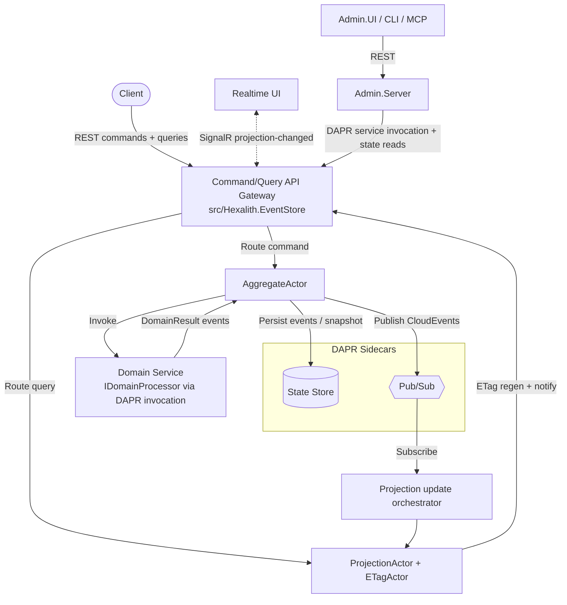

# Architecture — Hexalith.EventStore

> Code-derived architecture map for AI-assisted development. See also
> [integration-architecture.md](./integration-architecture.md) and the hand-authored
> `docs/concepts/architecture-overview.md`.

## 1. Executive Summary

Hexalith.EventStore implements **CQRS + DDD + Event Sourcing** on top of **DAPR actors and pub/sub**,
orchestrated locally by **.NET Aspire**. Each aggregate instance is a DAPR virtual actor whose ID is
`{TenantId}:{Domain}:{AggregateId}`. Commands flow in through a REST gateway, are routed to the aggregate
actor, which invokes the domain service (a pure function), persists resulting events with gapless
sequence numbers, snapshots periodically, and publishes events to pub/sub. Downstream projection actors
consume events, maintain read models, and trigger ETag invalidation + SignalR notifications for
real-time read-model refresh.

## 2. Architectural Patterns

| Pattern | Implementation |
|---------|----------------|
| **CQRS** | Commands and queries are separate MediatR pipelines (`SubmitCommandHandler`, query handlers). |
| **Event Sourcing** | State is reconstructed by replaying events; events are write-once per sequence key. |
| **DDD Aggregates** | Pure functions: `Handle(Command, State?) -> DomainResult`; `state.Apply(Event)`. |
| **Actor-per-aggregate** | One DAPR actor per aggregate identity; serialized turn-based concurrency. |
| **Convention discovery** | Reflection finds `Handle`/`Apply` methods and derives kebab-case domain names; no manual registration. |
| **Infrastructure abstraction** | DAPR sidecars front state store + pub/sub; backends swap via YAML, zero code change. |
| **Multi-tenancy** | Tenant isolation baked into identity + storage keys + actor scoping + JWT enforcement. |
| **Fail-open vs fail-closed** | Advisory work (status, archive, snapshot, drain, SignalR) fails open; auth/validation fail closed. |

## 3. System Topology

## 4. The Parts (deployable + libraries)

| Part | Project | Role | Container |
|------|---------|------|-----------|
| **Command/Query API gateway** | `src/Hexalith.EventStore` | REST gateway ("CommandApi"), auth, validation, rate limiting, ETag, error handling, hosts actors | `eventstore` |
| **Server domain processing** | `src/Hexalith.EventStore.Server` | DAPR actors, command/query routing, event persistence, snapshots, pub/sub, projections | (in gateway) |
| **Contracts** | `src/Hexalith.EventStore.Contracts` | Commands, events, envelopes, identities, queries, results, problems, security | NuGet |
| **Client** | `src/Hexalith.EventStore.Client` | Aggregate/projection base classes, convention discovery, DI registration | NuGet |
| **SignalR** | `src/Hexalith.EventStore.SignalR` | Real-time projection-changed client + hub contract | NuGet |
| **Testing** | `src/Hexalith.EventStore.Testing` | Builders, fakes, in-memory stores, assertions, compliance helpers | NuGet |
| **Aspire** | `src/Hexalith.EventStore.Aspire` | Hosting extensions (`AddHexalithEventStore`) | NuGet |
| **AppHost** | `src/Hexalith.EventStore.AppHost` | Aspire app model + DAPR components (local topology) | — |
| **ServiceDefaults** | `src/Hexalith.EventStore.ServiceDefaults` | OpenTelemetry, health checks, service discovery, resilience | — |
| **Admin.Abstractions** | `src/Hexalith.EventStore.Admin.Abstractions` | 16 admin service interfaces + DTOs + roles + redaction | NuGet |
| **Admin.Server(.Host)** | `src/...Admin.Server`, `...Admin.Server.Host` | DAPR-backed admin REST API (10 controllers) | `eventstore-admin` |
| **Admin.UI** | `src/Hexalith.EventStore.Admin.UI` | Blazor dashboard (22 pages, FluentUI) | `eventstore-admin-ui` |
| **Admin.Cli** | `src/Hexalith.EventStore.Admin.Cli` | `eventstore-admin` CLI (System.CommandLine) | NuGet tool |
| **Admin.Mcp** | `src/Hexalith.EventStore.Admin.Mcp` | MCP server, AI-callable admin tools | exe |

### 4a. Domain-service authoring model (domain-centric)

Domain modules that run on this platform (the `Sample`, the `Hexalith.Tenants` submodule, and any custom
domain) are **domain-centric**: they contain only aggregates, commands, events, projections, validators,
queries, and contracts. **All hosting/infrastructure boilerplate is provided by the EventStore client
libraries** — a domain module must not ship its own `*.AppHost`, `*.Aspire`, or `*.ServiceDefaults`, nor
re-implement projection/query actors, DAPR wiring, telemetry, health checks, or event-subscription plumbing.

The seam is convention discovery (`AssemblyScanner` + `NamingConventionEngine`) over the
`IDomainProcessor` / `EventStoreAggregate<TState>` base classes: a domain author inherits the base class and
the platform discovers, registers (keyed by kebab-case domain name), hosts, routes, persists, and publishes.
A conforming domain service is ≈ domain code + a 2-line host (`AddEventStoreDomainService()` /
`UseEventStoreDomainService()`; see `Hexalith.EventStore.Client`). The `Sample` is the reference shape.

## 5. Command Processing Pipeline

`POST /api/v1/commands` → MediatR `SubmitCommandHandler`
(`src/Hexalith.EventStore.Server/Pipeline/SubmitCommandHandler.cs`):

1. **(Advisory)** write `Received` status (`ICommandStatusStore`) and archive original command
   (`ICommandArchiveStore`) — failures here never block processing.
2. **Authorization behavior** (`AuthorizationBehavior<TCommand,TResult>`) validates tenant + RBAC
   *before* domain invocation (fail-fast, fail-closed).
3. **Route** via `ICommandRouter` → `CommandRouter` derives `AggregateIdentity.ActorId`
   (never manual string concatenation) and invokes the `IAggregateActor` DAPR proxy.

Inside **`AggregateActor.ProcessCommandAsync`** (`Actors/AggregateActor.cs`, ~2258 lines, a thin
orchestrator over a checkpointed 5-step pipeline — `PipelineState` persisted for crash recovery, NFR25):

1. **Idempotency check** (`IIdempotencyChecker`) — skip duplicate causation IDs.
2. **Tenant validation** (custom actor or `ITenantValidator`).
3. **State rehydration** — load snapshot (preferred) then tail events via `EventStreamReader`.
4. **Domain invocation** (`IDomainServiceInvoker` → `DaprDomainServiceInvoker`) — DAPR service
   invocation to the domain service app/method; returns `DomainResult`. No custom retry (DAPR resiliency).
5. **Event persistence + publish** — `IEventPersister` assigns gapless sequence numbers and writes
   write-once event keys; `ISnapshotManager` snapshots per interval policy; `IEventPublisher` publishes
   CloudEvents 1.0 to pub/sub. The actor commits state atomically (persisters do **not** call
   `SaveStateAsync` themselves).

**Resilience features:**
- **Backpressure** (Story 4.3): per-aggregate pending-command cap (`BackpressureOptions.MaxPendingCommandsPerAggregate`, default 100) → `BackpressureExceededException` → HTTP **429** + `Retry-After`.
- **Event drain recovery** (Story 4.2): on publish failure the actor records unpublished events and registers an `IRemindable` reminder to retry publishing (`EventDrainOptions`).
- **Concurrency retry**: optimistic concurrency via metadata ETag; retries on `ConcurrencyConflictException` up to `CommandConcurrencyOptions.MaxPersistenceConflictRetries`; surfaced as HTTP **409**.
- **Dead-letter routing**: infrastructure failures at steps 3–5 route to `IDeadLetterPublisher` (CloudEvents type `deadletter.command.failed`).

**Command status lifecycle** (`CommandStatus` enum): `Received → Processing → EventsStored → EventsPublished → Completed`, or terminal `Rejected / PublishFailed / TimedOut`. Clients poll `GET /api/v1/commands/status/{correlationId}`; non-terminal states return `Retry-After`.

## 6. Query Pipeline & Caching

`POST /api/v1/queries` (`QueriesController`):

- **Gate 1 (ETag pre-check):** if `If-None-Match` is present and no explicit policy inputs (paging/search/filter/orderby/freshness), `IETagService.GetCurrentETagAsync()` is consulted before routing → **304 Not Modified** on match (fail-open: skip on error). ETags are **self-routing** — they encode the projection type (base64url) for multi-tenant lookup.
- **Gate 2 (execution):** route to projection actor (`EventReplayProjectionActor`, registered as DAPR type `"ProjectionActor"`), execute, set ETag response header.
- **ETag tracking:** `ETagActor` holds the current ETag per `{ProjectionType}:{TenantId}`, persisting before updating its in-memory cache (FM-1) and degrading gracefully on load failure (FM-2).

## 7. Projection & Real-Time Refresh

1. After events persist, `EventPublisher` fires `IProjectionUpdateOrchestrator.UpdateProjectionAsync` (fire-and-forget).
2. `EventReplayProjectionActor.UpdateProjectionAsync` persists projection state, regenerates the ETag, and calls `IProjectionChangeNotifier`.
3. `DaprProjectionChangeNotifier` notifies via **PubSub** (`{ProjectionType}-{TenantId}-changed`) or **Direct** (in-process ETag actor invocation), then broadcasts to SignalR via `IProjectionChangedBroadcaster` (fail-open per ADR-18.5a).
4. The gateway also exposes `POST /projections/changed` (anonymous, DAPR pub/sub subscription `*.*.projection-changed`) which regenerates the ETag and broadcasts to the SignalR hub (`ProjectionChangedHub`).
5. Clients use `EventStoreSignalRClient` (`src/Hexalith.EventStore.SignalR`) — auto-reconnect, group rejoin per `{projectionType}:{tenantId}`.

## 8. Authentication & Authorization

- **Composite scheme "Hexalith"** (`ServiceCollectionExtensions`): a policy scheme that forwards to a
  **DAPR internal auth handler** when a trusted `dapr-caller-app-id` header (in `AllowedCallers`) is
  present, otherwise to **JWT bearer**.
- **JWT bearer:** OIDC discovery via `Authentication:JwtBearer:Authority` (Keycloak in dev/prod) or
  **symmetric-key (HS256) fallback** when `Authority` is empty (`EnableKeycloak=false`).
  `MapInboundClaims=false`; UserId comes from the `sub` claim only (never `name`).
- **Tenant isolation:** `eventstore:tenant` claim(s); `ITenantValidator` (`ClaimsTenantValidator` or
  actor-backed `ActorTenantValidator`).
- **RBAC:** `IRbacValidator` (`ClaimsRbacValidator` or `ActorRbacValidator`) checks domain + message
  type + category (command vs query). Admin uses 3-tier policies (`AdminReadOnly` / `AdminOperator` /
  `AdminFull`).
- **Errors:** RFC 9457 `application/problem+json` via a prioritized chain of exception handlers
  (validation→503-auth→403-auth→429→409→422→404→503→500). See [api-contracts.md](./api-contracts.md).

## 9. Event Sourcing Mechanics

- **Sequence numbers:** gapless, monotonically increasing per aggregate, starting at 1. Stored as
  write-once keys `{TenantId}:{Domain}:{AggregateId}:events:{SequenceNumber}`.
- **Metadata:** `{...}:metadata` holds `CurrentSequence`, `LastModified`, `ETag` (optimistic concurrency).
- **Snapshots:** `{...}:snapshot`; interval resolved 4-tier (per-aggregate policy → per-tenant-domain →
  per-domain → system default; all intervals validated `>= 10`). Snapshotting is advisory.
- **Rehydration:** load snapshot → tail-read events after the snapshot sequence → fold via `Apply`.
- **Termination/tombstoning:** aggregates may implement `ITerminatable`; commands to a terminated
  aggregate yield `AggregateTerminated` (an `IRejectionEvent`); state must declare `Apply(AggregateTerminated)`.
- **Payload protection:** `IEventPayloadProtectionService` (default no-op) hooks encryption/signing;
  supports crypto-shredding workflows and "unreadable protected data" problem reporting.

## 10. Observability (ServiceDefaults)

`AddServiceDefaults()` (`src/Hexalith.EventStore.ServiceDefaults/Extensions.cs`):

- **OpenTelemetry** logs (JSON console, UTC, scopes), metrics (ASP.NET/HTTP/runtime), traces
  (`"Hexalith.EventStore"` + SignalR sources; health endpoints excluded); OTLP exporter when
  `OTEL_EXPORTER_OTLP_ENDPOINT` is set.
- **Health checks:** `/health` (all), `/alive` (live), `/ready` (ready); Healthy/Degraded→200, Unhealthy→503.
- **Service discovery** + standard HTTP resilience on all `HttpClient`s.

## 11. Key Design Decisions / Rules (from code + CLAUDE.md)

- Identifiers are **ULIDs** — use `Ulid.TryParse` or accept any non-whitespace per `AggregateIdentity`;
  `Guid.TryParse` on `messageId/correlationId/aggregateId/causationId` is forbidden (R2-A7).
- Payloads are redacted in `ToString()` on `CommandEnvelope`, `EventEnvelope`, `QueryEnvelope` (SEC-5).
- No custom retry around DAPR calls — DAPR resiliency policies own transient failures (rule #4).
- Tenant/domain/aggregate-id components forbid colons → structurally disjoint key spaces (FR15/FR28).
- `Hexalith.EventStore.Server.Tests` is excluded from the baseline due to a pre-existing CA2007
  warnings-as-errors build failure (see development-guide.md).
- **Domain modules are domain-centric (boilerplate lives in the client libraries).** A domain module must
  not re-implement platform infrastructure — no own `*.AppHost`/`*.Aspire`/`*.ServiceDefaults`, no custom
  projection/query actor, no hand-rolled DAPR wiring, telemetry, health checks, or event-subscription
  plumbing. It references the EventStore client libraries (the domain-service SDK) and writes only domain
  code plus a 2-line host. See §4a. The `Sample` is the conforming reference; the `Hexalith.Tenants`
  submodule is being aligned to it (see `_bmad-output/planning-artifacts/sprint-change-proposal-2026-06-02.md`).
