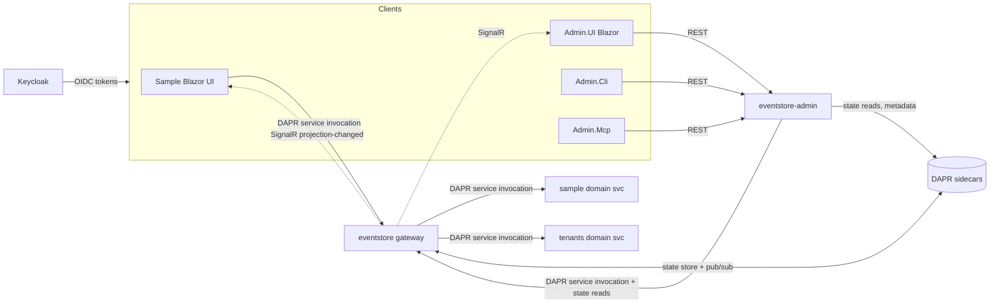

# Integration Architecture — Hexalith.EventStore

> How the deployable parts of this monorepo communicate. All inter-service communication goes through
> **DAPR** (service invocation, pub/sub, actors) — never direct HTTP between services.

## Parts & their runtime relationships

## Integration points

| From | To | Transport | Details |
|------|----|-----------|---------|
| Client / Sample UI | `eventstore` gateway | DAPR service invocation (or REST) | Submit commands/queries; receive SignalR projection-changed |
| `eventstore` | Domain services (`sample`, `tenants`, custom) | **DAPR service invocation** | `DaprDomainServiceInvoker` resolves (AppId, MethodName) via `IDomainServiceResolver` from `EventStore:DomainServices`; version from command extensions (`v{n}`) |
| `eventstore` | State store | DAPR state (actor-scoped) | Events (write-once), metadata, snapshots, ETags, projection state, command status/archive |
| `eventstore` | Pub/Sub | DAPR pub/sub | Events as CloudEvents 1.0; topic `{tenant}.{domain}.events`; dead-letter `deadletter.*` |
| Pub/Sub | `eventstore` `POST /projections/changed` | DAPR subscription `*.*.projection-changed` | Regenerate ETag + SignalR broadcast |
| `eventstore` | Clients | SignalR (`ProjectionChangedHub`) + Redis backplane | Real-time read-model refresh per `{projectionType}:{tenantId}` group |
| `eventstore-admin` | `eventstore` | DAPR service invocation + state reads | Admin **writes are delegated** to the gateway (ADR-P4); reads go direct to state store (`keyPrefix=none`) |
| Admin.UI / Cli / Mcp | `eventstore-admin` | REST (JWT) | All admin operations via the Admin.Server REST API |
| All services | Keycloak | OIDC (HTTP) | JWT issuance/validation (or symmetric-key fallback when `EnableKeycloak=false`) |

## DAPR sidecar wiring (from `HexalithEventStoreExtensions`)

| Service | DAPR AppId | State store | Pub/Sub | Notes |
|---------|-----------|-------------|---------|-------|
| `eventstore` | `eventstore` | ✅ | ✅ | Fixed `DaprHttpPort=3501` for admin metadata queries |
| `eventstore-admin` | `eventstore-admin` | ✅ (reads) | ❌ | No pub/sub; reads only; resiliency path injected (run-mode) |
| `eventstore-admin-ui` | `eventstore-admin-ui` | ❌ | ❌ | Service invocation to admin only |
| `sample` / `tenants` | `sample` / `tenants` | ❌ | ❌ | **Zero infrastructure access** (D4); invoked by eventstore |

## Domain modules are domain-centric

Domain services (`sample`, `tenants`, and any custom domain) own **only domain logic** — aggregates,
commands, events, projections, validators, queries, contracts. Everything needed to run on Hexalith.EventStore
is supplied by the **`Hexalith.EventStore.DomainService` SDK** (which builds on the client libraries):
hosting, the DAPR-invoked domain-service endpoints (`/process`, `/replay-state`,
`/admin/operational-index-metadata` today; `/project` generalization is Epic A3), convention
discovery/registration, ServiceDefaults, and — as the platform last-mile lands — telemetry, health checks,
and event-subscription/projection-consumer plumbing.

A conforming domain module therefore does **not** ship its own `*.AppHost`, `*.Aspire`, or `*.ServiceDefaults`
projects, and does **not** re-implement projection/query actors or DAPR sidecar wiring. The reference shape is
`samples/Hexalith.EventStore.Sample` (≈ domain code + a 2-line host). The `Hexalith.Tenants` submodule
currently diverges from this and is being aligned — see
`_bmad-output/planning-artifacts/sprint-change-proposal-2026-06-02.md`.

## Access control (D4 / FR34)

Each receiving service has its own DAPR Configuration CRD (`accesscontrol*.yaml`):

- `eventstore` allows `eventstore-admin` (delegation) and `sample-blazor-ui` (queries).
- `eventstore-admin` allows `eventstore-admin-ui` (D13).
- `sample` / `tenants` allow `eventstore` POST-only (command invocation).
- Self-hosted/dev: allow-by-default + public trust domain. **Production: deny-by-default + mTLS.**

## Topic & resource naming conventions (`NamingConventionEngine`)

- Domain name: kebab-case from aggregate/projection type (suffixes `Aggregate`/`Projection`/`Processor`
  stripped), or `[EventStoreDomain]` override.
- State store name: `{domain}-eventstore`. Events topic: `{domain}.events`.
- Projection-changed topic: `{tenantId}.{projectionType}.projection-changed`.

## Failure isolation

- Advisory paths (status write, archive, snapshot, projection notify, SignalR broadcast) **fail open**.
- Auth/tenant/RBAC/validation **fail closed**.
- Publish failures → drain recovery (reminder-based retry); step 3–5 infra failures → dead-letter.
- Pub/sub circuit breaker (>5 failures) drives `AggregateActor` into `PublishFailed`/drain.
