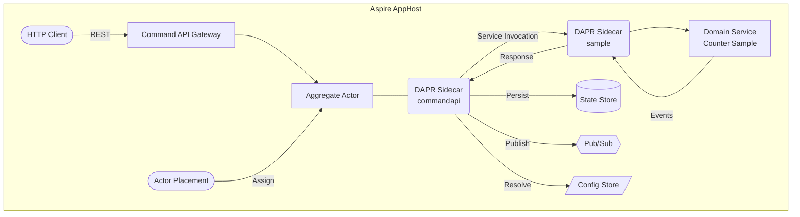

[<- Back to Hexalith.EventStore](../../README.md)

# Architecture Overview

This page explains how Hexalith.EventStore components work together — the services, DAPR sidecars, infrastructure building blocks, and the flow of a command from HTTP request to persisted event. If you completed the [Quickstart Guide](../getting-started/quickstart.md), you already have the system running; this page shows you what happens under the hood.

> **Prerequisites:** [Quickstart Guide](../getting-started/quickstart.md), basic familiarity with REST APIs

## What Happens When You Send a Command?

When you send a command like `IncrementCounter`, it travels through a layered pipeline: the Command API Gateway authenticates and validates the request, a DAPR Actor processes it with single-threaded safety, a domain service applies your business logic as a pure function, and DAPR handles all the infrastructure work — persisting events, publishing to subscribers, and managing state. Your domain code never touches a database, never opens a network connection, and never knows what backend is running underneath.

The rest of this page breaks down each layer of that pipeline: the static topology (what components exist and how they connect), the DAPR building blocks (what infrastructure DAPR abstracts), and the dynamic flow (how a single command moves through the system step by step).

## System Topology

When you ran `aspire run` on the Aspire AppHost in the quickstart, you started a set of interconnected services. The diagram below shows the full topology — every service, every DAPR sidecar, and how they connect to infrastructure.



<details>
<summary>Architecture diagram text description</summary>

The diagram shows the complete Hexalith.EventStore topology running inside the Aspire AppHost boundary — the same boundary you see on the Aspire dashboard when you run the quickstart.

An HTTP Client (shown as a rounded shape) sends REST requests to the Command API Gateway (rectangle), which is the system's single entry point. The Command API Gateway routes commands to the Aggregate Actor (rectangle), which is the core processing unit for each aggregate identity.

The Aggregate Actor communicates through its DAPR Sidecar (rounded rectangle, labeled "commandapi"), which handles all infrastructure interactions on the actor's behalf. The commandapi sidecar connects to three infrastructure components: a State Store (cylinder shape) for persisting events, snapshots, and actor state; a Pub/Sub component (hexagon shape) for publishing domain events to downstream subscribers; and a Config Store (parallelogram shape) for resolving which domain service handles commands for a given tenant and domain.

When the actor needs to invoke business logic, the commandapi sidecar uses DAPR Service Invocation to call the sample sidecar (another rounded rectangle), which forwards the request to the Domain Service (rectangle, labeled "Counter Sample"). The Domain Service processes the command using pure business logic and returns events back through the sidecar chain to the actor.

An Actor Placement service (stadium shape) manages actor assignment, ensuring each aggregate identity is handled by exactly one actor instance at a time.

All services, sidecars, and infrastructure connections run within the Aspire AppHost boundary.

</details>

## What Is DAPR?

DAPR (Distributed Application Runtime) is a runtime that sits alongside your application as a sidecar process, providing building blocks like state management, pub/sub messaging, and service-to-service communication through a simple HTTP/gRPC API. Hexalith uses DAPR so that your domain code and the infrastructure it runs on are completely decoupled — you write business logic, DAPR handles the plumbing, and you can swap that plumbing without touching your code.

In the topology diagram above, every connection to a cylinder, hexagon, or parallelogram goes through a DAPR sidecar. Your application code never talks directly to Redis, PostgreSQL, or any other backend — it talks to DAPR, and DAPR talks to the backend. This separation is what makes infrastructure portability possible: changing the backend means changing a DAPR component YAML file, not your application code.

## DAPR Building Blocks

Hexalith.EventStore uses five DAPR building blocks. Each building block is an API category that abstracts a specific infrastructure concern — think of them as standardized interfaces between your application and the outside world. The sections below explain what each one does, why Hexalith needs it, and where to go for deeper DAPR-specific documentation.

The current quickstart uses Redis as the backend for the state store, pub/sub, and configuration store. In production, you can replace any of these with enterprise-grade alternatives (PostgreSQL, Azure Cosmos DB, Apache Kafka, Azure Service Bus) by swapping DAPR component YAML files — no code changes required.

### State Store

A state store is a key-value storage backend that DAPR manages for you. Your application saves and retrieves data through the DAPR state API, and DAPR handles serialization, concurrency, and backend-specific details.

Hexalith uses the state store for:

- **Actor state** — each Aggregate Actor stores its current state, enabling fast command processing without rehydrating from scratch every time
- **Event streams** — the ordered sequence of domain events for each aggregate, keyed by tenant, domain, and aggregate identity
- **Snapshots** — periodic snapshots of aggregate state to speed up rehydration when the event stream grows long
- **Command status** — tracking whether a command is pending, succeeded, or failed, with a 24-hour time-to-live
- **Idempotency records** — detecting duplicate commands by causation ID to prevent double-processing

When you sent `IncrementCounter` in the quickstart, the Aggregate Actor persisted the resulting `CounterIncremented` event to the state store through its DAPR sidecar.

[Learn more about DAPR State Management](https://docs.dapr.io/developing-applications/building-blocks/state-management/)

### Pub/Sub

Pub/Sub (publish/subscribe) is a messaging pattern where producers publish messages to topics and consumers subscribe to those topics. DAPR's pub/sub building block uses the [CloudEvents 1.0](https://cloudevents.io/) specification for message envelopes, providing a standard format regardless of the underlying message broker.

Hexalith uses pub/sub to:

- **Publish domain events** after they are persisted — downstream consumers (projections, read models, other services) receive events through topic subscriptions
- **Route dead letters** — when event delivery fails after retries, the event is routed to a dead-letter topic with full context for investigation and replay

Topics follow a tenant-isolated naming pattern. For example, events from the Counter domain in `tenant-a` are published to the topic `tenant-a.counter.events`.

[Learn more about DAPR Pub/Sub](https://docs.dapr.io/developing-applications/building-blocks/pubsub/)

### Service Invocation

Service invocation lets one application call another through DAPR sidecars, without needing to know the target's network address. DAPR handles service discovery, load balancing, and mutual TLS automatically.

Hexalith uses service invocation when the Command API Gateway needs to call a domain service. In the quickstart, when you sent `IncrementCounter`, the commandapi sidecar invoked the sample domain service's `/process` endpoint through the sample sidecar. Your domain service received a clean HTTP POST with the command — it never needed to know where the Command API Gateway was running.

[Learn more about DAPR Service Invocation](https://docs.dapr.io/developing-applications/building-blocks/service-invocation/)

### Actors

The virtual actor pattern assigns a unique actor instance to each entity in your system. Actors are single-threaded — only one operation runs on a given actor at a time — which eliminates concurrency bugs for aggregate state management. DAPR manages actor lifecycle automatically: actors activate when needed and deactivate after idle periods.

Hexalith uses a single actor type, `AggregateActor`, where each actor instance represents one aggregate identity (tenant + domain + aggregate ID). When you sent `IncrementCounter`, DAPR's Actor Placement service assigned the actor for your counter aggregate, and that actor processed the command exclusively — no locks, no race conditions.

[Learn more about DAPR Actors](https://docs.dapr.io/developing-applications/building-blocks/actors/)

### Configuration Store

A configuration store provides key-value configuration that applications can read at runtime. Unlike static configuration files, a config store allows values to change without redeploying.

Hexalith uses the configuration store for **domain service resolution** — mapping a tenant, domain, and version to the DAPR app-ID and method that should process commands for that domain. This enables multi-tenant scenarios where different tenants can use different domain service versions. For simpler setups, you can also register domain services directly in `appsettings.json` — see [Domain Service Resolution](#domain-service-resolution) below for both approaches.

[Learn more about DAPR Configuration](https://docs.dapr.io/developing-applications/building-blocks/configuration/)

## Components

### Command API Gateway

The Command API Gateway (`commandapi`, port 8080) is the system's entry point. It is a .NET Minimal API application that hosts:

- **REST endpoints** for submitting commands, querying command status, and replaying commands
- **JWT authentication** with claims transformation for tenant-aware authorization
- **MediatR pipeline** with validation behaviors (FluentValidation), logging, and command routing
- **Rate limiting** to protect against excessive request volumes
- **Swagger UI** for interactive API exploration (the UI you used in the quickstart)

The Command API Gateway also hosts the DAPR Actor runtime, making it the home for all `AggregateActor` instances. In the quickstart, this is the service you interacted with through Swagger UI at `http://localhost:8080/swagger`.

### Aggregate Actor

The `AggregateActor` is the core processing unit. Each actor instance handles commands for exactly one aggregate identity. When a command arrives, the actor executes a 5-step pipeline:

1. **Idempotency check** — look up the command's causation ID in actor state. If found, the command was already processed; return the previous result
2. **Tenant validation** — verify that the requesting tenant matches the aggregate's tenant
3. **State rehydration** — load the most recent snapshot, then replay any events after that snapshot to reconstruct the current aggregate state
4. **Domain service invocation** — call the domain service through DAPR service invocation, passing the command and current state. The domain service returns a result containing new events
5. **Persist and publish** — save new events to the state store, create a snapshot if the interval threshold is reached, and publish events to the pub/sub topic

This pipeline runs with single-threaded actor guarantees — no concurrent commands can execute for the same aggregate at the same time. This eliminates an entire category of concurrency bugs that are common in traditional event sourcing implementations. You do not need to implement locking, optimistic concurrency retries, or conflict resolution — the actor model handles it for you.

When you sent `IncrementCounter` in the quickstart, this exact 5-step pipeline executed: the actor checked for duplicates, validated the tenant, loaded the counter state, called the Counter domain service to produce a `CounterIncremented` event, and then persisted and published that event — all within a single actor turn.

### Domain Service

A domain service is where your business logic lives. It is a standalone .NET application that exposes a `POST /process` endpoint. The Counter sample from the quickstart is a domain service.

The defining principle of Hexalith domain services is **zero infrastructure access**. A domain service:

- Never imports Redis, PostgreSQL, or any database client
- Never knows which state store or message broker backs the system
- Never manages its own persistence or event publishing
- Contains only pure functions: `Handle(Command, State?) → DomainResult`

This is not just a sample convention — it is a core Hexalith design principle. Your domain services work identically regardless of what infrastructure DAPR is wired to. To switch from Redis to PostgreSQL, you change one YAML file — zero code changes, zero recompilation.

DAPR enforces component-level scoping so domain services cannot access infrastructure directly. The state store, pub/sub, and config store components are scoped to `commandapi` only — domain services are explicitly denied access at the DAPR level.

### Infrastructure Portability

Because all infrastructure access goes through DAPR building blocks, switching backends is a configuration change — not a code change. To switch from Redis to PostgreSQL, you change one YAML file — zero code changes, zero recompilation. The same applies to pub/sub backends (Redis Streams to RabbitMQ to Apache Kafka to Azure Service Bus) and configuration stores.

This portability extends to your domain services automatically. Since domain services have zero infrastructure access, they work identically on any DAPR-supported backend. You can develop locally against Redis and deploy to production against Azure Cosmos DB without modifying a single line of application code.

### Domain Service Resolution

Hexalith supports two paths for resolving which domain service handles a given command:

#### Configuration Store (Dynamic, Multi-Tenant)

The config store maps `{tenant}:{domain}:{version}` keys to `{AppId, MethodName}` values. This allows different tenants to route to different domain service versions at runtime — useful for gradual rollouts, A/B testing, or tenant-specific customizations. Changes take effect without redeployment.

#### appsettings.json (Static, Simple)

For applications with a single tenant or fixed domain service mapping, you can register domain services directly in `appsettings.json`. This is simpler to set up and does not require a configuration store component.

If you are building a single-tenant application or a prototype, start with `appsettings.json`. You can switch to the config store later without changing your domain service code.

## Command Flow

Now that you understand the static topology and each component's role, the sequence diagram below traces a single command — `IncrementCounter` from the quickstart — through the entire system. This is the dynamic view: how data flows through the components at runtime.

```mermaid
sequenceDiagram
    participant Client as HTTP Client
    participant API as Command API Gateway
    participant MediatR as MediatR Pipeline
    participant Router as Command Router
    participant Actor as Aggregate Actor
    participant Sidecar as DAPR Sidecar
    participant Domain as Domain Service (Counter)

    Client->>API: POST /api/commands (IncrementCounter)
    API->>MediatR: Dispatch command
    MediatR->>MediatR: Validate (FluentValidation)
    MediatR->>Router: Route to actor
    Router->>Actor: Invoke AggregateActor
    Actor->>Actor: 1. Idempotency check
    Actor->>Actor: 2. Tenant validation
    Actor->>Actor: 3. Rehydrate state (snapshot + events)
    Actor->>Sidecar: 4. Invoke domain service
    Sidecar->>Domain: POST /process (IncrementCounter + state)
    Domain-->>Sidecar: CounterIncremented event
    Sidecar-->>Actor: Domain result
    Actor->>Sidecar: 5a. Persist events to state store
    Actor->>Sidecar: 5b. Publish events to pub/sub
    Actor->>Sidecar: 5c. Create snapshot (if threshold reached)
    Actor-->>Router: Command result
    Router-->>MediatR: Result
    MediatR-->>API: Result
    API-->>Client: 202 Accepted + correlation ID
```

<details>
<summary>Command flow diagram text description</summary>

The flow begins when an HTTP Client sends a POST request to the Command API Gateway with an IncrementCounter command. The Command API Gateway dispatches the command into the MediatR pipeline, which first validates the command using FluentValidation rules. After validation passes, MediatR routes the command to the Command Router, which identifies the target Aggregate Actor based on the command's aggregate identity. The Command Router invokes the Aggregate Actor, which executes its 5-step pipeline: (1) idempotency check to detect duplicate commands, (2) tenant validation to confirm authorization, (3) state rehydration by loading the latest snapshot and replaying subsequent events. For step 4, the actor asks its DAPR Sidecar to invoke the Counter domain service, which receives a POST /process request containing the IncrementCounter command and the current aggregate state. The domain service processes the command with pure business logic and returns a CounterIncremented event. The event travels back through the sidecar to the actor, which then executes step 5 in three parts: (5a) persist the new event to the state store, (5b) publish the event to the pub/sub topic, and (5c) create a snapshot if the configured interval threshold has been reached. The result propagates back through the Command Router, MediatR pipeline, and Command API Gateway, which responds to the client with HTTP 202 Accepted and a correlation ID for status tracking.

</details>

## Next Steps

- **Next:** [Command Lifecycle Deep Dive](command-lifecycle.md) — trace a command end-to-end through the system
- **Related:** [Choose the Right Tool](choose-the-right-tool.md), [Quickstart Guide](../getting-started/quickstart.md)
