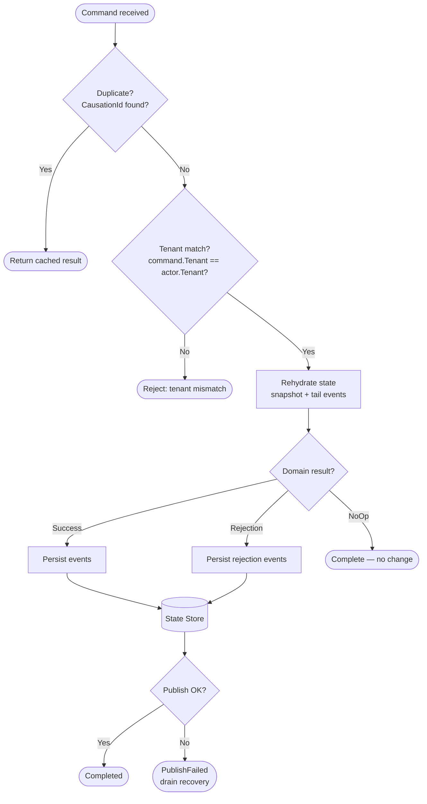

[<- Back to Hexalith.EventStore](../../README.md)

# Command Lifecycle Deep Dive

When you send a command to Hexalith.EventStore, it passes through a precise pipeline: REST authentication, validation, actor-based processing, event persistence, and pub/sub distribution. This page traces that entire journey step by step using the `IncrementCounter` command from the quickstart, so you can see exactly what happens between your HTTP request and the persisted event that appears in the state store.

> **Prerequisites:** [Architecture Overview](architecture-overview.md) — understand the system topology and DAPR building blocks before diving into the command flow

## What Happens When You Send a Command?

When you sent `IncrementCounter` in the quickstart, here is what happened behind the scenes. The command traveled through seven distinct phases, each with a clear responsibility. The pipeline ensures that every command is authenticated, validated, processed exactly once, and that the resulting events are safely persisted before they are broadcast to subscribers.

1. **REST API Entry Point** — the Command API Gateway receives your HTTP request, authenticates the JWT, and generates a correlation ID
2. **MediatR Pipeline** — three behaviors run in sequence: logging, authorization, and validation
3. **Command Routing** — the handler archives the command and routes it to the correct DAPR actor based on the aggregate identity
4. **Actor Activation** — DAPR activates the `AggregateActor` for your specific aggregate, guaranteeing single-threaded processing
5. **Domain Processing** — the actor runs a 5-step internal pipeline: idempotency check, tenant validation, state rehydration, domain service invocation, and event persistence
6. **Event Publishing** — persisted events are published to DAPR pub/sub as CloudEvents 1.0 messages
7. **Terminal State** — the command reaches a final status (Completed, Rejected, PublishFailed, or Failed) and an idempotency record is stored for safe retries

The rest of this page walks through each phase in detail, with diagrams and code examples grounded in the Counter domain.

## The Full Journey — Sequence Diagram

The diagram below traces a single `IncrementCounter` command from the HTTP client all the way to the state store and pub/sub topic. The highlighted block in the center shows the 5-step AggregateActor pipeline — the core of the system.

```mermaid
sequenceDiagram
    participant Client as HTTP Client
    participant API as Command API
    participant MediatR as MediatR Pipeline
    participant Handler as SubmitCommandHandler
    participant Router as CommandRouter
    participant Actor as AggregateActor
    participant Domain as Domain Service
    participant Store as State Store
    participant PubSub as Pub/Sub

    Client->>API: POST /api/v1/commands (IncrementCounter)
    API->>MediatR: Dispatch command
    MediatR->>MediatR: Log, Authorize, Validate
    MediatR->>Handler: SubmitCommand
    Handler->>Handler: Write "Received" status
    Handler->>Router: Route to actor
    Router->>Actor: ProcessCommandAsync via DAPR proxy

    rect rgb(240, 248, 255)
        Note right of Actor: Step 1: Idempotency Check
        Actor->>Actor: Lookup CausationId in state
        Note right of Actor: Step 2: Tenant Validation
        Actor->>Actor: Assert command tenant matches actor
        Note right of Actor: Step 3: State Rehydration
        Actor->>Store: Load snapshot + tail events
        Store-->>Actor: Current aggregate state
        Note right of Actor: Step 4: Domain Invocation
        Actor->>Domain: POST /process (command + state)
        Domain-->>Actor: DomainResult (CounterIncremented)
        Note right of Actor: Step 5: Persist & Publish
        Actor->>Store: Persist events atomically
        Actor->>PubSub: Publish CloudEvents
    end

    Actor-->>Router: Command result
    Router-->>Handler: Result
    Handler-->>MediatR: Result
    MediatR-->>API: Result
    API-->>Client: 202 Accepted + correlationId
```

<details>
<summary>Diagram text description</summary>

The sequence begins when an HTTP Client sends a POST request to the Command API with an IncrementCounter command. The Command API dispatches the command into the MediatR Pipeline, which runs logging, authorization, and validation behaviors in sequence. After passing validation, MediatR forwards the command to the SubmitCommandHandler, which writes an advisory "Received" status and passes the command to the CommandRouter. The CommandRouter derives the actor ID from the aggregate identity and invokes ProcessCommandAsync on the AggregateActor through a DAPR actor proxy.

Inside the AggregateActor pipeline (shown in the highlighted block), five steps execute in order. Step 1: the actor checks for an existing idempotency record by looking up the command's CausationId in its state. Step 2: the actor validates that the command's tenant matches the actor's tenant. Step 3: the actor rehydrates the aggregate's current state by loading the latest snapshot from the State Store and replaying any subsequent events. Step 4: the actor sends the command and current state to the Domain Service via a POST /process call; the Domain Service returns a DomainResult containing a CounterIncremented event. Step 5: the actor persists the new events atomically to the State Store and publishes them to the Pub/Sub topic as CloudEvents.

The result propagates back through the CommandRouter, SubmitCommandHandler, MediatR Pipeline, and Command API, which responds to the client with HTTP 202 Accepted and a correlationId for status tracking.

</details>

## Phase 1: REST API Entry Point

Your command enters the system at `POST /api/v1/commands`. The request body contains the routing coordinates and the command payload:

```bash
$ curl -X POST https://localhost:8080/api/v1/commands \
  -H "Authorization: Bearer $TOKEN" \
  -H "Content-Type: application/json" \
  -d '{
    "tenant": "demo",
    "domain": "counter",
    "aggregateId": "counter-1",
    "commandType": "IncrementCounter",
    "payload": { "amount": 1 }
  }'
```

The Command API responds immediately with `202 Accepted` and a correlation ID:

```json
{
  "correlationId": "550e8400-e29b-41d4-a716-446655440000"
}
```

Before the command reaches the pipeline, three things happen at the entry point: a unique correlation ID is generated for end-to-end tracing, the JWT is checked with a 3-layer tenant authorization (the token must carry `eventstore:tenant`, `eventstore:domain`, and `eventstore:permission` claims), and the user ID is extracted from the JWT `sub` claim. Rate limiting and [OpenAPI/Swagger UI](https://swagger.io/tools/swagger-ui/) are also available at this layer — the quickstart Swagger UI you used lives here.

With your command accepted, it enters the MediatR pipeline.

## Phase 2: The MediatR Pipeline

The [MediatR](https://github.com/jbogard/MediatR) pipeline runs three behaviors in order, each acting as a filter before the command reaches the handler:

1. **LoggingBehavior** (outermost) — creates an [OpenTelemetry](https://opentelemetry.io/) Activity for distributed tracing and logs the command with structured logging, including duration tracking
2. **AuthorizationBehavior** — validates JWT claims (`eventstore:tenant`, `eventstore:domain`, `eventstore:permission`) against the command's routing coordinates. A missing or mismatched claim stops the command here.
3. **ValidationBehavior** — runs [FluentValidation](https://docs.fluentvalidation.net/) rules against the command. If validation fails, the pipeline returns an [RFC 7807](https://datatracker.ietf.org/doc/html/rfc7807) problem details response with structured error information — no further processing occurs.

Having passed all checks, the command moves to routing.

## Phase 3: Command Routing

The `SubmitCommandHandler` receives the validated command and performs two actions: it writes an advisory "Received" status (for command status tracking) and archives the original command payload. Then it hands the command to the `CommandRouter`.

The `CommandRouter` derives the actor ID from the command's aggregate identity using the format `tenant:domain:aggregateId`. For your `IncrementCounter` command targeting tenant `demo`, domain `counter`, aggregate `counter-1`, the actor ID becomes `demo:counter:counter-1`. The router creates a [DAPR actor proxy](https://docs.dapr.io/developing-applications/building-blocks/actors/) for `IAggregateActor` with that ID and invokes `ProcessCommandAsync`.

This actor ID format is central to tenant isolation — every piece of state the actor reads or writes is scoped to that composite key. Two tenants can have identically named aggregates without any risk of cross-contamination. The full identity scheme is covered in the [Identity Scheme Documentation](identity-scheme.md).

The actor proxy activates the AggregateActor — and this is where the real work begins.

## Phase 4: The AggregateActor Pipeline

The `AggregateActor`, which manages one aggregate instance with single-threaded safety, executes a 5-step internal pipeline. This is the heart of Hexalith.EventStore — every command passes through these exact steps in this exact order.

### Step 1: Idempotency Check

First, the actor checks whether it has already processed this exact command.

The actor looks up the command's `CausationId` in its state. If an idempotency record exists, this is a duplicate — the actor returns the cached result from the previous execution without re-processing. This makes command submission safe to retry: network timeouts, client crashes, or load balancer retries will never cause double-processing.

The `CausationId` identifies a specific command instance (one execution attempt), while the `CorrelationId` tracks the entire request across services (for distributed tracing). The idempotency check also detects in-flight pipeline resumption — if the actor crashed mid-pipeline, it picks up from the last checkpoint rather than starting over.

### Step 2: Tenant Validation

Before touching any stored state, the actor verifies the command belongs to the right tenant.

The actor asserts that the command's tenant matches the tenant encoded in the actor ID. This is a defense-in-depth check — the JWT was already validated at the API entry point, but the actor enforces tenant isolation independently. Even if a routing bug or misconfigured proxy sent a command to the wrong actor, this check prevents cross-tenant state access.

### Step 3: State Rehydration

The actor reconstructs the aggregate's current state by replaying its event history.

Rehydration follows a snapshot-first strategy: load the most recent snapshot (if one exists), then load the tail events from the snapshot's sequence number to the current sequence. For a brand-new aggregate, there is no history — the state starts as `null`. If your counter has processed 150 commands with snapshots every 100 events, rehydration loads the snapshot at sequence 100 plus events 101–150, applying each event through the aggregate's `Apply` method to reconstruct the current state. This is faster than replaying all 150 events from scratch while keeping the full event history intact.

### Step 4: Domain Service Invocation

With the current state in hand, the actor sends your command to the domain service — the only place where your business logic runs.

The actor resolves which domain service handles this tenant and domain combination (via the [DAPR configuration store](https://docs.dapr.io/developing-applications/building-blocks/configuration/) or `appsettings.json`), then uses [DAPR service invocation](https://docs.dapr.io/developing-applications/building-blocks/service-invocation/) to call the domain service's `/process` endpoint. In the sample domain, this reaches `CounterProcessor`, which receives the command and current state, runs your pure business logic, and returns a `DomainResult`.

For the Counter domain, the `Handle` method is a pure function with no infrastructure access:

```csharp
// Pure function: Command + State -> Events (no infrastructure access)
public static DomainResult Handle(IncrementCounter command, CounterState? state)
{
    int currentValue = state?.Value ?? 0;
    return DomainResult.Success(new CounterIncremented(currentValue + command.Amount));
}
```

The domain service can return three outcomes: `DomainResult.Success(events)` when the command produces new events, `DomainResult.Rejection(rejectionEvents)` when the domain rejects the command (for example, a `DecrementCounter` that would make the value negative returns a `CounterCannotGoNegative` rejection), or `DomainResult.NoOp()` when no state change is needed. A rejection is a valid domain outcome — not an error. Rejection events are persisted and published just like success events, because they record something meaningful that happened in the domain.

> **Where your code lives:** As a domain service author, you only write `Handle` and `Apply` methods. Everything else — routing, persistence, publishing, retries — is handled for you by the Hexalith infrastructure.

### Step 5: Event Persistence and Publishing

The actor now persists the resulting events and broadcasts them to subscribers.

This step runs in three sub-phases. First, the `EventPersister` wraps each event in an `EventEnvelope` with metadata (sequence number, timestamp, causation and correlation IDs) and writes them to the [DAPR state store](https://docs.dapr.io/developing-applications/building-blocks/state-management/) atomically with gapless sequence numbers — the pipeline checkpoints to `EventsStored` after this write succeeds. Second, the `SnapshotManager` checks whether the snapshot interval threshold has been reached and creates a new snapshot if so. Third, the `EventPublisher` publishes each event to [DAPR pub/sub](https://docs.dapr.io/developing-applications/building-blocks/pubsub/) as [CloudEvents 1.0](https://cloudevents.io/) messages on the tenant-isolated topic (for example, `demo.counter.events`), and the pipeline checkpoints to `EventsPublished`.

**Events are always persisted before they are published.** If publication fails, the events are safe in the state store and a background drain process retries delivery. You never lose an event. The full structure of an EventEnvelope is covered in [Event Envelope & Metadata](event-envelope.md).

## Phase 5: Terminal States

After the actor pipeline completes, the command reaches one of four terminal states:

| State | Meaning |
|-------|---------|
| **Completed** | Events persisted and published successfully — the happy path |
| **Rejected** | The domain rejected the command (a valid outcome, not an error) — rejection events are still persisted and published |
| **PublishFailed** | Events persisted but pub/sub delivery failed — an `UnpublishedEventsRecord` is stored for background drain recovery |
| **Failed** | An infrastructure error prevented processing (state store unavailable, actor crash, etc.) |

At terminal state, an idempotency record is stored with the result. If the same command arrives again (same `CausationId`), the actor returns the cached result from Step 1 without re-processing — this is what makes retries safe.

You can poll the command's progress at `GET /api/v1/commands/status/{correlationId}`, which returns the current pipeline stage: Received -> EventsStored -> EventsPublished -> Completed/Rejected. Status records have a 24-hour TTL. The full endpoint documentation will be available in the [Command API Reference](../reference/command-api.md).

The command lifecycle is now complete — from HTTP request to persisted event to published message.

## The Decision Tree

The flowchart below shows the AggregateActor pipeline as a decision tree, making the branching logic explicit. Each diamond is a decision point, each rectangle is a processing step.



<details>
<summary>Diagram text description</summary>

The decision tree starts when a command is received by the AggregateActor. The first decision is the idempotency check: if the command's CausationId is found in the actor's state, the command is a duplicate and the actor returns the cached result from the previous execution. If the CausationId is not found, the command is new and proceeds to tenant validation.

The second decision checks whether the command's tenant matches the actor's tenant. If they do not match, the command is rejected with a tenant mismatch error. If they match, the actor proceeds to rehydrate the aggregate state by loading the latest snapshot and replaying tail events.

After rehydration, the actor invokes the domain service and checks the result. If the domain returns Success, the actor persists the resulting events. If the domain returns Rejection, the actor persists the rejection events (rejection is a valid outcome, not an error). If the domain returns NoOp, the command completes immediately with no state change.

For both Success and Rejection paths, the persisted events flow to the State Store. After persistence, the actor attempts to publish the events to pub/sub. If publishing succeeds, the command reaches the Completed terminal state. If publishing fails, the command reaches the PublishFailed state and a background drain process handles retry delivery.

</details>

## Connecting the Dots

In the [Architecture Overview](architecture-overview.md), you saw the static topology. Now you have traced a single command through that topology end-to-end. Four design principles run through every phase you just read:

- **Event Sourcing:** Every state change is an appended event — the counter's value is reconstructed from its event history, never updated in place.
- **CQRS:** Commands go in, events come out — the domain service is a pure function with no side effects.
- **Infrastructure Portability:** DAPR abstracts every infrastructure interaction — swap Redis for PostgreSQL by changing one YAML file.
- **Multi-Tenant Isolation:** The actor ID embeds the tenant, scoping all state and events to a single tenant automatically.

## Next Steps

- **Next:** [Event Envelope & Metadata](event-envelope.md) — understand the structure of persisted events
- **Related:** [Architecture Overview](architecture-overview.md), [First Domain Service Tutorial](../getting-started/first-domain-service.md)
