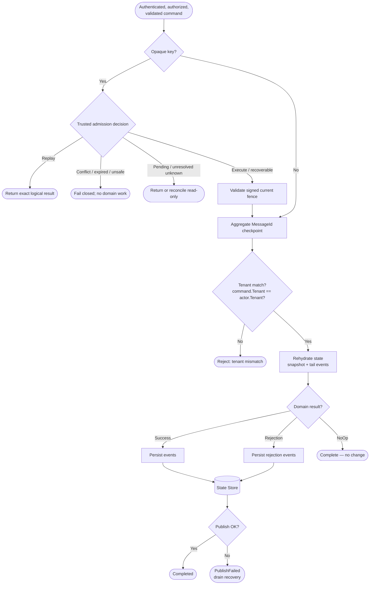

[<- Back to Hexalith.EventStore](../../README.md)

# Command Lifecycle Deep Dive

When you send a command to Hexalith.EventStore, it passes through a precise pipeline: REST authentication, current authorization, validation, optional trusted idempotency admission, actor-based processing, event persistence, and pub/sub distribution. This page traces that entire journey step by step using the `IncrementCounter` command from the quickstart, so you can see exactly what happens between your HTTP request and the persisted event that appears in the state store.

> **Prerequisites:** [Architecture Overview](architecture-overview.md) — understand the system topology and DAPR building blocks before diving into the command flow

## What Happens When You Send a Command?

When you sent `IncrementCounter` in the quickstart, here is what happened behind the scenes. The command traveled through eight distinct phases, each with a clear responsibility. The pipeline ensures that every command is authenticated and validated, that an eligible opaque-key first writer receives one protected execution, and that resulting events are safely persisted before publication.

1. **REST API Entry Point** — the Command API Gateway receives your HTTP request, authenticates the JWT, and establishes the current-request correlation ID
2. **MediatR Pipeline** — logging, current tenant/operation authorization, structural validation, and canonical domain validation run before admission-state access
3. **Trusted Admission** — when an opaque `idempotencyKey` is supplied, a registered server adapter derives canonical intent and the tenant/key actor returns replay, conflict, expiry, pending/recovery, or one signed execution fence
4. **Command Routing** — only an eligible writer may create advisory command state and route a fence-bound command to the aggregate actor
5. **Actor Activation** — DAPR activates the `AggregateActor` for your specific aggregate, guaranteeing single-threaded processing
6. **Domain Processing** — the actor validates the execution fence and runs its aggregate-local checkpoint, tenant validation, state rehydration, domain service invocation, and event persistence pipeline
7. **Event Publishing** — persisted events are published to DAPR pub/sub as CloudEvents 1.0 messages
8. **Terminal State** — the exact logical result is finalized under the same fence for authorized replay

The rest of this page walks through each phase in detail, with diagrams and code examples grounded in the Counter domain.

## The Full Journey — Sequence Diagram

The diagram below traces a single `IncrementCounter` command from the HTTP client all the way to the state store and pub/sub topic. The highlighted block in the center shows the 5-step AggregateActor pipeline — the core of the system.

```mermaid
sequenceDiagram
    participant Client as HTTP Client
    participant API as Command API
    participant MediatR as MediatR Pipeline
    participant Handler as SubmitCommandHandler
    participant Admission as Idempotency Admission Actor
    participant Router as CommandRouter
    participant Actor as AggregateActor
    participant Domain as Domain Service
    participant Store as State Store
    participant PubSub as Pub/Sub

    Client->>API: POST /api/v1/commands (IncrementCounter)
    API->>MediatR: Dispatch command
    MediatR->>MediatR: Log, current authorize, validate
    MediatR->>Handler: SubmitCommand
    opt opaque idempotencyKey supplied
        Handler->>Admission: Trusted canonical intent + protected key identity
        Admission-->>Handler: Replay / reject / pending / signed current fence
    end
    Handler->>Handler: Validate fence; write advisory state/outbox
    Handler->>Router: Route signed-fence command
    Router->>Actor: ProcessFencedCommandAsync via DAPR proxy

    rect rgb(240, 248, 255)
        Note right of Actor: Step 1: Fence + checkpoint validation
        Actor->>Actor: Validate current fence and exact MessageId checkpoint
        Note right of Actor: Step 2: Tenant Validation
        Actor->>Actor: Assert command tenant matches actor
        Note right of Actor: Step 3: State Rehydration
        Actor->>Store: Load snapshot + tail events
        Store-->>Actor: Current aggregate state
        Note right of Actor: Step 4: Domain Invocation
        Actor->>Domain: POST /process (command + state)
        Domain-->>Actor: DomainResult (CounterIncremented)
        Note right of Actor: Step 5: Persist & Publish
        Actor->>Store: Persist events atomically
        Actor->>PubSub: Publish CloudEvents
    end

    Actor-->>Router: Exact command result
    Router-->>Handler: Result
    Handler->>Admission: Complete exact result under current fence
    Handler-->>MediatR: Result
    MediatR-->>API: Result
    API-->>Client: 202 Accepted + correlationId
```

<details>
<summary>Diagram text description</summary>

The sequence begins when an HTTP Client submits IncrementCounter. The MediatR pipeline authenticates, currently authorizes, and validates the command before the SubmitCommandHandler can inspect admission state. When an opaque idempotency key is present, a registered server adapter creates canonical intent and the tenant/key admission actor either returns a non-executing classification or grants one signed current fence. The handler validates executable authority before writing advisory state or projection-activation work, then the CommandRouter invokes the fence-bound AggregateActor through DAPR.

Inside the AggregateActor pipeline, the actor first validates the signed fence and exact stable `MessageId` checkpoint, then validates tenant identity, rehydrates state, invokes the domain service, and persists and publishes the result. The exact logical outcome is returned to the handler and finalized by the admission actor under the same fence.

The result propagates back through the CommandRouter, SubmitCommandHandler, MediatR Pipeline, and Command API, which responds to the client with HTTP 202 Accepted and a correlationId for status tracking.

</details>

## Phase 1: REST API Entry Point

Your command enters the system at `POST /api/v1/commands`. The request body contains the routing coordinates and the command payload:

```bash
$ curl -X POST https://localhost:8080/api/v1/commands \
  -H "Authorization: Bearer $TOKEN" \
  -H "Content-Type: application/json" \
  -d '{
    "messageId": "01J00000000000000000000000",
    "tenant": "demo",
    "domain": "counter",
    "aggregateId": "counter-1",
    "commandType": "IncrementCounter",
    "payload": { "amount": 1 },
    "idempotencyKey": "opaque-client-retry-scope"
  }'
```

The Command API responds immediately with `202 Accepted` and a correlation ID:

```json
{
  "correlationId": "550e8400-e29b-41d4-a716-446655440000"
}
```

Before the command reaches the pipeline, three things happen at the entry point: a unique correlation ID is generated for end-to-end tracing, the JWT is checked with a 3-layer tenant authorization (the token must carry `eventstore:tenant`, `eventstore:domain`, and `eventstore:permission` claims), and the user ID is extracted from the JWT `sub` claim. Rate limiting and [OpenAPI/Swagger UI](https://swagger.io/tools/swagger-ui/) are also available at this layer — the quickstart Swagger UI you used lives here.

With your command accepted, it enters the MediatR pipeline.

## Phase 2: The MediatR Pipeline

The [MediatR](https://github.com/jbogard/MediatR) pipeline runs three behaviors in order, each acting as a filter before the command reaches the handler:

1. **LoggingBehavior** (outermost) — creates an [OpenTelemetry](https://opentelemetry.io/) Activity for distributed tracing and logs the command with structured logging, including duration tracking
2. **AuthorizationBehavior** — validates JWT claims (`eventstore:tenant`, `eventstore:domain`, `eventstore:permission`) against the command's routing coordinates. A missing or mismatched claim stops the command here.
3. **ValidationBehavior** — runs [FluentValidation](https://docs.fluentvalidation.net/) rules against the command. If validation fails, the pipeline returns an [RFC 7807](https://datatracker.ietf.org/doc/html/rfc7807) problem details response with structured error information — no further processing occurs.

Having passed all checks, the command moves to routing.

## Phase 3: Trusted Admission and Command Routing

The `SubmitCommandHandler` receives an authenticated, currently authorized, structurally valid command. If the request contains an opaque `idempotencyKey`, the handler first asks the server-owned adapter registry for the operation's canonical intent. Unknown adapters or invalid canonical input fail closed before any admission record is read or created. The raw key is never used as an actor ID, logged, or persisted.

The tenant-scoped admission actor serializes equivalent first writers and durably grants one current fencing token. Replay, conflict, expired, pending, corrupt, unsafe-legacy, and unreconciled unknown outcomes do not reach domain execution. Only after an executable decision does the handler validate the signed fence before advisory status/archive writes, projection-activation scheduling, aggregate routing, and terminal completion.

The `CommandRouter` derives the actor ID from the command's aggregate identity using the format `tenant:domain:aggregateId`. For your `IncrementCounter` command targeting tenant `demo`, domain `counter`, aggregate `counter-1`, the actor ID becomes `demo:counter:counter-1`. The router creates a [DAPR actor proxy](https://docs.dapr.io/developing-applications/building-blocks/actors/) for `IAggregateActor`; admitted commands use `ProcessFencedCommandAsync`, while commands without an opaque idempotency key retain the ordinary command path.

This actor ID format is central to tenant isolation — every piece of state the actor reads or writes is scoped to that composite key. Two tenants can have identically named aggregates without any risk of cross-contamination. The full identity scheme is covered in the [Identity Scheme Documentation](identity-scheme.md).

The actor proxy activates the AggregateActor — and this is where the real work begins.

## Phase 4: The AggregateActor Pipeline

The `AggregateActor`, which manages one aggregate instance with single-threaded safety, executes a 5-step internal pipeline. This is the heart of Hexalith.EventStore — every command passes through these exact steps in this exact order.

### Step 1: Fence and Aggregate Checkpoint Validation

For an admitted request, the actor first validates the internal capability against the admission actor ID, current fencing token, digest-key version, stable execution `MessageId`, stable execution correlation, tenant, domain, aggregate, and command type. A zero, missing, stale, forged, or boundary-mismatched fence fails before side effects. The same validation is repeated at protected side-effect and completion boundaries.

The aggregate-local `MessageId` checkpoint remains an authoritative recovery guard for event mutation and read-only unknown-outcome reconciliation. It is not the caller's opaque idempotency key. `MessageId` identifies command/status/archive/event records; `CorrelationId` traces a request; `idempotencyKey` identifies a logical retry scope through protected tenant/key admission. Equivalent retries reuse the first writer's persisted execution identities and fence rather than manufacturing a new downstream command identity.

### Step 2: Tenant Validation

Before touching any stored state, the actor verifies the command belongs to the right tenant.

The actor asserts that the command's tenant matches the tenant encoded in the actor ID. This is a defense-in-depth check — the JWT was already validated at the API entry point, but the actor enforces tenant isolation independently. Even if a routing bug or misconfigured proxy sent a command to the wrong actor, this check prevents cross-tenant state access.

### Step 3: State Rehydration

The actor reconstructs the aggregate's current state by replaying its event history.

Rehydration follows a snapshot-first strategy: load the most recent snapshot (if one exists), then load the tail events from the snapshot's sequence number to the current sequence. For a brand-new aggregate, there is no history — the state starts as `null`. If your counter has processed 150 commands with snapshots every 100 events, rehydration loads the snapshot at sequence 100 plus events 101–150, applying each event through the aggregate's `Apply` method to reconstruct the current state. This is faster than replaying all 150 events from scratch while keeping the full event history intact.

### Step 4: Domain Service Invocation

With the current state in hand, the actor sends your command to the domain service — the only place where your business logic runs.

The actor resolves which domain service handles this tenant and domain combination (via the [DAPR configuration store](https://docs.dapr.io/developing-applications/building-blocks/configuration/) or `appsettings.json`), then uses [DAPR service invocation](https://docs.dapr.io/developing-applications/building-blocks/service-invocation/) to call the domain service's `/process` endpoint. In the sample domain, the domain-service SDK discovers `CounterAggregate`, invokes its typed handler with the command and current state, and returns the resulting `DomainResult`.

For the Counter domain, the `Handle` method is a pure function with no infrastructure access:

```csharp
// Pure function: Command + State -> Events (no infrastructure access)
public static DomainResult Handle(IncrementCounter command, CounterState? state)
{
    return DomainResult.Success(new IEventPayload[] { new CounterIncremented() });
}
```

The domain service can return three outcomes: `DomainResult.Success(events)` when the command produces new events, `DomainResult.Rejection(rejectionEvents)` when the domain rejects the command (for example, a `DecrementCounter` that would make the value negative returns a `CounterCannotGoNegative` rejection), or `DomainResult.NoOp()` when no state change is needed. A rejection is a valid domain outcome — not an error. Rejection events are persisted and published just like success events, because they record something meaningful that happened in the domain.

> **Where your code lives:** As a domain service author, you only write `Handle` and `Apply` methods. Everything else — routing, persistence, publishing, retries — is handled for you by the Hexalith infrastructure.

### Step 5: Event Persistence and Publishing

The actor now persists the resulting events and broadcasts them to subscribers.

This step runs in three sub-phases. First, the `EventPersister` wraps each event in an `EventEnvelope` with metadata (sequence number, timestamp, causation and correlation IDs) and writes them to the [DAPR state store](https://docs.dapr.io/developing-applications/building-blocks/state-management/) atomically with gapless sequence numbers — the pipeline checkpoints to `EventsStored` after this write succeeds. Second, the `SnapshotManager` checks whether the snapshot interval threshold has been reached and creates a new snapshot if so. Third, the `EventPublisher` publishes each event to [DAPR pub/sub](https://docs.dapr.io/developing-applications/building-blocks/pubsub/) as [CloudEvents 1.0](https://cloudevents.io/) messages on the tenant-isolated topic (for example, `demo.counter.events`), and the pipeline checkpoints to `EventsPublished`.

**Events are always persisted before they are published.** If publication fails, the events are safe in the state store and a background drain process retries delivery. You never lose an event. The full structure of an EventEnvelope is covered in [Event Envelope & Metadata](event-envelope.md).

Publication recovery is EventStore-owned and stops at DAPR publish acceptance. A failed or ambiguous publish leaves a drain record that contains only operational metadata such as the correlation ID, sequence range, command type, retry count, and last failure reason. Drain retry may publish the same persisted event more than once, so subscribers must deduplicate with EventStore metadata such as tenant, domain, aggregate ID, sequence number, correlation ID, causation ID, message ID, event type, and topic.

There are two separate dead-letter concepts. EventStore command infrastructure dead letters are published by `DeadLetterPublisher` to `{DeadLetterTopicPrefix}.{tenant}.{domain}.events` when command processing fails before a durable publish recovery path exists. DAPR subscriber dead letters are configured on pub/sub subscriptions and are used after subscriber delivery retry exhaustion. A DAPR subscriber dead letter does not mean EventStore lost or failed a persisted event, and an EventStore infrastructure dead letter does not prove subscriber delivery failed.

## Phase 5: Terminal States

After the actor pipeline completes, the command reaches one of four terminal states:

| State | Meaning |
|-------|---------|
| **Completed** | Events persisted and published successfully — the happy path |
| **Rejected** | The domain rejected the command (a valid outcome, not an error) — rejection events are still persisted and published |
| **PublishFailed** | Events persisted but pub/sub delivery failed — an `UnpublishedEventsRecord` is stored for background drain recovery |
| **Failed** | An infrastructure error prevented processing (state store unavailable, actor crash, etc.) |

At terminal state, admission stores the exact logical result, including deterministic rejection/failure classification and whether a public payload was withheld. An authorized equivalent retry receives that exact mapping without consulting advisory status or archive stores.

Mutation results remain replayable for exactly 86,400 seconds and commit-class results use a seven-year calendar boundary. At the inclusive expiry instant, the live intent and result are atomically replaced with a metadata-only consumed-key tombstone. Equivalent and different intents then receive the same non-retryable `idempotency_key_expired` response; the key is not deleted or made executable again. Tenant deletion starts a separate 400-day governed retention interval, which legal hold can pause, before final purge is eligible.

You can poll the command's progress at `GET /api/v1/commands/status/{correlationId}`, which returns the current pipeline stage: Received -> EventsStored -> EventsPublished -> Completed/Rejected. Status records have a 24-hour TTL. The full endpoint documentation will be available in the [Command API Reference](../reference/command-api.md).

The command lifecycle is now complete — from HTTP request to persisted event to published message.

## The Decision Tree

The flowchart below shows the AggregateActor pipeline as a decision tree, making the branching logic explicit. Each diamond is a decision point, each rectangle is a processing step.



<details>
<summary>Diagram text description</summary>

The decision tree starts only after authentication, current authorization, and canonical validation. An opaque-key request is classified by trusted admission: replay returns the exact logical result; conflict, expiry, unsafe, corrupt, and unavailable outcomes do no domain work; unknown outcome permits only read-only reconciliation; and executable outcomes must carry a valid current fence. The aggregate then checks the stable `MessageId` checkpoint before tenant validation and processing.

The second decision checks whether the command's tenant matches the actor's tenant. If they do not match, the command is rejected with a tenant mismatch error. If they match, the actor proceeds to rehydrate the aggregate state by loading the latest snapshot and replaying tail events.

After rehydration, the actor invokes the domain service and checks the result. If the domain returns Success, the actor persists the resulting events. If the domain returns Rejection, the actor persists the rejection events (rejection is a valid outcome, not an error). If the domain returns NoOp, the command completes immediately with no state change.

For both Success and Rejection paths, the persisted events flow to the State Store. After persistence, the actor attempts to publish the events to pub/sub. If publishing succeeds, the command reaches the Completed terminal state. If publishing fails, the command reaches the PublishFailed state and a background drain process handles retry delivery.

</details>

## Connecting the Dots

In the [Architecture Overview](architecture-overview.md), you saw the static topology. Now you have traced a single command through that topology end-to-end. Four design principles run through every phase you just read:

- **Event Sourcing:** Every state change is an appended event — the counter's value is reconstructed from its event history, never updated in place.
- **CQRS:** Commands go in, events come out — the domain service is a pure function with no side effects.
- **Infrastructure Portability:** DAPR abstracts every infrastructure interaction — swap Redis for PostgreSQL by changing one YAML file.
- **Multi-Tenant Isolation:** The actor ID embeds the tenant, scoping all state and events to a single tenant automatically.

## Next Steps

- **Next:** [Event Envelope & Metadata](event-envelope.md) — understand the structure of persisted events
- **Related:** [Architecture Overview](architecture-overview.md), [First Domain Service Tutorial](../getting-started/first-domain-service.md)
