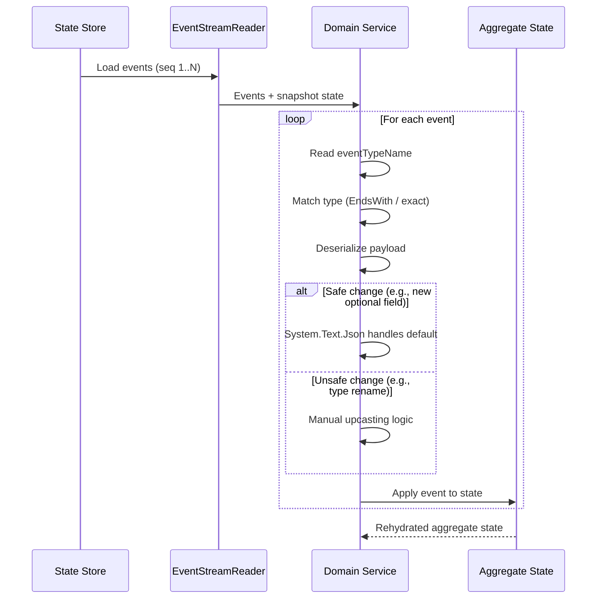

[← Back to Hexalith.EventStore](../../README.md)

# Event Versioning & Schema Evolution

Event versioning is the practice of managing changes to the structure of domain events over time — adding fields, renaming types, or splitting events — without breaking existing persisted data. Schema evolution is the broader strategy that governs how your system handles these changes safely. In an event-sourced system, events are immutable and stored forever, so every schema change must be backward-compatible: old events must remain readable by new code, indefinitely.

This guide explains Hexalith.EventStore's approach to event versioning, the metadata that enables it, and the manual strategies you use today to evolve event schemas safely. It covers the error-first contract, safe and unsafe change classifications, upcasting patterns, and version routing.

> **Prerequisites:**
>
> - [Event Envelope & Metadata](event-envelope.md) — the 11 metadata fields and envelope structure
> - [Command Lifecycle Deep Dive](command-lifecycle.md) — the processing pipeline that produces events
>
> **Key Terms:**
>
> - **Upcasting** — transforming an old event format to a new format during replay, so your current code can process events stored in an older shape
> - **Downcasting** — handling newer events in older consumers that do not understand the new format
> - **Rehydration** — rebuilding current aggregate state by replaying stored events from the beginning (or from a snapshot)
> - **Aggregate state** — the current state of a domain object, derived from its complete event history

## Why Error-First?

Before learning how to evolve events, you need to understand *why* Hexalith takes such a strict approach.

When `EventStreamReader` replays events to rehydrate aggregate state, it processes every event in the stream in strict sequence order. If an event's `eventTypeName` cannot be deserialized — because the class was renamed, deleted, or moved to a different namespace — Hexalith throws an `UnknownEventException`:

```text
UnknownEvent during state rehydration: sequence 42, type
'Hexalith.EventStore.Sample.Counter.Events.CounterIncremented',
aggregate tenant-a:counter:counter-1.
Domain service must maintain backward-compatible deserialization
for all event types.
```

The alternative — silently skipping unknown events — would produce incorrect aggregate state. If event #42 incremented a counter and you skip it, the current count is wrong by one. Every subsequent command decision is based on corrupted state. This is Architecture Decision D3: **skipping unknown events produces incorrect aggregate state**.

The recovery path is straightforward: redeploy the previous domain service version that can deserialize the event, or add a backward-compatible deserializer for the missing type.

This error-first contract applies to **all** event consumers — not just domain service rehydration. Projections, read models, and integration event subscribers must also handle every event type they consume. If a projection skips an unknown event, its read model diverges from the source of truth.

## The Versioning Metadata Foundation

Three of the 11 event envelope metadata fields form the versioning foundation. Each is set automatically by EventStore when persisting events — your domain service only returns the payload.

- **`domainServiceVersion`** — records which version of the domain service produced the event (e.g., `"v1"`, `"v2"`). This enables version-aware deserialization: consumers can detect which service version wrote the event and apply appropriate upcasting logic. Extracted from the command envelope's `domain-service-version` extension key; if the extension is absent, defaults to `"v1"`. The version format is `v{number}` (regex: `^v[0-9]+$`). See [Event Envelope — Versioning Fields](event-envelope.md) for the full field definition.

- **`eventTypeName`** — the fully qualified .NET type name of the event (e.g., `"Hexalith.EventStore.Sample.Counter.Events.CounterIncremented"`). This is the type identifier used for deserialization routing and the CloudEvents `type` attribute. **Once persisted, this value is immutable** — renaming a .NET class does not retroactively update stored type names. Event type names are scoped per-domain (two different domains can have `OrderCreated` without conflict), but within the same domain, type name uniqueness is the developer's responsibility. You can decouple the stored type name from the .NET class name using `ISerializedEventPayload.EventTypeName`. See [Event Envelope — Metadata Fields](event-envelope.md) for the full field definition.

- **`serializationFormat`** — the payload encoding format, currently always `"json"` with the default `System.Text.Json` serializer. This field exists to enable future incremental format migration (e.g., JSON to Protobuf) without a big-bang conversion. When `serializationFormat` changes for new events, consumers can branch deserialization logic per event. The `ISerializedEventPayload` interface allows custom serializers that may set a different format value. The safe/unsafe classifications in this guide assume the default JSON serializer. See [Event Envelope — Metadata Fields](event-envelope.md) for the full field definition.

## Common Schema Evolution Scenarios

The following table classifies common event schema changes as safe or unsafe. These classifications assume the default `System.Text.Json` serializer — custom serializers via `ISerializedEventPayload` may behave differently.

| Change | Safety | Explanation | Recommended Approach |
|--------|--------|-------------|----------------------|
| Add optional/nullable field | **SAFE** | `System.Text.Json` maps missing JSON properties to `default(T)` for value types, `null` for reference types | Use nullable types or provide sensible defaults |
| Add required field without default | **UNSAFE** | Old events lack the property; deserialization produces unexpected defaults that may break domain invariants | Always use default parameter values for new fields |
| Remove a field | **SAFE** | `System.Text.Json` ignores extra JSON properties by default | Old events with the removed field deserialize without error |
| Rename a .NET event class | **UNSAFE** | The persisted `eventTypeName` stores the fully qualified type name — old events become `UnknownEventException` | Keep old class as alias, or use `ISerializedEventPayload.EventTypeName` to decouple type name from class name |
| Move event to different namespace | **UNSAFE** | `eventTypeName` includes the full namespace — same breakage as a class rename | Same as rename: keep old class or decouple via `ISerializedEventPayload.EventTypeName` |
| Delete an event class | **UNSAFE** | **Never do this.** The class must exist as long as events of that type exist in any stream | Mark `[Obsolete]` instead; move to a `Events/Legacy/` folder to keep active code clean |
| Rename a field | **UNSAFE** | Old JSON key will not map to the new property name | Use `[JsonPropertyName("oldName")]` attribute to preserve backward compatibility |
| Change field type (widening) | **SAFE** | `int` → `long` is a silent, safe conversion | Widening conversions are handled automatically |
| Change field type (narrowing) | **UNSAFE** | `long` → `int` risks overflow | Avoid narrowing; use widening only |
| Change field type (cross-type) | **UNSAFE** | `int` → `string` or vice versa throws `JsonException` | Treat as a new field; keep old field with `[Obsolete]` |
| Add new enum member | **SAFE** (caution) | Old events are fine, but new events with the unknown member may confuse older consumers depending on `System.Text.Json` enum handling config | Ensure consumers handle unknown enum values gracefully |
| Split one event into two | **UNSAFE** | Old single events need upcasting logic to produce two new events | Requires explicit upcasting in your domain service |
| Merge two events into one | **UNSAFE** | Two old events need upcasting logic to merge | Requires explicit upcasting in your domain service |

**C# records caveat:** Records with constructor parameters require special attention. If a new field has no default value and no `[JsonConstructor]`-annotated parameterless path, deserialization of old events (which lack that JSON property) may throw. Best practice: **always use default parameter values for new record fields**.

```csharp
// SAFE: default parameter value handles old events missing this field
public sealed record CounterIncremented(int IncrementedBy = 1) : IEventPayload;

// UNSAFE: old events without "IncrementedBy" will fail to deserialize
public sealed record CounterIncremented(int IncrementedBy) : IEventPayload;
```

## Upcasting Strategies

Upcasting transforms old event payloads into a format your current code understands during deserialization or state replay. In Hexalith today, there is **no formal upcaster pipeline** (like EventStoreDB's `IEventUpcaster` or Marten's `IEventUpcaster`). The extension point is your domain service's state rehydration logic — the code that reads events and reconstructs aggregate state.

### The Simple Before/After

Imagine `CounterIncremented` v1 is a marker event with no fields. In v2, you add an `IncrementedBy` field to support increment-by-N:

**v1 (current):**

```csharp
public sealed record CounterIncremented : IEventPayload;
```

**v2 (evolved):**

```csharp
public sealed record CounterIncremented(int IncrementedBy = 1) : IEventPayload;
```

When old v1 events are replayed, the JSON payload is `{}` (empty object). `System.Text.Json` deserializes this to `CounterIncremented(IncrementedBy: 1)` because of the default parameter value. The state rehydration produces the correct count. No explicit upcasting code is needed — the safe schema change handles it automatically.

### Manual Upcasting via State Rehydration

For unsafe changes (renaming types, splitting events), you write explicit upcasting logic in your state rehydration code. The Counter sample demonstrates this pattern in [`CounterProcessor.cs`](../../samples/Hexalith.EventStore.Sample/Counter/CounterProcessor.cs):

```csharp
// From CounterProcessor.cs — real code, not idealized
private static void ApplyEventToCount(string eventTypeName, ref int countValue)
{
    if (eventTypeName.EndsWith("CounterIncremented", StringComparison.Ordinal))
    {
        countValue++;
        return;
    }

    if (eventTypeName.EndsWith("CounterDecremented", StringComparison.Ordinal))
    {
        countValue = Math.Max(0, countValue - 1);
        return;
    }

    if (eventTypeName.EndsWith("CounterReset", StringComparison.Ordinal))
    {
        countValue = 0;
    }
}
```

This code uses `EndsWith()` for type matching rather than exact string comparison. The trade-offs:

- **Why `EndsWith()`:** Resilience to namespace changes. If the event class moves from `MyApp.Events.CounterIncremented` to `MyApp.V2.Events.CounterIncremented`, the suffix still matches — the rehydration code does not break.
- **Risk:** Suffix collision. If two event types share the same suffix (e.g., `OrderItemIncremented` and `CounterIncremented` both end with `Incremented`), the match is ambiguous. In single-domain scenarios this is unlikely, but multi-domain assemblies could hit this.
- **Recommendation:** Use the most specific suffix possible. For production services with many event types, consider exact type name matching to eliminate ambiguity.

### Multi-Representation State Handling

The Counter sample also demonstrates handling multiple state representations during rehydration — a critical pattern when snapshot formats evolve:

```csharp
// From CounterProcessor.cs — handles null, typed, JSON, and enumerable state
private static int RehydrateCount(object? currentState)
{
    if (currentState is null)
        return 0;

    if (currentState is CounterState typedState)
        return typedState.Count;

    if (currentState is JsonElement json)
        return RehydrateCountFromJson(json);

    return RehydrateCountFromObjectEnumerable(currentState);
}
```

State arrives in different forms depending on context: `null` for new aggregates, a typed `CounterState` when deserialization succeeds directly, a `JsonElement` when the state store returns raw JSON, or an enumerable of events when replaying from an event array. Your rehydration code must handle all representations.

### Upcasting Flow



**The backward compatibility contract applies to all event consumers** — not just domain service rehydration, but also projections, read models, and integration subscribers. Every consumer that deserializes events must handle every event type it may encounter in the stream.

## Domain Service Version Routing

The `domainServiceVersion` metadata field enables running multiple versions of the same domain service simultaneously. This is how you deploy a new version of your domain logic without downtime and with instant rollback capability.

Version-based service resolution uses the DAPR configuration store:

- **Resolution key:** `{tenantId}:{domain}:{version}` (or `{tenantId}|{domain}|{version}` for config-friendly format)
- **Version format:** `v{number}` (regex: `^v[0-9]+$`, default: `v1`)
- **Version source:** extracted from the command envelope's `domain-service-version` extension key

The `DomainServiceResolver` checks static registrations first (for local dev and testing), then falls back to the DAPR config store for dynamic resolution.

### Deployment Checklist

1. **Deploy new service version** — deploy the v2 domain service alongside v1 (both running simultaneously)
2. **Update DAPR config store mapping** — set `{tenantId}:{domain}:v2` to point to the new service's app-id
3. **Verify routing with test command** — send a command with the `domain-service-version: v2` extension to confirm routing
4. **Monitor for `UnknownEventException` errors** — these indicate the new service cannot read events produced by the old version
5. **Rollback if needed** — update the config store mapping back to v1 (no redeployment required)

### Common Mistakes

- **Deploying v2 but forgetting to update config store mapping:** Commands still route to v1. The new service sits idle.
- **Config store eventual consistency:** During propagation, some instances may route to v1 and others to v2. Design your domain services for this window — both versions must be backward-compatible with all existing events.
- **Static fallback registration:** For critical domain services, configure a static registration in `appsettings.json` as a safety net when the config store is temporarily unavailable. See [Configuration Reference — Domain Services](../guides/configuration-reference.md) for the registration format.

## Counter Domain Versioning Example

This end-to-end walkthrough shows how to evolve the Counter domain by adding an `IncrementedBy` field to `CounterIncremented`.

### Step 1: The Current State

The Counter domain currently has a simple marker event:

```csharp
// Current: samples/Hexalith.EventStore.Sample/Counter/Events/CounterIncremented.cs
public sealed record CounterIncremented : IEventPayload;
```

State is tracked as a simple integer. The `CounterState` class applies events:

```csharp
// Current: samples/Hexalith.EventStore.Sample/Counter/State/CounterState.cs
public sealed class CounterState
{
    public int Count { get; private set; }
    public void Apply(CounterIncremented e) => Count++;
    public void Apply(CounterDecremented e) => Count--;
    public void Apply(CounterReset e) => Count = 0;
}
```

Existing events in the store look like:

```json
{
  "metadata": {
    "eventTypeName": "Hexalith.EventStore.Sample.Counter.Events.CounterIncremented",
    "domainServiceVersion": "v1",
    "serializationFormat": "json"
  },
  "payload": {}
}
```

### Step 2: Evolve the Event

Add the `IncrementedBy` field with a default value of `1` — this keeps old events backward-compatible:

```csharp
// Evolved: CounterIncremented with increment-by-N support
public sealed record CounterIncremented(int IncrementedBy = 1) : IEventPayload;
```

Old events with payload `{}` deserialize to `CounterIncremented(IncrementedBy: 1)` — the default handles the missing property.

### Step 3: Update State Application

```csharp
public sealed class CounterState
{
    public int Count { get; private set; }
    public void Apply(CounterIncremented e) => Count += e.IncrementedBy;
    public void Apply(CounterDecremented e) => Count--;
    public void Apply(CounterReset e) => Count = 0;
}
```

Old events replay with `IncrementedBy = 1`, producing the same state as before. New events carry the actual increment value.

### Step 4: Handle Snapshot State Evolution

Snapshots contain serialized aggregate state. When the state shape changes, old snapshots must remain deserializable. The `CounterProcessor` already demonstrates this with its multi-format `RehydrateCount()` method that handles null, typed, `JsonElement`, and enumerable representations.

For more complex state objects, the same principle applies: always handle the possibility that the deserialized state has a different shape than expected. Use nullable properties with defaults, and test backward compatibility by deserializing old-format state.

### Step 5: Deploy the New Version

1. Deploy the v2 Counter domain service
2. Update the DAPR config store: `tenant-a:counter:v2 → { "AppId": "counter-service-v2", ... }`
3. Send a test command with `domain-service-version: v2` extension
4. Verify v2 can rehydrate state from v1 events (old `CounterIncremented` with empty payload → `IncrementedBy = 1`)
5. Monitor for errors; rollback to v1 via config store if needed

### Step 6: Verify Backward Compatibility

Recommended testing strategy: replay synthetic old-format events and assert correct state reconstruction.

```csharp
[Fact]
public void OldEventsRehydrateCorrectly()
{
    var state = new CounterState();

    // Simulate old v1 event (no IncrementedBy field)
    state.Apply(new CounterIncremented()); // IncrementedBy defaults to 1

    state.Count.ShouldBe(1);
}

[Fact]
public void NewEventsUseIncrementValue()
{
    var state = new CounterState();

    state.Apply(new CounterIncremented(IncrementedBy: 5));

    state.Count.ShouldBe(5);
}
```

> **Note:** The Counter domain is intentionally simple. For complex domain models with nested objects, collections, or polymorphic types, the same patterns apply but pay extra attention to nested deserialization and `System.Text.Json` converter behavior.

## What's Coming (v3 Roadmap)

The following features are planned for v3 but **do not exist today**. This section is included for transparency about the project's direction — do not depend on these features for current implementations.

**Planned v3 tooling:**

- **Upcasting framework** — a formal `IEventUpcaster` pipeline for transforming old event formats to new ones automatically during replay
- **Schema registry** — a centralized catalog of event schemas with version tracking and compatibility validation
- **Migration tooling** — automated tools for batch event stream migration and schema evolution DSL
- **Auto-versioning** — automatic version detection based on payload schema changes

**What exists today:**

- The three versioning metadata fields (`domainServiceVersion`, `eventTypeName`, `serializationFormat`)
- Version-based domain service routing via DAPR config store
- The error-first contract (`UnknownEventException`)
- Manual upcasting via domain service state rehydration logic

The manual approach works well for small-to-medium domains, but becomes harder to maintain past approximately 10 evolving event types. The v3 tooling addresses this real scaling limitation — not a theoretical one.

**Envelope versioning note:** Changes to the event envelope schema between Hexalith major versions are treated as **major version bumps**. EventStore guarantees backward-compatible reading of all previously persisted envelopes within a major version line.

## Next Steps

- **Next:** [Event Envelope & Metadata](event-envelope.md) — the complete envelope structure and all 11 metadata fields
- **Related:** [Identity Scheme](identity-scheme.md) — how tenant, domain, and aggregate IDs map to actors, streams, and topics
- **Related:** [Your First Domain Service](../getting-started/first-domain-service.md) — step-by-step tutorial for building a domain service
