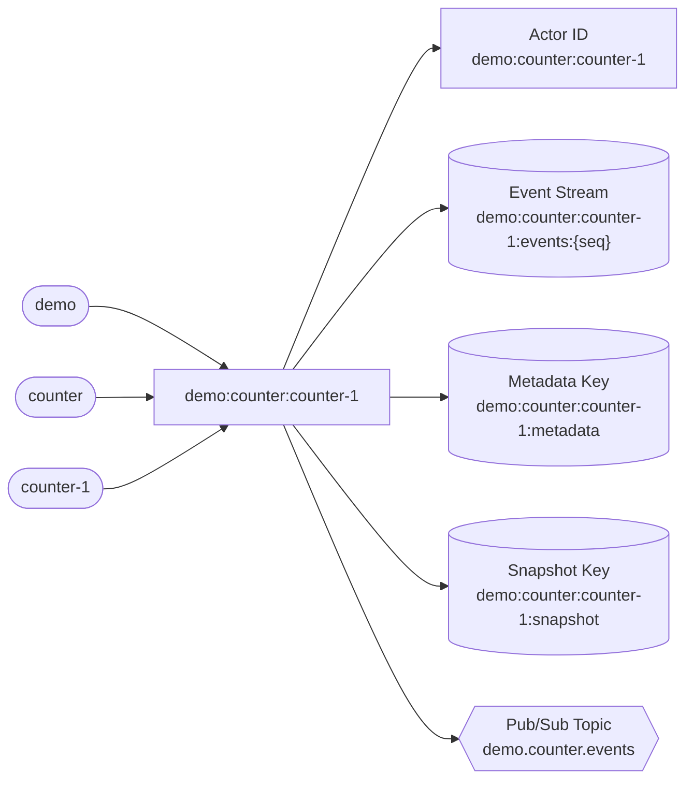

[← Back to Hexalith.EventStore](../../README.md)

# Identity Scheme

Every aggregate in Hexalith.EventStore is addressed by three simple values — a tenant ID, a domain name, and an aggregate ID. These three values are the single source of truth from which the EventStore derives every infrastructure key, actor address, event stream, and pub/sub topic in the system. You never configure keys, topics, or actor addresses manually — the EventStore derives all of them automatically from this identity triple.

This page explains the identity structure, validation rules that prevent cross-tenant key collisions, and the complete mapping from identity components to infrastructure — so you know exactly how your domain identifiers translate into state store keys, actor addresses, and topic names. By the end, you will understand why every key in the system starts with the same three values, how validation rules guarantee structural isolation between tenants, and what the `AggregateIdentity` type looks like in code.

> **Prerequisites:**
>
> - [Architecture Overview](architecture-overview.md) — DAPR topology and building blocks
> - [Event Envelope & Metadata](event-envelope.md) — the `aggregateId` metadata field that carries the canonical identity form

## The Three Components

An aggregate identity consists of three components:

- **Tenant ID** — which tenant owns this data (e.g., `demo`)
- **Domain** — which business domain this aggregate belongs to (e.g., `counter`)
- **Aggregate ID** — the specific instance within that domain (e.g., `counter-1`)

The canonical form combines these three values with colon separators: `{tenantId}:{domain}:{aggregateId}` — for example, `demo:counter:counter-1`. These three values are the single source of truth from which every infrastructure key, actor address, event stream, and pub/sub topic is derived. Every key you see in the DAPR state store, every actor address on the DAPR dashboard, and every pub/sub topic name traces back to this triple.

Colons are used as separators because colons are forbidden in all three components (enforced by validation at construction time). This makes the composite structurally unambiguous — you can always split on colons to recover the original three parts without ambiguity. There is no escaping needed and no edge cases to worry about — the colon separator is guaranteed safe by construction.

You'll encounter these identity values in event envelope metadata (the `aggregateId` field you saw in [Event Envelope & Metadata](event-envelope.md)), DAPR dashboard actor lists, state store key prefixes when browsing your database, and pub/sub topic names when configuring subscriptions.

## Validation Rules

Each component has strict validation rules enforced at construction time:

| Component     | Allowed Characters                        | Regex                                        | Max Length | Case                | Example                       |
| ------------- | ----------------------------------------- | -------------------------------------------- | ---------- | ------------------- | ----------------------------- |
| `tenantId`    | Lowercase alphanumeric + hyphens          | `^[a-z0-9]([a-z0-9-]*[a-z0-9])?$`            | 64 chars   | Forced to lowercase | `demo`, `tenant-a`            |
| `domain`      | Lowercase alphanumeric + hyphens          | `^[a-z0-9]([a-z0-9-]*[a-z0-9])?$`            | 64 chars   | Forced to lowercase | `counter`, `order-management` |
| `aggregateId` | Alphanumeric + dots, hyphens, underscores | `^[a-zA-Z0-9]([a-zA-Z0-9._-]*[a-zA-Z0-9])?$` | 256 chars  | Case-sensitive      | `counter-1`, `order.2024.001` |

Colons, control characters (below 0x20), and non-ASCII characters (above 0x7F) are all rejected in every component. The security motivation is straightforward: by rejecting colons in individual components, the colon-separated composite key is structurally unambiguous. By rejecting control characters and non-ASCII, the system prevents encoding-based injection attacks. The result is that no tenant can craft an ID that overlaps with another tenant's key space — two tenants with identically named aggregates produce structurally disjoint keys because the tenant prefix is always different.

Note that `tenantId` and `domain` are forced to lowercase on construction, while `aggregateId` preserves case. This means `Demo` and `demo` resolve to the same tenant, but `Counter-1` and `counter-1` are distinct aggregate IDs. The lowercase normalization on tenant and domain prevents case-variant collisions in state store keys and topic names.

Validation happens at construction time in the `AggregateIdentity` record — if any component violates these rules, an `ArgumentException` is thrown immediately. You never need to validate identity components yourself — the constructor enforces all rules before the identity can be used anywhere in the system.

## How Identity Maps to Infrastructure

The core idea of the identity scheme is that three input values produce every infrastructure address in the system. You never configure state store keys, actor addresses, or topic names manually — the EventStore computes them all from `AggregateIdentity`.

The flowchart below shows this derivation visually. The three identity components flow from the left into the composite identity, which then fans out to every derived key on the right. Different shapes distinguish different infrastructure types: round edges for inputs, rectangles for computed addresses, cylinders for state store keys, and hexagons for pub/sub topics.



<details>
<summary>Text description of identity-to-infrastructure mapping</summary>

The diagram shows the identity-to-infrastructure derivation as a left-to-right flow with 9 nodes.

Three input nodes on the left represent the identity components: Tenant ID (demo, shown as a rounded node), Domain (counter, shown as a rounded node), and Aggregate ID (counter-1, shown as a rounded node). All three flow into a central composite identity node (shown as a rectangle) displaying the canonical form demo:counter:counter-1.

From the composite identity, five derived outputs fan out to the right:

- Actor ID: demo:counter:counter-1 (shown as a rectangle, representing a computed address)
- Event Stream key: demo:counter:counter-1:events:{seq} (shown as a cylinder, representing state store data)
- Metadata key: demo:counter:counter-1:metadata (shown as a cylinder)
- Snapshot key: demo:counter:counter-1:snapshot (shown as a cylinder)
- Pub/Sub Topic: demo.counter.events (shown as a hexagon, representing messaging infrastructure)

Each shape type distinguishes the infrastructure category without relying on color: round edges for identity inputs, rectangles for computed addresses, cylinders for state store keys, and hexagons for pub/sub topics.

</details>

### Key Derivation Table

Every infrastructure key is derived from the three identity components. The table below lists every key pattern, its concrete Counter domain example, and the separator convention it follows.

State store keys use colons (matching the canonical identity form), while pub/sub topics use dots (matching DAPR topic naming conventions). The separator distinction is intentional: colons create a hierarchical key structure suitable for state store prefix queries, while dots match DAPR's topic naming conventions for pub/sub routing. Both are structurally disjoint by tenant by design.

| Purpose             | Pattern                                              | Example                                        | Separator |
| ------------------- | ---------------------------------------------------- | ---------------------------------------------- | --------- |
| Actor ID            | `{tenant}:{domain}:{aggId}`                          | `demo:counter:counter-1`                       | colons    |
| Event Stream        | `{tenant}:{domain}:{aggId}:events:{seq}`             | `demo:counter:counter-1:events:1`              | colons    |
| Metadata            | `{tenant}:{domain}:{aggId}:metadata`                 | `demo:counter:counter-1:metadata`              | colons    |
| Snapshot            | `{tenant}:{domain}:{aggId}:snapshot`                 | `demo:counter:counter-1:snapshot`              | colons    |
| Pipeline Checkpoint | `{tenant}:{domain}:{aggId}:pipeline:{correlationId}` | `demo:counter:counter-1:pipeline:550e8400-...` | colons    |
| Pub/Sub Topic       | `{tenant}.{domain}.events`                           | `demo.counter.events`                          | dots      |
| Dead-Letter Topic   | `deadletter.{tenant}.{domain}.events`                | `deadletter.demo.counter.events`               | dots      |

The pipeline checkpoint key (`{tenant}:{domain}:{aggId}:pipeline:{correlationId}`) is used internally by the AggregateActor to track in-flight command processing stages. It is an implementation detail of the command pipeline described in the [Command Lifecycle Deep Dive](command-lifecycle.md) — you will not interact with it directly as a domain service developer.

The dead-letter topic prefix (`deadletter`) is a configurable default in `EventPublisherOptions` — you can change it for your deployment, but the structural pattern remains the same. Whether you use the default prefix or a custom one, the topic still starts with the tenant ID after the prefix, maintaining the tenant isolation guarantee.

Every identity-derived key and topic in this table starts with the tenant, which means a simple prefix query can retrieve all data for a given tenant — essential for tenant management operations. For example, querying keys that start with `acme:` returns every event stream, snapshot, and metadata record belonging to tenant `acme`, regardless of which domain or aggregate they belong to. Similarly, querying keys that start with `acme:counter:` narrows to a specific domain within a tenant, and `acme:counter:counter-1:` narrows to a single aggregate's complete state. One deliberate exception exists in actor-scoped state: idempotency records use `idempotency:{causationId}` and rely on actor ID scoping (which already embeds the tenant) for isolation.

The event stream key includes a gapless sequence number suffix (`:events:1`, `:events:2`, etc.) that provides strict ordering within each aggregate stream. The metadata key tracks the current sequence watermark — the highest sequence number persisted so far. The snapshot key stores periodic aggregate state snapshots that speed up state rehydration when the event stream grows long. These patterns are described in detail in the [Event Envelope & Metadata](event-envelope.md) page.

## Multi-Tenant Isolation

Multi-tenancy is a first-class concern in Hexalith.EventStore — it is not an afterthought or an optional add-on. The identity scheme enforces tenant isolation through four complementary layers, each providing defense-in-depth:

1. **Input validation** — colons, control characters, and non-ASCII are rejected at construction, making tenant key spaces structurally disjoint. No tenant can craft an identity that produces keys overlapping with another tenant's key space. This is a construction-time guarantee — invalid identities cannot exist in the system, not even temporarily.

2. **Composite key prefixing** — every state store key and pub/sub topic starts with the tenant ID, scoping all data to a single tenant. A query for `acme:*` will never return data belonging to `globex`, regardless of how the underlying state store implements key lookups.

3. **DAPR Actor scoping** — each actor instance's state is scoped by DAPR to its actor ID, which embeds the tenant. Two actors with different tenant prefixes can never read each other's state. The DAPR actor runtime enforces this scoping at the infrastructure level — your code does not need to implement any tenant checks for state store access.

4. **JWT tenant enforcement** — the Command API validates JWT claims at entry, and the AggregateActor re-validates tenant ownership as defense-in-depth (Step 2 of the pipeline described in the [Command Lifecycle Deep Dive](command-lifecycle.md)). Even if a request bypasses the API gateway, the actor-level check prevents cross-tenant command processing.

To make this concrete: tenant `acme` and tenant `globex` can both have a `counter-1` aggregate in the `counter` domain. Their actor IDs are `acme:counter:counter-1` and `globex:counter:counter-1` — structurally different, with zero overlap in state store keys or pub/sub topics. Tenant `acme`'s events go to topic `acme.counter.events`, while tenant `globex`'s events go to `globex.counter.events`. Their event streams, snapshots, and metadata all live under different key prefixes. There is no configuration needed to achieve this isolation — it is a structural property of the identity scheme itself.

This is the isolation guarantee referenced in the [Architecture Overview](architecture-overview.md) and enforced at every layer of the command processing pipeline.

## AggregateIdentity in Code

Everything described so far — the three components, validation, key derivation, and tenant isolation — is encapsulated in a single type. The following is a simplified, illustrative version of the `AggregateIdentity` record that shows the key computed properties. The actual source includes additional properties (such as `PipelineKeyPrefix` and `QueueSession`) and full validation logic in the constructor, but this captures the essential derivation pattern:

```csharp
public record AggregateIdentity(string TenantId, string Domain, string AggregateId)
{
    public string ActorId => $"{TenantId}:{Domain}:{AggregateId}";
    public string EventStreamKeyPrefix => $"{TenantId}:{Domain}:{AggregateId}:events:";
    public string MetadataKey => $"{TenantId}:{Domain}:{AggregateId}:metadata";
    public string SnapshotKey => $"{TenantId}:{Domain}:{AggregateId}:snapshot";
    public string PubSubTopic => $"{TenantId}.{Domain}.events";
}
```

As a domain service developer, you never construct `AggregateIdentity` yourself — the `CommandRouter` creates it via `new AggregateIdentity(command.Tenant, command.Domain, command.AggregateId)`, and every `CommandEnvelope` also exposes a computed `AggregateIdentity` property that constructs the identity on the fly. The EventStore derives all keys from it automatically. Your domain service's `Handle` method receives the command and current state — the identity is already resolved and all infrastructure keys are already derived before your code runs.

The `ToString()` method returns the canonical `ActorId` form, so you'll see identities logged as `demo:counter:counter-1` in structured log output and OpenTelemetry traces. This is the same form stored in the `aggregateId` field of every [event envelope](event-envelope.md).

## Connecting the Dots

In the [Event Envelope & Metadata](event-envelope.md) page, you saw the `aggregateId` metadata field containing the canonical `tenant:domain:aggregateId` form. Now you know why: that single string encodes the complete identity from which every state key, topic, and actor address is derived. The identity scheme is the bridge between your domain model (tenants, domains, aggregate instances) and the infrastructure that stores and distributes events.

Three design principles run through the identity scheme:

- **Single source of truth:** Three input values derive every infrastructure address — no manual key configuration, no chance of mismatch. If you know the tenant, domain, and aggregate ID, you can predict every key and topic in the system without looking at configuration.

- **Structural isolation:** Validation rules guarantee that tenant key spaces can never overlap, regardless of aggregate naming. This is a mathematical property of the scheme — not a runtime check that could be bypassed.

- **Zero developer burden:** The EventStore derives all keys automatically — domain service authors never construct identities, keys, or topic names. You write business logic; the EventStore handles addressing.

When you configure DAPR components for production deployment, the key patterns from this page determine how your state store must be partitioned and how your pub/sub topics must be organized. Deployment guides will cover the infrastructure side.

Understanding the identity scheme is fundamental because it connects your domain model to every infrastructure concern in the system. Whether you are debugging an event stream in the state store, configuring pub/sub subscriptions, monitoring actors on the DAPR dashboard, or designing a multi-tenant deployment, the identity triple is always the starting point.

## Next Steps

- **Next:** [Choose the Right Tool](choose-the-right-tool.md) — compare Hexalith against alternatives and understand DAPR trade-offs
- **Related:** [Event Envelope & Metadata](event-envelope.md), [Architecture Overview](architecture-overview.md), [Command Lifecycle Deep Dive](command-lifecycle.md)
