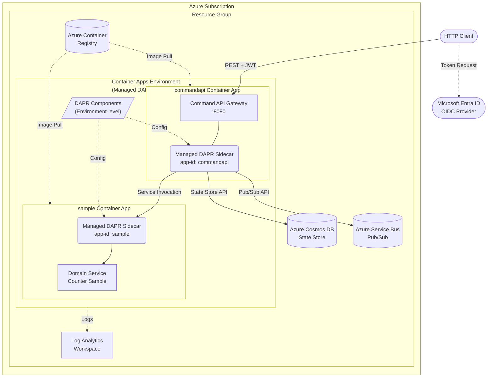

[← Back to Hexalith.EventStore](../../README.md)

# Azure Container Apps Deployment Guide

Deploy the Hexalith.EventStore sample application to Azure Container Apps with Azure-managed DAPR sidecars, Bicep infrastructure-as-code, and managed identity for secrets. This guide uses the .NET Aspire ACA publisher to generate Bicep modules, then adds DAPR configuration and Azure-native authentication for a production-ready cloud deployment. It is intended for operators and developers who have completed the [Docker Compose Deployment Guide](deployment-docker-compose.md) and [Kubernetes Deployment Guide](deployment-kubernetes.md) and want to run the system in Azure's serverless container platform.

> **Prerequisites:** [Prerequisites](../getting-started/prerequisites.md) — .NET 10 SDK, Aspire CLI, plus Azure-specific tools listed below

## What You Already Know

If you followed the [Docker Compose Deployment Guide](deployment-docker-compose.md) and [Kubernetes Deployment Guide](deployment-kubernetes.md), you already understand:

- **Aspire publisher workflow** — generating deployment manifests from the AppHost topology definition
- **DAPR building blocks** — state store, pub/sub, service invocation, and actor placement
- **Health endpoints** — `/health`, `/alive`, and `/ready` for verifying system readiness
- **Backend swap** — changing state store or pub/sub by swapping DAPR component configuration with zero code changes
- **Domain service isolation** — domain services have zero infrastructure access (D4)

**What's new in Azure Container Apps:**

| Concept | Docker Compose / Kubernetes | Azure Container Apps |
|---------|---------------------------|---------------------|
| DAPR sidecar | Manual containers / Operator-injected | **Azure-managed** — enable per app, no operator install |
| Component config | File-mounted YAML / K8s CRDs | **Environment-level ACA resources** (simplified schema) |
| Secret management | `.env` files / K8s Secrets | **Managed identity + Azure Key Vault** (no connection strings needed for Azure services) |
| Networking | Docker network / K8s Service DNS | **Container Apps Environment internal DNS** |
| Authentication | Keycloak / External OIDC | **Entra ID (Azure AD)** — native Azure integration |
| Scaling | Manual / HPA+KEDA | **Built-in scaling rules** + KEDA (scale-to-zero for non-actor apps) |
| Health probes | Docker HEALTHCHECK / K8s probes | **ACA probes** (same schema as Kubernetes) |
| Manifest source | docker-compose.yaml / Helm chart | **Bicep modules** (infrastructure-as-code) |
| mTLS | Not available / DAPR Sentry (manual) | **Azure-managed** (automatic, zero configuration) |
| IaC | docker-compose.yaml / Helm+kubectl | **Bicep / ARM templates** |
| DAPR install | `dapr init` / `dapr init -k` | **None** — Azure manages the DAPR runtime |

## What You'll Deploy

The Azure Container Apps deployment includes the Command API Gateway, the Counter sample domain service, Azure-managed DAPR sidecars, Azure Cosmos DB (state store), Azure Service Bus (pub/sub), Azure Container Registry, and Entra ID for OIDC authentication.



<details>
<summary>Deployment topology text description</summary>

The diagram shows the Azure Container Apps deployment topology for Hexalith.EventStore.

An HTTP Client obtains JWT tokens from Microsoft Entra ID (the OIDC provider) and sends authenticated REST requests to the Command API Gateway.

Within an Azure Subscription, a Resource Group contains all deployment resources:

1. **Container Apps Environment** with managed DAPR: The central hosting environment that provides built-in DAPR runtime management, internal DNS for service-to-service communication, and automatic mTLS between container apps.

2. **commandapi Container App**: Runs the Command API Gateway on port 8080 with an Azure-managed DAPR sidecar (app-id: commandapi). The sidecar handles all infrastructure interactions: persisting events and actor state to Azure Cosmos DB via the state store building block, publishing domain events to Azure Service Bus via the pub/sub building block, and invoking the sample domain service through DAPR service invocation.

3. **sample Container App**: Runs the Counter Sample domain service with its own Azure-managed DAPR sidecar (app-id: sample). The sample sidecar receives service invocation calls from the commandapi sidecar. The sample domain service has zero infrastructure access — it cannot read or write to the state store or pub/sub (D4).

4. **DAPR Components**: Configured at the Container Apps Environment level (not per-app). These define the state store (Cosmos DB) and pub/sub (Service Bus) connections with component scoping to restrict access to commandapi only.

5. **Azure Container Registry (ACR)**: Stores the container images for both container apps.

6. **Azure Cosmos DB**: External state store for event streams, snapshots, actor state, and command status.

7. **Azure Service Bus**: External pub/sub for event distribution with per-tenant-per-domain topic isolation.

8. **Log Analytics Workspace**: Collects container logs, DAPR sidecar logs, and system metrics.

Azure manages the DAPR sidecar lifecycle, health, updates, and mTLS certificates automatically — no DAPR operator installation, no Sentry configuration, no certificate rotation to manage.

</details>

## Prerequisites

Before starting, ensure you have the following:

- **Azure subscription** — with Contributor role on the target resource group
- **Azure CLI** — version 2.60 or later (`az --version` to check)
- **.NET 10 SDK** — version 10.0.103 or later (`dotnet --version` to check)
- **Aspire CLI** — install as a global tool if not already present:

    ```bash
    dotnet tool install -g Aspire.Cli
    ```

- **DAPR CLI** — version 1.14 or later, for local testing only (`dapr --version` to check)

### Azure-Specific Setup

Log in to Azure and install the Container Apps extension:

```bash
az login
az extension add --name containerapp --upgrade
```

Register the required resource providers (one-time per subscription):

```bash
az provider register -n Microsoft.App
az provider register -n Microsoft.OperationalInsights
```

> **Minimum Azure roles needed:** Contributor on the resource group. For managed identity role assignments, you also need User Access Administrator or Owner on the target resources (Cosmos DB, Service Bus).

## Generate Azure Deployment Artifacts

The Aspire AppHost includes an Azure Container Apps publisher that generates Bicep modules from the Aspire topology definition. The `Aspire.Hosting.Azure.AppContainers` package (v13.1.2) is a **stable** (GA) package — unlike the Kubernetes and Docker publishers which are preview.

```bash
PUBLISH_TARGET=aca EnableKeycloak=false aspire publish --project src/Hexalith.EventStore.AppHost/Hexalith.EventStore.AppHost.csproj -o ./publish-output/azure
```

> **PowerShell (Windows):**
>
> ```powershell
> $env:PUBLISH_TARGET='aca'; $env:EnableKeycloak='false'; aspire publish --project src/Hexalith.EventStore.AppHost/Hexalith.EventStore.AppHost.csproj -o ./publish-output/azure
> ```

**Important:** `EnableKeycloak=false` is **required**. Azure Container Apps does not support Keycloak bind mounts for realm import. Production ACA deployments must use an external OIDC provider (Entra ID recommended).

### Expected Generated Structure

The publisher generates Bicep modules with this general structure:

```text
publish-output/azure/
  main.bicep                    # Subscription-scoped orchestrator
  main.parameters.bicepparam    # Parameter file with defaults
  commandapi/
    commandapi.module.bicep     # Container App definition for commandapi
  sample/
    sample.module.bicep         # Container App definition for sample
  acr/
    acr.module.bicep            # Azure Container Registry
  cae/
    cae.module.bicep            # Container Apps Environment
  law/
    law.module.bicep            # Log Analytics Workspace
```

> **Note:** Exact structure depends on the Aspire SDK version (currently 13.1.x). Always inspect the generated output before deploying.

### What Needs Manual Configuration

The generated Bicep handles infrastructure provisioning but does **not** include DAPR configuration (confirmed gap — see [DAPR Configuration Gap](#dapr-configuration-gap)). You need to manually configure:

- **DAPR settings** on each container app (app-id, app-port, protocol)
- **DAPR components** in the Container Apps Environment (state store, pub/sub)
- **Environment variables** for authentication (Entra ID settings)
- **Bicep parameters** — resource group name, location, container image tags

## Provision Azure Infrastructure

### Approach A: Deploy Aspire-Generated Bicep (Recommended)

Deploy the generated Bicep to create all infrastructure resources at once:

```bash
az deployment group create \
  --resource-group <your-resource-group> \
  --template-file ./publish-output/azure/main.bicep \
  --parameters ./publish-output/azure/main.parameters.bicepparam
```

> **PowerShell:**
>
> ```powershell
> az deployment group create `
>   --resource-group <your-resource-group> `
>   --template-file ./publish-output/azure/main.bicep `
>   --parameters ./publish-output/azure/main.parameters.bicepparam
> ```

**Note:** If the resource group does not exist, create it first:

```bash
az group create --name <your-resource-group> --location <region>
```

### Approach B: Step-by-Step Azure CLI (Alternative)

For more control, provision resources individually:

```bash
# Create resource group
az group create --name hexalith-rg --location eastus

# Create Container Apps Environment with DAPR enabled
az containerapp env create \
  --name hexalith-env \
  --resource-group hexalith-rg \
  --location eastus \
  --enable-dapr

# Create Azure Container Registry
az acr create \
  --name hexalithacr \
  --resource-group hexalith-rg \
  --sku Basic \
  --admin-enabled true

# Verify the environment
az containerapp env show \
  --name hexalith-env \
  --resource-group hexalith-rg \
  --query "{name:name, provisioningState:provisioningState, daprEnabled:properties.daprConfiguration}" \
  -o table
```

Both approaches produce a Container Apps Environment with DAPR enabled and a Log Analytics workspace connected.

## Build and Push Container Images

Build container images using the .NET SDK container publishing feature (no Dockerfile required) and push them to Azure Container Registry.

```bash
# Log in to ACR
az acr login --name hexalithacr

# Build container images
dotnet publish src/Hexalith.EventStore.CommandApi/Hexalith.EventStore.CommandApi.csproj --os linux --arch x64 -t:PublishContainer -p:ContainerRepository=hexalithacr.azurecr.io/hexalith-commandapi -p:ContainerImageTag=latest
dotnet publish samples/Hexalith.EventStore.Sample/Hexalith.EventStore.Sample.csproj --os linux --arch x64 -t:PublishContainer -p:ContainerRepository=hexalithacr.azurecr.io/hexalith-sample -p:ContainerImageTag=latest

# Push to ACR
docker push hexalithacr.azurecr.io/hexalith-commandapi:latest
docker push hexalithacr.azurecr.io/hexalith-sample:latest
```

> **Note:** When using the Aspire-generated Bicep with approach A, the deployment automatically creates an ACR and can be configured to build and push images as part of the deployment. Check the generated Bicep parameters for image configuration options.

## Configure DAPR Components in Azure Container Apps

Azure Container Apps has **native managed DAPR** support. Components are configured at the Container Apps Environment level using a **simplified schema** — this is different from Kubernetes CRDs and Docker file-mounted YAML.

### DAPR Configuration Gap

The Aspire ACA publisher does **not** generate DAPR configuration. The `WithDaprSidecar()` calls from `CommunityToolkit.Aspire.Hosting.Dapr` are effective for local development only. The generated Bicep will not include:

- `dapr: { enabled: true, appId: 'commandapi', ... }` in container app configuration
- `Microsoft.App/managedEnvironments/daprComponents` resources

**Workaround:** Configure DAPR via post-deployment CLI commands (recommended) or supplementary Bicep modules.

### ACA Component Schema

ACA DAPR components use a simplified schema compared to standard DAPR YAML. The `apiVersion`, `kind`, and `namespace` fields are **stripped**. Components use `componentType`, `version`, `metadata`, and `scopes` at the top level.

Standard DAPR YAML (Kubernetes/Docker):

```yaml
apiVersion: dapr.io/v1alpha1
kind: Component
metadata:
  name: statestore
spec:
  type: state.azure.cosmosdb
  version: v1
  metadata:
    - name: url
      value: "https://mycosmosdb.documents.azure.com:443/"
scopes:
  - commandapi
```

ACA equivalent (simplified schema):

```yaml
componentType: state.azure.cosmosdb
version: v1
metadata:
  - name: url
    value: "https://mycosmosdb.documents.azure.com:443/"
  - name: database
    value: "eventstore"
  - name: collection
    value: "actorstate"
  - name: azureClientId
    value: "<managed-identity-client-id>"
scopes:
  - commandapi
```

### State Store: Azure Cosmos DB (Tier 1 — Recommended)

Create the state store DAPR component using Azure CLI:

```bash
az containerapp env dapr-component set \
  --name hexalith-env \
  --resource-group hexalith-rg \
  --dapr-component-name statestore \
  --yaml - <<'EOF'
componentType: state.azure.cosmosdb
version: v1
metadata:
  - name: url
    value: "https://<your-cosmosdb-account>.documents.azure.com:443/"
  - name: database
    value: "eventstore"
  - name: collection
    value: "actorstate"
  - name: actorStateStore
    value: "true"
  - name: azureClientId
    value: "<managed-identity-client-id>"
scopes:
  - commandapi
EOF
```

> **Managed identity (recommended):** The `azureClientId` metadata field authenticates to Cosmos DB using managed identity — no connection strings or keys needed. For system-assigned identity, omit `azureClientId` entirely. See [Managed Identity for Secrets](#managed-identity-for-secrets-recommended) for setup.

### Pub/Sub: Azure Service Bus (Tier 1 — Recommended)

```bash
az containerapp env dapr-component set \
  --name hexalith-env \
  --resource-group hexalith-rg \
  --dapr-component-name pubsub \
  --yaml - <<'EOF'
componentType: pubsub.azure.servicebus.topics
version: v1
metadata:
  - name: azureClientId
    value: "<managed-identity-client-id>"
  - name: namespaceName
    value: "<your-servicebus-namespace>.servicebus.windows.net"
  - name: enableDeadLetter
    value: "true"
  - name: deadLetterTopic
    value: "deadletter"
scopes:
  - commandapi
EOF
```

> **Note:** Azure Service Bus does not auto-create topics. Pre-create topics matching the `{tenant}.{domain}.events` pattern before sending commands.

### Resiliency

```bash
az containerapp env dapr-component set \
  --name hexalith-env \
  --resource-group hexalith-rg \
  --dapr-component-name resiliency \
  --yaml - <<'EOF'
componentType: resiliency
version: v1
metadata: []
EOF
```

> **Note:** The resiliency policies from `deploy/dapr/resiliency.yaml` need to be translated to ACA's simplified schema. Consult the [DAPR resiliency documentation](https://docs.dapr.io/operations/resiliency/) for ACA-compatible configuration.

### Component Scoping

All DAPR components include `scopes: ['commandapi']` to restrict access. Only the `commandapi` app-id can access the state store and pub/sub — domain services have zero infrastructure access (D4).

### Access Control: ACA-Equivalent Security

**Critical:** The `accesscontrol.yaml` from `deploy/dapr/` is a DAPR **Configuration** kind (not a Component kind) and is **not supported** in Azure Container Apps. ACA provides equivalent security through different mechanisms:

| DAPR Configuration (K8s/Docker) | ACA Equivalent |
|-------------------------------|---------------|
| `accesscontrol.yaml` deny-by-default policies | **Component scoping** via `scopes` field on each component |
| DAPR Sentry mTLS certificates | **Azure-managed mTLS** (automatic between container apps in the same environment) |
| Trust domain and namespace config | **ACA network isolation** (container apps in the same environment communicate securely by default) |

This provides equivalent or better security posture with zero configuration overhead.

### Managed Identity for Secrets (Recommended)

Azure Container Apps supports managed identity natively. For Azure-native backends (Cosmos DB, Service Bus, Key Vault), use managed identity instead of connection strings — this is more secure than the Kubernetes `secretKeyRef` approach.

**Priority for secret management in ACA:**

1. **Managed identity** for Azure services (Cosmos DB, Service Bus, Key Vault) — no secrets to manage
2. **Azure Key Vault secret store** for non-Azure services — secrets stored centrally
3. **ACA secrets** as last resort — stored in the container app configuration

**System-assigned identity** (simpler for single-app scenarios):

Omit `azureClientId` from DAPR component metadata — the sidecar uses the app's system identity automatically.

**User-assigned identity** (for multi-app shared access):

Set `azureClientId` to the managed identity client ID in each DAPR component's metadata.

**Required role assignments for managed identity:**

| Azure Service | Required Role | Scope |
|---------------|---------------|-------|
| Azure Cosmos DB | Cosmos DB Built-in Data Contributor | Cosmos DB account |
| Azure Service Bus | Azure Service Bus Data Sender + Data Receiver | Service Bus namespace |
| Azure Key Vault | Key Vault Secrets User | Key Vault |

### Supported Component Tiers

| Tier | Components | Support Level |
|------|-----------|--------------|
| **Tier 1** (fully supported) | `state.azure.cosmosdb`, `state.azure.tablestorage`, `pubsub.azure.servicebus.topics`, `secretstores.azure.keyvault` | Full Microsoft support |
| **Tier 2** (lower priority) | `state.postgresql`, `state.redis`, `pubsub.kafka` | Community support, lower priority fixes |

## Configure DAPR Settings on Container Apps

Each container app needs DAPR enabled individually with app-specific settings.

### Enable DAPR on commandapi

```bash
az containerapp dapr enable \
  --name commandapi \
  --resource-group hexalith-rg \
  --dapr-app-id commandapi \
  --dapr-app-port 8080 \
  --dapr-app-protocol http
```

### Enable DAPR on sample

```bash
az containerapp dapr enable \
  --name sample \
  --resource-group hexalith-rg \
  --dapr-app-id sample \
  --dapr-app-port 8080 \
  --dapr-app-protocol http
```

### Bicep Alternative

If using Bicep, add the DAPR configuration block to each container app resource:

```bicep
resource commandapi 'Microsoft.App/containerApps@2025-01-01' = {
  // ... existing properties
  properties: {
    configuration: {
      dapr: {
        enabled: true
        appId: 'commandapi'
        appPort: 8080
        appProtocol: 'http'
      }
    }
  }
}
```

> **Note:** No DAPR operator installation is needed. Azure manages the DAPR sidecar lifecycle, health checks, and runtime updates automatically.

## Configure External OIDC Authentication (Entra ID)

Azure Container Apps deployments should use Microsoft Entra ID (Azure AD) for OIDC authentication. Keycloak is not available in ACA (bind mounts for realm import are not supported).

### Create an Entra ID App Registration

1. Navigate to **Microsoft Entra ID** → **App registrations** → **New registration** in the Azure Portal
2. Set a name (e.g., `hexalith-eventstore-api`)
3. Set **Supported account types** as appropriate for your organization
4. No redirect URI is needed for a server API

### Expose an API Scope

1. Go to **Expose an API** → **Add a scope**
2. Set the Application ID URI (e.g., `api://hexalith-eventstore`)
3. Add a scope named `access_as_user` (or your preferred scope name)

### Note the Configuration Values

- **Authority:** `https://login.microsoftonline.com/{tenant-id}/v2.0`
- **Issuer:** `https://login.microsoftonline.com/{tenant-id}/v2.0`
- **Audience:** `api://hexalith-eventstore` (the Application ID URI)

### Set Environment Variables on the commandapi Container App

```bash
az containerapp update \
  --name commandapi \
  --resource-group hexalith-rg \
  --set-env-vars \
    "Authentication__JwtBearer__Authority=https://login.microsoftonline.com/{tenant-id}/v2.0" \
    "Authentication__JwtBearer__Issuer=https://login.microsoftonline.com/{tenant-id}/v2.0" \
    "Authentication__JwtBearer__Audience=api://hexalith-eventstore" \
    "Authentication__JwtBearer__RequireHttpsMetadata=true" \
    "Authentication__JwtBearer__SigningKey="
```

> **Critical:** The `SigningKey` must be explicitly set to an empty value. If `Authentication__JwtBearer__SigningKey` is present (from `appsettings.json` defaults), the application uses symmetric key validation and ignores the OIDC Authority. Clearing it ensures the app uses OIDC discovery mode.

### Acquire a Token for Testing

Using Azure CLI:

```bash
TOKEN=$(az account get-access-token --resource api://hexalith-eventstore --query accessToken -o tsv)
```

Using `curl` with client credentials:

```bash
TOKEN=$(curl -s -X POST "https://login.microsoftonline.com/{tenant-id}/oauth2/v2.0/token" \
  -d "grant_type=client_credentials" \
  -d "client_id={client-id}" \
  -d "client_secret={client-secret}" \
  -d "scope=api://hexalith-eventstore/.default" | jq -r '.access_token')
```

> **PowerShell:**
>
> ```powershell
> $token = (Invoke-RestMethod -Method Post -Uri "https://login.microsoftonline.com/{tenant-id}/oauth2/v2.0/token" -Body @{grant_type="client_credentials"; client_id="{client-id}"; client_secret="{client-secret}"; scope="api://hexalith-eventstore/.default"}).access_token
> ```

### Troubleshooting OIDC: 401 on All Requests

If you receive 401 Unauthorized, check:

1. **Is the Authority URL reachable?** The container app must be able to reach the OIDC discovery endpoint at `{Authority}/.well-known/openid-configuration`
2. **Is SigningKey cleared?** If `Authentication__JwtBearer__SigningKey` is set, the app uses symmetric key validation and ignores OIDC. Set it to an empty string explicitly
3. **Does the token `aud` claim match the Audience?** Decode the JWT at [jwt.ms](https://jwt.ms) and verify the `aud` claim matches `Authentication__JwtBearer__Audience`
4. **Is the Entra ID app registration configured correctly?** Verify the Application ID URI matches the Audience, and that the app registration has the correct API permissions

## Deploy the Application

Follow this explicit ordering to avoid failures from missing dependencies:

### Step 1: Deploy Infrastructure (Bicep)

Creates resource group, ACR, Container Apps Environment, and Log Analytics workspace.

```bash
az deployment group create \
  --resource-group hexalith-rg \
  --template-file ./publish-output/azure/main.bicep \
  --parameters ./publish-output/azure/main.parameters.bicepparam
```

> **Note:** Initial environment provisioning may take 3–5 minutes.

### Step 2: Build and Push Container Images

Build and push to the ACR created in Step 1 (see [Build and Push Container Images](#build-and-push-container-images)).

### Step 3: Create DAPR Components

Apply DAPR components to the Container Apps Environment (see [Configure DAPR Components](#configure-dapr-components-in-azure-container-apps)).

### Step 4: Configure Container Apps with DAPR Settings and Environment Variables

Enable DAPR on each container app and set authentication environment variables:

```bash
# Enable DAPR on commandapi
az containerapp dapr enable \
  --name commandapi \
  --resource-group hexalith-rg \
  --dapr-app-id commandapi \
  --dapr-app-port 8080 \
  --dapr-app-protocol http

# Enable DAPR on sample
az containerapp dapr enable \
  --name sample \
  --resource-group hexalith-rg \
  --dapr-app-id sample \
  --dapr-app-port 8080 \
  --dapr-app-protocol http

# Set domain service registration and auth env vars on commandapi
az containerapp update \
  --name commandapi \
  --resource-group hexalith-rg \
  --set-env-vars \
    "EventStore__DomainServices__Registrations__tenant-a|counter|v1__AppId=sample" \
    "EventStore__DomainServices__Registrations__tenant-a|counter|v1__MethodName=process" \
    "EventStore__DomainServices__Registrations__tenant-a|counter|v1__TenantId=tenant-a" \
    "EventStore__DomainServices__Registrations__tenant-a|counter|v1__Domain=counter" \
    "EventStore__DomainServices__Registrations__tenant-a|counter|v1__Version=v1" \
    "Authentication__JwtBearer__Authority=https://login.microsoftonline.com/{tenant-id}/v2.0" \
    "Authentication__JwtBearer__Issuer=https://login.microsoftonline.com/{tenant-id}/v2.0" \
    "Authentication__JwtBearer__Audience=api://hexalith-eventstore" \
    "Authentication__JwtBearer__RequireHttpsMetadata=true" \
    "Authentication__JwtBearer__SigningKey="
```

### Step 5: Verify Deployment

See [Verify System Health](#verify-system-health) below.

## Verify System Health

### Get the Container App URL

```bash
FQDN=$(az containerapp show \
  --name commandapi \
  --resource-group hexalith-rg \
  --query properties.configuration.ingress.fqdn \
  -o tsv)
echo "https://$FQDN"
```

### Check Health Endpoints

```bash
# Full health check
curl -s "https://$FQDN/health"

# Liveness probe
curl -s -o /dev/null -w "%{http_code}" "https://$FQDN/alive"

# Readiness probe
curl -s "https://$FQDN/ready"
```

### Check DAPR Sidecar Health via Container Logs

```bash
az containerapp logs show \
  --name commandapi \
  --resource-group hexalith-rg \
  --type system
```

Look for DAPR sidecar log entries confirming component loading:

- `component loaded. name: statestore`
- `component loaded. name: pubsub`

### Quick Validation Checklist

| Check | Command | Expected |
|-------|---------|----------|
| Environment provisioned | `az containerapp env show --name hexalith-env --resource-group hexalith-rg` | `provisioningState: Succeeded` |
| DAPR components loaded | `az containerapp env dapr-component list --name hexalith-env --resource-group hexalith-rg -o table` | statestore, pubsub listed |
| Container apps running | `az containerapp show --name commandapi --resource-group hexalith-rg --query properties.runningStatus` | `Running` |
| `/health` returns 200 | `curl -s "https://$FQDN/health"` | `Healthy` |
| Can get Entra ID token | `az account get-access-token --resource api://hexalith-eventstore` | Valid JWT |
| Can submit command | POST to `https://$FQDN/api/v1/commands` | HTTP 202 Accepted |

## Send a Test Command

Use the container app FQDN (HTTPS) to submit a test command.

### Get an Access Token

```bash
TOKEN=$(az account get-access-token --resource api://hexalith-eventstore --query accessToken -o tsv)
```

> **PowerShell:**
>
> ```powershell
> $token = (az account get-access-token --resource api://hexalith-eventstore --query accessToken -o tsv)
> ```

### Submit a Command

```bash
curl -s -X POST "https://$FQDN/api/v1/commands" \
  -H "Authorization: Bearer $TOKEN" \
  -H "Content-Type: application/json" \
  -d '{
    "tenant": "tenant-a",
    "domain": "counter",
    "aggregateId": "counter-1",
    "commandType": "IncrementCounter",
    "payload": {}
  }'
```

> **PowerShell:**
>
> ```powershell
> $body = '{"tenant":"tenant-a","domain":"counter","aggregateId":"counter-1","commandType":"IncrementCounter","payload":{}}'
> Invoke-RestMethod -Method Post -Uri "https://$FQDN/api/v1/commands" -Headers @{Authorization="Bearer $token"} -ContentType "application/json" -Body $body
> ```

Expected response (HTTP 202 Accepted):

```json
{
    "correlationId": "a1b2c3d4-e5f6-7890-abcd-ef1234567890"
}
```

### Verify the Event in Cosmos DB

Check the Azure Portal → Cosmos DB → Data Explorer → `eventstore` database → `actorstate` container. Look for documents with keys matching `commandapi||tenant-a||counter||counter-1||*`.

## Where Is My Data?

Event data is physically stored in whatever backend the DAPR state store component points to. The application never accesses the backend directly — all reads and writes go through DAPR's state management API.

### Azure Cosmos DB (Recommended for ACA)

Events are stored as documents in the configured Cosmos DB container. Each document contains `id` (the composite key), `value` (the serialized state), and `_etag` for optimistic concurrency. Keys follow the composite pattern: `commandapi||{tenant}||{domain}||{aggregateId}||events||{sequenceNumber}`.

- **Event streams:** `commandapi||{tenant}||{domain}||{aggregateId}||events||{sequenceNumber}`
- **Snapshots:** `commandapi||{tenant}||{domain}||{aggregateId}||snapshot`
- **Actor state:** `commandapi||{tenant}||{domain}||{aggregateId}||actor`
- **Command status:** `{tenant}:{correlationId}:status` (24-hour TTL)
- **Idempotency records:** `commandapi||{tenant}||{domain}||{aggregateId}||idempotency||{causationId}`

### Azure PostgreSQL Flexible Server

When using the PostgreSQL state store (Tier 2), DAPR creates a `state` table in the configured database. Each key-value pair becomes a row with columns for `key`, `value` (JSONB), `etag`, and `expiredate`.

For the full backend compatibility matrix and key patterns, see [deploy/README.md](../../deploy/README.md#backend-compatibility-matrix).

## Resource Requirements & Scaling

### Container App Resource Allocation

| Component | vCPU | Memory | Notes |
|-----------|------|--------|-------|
| commandapi | 0.5 | 1Gi | Handles command processing and actor state |
| sample | 0.25 | 0.5Gi | Domain service (lightweight) |
| DAPR sidecars | Managed | Managed | Azure manages sidecar resources automatically |

### Scaling Rules

Container Apps support multiple scaling triggers:

- **HTTP-based scaling** — scale based on concurrent HTTP request count
- **KEDA-based scaling** — scale based on Azure Service Bus queue length, custom metrics
- **Min/max replicas** — set boundaries for auto-scaling

**Critical: Actor constraint.** The commandapi container app uses DAPR actors for aggregate processing. Actors require at least one running instance — `minReplicas` **must** be >= 1. Scale-to-zero is **not supported** for actor-enabled apps.

```bash
# Set scaling rules for commandapi (actors require minReplicas >= 1)
az containerapp update \
  --name commandapi \
  --resource-group hexalith-rg \
  --min-replicas 1 \
  --max-replicas 5

# sample can scale to zero (no actors)
az containerapp update \
  --name sample \
  --resource-group hexalith-rg \
  --min-replicas 0 \
  --max-replicas 3
```

### Performance Expectations

- Command submission latency: <50 ms p99
- End-to-end command lifecycle: <200 ms p99
- DAPR sidecar overhead: ~1–2 ms per building block call
- ACA network latency: ~5–15 ms additional (Azure internal networking)
- Default DAPR sidecar call timeout: 5 seconds
- Snapshot frequency: every 100 events (keeps rehydration to ≤102 reads)

### Cost Estimation

| Plan | Pricing Model | Best For |
|------|---------------|----------|
| **Consumption** | Per-second vCPU + memory | Development, variable workloads |
| **Dedicated** | Reserved capacity | Production, predictable workloads |

- **Development environment:** Estimate ~$30–50/month with minimal traffic (consumption plan). commandapi must run at least 1 replica (actors); sample can scale to zero
- **Production:** Depends on traffic volume and replica count. Use Azure Cost Management for detailed estimates

## Infrastructure Differences: Docker vs Kubernetes vs Azure Container Apps

| Aspect | Docker Compose | Kubernetes | Azure Container Apps |
|--------|---------------|------------|---------------------|
| DAPR management | Manual container definitions | Operator-injected sidecars | **Azure-managed** (enable per app) |
| Component config | File-mounted YAML | Kubernetes CRDs | **Environment-level ACA resources** |
| Secret management | `.env` file | K8s Secrets + `secretKeyRef` | **Managed identity + Key Vault** |
| Networking | Docker network | K8s Service DNS | **Container Apps Environment DNS** |
| Scaling | Manual replicas | HPA / KEDA | **Built-in scaling rules + KEDA** |
| Health checks | Docker HEALTHCHECK | K8s probes | **ACA health probes** |
| Image delivery | Local build | Registry push | **ACR integration** |
| Authentication | Keycloak (local) | External OIDC | **Entra ID (native Azure)** |
| IaC | docker-compose.yaml | Helm chart | **Bicep modules** |
| mTLS | Not available | DAPR Sentry (manual) | **Azure-managed (automatic)** |
| DAPR install | `dapr init` (Docker) | `dapr init -k` (operator) | **None (Azure-managed)** |
| Access control | `accesscontrol.yaml` | `accesscontrol.yaml` CRD | **Component scoping + ACA network isolation** |

## Backend Swap

The same zero-code-change backend swap principle applies in Azure Container Apps. Swap the state store or pub/sub by updating the DAPR component in the Container Apps Environment.

### Example: Cosmos DB to PostgreSQL

1. Update the state store DAPR component:

    ```bash
    az containerapp env dapr-component set \
      --name hexalith-env \
      --resource-group hexalith-rg \
      --dapr-component-name statestore \
      --yaml - <<'EOF'
    componentType: state.postgresql
    version: v1
    metadata:
      - name: connectionString
        secretStoreComponent: keyvault
        secretRef: postgres-connection-string
      - name: actorStateStore
        value: "true"
    scopes:
      - commandapi
    EOF
    ```

2. Verify the component update:

    ```bash
    az containerapp env dapr-component list \
      --name hexalith-env \
      --resource-group hexalith-rg \
      -o table
    ```

No application code was modified. Only the DAPR component configuration changed.

For the full list of supported backends and their configuration, see [deploy/README.md](../../deploy/README.md#backend-compatibility-matrix).

## Troubleshooting

### Container App Not Starting

**Symptom:** Container app shows `Failed` or `Waiting` status.

**Fix:** Check system logs for startup errors:

```bash
az containerapp logs show \
  --name commandapi \
  --resource-group hexalith-rg \
  --type system
```

Common causes:

- **Image pull failure** — ACR credentials not configured, image tag not found. Verify: `az acr repository show-tags --name hexalithacr --repository hexalith-commandapi`
- **Insufficient permissions** — container app managed identity cannot pull from ACR. Assign AcrPull role: `az role assignment create --assignee <identity-id> --role AcrPull --scope <acr-resource-id>`
- **Port mismatch** — ingress target port doesn't match the container's listening port (8080)

### DAPR Component Load Failures

**Symptom:** Health check shows `dapr-statestore: Unhealthy` or `dapr-pubsub: Degraded`.

**Fix:** Check environment-level DAPR component status:

```bash
az containerapp env dapr-component list \
  --name hexalith-env \
  --resource-group hexalith-rg \
  -o table
```

Common causes:

- **Wrong metadata format** — ACA uses a simplified schema (no `apiVersion`, `kind`, `namespace`). Verify you're using `componentType` instead of `spec.type`
- **Missing secrets or managed identity permissions** — the managed identity lacks role assignments on the target resource
- **Component scoping** — the `scopes` list must include the container app's DAPR app-id

### Managed Identity Issues

**Symptom:** DAPR component loads but cannot authenticate to Azure services.

Common causes:

- **Identity not assigned** — verify managed identity is assigned to the container app: `az containerapp identity show --name commandapi --resource-group hexalith-rg`
- **Role assignments not propagated** — Azure role assignments can take up to 10 minutes to propagate. Wait and retry
- **Wrong resource scope** — role assignment must be at the correct scope (e.g., Cosmos DB account level, not resource group)
- **Wrong client ID** — if using user-assigned identity, verify `azureClientId` in DAPR component metadata matches the identity's client ID

### Ingress Issues

**Symptom:** Cannot reach the container app URL.

Common causes:

- **Ingress not enabled** — enable external ingress: `az containerapp ingress enable --name commandapi --resource-group hexalith-rg --type external --target-port 8080 --transport auto`
- **Target port mismatch** — the ingress target port must match the container's listening port (8080)
- **Custom domain** — additional DNS and TLS configuration needed for custom domains

### Service Invocation Failures

**Symptom:** commandapi cannot invoke the sample domain service.

Common causes:

- **DAPR app-id mismatch** — the `dapr-app-id` must match on both the invoking and target container apps
- **Apps not in same environment** — DAPR service invocation only works between container apps in the same Container Apps Environment
- **DAPR not enabled** — verify DAPR is enabled on both container apps: `az containerapp show --name sample --resource-group hexalith-rg --query properties.configuration.dapr`

### 401 Unauthorized on All Requests

See [Troubleshooting OIDC](#troubleshooting-oidc-401-on-all-requests) in the authentication section.

### Real-Time Debugging

Use the Azure Portal for real-time log streaming:

**Azure Portal** → **Container Apps** → select your app → **Monitoring** → **Log stream**

Or via CLI:

```bash
az containerapp logs show \
  --name commandapi \
  --resource-group hexalith-rg \
  --type console \
  --follow
```

## Cost Management

### Pricing Plans

- **Consumption plan** — per-second vCPU and memory usage. Scale-to-zero means zero compute cost when idle (but not for actor-enabled apps like commandapi)
- **Dedicated plan** — reserved capacity with predictable pricing for production workloads

### Cost Optimization Tips

- Set `minReplicas: 0` on non-actor container apps (like `sample`) to enable scale-to-zero
- Use consumption plan for development and testing environments
- Right-size container resources — start small and scale up based on actual usage
- Monitor costs via **Azure Portal** → **Cost Management** → set alerts for budget thresholds
- Consider reserved capacity (dedicated plan) for production workloads with predictable traffic

## Next Steps

- **Next:** Deployment Progression Guide (Story 14-4) — scaling strategies, multi-region, production hardening
- **Related:** DAPR Component Configuration Reference (Story 14-5) — full component configuration details
- **Related:** Security Model Documentation (Story 14-6) — production hardening topics including network security groups, private endpoints, WAF, managed identity least-privilege, and diagnostic settings
- **Related:** [Deployment Configuration Reference](../../deploy/README.md) — full backend compatibility matrix and per-backend environment variables
- **Related:** [Architecture Overview](../concepts/architecture-overview.md) — system topology and DAPR building blocks
- **Related:** [Kubernetes Deployment Guide](deployment-kubernetes.md) — Kubernetes deployment with DAPR operator
- **Related:** [Docker Compose Deployment Guide](deployment-docker-compose.md) — local Docker Compose deployment
- **Related:** [Quickstart Guide](../getting-started/quickstart.md) — run the system locally with Aspire
