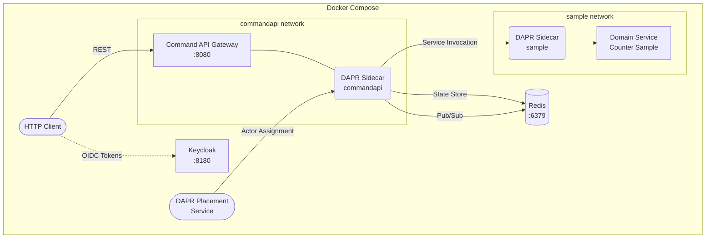

[← Back to Hexalith.EventStore](../../README.md)

# Docker Compose Deployment Guide

Deploy the Hexalith.EventStore sample application to Docker Compose for a production-like topology on your local machine. This guide uses the .NET Aspire publisher to generate Docker Compose manifests, then adds DAPR sidecars for full event sourcing functionality. It is intended for operators and developers who have completed the [Quickstart Guide](../getting-started/quickstart.md) and want to run the system outside of `dotnet run`.

> **Prerequisites:** [Prerequisites](../getting-started/prerequisites.md) — Docker Desktop, .NET 10 SDK, DAPR CLI, Aspire CLI

## What You'll Deploy

The Docker Compose topology includes the Command API Gateway, the Counter sample domain service, DAPR sidecars for each service, Redis (state store and pub/sub), and optionally Keycloak for OIDC authentication. Unlike the Aspire `dotnet run` experience, this deployment runs entirely inside Docker containers — closer to how you would run in production.



<details>
<summary>Deployment topology text description</summary>

The diagram shows the Docker Compose deployment topology for Hexalith.EventStore.

An HTTP Client sends REST requests to the Command API Gateway container, which listens on port 8080. The Command API Gateway shares a network namespace with its DAPR Sidecar container (app-id: commandapi). The commandapi sidecar handles all infrastructure interactions: persisting events and actor state to the Redis container (port 6379) via the State Store building block, publishing domain events via the Pub/Sub building block (also backed by Redis), and invoking the sample domain service through DAPR Service Invocation.

The Counter Sample domain service runs in a separate container with its own DAPR Sidecar (app-id: sample). The sample sidecar receives service invocation calls from the commandapi sidecar and forwards them to the domain service. The sample domain service has zero infrastructure access — it cannot read or write to the state store or pub/sub.

A DAPR Placement Service container manages actor assignment, ensuring each aggregate identity is processed by exactly one actor instance at a time.

An optional Keycloak container (port 8180) provides OIDC authentication. The HTTP Client obtains JWT tokens from Keycloak before calling the Command API Gateway. Keycloak can be disabled by setting `EnableKeycloak=false`, in which case the system falls back to symmetric key authentication.

All containers run within the Docker Compose network boundary.

</details>

## Prerequisites

Before starting, ensure you have the following installed:

- **Docker Desktop** — running with at least 4 GB of memory allocated
- **.NET 10 SDK** — version 10.0.103 or later (`dotnet --version` to check)
- **DAPR CLI** — version 1.14 or later (`dapr --version` to check)
- **Aspire CLI** — install as a global tool if not already present:

    ```bash
    $ dotnet tool install -g Aspire.Cli
    ```

- **DAPR runtime initialized for Docker** — see the next section

## DAPR Runtime Setup for Docker

DAPR requires a one-time initialization that installs the DAPR placement service and default components into your Docker environment. This is different from `dapr init --slim`, which runs DAPR without Docker containers.

Initialize the full DAPR runtime:

```bash
$ dapr init
```

Verify the installation:

```bash
$ dapr --version
$ docker ps --filter "name=dapr"
```

You should see three DAPR containers running: `dapr_placement`, `dapr_zipkin`, and `dapr_redis`. The placement service is required for actor support — without it, aggregate actors cannot activate.

> **Note:** If you previously ran `dapr init --slim` (as used in the quickstart), you need to uninstall and reinitialize with the full runtime:
>
> ```bash
> $ dapr uninstall
> $ dapr init
> ```

## Generate Docker Compose Output

The Aspire AppHost includes a Docker Compose publisher that generates `docker-compose.yaml` and `.env` files from the Aspire topology definition.

```bash
$ PUBLISH_TARGET=docker aspire publish --project src/Hexalith.EventStore.AppHost/Hexalith.EventStore.AppHost.csproj -o ./publish-output/docker
```

> **PowerShell (Windows):**
>
> ```powershell
> $env:PUBLISH_TARGET="docker"
> $ aspire publish --project src/Hexalith.EventStore.AppHost/Hexalith.EventStore.AppHost.csproj -o .\publish-output\docker
> ```

This generates:

- `publish-output/docker/docker-compose.yaml` — service definitions for `commandapi`, `sample`, `keycloak` (when enabled), and an Aspire dashboard
- `publish-output/docker/.env` — parameterized placeholders for container images, ports, and secrets

> **Important:** The generated `docker-compose.yaml` does **not** include DAPR sidecar containers. The `CommunityToolkit.Aspire.Hosting.Dapr` package is a local development orchestration tool — its DAPR configuration does not carry through to Docker Compose publishing. You must add DAPR sidecars manually, as described in the next sections.

### Expected Generated Structure

The Aspire publisher generates a compose file with this general structure (abbreviated):

```yaml
services:
    commandapi:
        image: ${COMMANDAPI_IMAGE}
        ports:
            - "8080:8080"
        environment:
            - ASPNETCORE_ENVIRONMENT=Production
            - Authentication__JwtBearer__Authority=${AUTH_AUTHORITY}
            # ... additional environment variables from .env

    sample:
        image: ${SAMPLE_IMAGE}
        environment:
            - ASPNETCORE_ENVIRONMENT=Production

    keycloak:
        image: "quay.io/keycloak/keycloak:26.4"
        command: ["start-dev", "--import-realm"]
        ports:
            - "8180:8080"
        # ... realm import volumes, environment variables

    # Aspire dashboard (optional, remove for production)
    docker-dashboard:
        image: ${DASHBOARD_IMAGE}
```

> **Note:** Exact field names and structure depend on the Aspire SDK version (currently 13.1.x). Always use the generated output rather than copying this example verbatim. Two changes are typically needed in the generated file:
>
> 1. **Keycloak:** Change `command: ["start", "--import-realm"]` to `command: ["start-dev", "--import-realm"]` for HTTP-only local deployments. The `start` command requires HTTPS configuration.
> 2. **Port mappings:** The generated file may use `expose` instead of `ports` for `commandapi`. Add `ports: ["8080:8080"]` to make the API accessible from the host.

### Customize for Production Use

To adapt the generated compose file for production deployment:

1. **Replace image placeholders** in `.env` with your container registry paths (e.g., `COMMANDAPI_IMAGE=myregistry.azurecr.io/hexalith-commandapi:1.0.0`)
2. **Add DAPR sidecar containers** as described in [Deploy the Application](#deploy-the-application)
3. **Swap DAPR components** from Redis to production backends (see [Configure DAPR Components](#configure-dapr-components))
4. **Configure external OIDC** instead of Keycloak (see [deploy/README.md](../../deploy/README.md#external-oidc-configuration-for-production) for environment variables)
5. **Remove the dashboard** service for production deployments
6. **Set secrets** via `.env` file (excluded from source control) or Docker secrets

## Deploy the Application

### Step 1: Prepare the DAPR Components Directory

Create a directory for DAPR component definitions and copy the local development components:

```bash
$ mkdir -p publish-output/docker/dapr-components
$ cp src/Hexalith.EventStore.AppHost/DaprComponents/statestore.yaml publish-output/docker/dapr-components/
$ cp src/Hexalith.EventStore.AppHost/DaprComponents/pubsub.yaml publish-output/docker/dapr-components/
$ cp src/Hexalith.EventStore.AppHost/DaprComponents/accesscontrol.yaml publish-output/docker/dapr-components/
$ cp src/Hexalith.EventStore.AppHost/DaprComponents/configstore.yaml publish-output/docker/dapr-components/
$ cp src/Hexalith.EventStore.AppHost/DaprComponents/resiliency.yaml publish-output/docker/dapr-components/
$ cp src/Hexalith.EventStore.AppHost/DaprComponents/subscription-sample-counter.yaml publish-output/docker/dapr-components/
```

> For production backends (PostgreSQL, RabbitMQ, etc.), copy from `deploy/dapr/` instead. See [Configure DAPR Components](#configure-dapr-components).
>
> **Important:** The local development DAPR component files use `{env:REDIS_HOST|localhost:6379}` for the Redis host. This environment variable substitution syntax is **not reliably resolved** by all DAPR runtime versions when running inside Docker Compose. After copying the component files, update `redisHost` values to use the Docker service name directly:
>
> ```yaml
> - name: redisHost
>   value: "redis:6379"
> ```
>
> Apply this change to `statestore.yaml`, `pubsub.yaml`, and `configstore.yaml` in your `dapr-components/` directory.

### Step 2: Add DAPR Sidecar Containers

Add the following service definitions to the generated `docker-compose.yaml`. Each DAPR sidecar shares the network namespace of its application container via `network_mode`:

```yaml
services:
    # ... (existing generated services above)

    commandapi-dapr:
        image: "daprio/daprd:latest"
        network_mode: "service:commandapi"
        depends_on:
            - commandapi
        volumes:
            - ./dapr-components:/components
        command:
            [
                "./daprd",
                "-app-id",
                "commandapi",
                "-app-port",
                "8080",
                "-placement-host-address",
                "placement:50006",
                "-components-path",
                "/components",
                "-config",
                "/components/accesscontrol.yaml",
            ]

    sample-dapr:
        image: "daprio/daprd:latest"
        network_mode: "service:sample"
        depends_on:
            - sample
        volumes:
            - ./dapr-components:/components
        command:
            [
                "./daprd",
                "-app-id",
                "sample",
                "-placement-host-address",
                "placement:50006",
                "-components-path",
                "/components",
                "-config",
                "/components/accesscontrol.yaml",
            ]

    placement:
        image: "daprio/placement:latest"
        ports:
            - "50006:50006"
        command: ["./placement", "-port", "50006"]

    redis:
        image: "redis:7-alpine"
        ports:
            - "6379:6379"
```

> **Note:** The `network_mode: "service:commandapi"` directive makes the DAPR sidecar share the same network namespace as the application container. This means the sidecar is accessible at `localhost:3500` from inside the application container — exactly how DAPR expects to communicate.

### Step 2b: Register Domain Services for the Sample

The Counter sample domain service registration is only configured in `appsettings.Development.json`. Since Docker Compose runs in Production mode, you must add the registration via environment variables on the `commandapi` service:

```yaml
services:
    commandapi:
        environment:
            # ... (existing environment variables)
            # Counter sample domain service registration
            EventStore__DomainServices__Registrations__tenant-a|counter|v1__AppId: "sample"
            EventStore__DomainServices__Registrations__tenant-a|counter|v1__MethodName: "process"
            EventStore__DomainServices__Registrations__tenant-a|counter|v1__TenantId: "tenant-a"
            EventStore__DomainServices__Registrations__tenant-a|counter|v1__Domain: "counter"
            EventStore__DomainServices__Registrations__tenant-a|counter|v1__Version: "v1"
```

> **Note:** In production, domain service registrations should be managed via the DAPR config store rather than environment variables. See the architecture documentation for the config store registration pattern.

### Step 3: Configure Environment Variables

Edit the `.env` file in `publish-output/docker/` to set required values:

```bash
# Container images (replace with your registry paths or use local builds)
COMMANDAPI_IMAGE=hexalith-commandapi:latest
SAMPLE_IMAGE=hexalith-sample:latest

# Redis (matches DAPR component default)
REDIS_HOST=redis:6379
REDIS_PASSWORD=

# Keycloak (if enabled)
AUTH_AUTHORITY=http://keycloak:8080/realms/hexalith
```

> **Tip:** Build the container images from source using the .NET SDK container publishing feature (no Dockerfile required):
>
> ```bash
> $ dotnet publish src/Hexalith.EventStore.CommandApi/Hexalith.EventStore.CommandApi.csproj --os linux --arch x64 -t:PublishContainer -p:ContainerRepository=hexalith-commandapi -p:ContainerImageTag=latest
> $ dotnet publish samples/Hexalith.EventStore.Sample/Hexalith.EventStore.Sample.csproj --os linux --arch x64 -t:PublishContainer -p:ContainerRepository=hexalith-sample -p:ContainerImageTag=latest
> ```

### Step 4: Start the Application

Navigate to the publish output directory and start the containers:

```bash
$ cd publish-output/docker
$ docker compose up -d
```

Watch the logs to verify all services start successfully:

```bash
$ docker compose logs -f
```

Look for these key log messages:

- `commandapi-dapr` — `component loaded. name: statestore` and `component loaded. name: pubsub`
- `commandapi` — `Now listening on: http://[::]:8080`
- `placement` — `placement service started`

Press `Ctrl+C` to stop following logs.

## Configure DAPR Components

The default deployment uses Redis for both the state store and pub/sub. For production, swap to enterprise-grade backends by replacing the DAPR component YAML files in the `dapr-components/` directory.

### State Store Backend Selection

| Backend         | Config Source                            | Use Case                           |
| --------------- | ---------------------------------------- | ---------------------------------- |
| Redis           | `DaprComponents/statestore.yaml`         | Local development, prototyping     |
| PostgreSQL      | `deploy/dapr/statestore-postgresql.yaml` | Production with ACID transactions  |
| Azure Cosmos DB | `deploy/dapr/statestore-cosmosdb.yaml`   | Global distribution, elastic scale |

### Pub/Sub Backend Selection

| Backend           | Config Source                        | Use Case                          |
| ----------------- | ------------------------------------ | --------------------------------- |
| Redis Streams     | `DaprComponents/pubsub.yaml`         | Local development, prototyping    |
| RabbitMQ          | `deploy/dapr/pubsub-rabbitmq.yaml`   | Production, flexible routing      |
| Kafka             | `deploy/dapr/pubsub-kafka.yaml`      | High throughput, log-based        |
| Azure Service Bus | `deploy/dapr/pubsub-servicebus.yaml` | Native Azure, enterprise features |

To swap backends, copy the desired production component files into `dapr-components/`, set the required environment variables in `.env`, and restart:

```bash
$ cp deploy/dapr/statestore-postgresql.yaml publish-output/docker/dapr-components/statestore.yaml
$ cp deploy/dapr/pubsub-rabbitmq.yaml publish-output/docker/dapr-components/pubsub.yaml
$ docker compose restart commandapi-dapr sample-dapr
```

For per-backend environment variables and connection string formats, see [deploy/README.md](../../deploy/README.md#per-backend-configuration).

## Where Is My Data?

Event data is physically stored in whatever backend the DAPR state store component points to. The application code never accesses the backend directly — all reads and writes go through DAPR's state management API.

### Redis (Default)

Events, snapshots, and actor state are stored as Redis keys following the composite key pattern:

- **Event streams:** `commandapi||{tenant}||{domain}||{aggregateId}||events||{sequenceNumber}`
- **Snapshots:** `commandapi||{tenant}||{domain}||{aggregateId}||snapshot`
- **Actor state:** `commandapi||{tenant}||{domain}||{aggregateId}||actor`
- **Command status:** `commandapi||{tenant}||{domain}||{aggregateId}||status||{correlationId}` (24-hour TTL)
- **Idempotency records:** `commandapi||{tenant}||{domain}||{aggregateId}||idempotency||{causationId}`

Inspect Redis keys while the system is running:

```bash
$ docker compose exec redis redis-cli KEYS "*"
```

### PostgreSQL

When using the PostgreSQL state store, DAPR creates a `state` table in the configured database. Each key-value pair becomes a row with columns for `key`, `value` (JSONB), `etag`, and `expiredate`.

```bash
$ docker exec -it postgres psql -U dapr -d eventstore -c "SELECT key FROM state WHERE key LIKE 'commandapi||%' LIMIT 10;"
```

### Azure Cosmos DB

Events are stored as documents in the configured Cosmos DB container. Each document contains `id` (the composite key), `value` (the serialized state), and `_etag` for optimistic concurrency.

## Verify System Health

Once the containers are running, verify the system is healthy using the built-in health check endpoints.

### Full Health Check

```bash
$ curl -s http://localhost:8080/health
```

> **PowerShell:**
>
> ```powershell
> $ Invoke-RestMethod -Uri "http://localhost:8080/health"
> ```

Expected response (HTTP 200): `Healthy`

> **Note:** The default ASP.NET Core health check response is a plain text status string. To get detailed JSON with individual check results, configure the health check response writer in the application (see `ServiceDefaults/Extensions.cs`).

### Liveness Probe

```bash
$ curl -s -o /dev/null -w "%{http_code}" http://localhost:8080/alive
```

Returns `200` if the application process is responsive. Use this for Docker health checks or orchestrator liveness probes.

### Readiness Probe

```bash
$ curl -s http://localhost:8080/ready
```

Returns `200` when the application is ready to accept traffic (all `"ready"`-tagged health checks pass). Returns `503` if any readiness check fails. Use this for load balancer health checks.

> **Health status codes:** `Healthy` and `Degraded` both return HTTP 200. `Unhealthy` returns HTTP 503. A degraded pub/sub or config store does not prevent the system from accepting commands — only the sidecar and state store are critical.

## Send a Test Command

Verify the full command processing pipeline by submitting a test command.

### Get an Access Token

If Keycloak is running (default), obtain a JWT token:

```bash
$ TOKEN=$(curl -s -X POST http://localhost:8180/realms/hexalith/protocol/openid-connect/token \
  -d "grant_type=password" \
  -d "client_id=hexalith-eventstore" \
  -d "username=admin-user" \
  -d "password=admin-pass" | jq -r '.access_token')
```

> **PowerShell:**
>
> ```powershell
> $token = (Invoke-RestMethod -Method Post -Uri "http://localhost:8180/realms/hexalith/protocol/openid-connect/token" -Body @{grant_type="password"; client_id="hexalith-eventstore"; username="admin-user"; password="admin-pass"}).access_token
> ```

If Keycloak is disabled (`EnableKeycloak=false`), the system uses symmetric key authentication. Set the `Authentication__JwtBearer__SigningKey` environment variable and generate a token using that key.

### Submit a Command

```bash
$ curl -s -X POST http://localhost:8080/api/v1/commands \
  -H "Authorization: Bearer $TOKEN" \
  -H "Content-Type: application/json" \
  -d '{
    "tenant": "tenant-a",
    "domain": "counter",
    "aggregateId": "counter-1",
    "commandType": "IncrementCounter",
    "payload": {}
  }'
```

> **PowerShell:**
>
> ```powershell
> $body = '{"tenant":"tenant-a","domain":"counter","aggregateId":"counter-1","commandType":"IncrementCounter","payload":{}}'
> $ Invoke-RestMethod -Method Post -Uri "http://localhost:8080/api/v1/commands" -Headers @{Authorization="Bearer $token"} -ContentType "application/json" -Body $body
> ```

Expected response (HTTP 202 Accepted):

```json
{
    "correlationId": "a1b2c3d4-e5f6-7890-abcd-ef1234567890"
}
```

### Verify the Event Was Produced

Check that the event was persisted to the state store:

```bash
$ docker compose exec redis redis-cli KEYS "*counter-1*"
```

You should see keys for the event stream, idempotency record, and aggregate metadata — confirming the command was processed and an event was stored.

## Resource Requirements

Estimated resource requirements for running the full Docker Compose topology on a local machine:

| Component                    | CPU            | Memory      | Storage                         |
| ---------------------------- | -------------- | ----------- | ------------------------------- |
| Command API Gateway          | 0.5 core       | 256 MB      | Minimal                         |
| Counter Sample               | 0.25 core      | 128 MB      | Minimal                         |
| DAPR Sidecar (commandapi)    | 0.25 core      | 128 MB      | Minimal                         |
| DAPR Sidecar (sample)        | 0.1 core       | 64 MB       | Minimal                         |
| DAPR Placement Service       | 0.1 core       | 64 MB       | Minimal                         |
| Redis                        | 0.25 core      | 256 MB      | 1 GB+ (depends on event volume) |
| Keycloak (optional)          | 0.5 core       | 512 MB      | Minimal                         |
| **Total (with Keycloak)**    | **~2 cores**   | **~1.4 GB** | **~1 GB**                       |
| **Total (without Keycloak)** | **~1.5 cores** | **~900 MB** | **~1 GB**                       |

### Performance Expectations

- Command submission latency: <50 ms p99
- End-to-end command lifecycle: <200 ms p99
- DAPR sidecar overhead: ~1–2 ms per building block call
- Default DAPR sidecar call timeout: 5 seconds
- Snapshot frequency: every 100 events (keeps rehydration to ≤102 reads)

> **Tip:** Allocate at least 4 GB of memory to Docker Desktop. With 2 GB, Redis and Keycloak may be killed by the OOM reaper under load.

## Backend Swap

One of DAPR's core benefits is infrastructure portability. You can switch from Redis to PostgreSQL (or any other supported backend) with zero code changes — only DAPR component YAML files change.

### Example: Redis to PostgreSQL

1. Add a PostgreSQL container to `docker-compose.yaml`:

    ```yaml
    services:
        postgres:
            image: "postgres:16-alpine"
            ports:
                - "5432:5432"
            environment:
                POSTGRES_USER: dapr
                POSTGRES_PASSWORD: dapr-secret
                POSTGRES_DB: eventstore
            volumes:
                - pgdata:/var/lib/postgresql/data

    volumes:
        pgdata:
    ```

2. Replace the state store component:

    ```bash
    $ cp deploy/dapr/statestore-postgresql.yaml publish-output/docker/dapr-components/statestore.yaml
    ```

3. Set the connection string in `.env`:

    ```bash
    POSTGRES_CONNECTION_STRING=host=postgres;port=5432;username=dapr;password=dapr-secret;database=eventstore
    ```

4. Restart the DAPR sidecars to pick up the new component:

    ```bash
    $ docker compose restart commandapi-dapr sample-dapr
    ```

5. Verify the swap by sending a test command and checking PostgreSQL:

    ```bash
    $ docker exec -it postgres psql -U dapr -d eventstore -c "SELECT key FROM state LIMIT 5;"
    ```

No application code was modified. The Command API Gateway and Counter sample domain service are unchanged — only the DAPR component configuration changed.

For the full list of supported backends and their environment variables, see [deploy/README.md](../../deploy/README.md#backend-compatibility-matrix).

## Troubleshooting

### Port Conflicts

**Symptom:** `docker compose up` fails with `bind: address already in use`.

**Fix:** Check for processes using the conflicting ports:

```bash
$ lsof -i :8080   # Command API Gateway
$ lsof -i :8180   # Keycloak
$ lsof -i :6379   # Redis
```

Stop conflicting processes or change port mappings in `docker-compose.yaml`.

> **Note:** The `dapr init` command creates its own Redis container (`dapr_redis`) on port 6379. If you have port conflicts with Redis, either remove the host port mapping from your `redis` service in the compose file (DAPR sidecars reach Redis via Docker DNS, not host ports) or stop the DAPR Redis container: `docker stop dapr_redis`.

### DAPR Sidecar Timeout

**Symptom:** The application starts but commands fail with timeout errors. Health check shows `dapr-sidecar: Unhealthy`.

**Causes:**

- DAPR placement service is not running — verify the `placement` container is running: `docker compose ps placement`
- Component YAML files have syntax errors — check sidecar logs: `docker compose logs commandapi-dapr`
- Redis is not reachable from the sidecar — verify `redis` container is running and `REDIS_HOST` is set to `redis:6379` (Docker service name, not `localhost`)

### Container Networking

**Symptom:** DAPR sidecars cannot reach Redis or other services.

**Fix:** Ensure all services are on the same Docker Compose network. By default, `docker compose` creates a network for all services defined in the same file. If using `network_mode: "service:commandapi"`, the sidecar inherits the network of the application container.

Verify connectivity:

```bash
$ docker compose exec commandapi-dapr wget -qO- http://redis:6379 || echo "Connection refused (expected for raw Redis)"
```

### State Store Component Not Loading

**Symptom:** `dapr-statestore: Unhealthy` in health check.

**Fix:** Check sidecar logs for component loading errors:

```bash
$ docker compose logs commandapi-dapr | grep -i "component"
```

Common causes:

- YAML syntax error in the component file
- Missing environment variables referenced by `{env:VARIABLE_NAME}`
- Component scoping excludes the app-id (the `scopes` list must include `commandapi`)

### Keycloak Token Errors

**Symptom:** `401 Unauthorized` when calling the Command API Gateway.

**Fix:**

- Verify Keycloak is running: `curl -s http://localhost:8180/realms/hexalith/.well-known/openid-configuration | jq .issuer`
- Ensure the `Authentication__JwtBearer__Authority` environment variable on `commandapi` points to `http://keycloak:8080/realms/hexalith` (Docker service name, not `localhost`)
- Check token expiry — Keycloak tokens expire after 5 minutes by default. Request a fresh token.

## Next Steps

- **Next:** [Kubernetes Deployment Guide](deployment-kubernetes.md) — deploy to a Kubernetes cluster with DAPR operator and Helm charts
- **Related:** [Deployment Configuration Reference](../../deploy/README.md) — full backend compatibility matrix and per-backend environment variables
- **Related:** [Architecture Overview](../concepts/architecture-overview.md) — understand the system topology and DAPR building blocks
- **Related:** [Quickstart Guide](../getting-started/quickstart.md) — run the system locally with Aspire (no Docker Compose)
