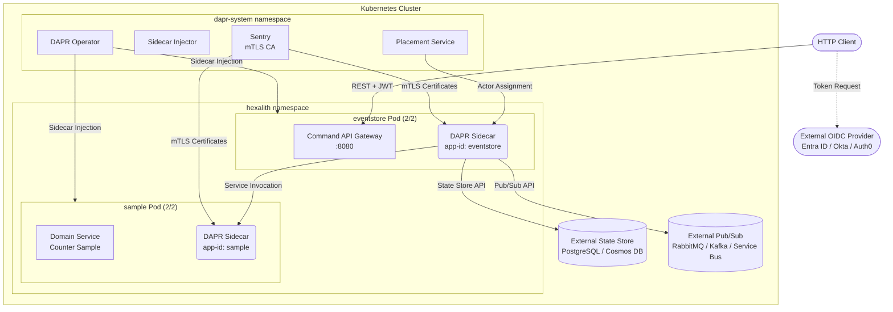

[← Back to Hexalith.EventStore](../../README.md)

# Kubernetes Deployment Guide

Deploy the Hexalith.EventStore sample application to a Kubernetes cluster with DAPR operator-managed sidecars and Helm chart manifests. This guide uses the .NET Aspire Kubernetes publisher to generate Helm charts, then adds DAPR annotations, CRD-based components, and Kubernetes Secrets for a production-ready deployment. It is intended for operators and developers who have completed the [Docker Compose Deployment Guide](deployment-docker-compose.md) and want to run the system in a Kubernetes environment.

> **Prerequisites:** [Prerequisites](../getting-started/prerequisites.md) — .NET 10 SDK, DAPR CLI, Aspire CLI, plus Kubernetes-specific tools listed below

## What You Already Know

If you followed the [Docker Compose Deployment Guide](deployment-docker-compose.md), you already understand:

- **Aspire publisher workflow** — generating deployment manifests from the AppHost topology definition
- **DAPR building blocks** — state store, pub/sub, service invocation, and actor placement
- **Health endpoints** — `/health`, `/alive`, and `/ready` for verifying system readiness
- **Backend swap** — changing state store or pub/sub by swapping DAPR component YAML files with zero code changes
- **Domain service isolation** — domain services have zero infrastructure access (D4)

**What's new in Kubernetes:**

| Concept                 | Docker Compose                                        | Kubernetes                                                                                               |
| ----------------------- | ----------------------------------------------------- | -------------------------------------------------------------------------------------------------------- |
| DAPR sidecar injection  | Manual container definitions in `docker-compose.yaml` | Automatic via `dapr.io/enabled: "true"` annotation — the DAPR operator injects the sidecar container     |
| Component configuration | File-mounted YAML volumes                             | Kubernetes CRDs (`kubectl apply -f`) — the DAPR operator watches for Component resources                 |
| Secret management       | `.env` file (excluded from source control)            | Kubernetes Secrets with DAPR `secretKeyRef` syntax                                                       |
| Networking              | Docker Compose network (`service:` DNS)               | Kubernetes Service DNS (`<service>.<namespace>.svc.cluster.local`)                                       |
| Authentication          | Keycloak container (local OIDC)                       | External OIDC provider (required — K8s publisher does not support bind mounts for Keycloak realm import) |
| Scaling                 | Manual `replicas:` in compose                         | Horizontal Pod Autoscaler (HPA) / KEDA                                                                   |
| Health checks           | Docker `HEALTHCHECK` directive                        | Kubernetes `livenessProbe`, `readinessProbe`, `startupProbe`                                             |
| Manifest source         | `aspire publish` → `docker-compose.yaml`              | `aspire publish` → Helm chart (`Chart.yaml`, `values.yaml`, templates)                                   |
| Service identity        | Docker network isolation                              | SPIFFE-based mTLS via DAPR Sentry (certificate-based service identity)                                   |

## What You'll Deploy

The Kubernetes deployment includes the Command API Gateway, the Counter sample domain service, DAPR sidecars auto-injected by the DAPR operator, external state store and pub/sub backends, and an external OIDC provider for authentication.



<details>
<summary>Deployment topology text description</summary>

The diagram shows the Kubernetes deployment topology for Hexalith.EventStore.

An HTTP Client obtains JWT tokens from an External OIDC Provider (such as Microsoft Entra ID, Okta, or Auth0) and sends authenticated REST requests to the Command API Gateway.

The Kubernetes cluster contains two namespaces:

1. **dapr-system namespace**: Contains four DAPR system pods:
    - **DAPR Operator** — watches for DAPR-annotated pods and manages component CRDs
    - **Sidecar Injector** — injects DAPR sidecar containers into annotated pods
    - **Placement Service** — manages actor assignment, ensuring each aggregate identity is processed by exactly one actor instance
    - **Sentry** — issues and rotates mTLS certificates for service-to-service communication

2. **hexalith namespace**: Contains two application pods:
    - **eventstore Pod** (shows 2/2 containers — app + DAPR sidecar): The Command API Gateway listens on port 8080. Its DAPR sidecar (app-id: eventstore) handles all infrastructure interactions: persisting events and actor state to the external state store, publishing domain events via pub/sub, and invoking the sample domain service through DAPR service invocation.
    - **sample Pod** (shows 2/2 containers — app + DAPR sidecar): The Counter Sample domain service runs with its own DAPR sidecar (app-id: sample). The sample sidecar receives service invocation calls from the eventstore sidecar. The sample domain service has zero infrastructure access — it cannot read or write to the state store or pub/sub (D4).

The external state store (PostgreSQL or Azure Cosmos DB) and external pub/sub (RabbitMQ, Kafka, or Azure Service Bus) run outside the cluster or as separate managed services. DAPR Sentry provides mTLS certificates to both application sidecars for encrypted service-to-service communication.

</details>

## Prerequisites

Before starting, ensure you have the following installed:

- **kubectl** — Kubernetes CLI (`kubectl version --client` to check)
- **Helm 3** — Kubernetes package manager (`helm version` to check)
- **Kubernetes cluster** — one of:
    - **minikube** (local development)
    - **kind** (Kubernetes in Docker)
    - **AKS** (Azure Kubernetes Service)
    - **EKS** (Amazon Elastic Kubernetes Service)
    - **GKE** (Google Kubernetes Engine)
- **.NET 10 SDK** — version 10.0.103 or later (`dotnet --version` to check)
- **Aspire CLI** — install as a global tool if not already present:

    ```bash
    dotnet tool install -g Aspire.Cli
    ```

- **DAPR CLI** — version 1.14 or later (`dapr --version` to check)
- **Container registry access** — a registry your cluster can pull from (Docker Hub, ACR, ECR, GCR, or a local alternative)

### Quick Start Cluster

For local development, create a minikube cluster with sufficient resources:

```bash
minikube start --cpus=4 --memory=8192 --driver=docker
```

> **Minimum cluster requirements:** 2 nodes (or a single node with equivalent resources), 4 GB RAM each. The cluster needs capacity for eventstore + sample + DAPR system pods + state store + pub/sub backends.

## Install DAPR on Kubernetes

Install the DAPR control plane into your Kubernetes cluster. Pin the DAPR runtime version to match the SDK version used by the application.

> **Note:** The project pins the DAPR SDK in [`Directory.Packages.props`](../../Directory.Packages.props) (the single source of truth). Use a compatible DAPR runtime version. Consult the [DAPR SDK-to-runtime compatibility matrix](https://docs.dapr.io/operations/support/support-release-policy/) for version mapping.

Install DAPR with a pinned runtime version:

```bash
dapr init -k --runtime-version 1.14.4
```

> **Alternative:** Install via the official Helm chart for more control over configuration:
>
> ```bash
> helm repo add dapr https://dapr.github.io/helm-charts/
> helm repo update
> helm install dapr dapr/dapr --namespace dapr-system --create-namespace --version 1.14.4
> ```

Verify the installation — all four DAPR system pods should be Running:

```bash
dapr status -k
```

Expected output shows four components running:

| NAME                  | NAMESPACE   | STATUS  |
| --------------------- | ----------- | ------- |
| dapr-operator         | dapr-system | Running |
| dapr-sidecar-injector | dapr-system | Running |
| dapr-placement-server | dapr-system | Running |
| dapr-sentry           | dapr-system | Running |

Verify DAPR CRDs are installed:

```bash
kubectl get crd | grep dapr
```

> **PowerShell (Windows):**
>
> ```powershell
> kubectl get crd | Select-String dapr
> ```

Expected CRDs:

- `components.dapr.io`
- `configurations.dapr.io`
- `resiliencies.dapr.io`
- `subscriptions.dapr.io`

## Generate Kubernetes Manifests

The Aspire AppHost includes a Kubernetes publisher that generates a Helm chart from the Aspire topology definition.

```bash
PUBLISH_TARGET=k8s EnableKeycloak=false aspire publish --project src/Hexalith.EventStore.AppHost/Hexalith.EventStore.AppHost.csproj -o ./publish-output/k8s
```

> **PowerShell (Windows):**
>
> ```powershell
> $env:PUBLISH_TARGET='k8s'; $env:EnableKeycloak='false'; aspire publish --project src/Hexalith.EventStore.AppHost/Hexalith.EventStore.AppHost.csproj -o ./publish-output/k8s
> ```

**Important:** `EnableKeycloak=false` is **required**. The Kubernetes publisher does not support bind mounts used by Keycloak's realm import. Production Kubernetes deployments must use an external OIDC provider.

**Warning:** The Aspire Kubernetes publisher (`Aspire.Hosting.Kubernetes`) is a preview package. Generated output may require manual adjustments.

### Expected Generated Structure

The publisher generates a Helm chart with this structure:

```text
publish-output/k8s/
  Chart.yaml                  # Helm chart metadata
  values.yaml                 # Parameterized values (image tags, replica counts, resource limits)
  templates/
    eventstore.yaml           # Deployment + Service for Command API Gateway
    sample.yaml               # Deployment + Service for Counter Sample
```

### Customize Key Parameters

Edit `values.yaml` to configure your deployment:

```yaml
# Container image registry and tags
eventstore:
    image:
        repository: myregistry.azurecr.io/hexalith-eventstore
        tag: "1.0.0"
    replicas: 1
    resources:
        requests:
            cpu: "250m"
            memory: "256Mi"
        limits:
            cpu: "1000m"
            memory: "512Mi"

sample:
    image:
        repository: myregistry.azurecr.io/hexalith-sample
        tag: "1.0.0"
    replicas: 1
    resources:
        requests:
            cpu: "100m"
            memory: "128Mi"
        limits:
            cpu: "500m"
            memory: "256Mi"
```

> **Note:** Exact field names depend on the Aspire SDK version (currently 13.1.2). Always inspect the generated `values.yaml` before modifying.

## Build and Push Container Images

Unlike Docker Compose (where images can be built locally), Kubernetes clusters pull images from container registries. You need to build, tag, and push the application images before deploying.

### Build Container Images

Use the .NET SDK container publishing feature (no Dockerfile required):

```bash
dotnet publish src/Hexalith.EventStore/Hexalith.EventStore.csproj --os linux --arch x64 -t:PublishContainer -p:ContainerRepository=hexalith-eventstore -p:ContainerImageTag=latest
dotnet publish samples/Hexalith.EventStore.Sample/Hexalith.EventStore.Sample.csproj --os linux --arch x64 -t:PublishContainer -p:ContainerRepository=hexalith-sample -p:ContainerImageTag=latest
```

### Push to a Container Registry

Tag and push to your registry:

```bash
docker tag hexalith-eventstore:latest myregistry.azurecr.io/hexalith-eventstore:latest
docker push myregistry.azurecr.io/hexalith-eventstore:latest

docker tag hexalith-sample:latest myregistry.azurecr.io/hexalith-sample:latest
docker push myregistry.azurecr.io/hexalith-sample:latest
```

### Local Cluster Alternatives

For local development clusters that don't pull from external registries:

```bash
# minikube
minikube image load hexalith-eventstore:latest
minikube image load hexalith-sample:latest

# kind
kind load docker-image hexalith-eventstore:latest
kind load docker-image hexalith-sample:latest
```

Update `values.yaml` with the correct image repository and tag to match the pushed images.

## Add DAPR Annotations and Kubernetes Probes

The Kubernetes publisher does **not** auto-generate DAPR annotations or Kubernetes health probes. You must add these manually to each Deployment's pod template spec in the generated Helm chart templates.

### eventstore Deployment

Add the following to `templates/eventstore.yaml` at `spec.template.metadata.annotations` and `spec.template.spec.containers`:

```yaml
apiVersion: apps/v1
kind: Deployment
metadata:
    name: eventstore
spec:
    template:
        metadata:
            annotations:
                # --- DAPR annotations (add these) ---
                dapr.io/enabled: "true"
                dapr.io/app-id: "eventstore"
                dapr.io/app-port: "8080"
                dapr.io/config: "accesscontrol"
                dapr.io/sidecar-cpu-request: "100m"
                dapr.io/sidecar-memory-request: "128Mi"
                dapr.io/sidecar-cpu-limit: "300m"
                dapr.io/sidecar-memory-limit: "256Mi"
        spec:
            containers:
                - name: eventstore
                  # ... (existing image, env, ports from generated template)
                  resources:
                      requests:
                          cpu: "250m"
                          memory: "256Mi"
                      limits:
                          cpu: "1000m"
                          memory: "512Mi"
                  # --- Kubernetes probes (add these) ---
                  startupProbe:
                      httpGet:
                          path: /alive
                          port: 8080
                      failureThreshold: 30
                      periodSeconds: 2
                  livenessProbe:
                      httpGet:
                          path: /alive
                          port: 8080
                  readinessProbe:
                      httpGet:
                          path: /ready
                          port: 8080
```

### sample Deployment

Add the following to `templates/sample.yaml`:

```yaml
apiVersion: apps/v1
kind: Deployment
metadata:
    name: sample
spec:
    template:
        metadata:
            annotations:
                # --- DAPR annotations (add these) ---
                dapr.io/enabled: "true"
                dapr.io/app-id: "sample"
                dapr.io/app-port: "8080"
                dapr.io/config: "accesscontrol"
                dapr.io/sidecar-cpu-request: "100m"
                dapr.io/sidecar-memory-request: "128Mi"
                dapr.io/sidecar-cpu-limit: "300m"
                dapr.io/sidecar-memory-limit: "256Mi"
        spec:
            containers:
                - name: sample
                  # ... (existing image, env, ports from generated template)
                  resources:
                      requests:
                          cpu: "100m"
                          memory: "128Mi"
                      limits:
                          cpu: "500m"
                          memory: "256Mi"
                  startupProbe:
                      httpGet:
                          path: /alive
                          port: 8080
                      failureThreshold: 30
                      periodSeconds: 2
                  livenessProbe:
                      httpGet:
                          path: /alive
                          port: 8080
                  readinessProbe:
                      httpGet:
                          path: /ready
                          port: 8080
```

> **Why `startupProbe` with `failureThreshold: 30`?** DAPR sidecar initialization (connecting to placement service, loading components, establishing mTLS) can take 10–30 seconds on cold starts. Without a startup probe, the liveness probe may kill the pod before the sidecar is ready.

## Apply DAPR Components

DAPR components in Kubernetes are applied as Custom Resource Definitions (CRDs), unlike Docker Compose where they are file-mounted. The production components already exist in `deploy/dapr/`.

### Create the Target Namespace

```bash
kubectl create namespace hexalith
```

### Select and Apply Components

Choose **one** state store and **one** pub/sub backend, then apply the required infrastructure components:

**State store** — pick one:

```bash
# PostgreSQL (recommended for production)
kubectl apply -f deploy/dapr/statestore-postgresql.yaml -n hexalith

# OR Azure Cosmos DB
kubectl apply -f deploy/dapr/statestore-cosmosdb.yaml -n hexalith
```

**Pub/sub** — pick one:

```bash
# RabbitMQ
kubectl apply -f deploy/dapr/pubsub-rabbitmq.yaml -n hexalith

# OR Kafka
kubectl apply -f deploy/dapr/pubsub-kafka.yaml -n hexalith

# OR Azure Service Bus
kubectl apply -f deploy/dapr/pubsub-servicebus.yaml -n hexalith
```

**Always apply** these components:

```bash
kubectl apply -f deploy/dapr/resiliency.yaml -n hexalith
kubectl apply -f deploy/dapr/accesscontrol.yaml -n hexalith
kubectl apply -f deploy/dapr/accesscontrol.eventstore-admin.yaml -n hexalith
kubectl apply -f deploy/dapr/accesscontrol.sample.yaml -n hexalith
kubectl apply -f deploy/dapr/subscription-sample-counter.yaml -n hexalith
```

> **Important:** The `subscription-sample-counter.yaml` uses DAPR Subscriptions API v2alpha1, which requires DAPR 1.12+.

### Component Scoping

The production DAPR component files already include `scopes: [eventstore]` on state store, pub/sub, and config store CRDs. This restricts access to eventstore only — domain services have zero infrastructure access (D4).

> **Warning:** `DAPR_TRUST_DOMAIN` and `DAPR_NAMESPACE` in the `accesscontrol*.yaml` files **must** be explicitly set. The fallback defaults (`hexalith.io` and `hexalith`) are reference values only — `hexalith.io` is a real domain and not safe for production use without intentional configuration. See [Adapt DAPR Components for Kubernetes Secrets](#adapt-dapr-components-for-kubernetes-secrets) for how to provide these values.

## Adapt DAPR Components for Kubernetes Secrets

**Critical:** The `{env:VAR}` syntax in production DAPR component YAMLs (e.g., `{env:POSTGRES_CONNECTION_STRING}`) does **not** work with Kubernetes auto-injected sidecars. The DAPR sidecar container does not inherit environment variables from the application container. You must use one of two approaches to provide secrets to DAPR components.

### Approach A: DAPR Secret Store with `secretKeyRef` (Recommended)

This approach uses DAPR's built-in Kubernetes secret store to reference Kubernetes Secrets from component metadata.

#### Step 1: Create a Kubernetes Secret

```bash
kubectl create secret generic dapr-secrets \
  --from-literal=postgres-connection-string='host=mydb.postgres.database.azure.com;port=5432;username=dapr;password=<secret>;database=eventstore;sslmode=require' \
  --from-literal=dapr-trust-domain='your-trust-domain.example.com' \
  --from-literal=dapr-namespace='hexalith' \
  -n hexalith
```

#### Step 2: Create a DAPR Kubernetes Secret Store Component

```yaml
apiVersion: dapr.io/v1alpha1
kind: Component
metadata:
    name: kubernetes-secrets
    namespace: hexalith
spec:
    type: secretstores.kubernetes
    version: v1
    metadata: []
```

Apply it:

```bash
kubectl apply -f - <<EOF
apiVersion: dapr.io/v1alpha1
kind: Component
metadata:
  name: kubernetes-secrets
  namespace: hexalith
spec:
  type: secretstores.kubernetes
  version: v1
  metadata: []
EOF
```

#### Step 3: Modify DAPR Component YAMLs to Use `secretKeyRef`

Replace `{env:VAR}` references with `secretKeyRef`. For example, modify `statestore-postgresql.yaml`:

```yaml
apiVersion: dapr.io/v1alpha1
kind: Component
metadata:
    name: statestore
    namespace: hexalith
spec:
    type: state.postgresql
    version: v1
    metadata:
        - name: connectionString
          secretKeyRef:
              name: dapr-secrets
              key: postgres-connection-string
        - name: actorStateStore
          value: "true"
auth:
    secretStore: kubernetes-secrets
scopes:
    - eventstore
```

#### Step 4: Verify Component Loading

```bash
kubectl logs <eventstore-pod> -c daprd -n hexalith | grep "component loaded"
```

> **PowerShell (Windows):**
>
> ```powershell
> kubectl logs <eventstore-pod> -c daprd -n hexalith | Select-String "component loaded"
> ```

### Approach B: Sidecar Environment Variable Injection

Use the `dapr.io/env` annotation to inject environment variables directly into the DAPR sidecar container:

```yaml
annotations:
    dapr.io/enabled: "true"
    dapr.io/app-id: "eventstore"
    dapr.io/env: "POSTGRES_CONNECTION_STRING=host=mydb;port=5432;username=dapr;password=secret;database=eventstore,DAPR_TRUST_DOMAIN=your-trust-domain.example.com,DAPR_NAMESPACE=hexalith"
```

> **Note:** Approach A (secretKeyRef) is recommended because it avoids exposing secrets in pod annotations and integrates with Kubernetes secret rotation.

### Subscriber and Monitor App IDs

The production pub/sub components reference `{env:SUBSCRIBER_APP_ID}` and `{env:OPS_MONITOR_APP_ID}` for external subscriber scoping. For minimal deployments without external subscribers, remove these entries from the `scopes`, `publishingScopes`, and `subscriptionScopes` fields in the pub/sub component YAML. This simplifies the deployment to only `eventstore` as the pub/sub user.

## Configure External OIDC Authentication

Kubernetes deployments require an external OIDC provider. Set the following environment variables on the `eventstore` Deployment:

```yaml
env:
    - name: Authentication__JwtBearer__Authority
      value: "https://login.microsoftonline.com/{tenant-id}/v2.0"
    - name: Authentication__JwtBearer__Issuer
      value: "https://login.microsoftonline.com/{tenant-id}/v2.0"
    - name: Authentication__JwtBearer__Audience
      value: "api://hexalith-eventstore"
    - name: Authentication__JwtBearer__RequireHttpsMetadata
      value: "true"
```

> **Critical:** Do **not** set `Authentication__JwtBearer__SigningKey`. If a SigningKey is present (in appsettings or environment variables), the application uses symmetric key validation and ignores the OIDC Authority. For external OIDC, the SigningKey must be cleared or omitted.

### Microsoft Entra ID (Azure AD) Walkthrough

1. **Create an App Registration** in the Azure Portal:
    - Navigate to **Microsoft Entra ID** → **App registrations** → **New registration**
    - Set a name (e.g., `hexalith-eventstore-api`)
    - Set **Supported account types** as appropriate for your organization
    - No redirect URI is needed for a server API

2. **Expose an API scope:**
    - Go to **Expose an API** → **Add a scope**
    - Set the Application ID URI (e.g., `api://hexalith-eventstore`)
    - Add a scope named `access_as_user` (or your preferred scope name)

3. **Note the values** for your Deployment environment variables:
    - **Authority:** `https://login.microsoftonline.com/{tenant-id}/v2.0`
    - **Issuer:** `https://login.microsoftonline.com/{tenant-id}/v2.0`
    - **Audience:** `api://hexalith-eventstore` (the Application ID URI)

4. **Acquire a token** for testing (using client credentials or user flow):

    ```bash
    TOKEN=$(curl -s -X POST "https://login.microsoftonline.com/{tenant-id}/oauth2/v2.0/token" \
      -d "grant_type=client_credentials" \
      -d "client_id={client-id}" \
      -d "client_secret={client-secret}" \
      -d "scope=api://hexalith-eventstore/.default" | jq -r '.access_token')
    ```

> **PowerShell (Windows):**
>
> ```powershell
> $token = (Invoke-RestMethod -Method Post -Uri "https://login.microsoftonline.com/{tenant-id}/oauth2/v2.0/token" -Body @{grant_type="client_credentials"; client_id="{client-id}"; client_secret="{client-secret}"; scope="api://hexalith-eventstore/.default"}).access_token
> ```

### Troubleshooting OIDC

If you receive **401 Unauthorized** on all requests, check:

1. **Is the Authority URL reachable from inside the pod?** The pod must be able to reach the OIDC discovery endpoint at `{Authority}/.well-known/openid-configuration`. Test from inside the pod:

    ```bash
    kubectl exec <eventstore-pod> -n hexalith -- wget -qO- "https://login.microsoftonline.com/{tenant-id}/v2.0/.well-known/openid-configuration"
    ```

2. **Is SigningKey cleared?** If `Authentication__JwtBearer__SigningKey` is set in `appsettings.json` or environment variables, clear it explicitly:

    ```yaml
    - name: Authentication__JwtBearer__SigningKey
      value: ""
    ```

3. **Does the token `aud` claim match the Audience?** Decode the JWT at [jwt.ms](https://jwt.ms) and verify the `aud` claim matches the `Authentication__JwtBearer__Audience` environment variable.

4. **Is `RequireHttpsMetadata=true` but the OIDC endpoint uses a self-signed certificate?** If deploying behind a proxy or using a private CA, you may need to add the CA certificate to the container's trust store or temporarily set `RequireHttpsMetadata=false` for testing.

## Deploy the Application

Follow this explicit ordering to avoid pod crash-loops from missing dependencies:

### Step 1: Create Namespace

```bash
kubectl create namespace hexalith
```

> Skip this step if the namespace was already created during [Apply DAPR Components](#apply-dapr-components).

### Step 2: Apply DAPR Component CRDs

Apply all selected DAPR components to the `hexalith` namespace (see [Apply DAPR Components](#apply-dapr-components) for component selection).

### Step 3: Create Secrets and Secret Store Component

Create Kubernetes Secrets and the DAPR secret store component (see [Adapt DAPR Components for Kubernetes Secrets](#adapt-dapr-components-for-kubernetes-secrets)).

### Step 4: Deploy the Application

Install the Helm chart or apply the Kubernetes manifests:

```bash
# Using Helm
helm install hexalith ./publish-output/k8s -n hexalith

# OR using kubectl (if you applied annotations directly to the generated YAML)
kubectl apply -f publish-output/k8s/templates/ -n hexalith
```

### Step 5: Wait for Pod Readiness

Pods may restart initially until DAPR components are loaded and the sidecar establishes connections:

```bash
kubectl get pods -n hexalith -w
```

Wait until all pods show `2/2` containers Ready (application + DAPR sidecar):

```text
NAME                          READY   STATUS    RESTARTS   AGE
eventstore-7d8f9b6c4-x2k9p   2/2     Running   0          45s
sample-5c4d7e8f9-m3n7q        2/2     Running   0          45s
```

> **Note:** If pods show `1/2` or `CrashLoopBackOff`, check the [Troubleshooting](#troubleshooting) section. Initial restarts are normal while DAPR components load.

## Verify System Health

### Application Health Endpoints

Port-forward to the eventstore Service:

```bash
kubectl port-forward svc/eventstore 8080:8080 -n hexalith
```

In a separate terminal, check the health endpoints:

```bash
# Full health check
curl -s http://localhost:8080/health

# Liveness probe
curl -s -o /dev/null -w "%{http_code}" http://localhost:8080/alive

# Readiness probe
curl -s http://localhost:8080/ready
```

### DAPR Sidecar Health

Port-forward directly to the eventstore pod for sidecar access:

```bash
kubectl port-forward pod/<eventstore-pod> 3500:3500 -n hexalith
```

```bash
# DAPR sidecar health
curl -s http://localhost:3500/v1.0/healthz
```

Alternatively, check sidecar health without port-forwarding:

```bash
kubectl exec <eventstore-pod> -c daprd -n hexalith -- wget -qO- http://localhost:3500/v1.0/healthz
```

### Verify Component Loading

Check DAPR sidecar logs for component loading confirmation (the sidecar container name is `daprd`):

```bash
kubectl logs <eventstore-pod> -c daprd -n hexalith | grep "component loaded"
```

> **PowerShell (Windows):**
>
> ```powershell
> kubectl logs <eventstore-pod> -c daprd -n hexalith | Select-String "component loaded"
> ```

Expected output should show `statestore` and `pubsub` components loaded successfully.

### Quick Validation Checklist

| Check                 | Command                                | Expected               |
| --------------------- | -------------------------------------- | ---------------------- |
| DAPR installed        | `dapr status -k`                       | 4 system pods Running  |
| CRDs present          | `kubectl get crd \| grep dapr`         | 4+ DAPR CRDs           |
| All pods 2/2          | `kubectl get pods -n hexalith`         | All pods `2/2 Running` |
| `/health` returns 200 | `curl -s http://localhost:8080/health` | `Healthy`              |
| Can get token         | Token acquisition from OIDC provider   | Valid JWT              |
| Can submit command    | POST to `/api/v1/commands`             | HTTP 202 Accepted      |

## Send a Test Command

With the port-forward active (`kubectl port-forward svc/eventstore 8080:8080 -n hexalith`):

### Get an Access Token

Obtain a token from your external OIDC provider (example using Entra ID client credentials):

```bash
TOKEN=$(curl -s -X POST "https://login.microsoftonline.com/{tenant-id}/oauth2/v2.0/token" \
  -d "grant_type=client_credentials" \
  -d "client_id={client-id}" \
  -d "client_secret={client-secret}" \
  -d "scope=api://hexalith-eventstore/.default" | jq -r '.access_token')
```

> **PowerShell:**
>
> ```powershell
> $token = (Invoke-RestMethod -Method Post -Uri "https://login.microsoftonline.com/{tenant-id}/oauth2/v2.0/token" -Body @{grant_type="client_credentials"; client_id="{client-id}"; client_secret="{client-secret}"; scope="api://hexalith-eventstore/.default"}).access_token
> ```

### Submit a Command

```bash
curl -s -X POST http://localhost:8080/api/v1/commands \
  -H "Authorization: Bearer $TOKEN" \
  -H "Content-Type: application/json" \
  -d '{
    "tenant": "tenant-a",
    "domain": "counter",
    "aggregateId": "counter-1",
    "commandType": "IncrementCounter",
    "payload": {}
  }'
```

> **PowerShell:**
>
> ```powershell
> $body = '{"tenant":"tenant-a","domain":"counter","aggregateId":"counter-1","commandType":"IncrementCounter","payload":{}}'
> Invoke-RestMethod -Method Post -Uri "http://localhost:8080/api/v1/commands" -Headers @{Authorization="Bearer $token"} -ContentType "application/json" -Body $body
> ```

Expected response (HTTP 202 Accepted):

```json
{
    "correlationId": "a1b2c3d4-e5f6-7890-abcd-ef1234567890"
}
```

### Verify the Event in the State Store

For PostgreSQL:

```bash
kubectl exec <postgres-pod> -n hexalith -- psql -U dapr -d eventstore -c "SELECT key FROM state WHERE key LIKE 'eventstore||%' LIMIT 5;"
```

For Cosmos DB, check the Azure Portal or use the Cosmos DB CLI to query the container.

## Where Is My Data?

Event data is physically stored in whatever backend the DAPR state store component points to. The application never accesses the backend directly — all reads and writes go through DAPR's state management API.

### PostgreSQL

DAPR creates a `state` table in the configured database. Each key-value pair becomes a row with columns for `key`, `value` (JSONB), `etag`, and `expiredate`. Keys follow the composite pattern: `eventstore||{tenant}||{domain}||{aggregateId}||events||{sequenceNumber}`.

### Azure Cosmos DB

Events are stored as documents in the configured container. Each document contains `id` (the composite key), `value` (the serialized state), and `_etag` for optimistic concurrency.

For the full backend compatibility matrix and key patterns, see [deploy/README.md](../../deploy/README.md#backend-compatibility-matrix).

## Resource Requirements

### Application Container Resources

| Component  | CPU Request | CPU Limit | Memory Request | Memory Limit |
| ---------- | ----------- | --------- | -------------- | ------------ |
| eventstore | 250m        | 1000m     | 256Mi          | 512Mi        |
| sample     | 100m        | 500m      | 128Mi          | 256Mi        |

> **Note:** .NET runtime respects container memory limits. Set at least 512Mi for eventstore to avoid GC pressure under load.

### DAPR Sidecar Resources (via Annotations)

| Sidecar            | CPU Request | CPU Limit | Memory Request | Memory Limit |
| ------------------ | ----------- | --------- | -------------- | ------------ |
| eventstore sidecar | 100m        | 300m      | 128Mi          | 256Mi        |
| sample sidecar     | 100m        | 300m      | 128Mi          | 256Mi        |

### Minimal Cluster Sizing

For running eventstore + sample + DAPR system pods + a state store + a pub/sub backend:

- **Nodes:** 2 nodes (or 1 node with equivalent resources)
- **RAM per node:** 4 GB minimum
- **Total cluster capacity:** ~8 GB RAM, ~4 CPU cores

### Performance Expectations

- Command submission latency: <50 ms p99
- End-to-end command lifecycle: <200 ms p99
- DAPR sidecar overhead: ~1–2 ms per building block call
- Default DAPR sidecar call timeout: 5 seconds
- Snapshot frequency: every 100 events (keeps rehydration to ≤102 reads)

> **Note:** HPA/KEDA auto-scaling configuration is out of scope for this walkthrough. See the Deployment Progression Guide (Story 14-4) for scaling strategies.

## Infrastructure Differences: Docker vs Kubernetes

| Aspect            | Docker Compose                                        | Kubernetes                                                     |
| ----------------- | ----------------------------------------------------- | -------------------------------------------------------------- |
| Sidecar injection | Manual container definitions in `docker-compose.yaml` | Annotation-based auto-injection by DAPR operator               |
| Component config  | File-mounted YAML via Docker volumes                  | Kubernetes CRDs applied via `kubectl apply`                    |
| Secret management | `.env` file (excluded from source control)            | Kubernetes Secrets with DAPR `secretKeyRef`                    |
| Networking        | Docker Compose network (service DNS)                  | Kubernetes Service DNS (`<svc>.<ns>.svc.cluster.local`)        |
| Scaling           | Manual `replicas:` in compose file                    | HPA (CPU/memory) or KEDA (event-driven)                        |
| Health checks     | Docker `HEALTHCHECK` directive                        | Kubernetes `livenessProbe` / `readinessProbe` / `startupProbe` |
| Image delivery    | Local `docker build` (images available immediately)   | Container registry (build, push, pull)                         |
| Authentication    | Keycloak container (local OIDC)                       | External OIDC provider (Entra ID, Okta, Auth0)                 |
| Service identity  | Docker network isolation                              | SPIFFE-based mTLS via DAPR Sentry                              |
| Manifest source   | `aspire publish` → `docker-compose.yaml`              | `aspire publish` → Helm chart                                  |

## Expose the Service

By default, the eventstore Service is only accessible within the cluster. To expose it externally:

### Kubernetes Ingress (nginx/traefik)

```yaml
apiVersion: networking.k8s.io/v1
kind: Ingress
metadata:
    name: eventstore-ingress
    namespace: hexalith
    annotations:
        nginx.ingress.kubernetes.io/rewrite-target: /
spec:
    ingressClassName: nginx
    tls:
        - hosts:
              - api.example.com
          secretName: tls-secret
    rules:
        - host: api.example.com
          http:
              paths:
                  - path: /
                    pathType: Prefix
                    backend:
                        service:
                            name: eventstore
                            port:
                                number: 8080
```

### LoadBalancer Service

For cloud environments (AKS, EKS, GKE):

```bash
kubectl patch svc eventstore -n hexalith -p '{"spec": {"type": "LoadBalancer"}}'
```

> **Note:** TLS termination should be configured at the ingress or load balancer level. Do not expose the eventstore HTTP endpoint directly to the internet without TLS.

## Backend Swap

The same zero-code-change backend swap principle from Docker Compose applies to Kubernetes. Swap the state store or pub/sub by applying a different DAPR CRD:

### Example: PostgreSQL to Cosmos DB

1. Delete the current state store component:

    ```bash
    kubectl delete component statestore -n hexalith
    ```

2. Apply the Cosmos DB state store (after adapting for `secretKeyRef`):

    ```bash
    kubectl apply -f deploy/dapr/statestore-cosmosdb.yaml -n hexalith
    ```

3. Create the Cosmos DB secrets:

    ```bash
    kubectl create secret generic cosmosdb-secrets \
      --from-literal=cosmosdb-url='https://myaccount.documents.azure.com:443/' \
      --from-literal=cosmosdb-key='<primary-key>' \
      --from-literal=cosmosdb-database='eventstore' \
      --from-literal=cosmosdb-collection='actorstate' \
      -n hexalith
    ```

4. Restart the pods to pick up the new component:

    ```bash
    kubectl rollout restart deployment eventstore -n hexalith
    kubectl rollout restart deployment sample -n hexalith
    ```

No application code was modified. Only the DAPR component CRD changed.

For the full list of supported backends and their environment variables, see [deploy/README.md](../../deploy/README.md#per-backend-configuration).

## Troubleshooting

### Sidecar Not Injecting

**Symptom:** Pods show `1/1` instead of `2/2` containers.

**Causes:**

- Missing DAPR annotations on the pod template — verify `dapr.io/enabled: "true"` is set at `spec.template.metadata.annotations` (not `metadata.annotations` on the Deployment itself)
- DAPR operator not running — check: `kubectl get pods -n dapr-system -l app=dapr-operator`
- Namespace mismatch — DAPR components must be in the same namespace as the application pods
- DAPR sidecar injector not running — check: `kubectl get pods -n dapr-system -l app=dapr-sidecar-injector`

### Component Load Failures

**Symptom:** Sidecar logs show component errors; health checks report `Unhealthy`.

**Causes:**

- Wrong namespace on `kubectl apply` — use `-n hexalith` on all component apply commands
- Missing secrets — verify the Kubernetes Secret exists: `kubectl get secret dapr-secrets -n hexalith`
- CRDs not installed — verify: `kubectl get crd | grep dapr`
- Component YAML syntax errors — check sidecar logs: `kubectl logs <pod> -c daprd -n hexalith`

PowerShell equivalents:

- `kubectl get crd | Select-String dapr`

### Pod Crash Loops

**Symptom:** Pods show `CrashLoopBackOff` or repeated restarts.

**Causes:**

- **Missing environment variables** — check pod events: `kubectl describe pod <pod> -n hexalith`
- **ImagePullBackOff** — images not in registry or registry credentials missing. Check: `kubectl get events -n hexalith | grep Pull`
- **OOMKilled** — container memory limits too low. Check: `kubectl describe pod <pod> -n hexalith | grep "Last State"`. Increase memory limits in the Deployment spec
- **DAPR component failures** — sidecar cannot connect to state store or pub/sub. Check sidecar logs: `kubectl logs <pod> -c daprd -n hexalith`

PowerShell equivalents:

- `kubectl get events -n hexalith | Select-String Pull`
- `kubectl describe pod <pod> -n hexalith | Select-String "Last State"`

### DAPR Placement Service Issues

**Symptom:** Actor-based operations fail; commands time out.

**Fix:** Actors require the placement service. Verify it's running:

```bash
kubectl get pods -n dapr-system -l app=dapr-placement-server
```

### Service Invocation Failures

**Symptom:** eventstore cannot invoke the sample domain service.

**Causes:**

- `app-id` must match the Kubernetes Service name — verify the `dapr.io/app-id` annotation matches
- Namespace alignment — both pods must be in the same namespace, or use the full DNS name
- Access control policy — verify `accesscontrol.sample.yaml` allows eventstore to invoke the sample service and that `accesscontrol.yaml` is bound only to the EventStore sidecar

### 401 Unauthorized on All Requests

See [Troubleshooting OIDC](#troubleshooting-oidc) above. Common causes:

- `Authentication__JwtBearer__SigningKey` not cleared — the app uses symmetric key validation instead of OIDC
- Authority URL not reachable from inside the pod
- Token `aud` claim doesn't match the configured `Audience`
- `RequireHttpsMetadata=true` but OIDC endpoint uses self-signed certificate

### DAPR Dashboard

For visual inspection of components, sidecars, and configuration:

```bash
dapr dashboard -k
```

This opens a web dashboard showing all DAPR components, configurations, and sidecar status across the cluster.

## Next Steps

- **Next:** Azure Container Apps Deployment Guide (Story 14-3) — deploy to Azure Container Apps with native DAPR support
- **Related:** Deployment Progression Guide (Story 14-4) — scaling strategies, HPA/KEDA, multi-region
- **Related:** [DAPR Component Configuration Reference](../../deploy/README.md) — full backend compatibility matrix and per-backend environment variables
- **Related:** Security Model Documentation (Story 14-6) — production hardening topics including RBAC, NetworkPolicy, secret rotation, mTLS certificate management, container image security, and audit logging
- **Related:** [Architecture Overview](../concepts/architecture-overview.md) — system topology and DAPR building blocks
- **Related:** [Docker Compose Deployment Guide](deployment-docker-compose.md) — local Docker Compose deployment
- **Related:** [Quickstart Guide](../getting-started/quickstart.md) — run the system locally with Aspire
