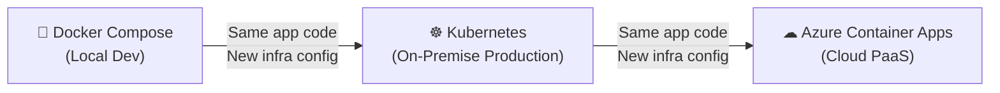

[← Back to Hexalith.EventStore](../../README.md)

# Deployment Progression Guide

This guide shows the big picture: how the same Hexalith.EventStore Counter sample application runs across three deployment environments — local Docker Compose, on-premise Kubernetes, and Azure Container Apps — with only infrastructure configuration changes. Use this page to understand the progression path and then follow the individual deployment guides for detailed walkthroughs.

> **Prerequisites:** [Prerequisites](../getting-started/prerequisites.md) — .NET 10 SDK, Docker Desktop, DAPR CLI, Aspire CLI

## The Zero-Code-Change Promise

The Counter sample application (`samples/Hexalith.EventStore.Sample/`) runs identically across all three deployment environments. The application code and domain logic do not change when moving between environments. You still publish and deploy environment-specific artifacts, but only infrastructure configuration — DAPR component YAML, secrets, and networking — changes.

This is enabled by DAPR's building block abstraction. The application talks to DAPR APIs (state store, pub/sub, service invocation, actors). DAPR talks to the infrastructure. When you swap Redis for PostgreSQL or Azure Cosmos DB, the application does not know and does not care.

## Progression Overview



<details>
<summary>Progression diagram text description</summary>

The diagram shows a three-tier deployment progression flowing left to right. Docker Compose (local development) connects to Kubernetes (on-premise production) with an arrow labeled "Same app code, New infra config". Kubernetes connects to Azure Container Apps (cloud PaaS) with the same label. Each transition changes only the infrastructure configuration while the application code remains identical.

</details>

## What Stays the Same

Across all three environments, the following remain identical:

| Aspect | Details |
|--------|---------|
| Application code | `samples/Hexalith.EventStore.Sample/` — zero changes between environments |
| Domain service logic | Command handlers, event Apply methods, aggregate state |
| Command/event contracts | `Hexalith.EventStore.Contracts` package — identical wire format |
| DAPR building block usage | State store, pub/sub, service invocation, actors |
| Health check endpoints | `/health`, `/alive`, `/ready` |
| REST API endpoints | Command submission, status query, replay |
| Domain service isolation | Domain services have zero infrastructure access (D4) |

## What Changes

| Aspect | Docker Compose | Kubernetes | Azure Container Apps |
|--------|---------------|-----------|---------------------|
| DAPR sidecar management | Manual container definitions | Operator-injected via annotations | Azure-managed (enable per app) |
| Component config format | File-mounted YAML | Kubernetes CRDs | ACA environment-level resources |
| Secret management | `.env` file | K8s Secrets + `secretKeyRef` | Managed identity + Key Vault |
| Networking | Docker network | K8s Service DNS | Container Apps Environment DNS |
| Authentication | Keycloak (local) | External OIDC provider | Entra ID (native) |
| Scaling | Manual replicas | HPA + KEDA | Built-in scaling rules + KEDA |
| Health probes | Docker `HEALTHCHECK` | K8s liveness/readiness/startup probes | ACA probes (K8s schema) |
| Container image delivery | Local build | Registry push | ACR integration |
| Service-to-service mTLS | Not available | DAPR Sentry (manual config) | Azure-managed (automatic) |
| IaC tool | `docker-compose.yaml` | Helm chart + `kubectl` | Bicep modules |
| Manifest generation | `aspire publish --docker` | `aspire publish --k8s` | `aspire publish --aca` |

## Environment Comparison Table

A comprehensive comparison for choosing and planning your deployment target (FR58):

| Category | Docker Compose | Kubernetes | Azure Container Apps |
|----------|---------------|-----------|---------------------|
| **DAPR Runtime Setup** | `dapr init` (Docker runtime) | `dapr init -k` (operator install) | None — Azure manages DAPR |
| **Component Configuration** | File-mounted YAML volumes | Kubernetes CRDs (`kubectl apply`) | Environment-level ACA resources (simplified schema) |
| **Secret Management** | `.env` file (excluded from source control) | K8s Secrets with DAPR `secretKeyRef` | Managed identity + Azure Key Vault |
| **Networking Model** | Docker Compose network (`service:` DNS) | K8s Service DNS (`<svc>.<ns>.svc.cluster.local`) | Container Apps Environment internal DNS |
| **Authentication Provider** | Keycloak container (local OIDC) | External OIDC (Entra ID, Okta, Auth0) | Entra ID (recommended, native Azure) |
| **Scaling Strategy** | Manual `replicas:` | HPA / KEDA autoscaling | Built-in scaling rules + KEDA (scale-to-zero) |
| **Health Check Implementation** | Docker `HEALTHCHECK` directive | K8s `livenessProbe`, `readinessProbe`, `startupProbe` | ACA probes (same schema as K8s) |
| **Container Image Delivery** | Local `docker build` | Push to container registry | ACR with managed identity pull |
| **Service-to-Service Security** | Docker network isolation only | SPIFFE-based mTLS via DAPR Sentry | Azure-managed mTLS (automatic) |
| **IaC Tool** | `docker-compose.yaml` | Helm chart + `kubectl` | Bicep / ARM templates |
| **Aspire Publisher Target** | `PUBLISH_TARGET=docker` | `PUBLISH_TARGET=k8s` | `PUBLISH_TARGET=aca` |
| **DAPR Install Command** | `dapr init` | `dapr init -k` | None required |
| **Approx. Resource Requirements** | Docker Desktop (4 GB RAM minimum) | Kubernetes cluster (3+ nodes recommended) | Azure subscription + resource group |
| **Estimated Cost (dev)** | Free (local machine) | Free (minikube/kind) to cluster costs | Pay-per-use (Container Apps consumption plan) |

> **Operational note:** For Kubernetes and Azure Container Apps publisher targets, use `EnableKeycloak=false` with `aspire publish` because Keycloak bind mounts are Docker-only in this repo's deployment flow. See [deploy/README.md](../../deploy/README.md) for exact publish commands.

## DAPR Component Configuration Across Environments

The same logical component — a state store — is configured differently in each environment, but the application code never changes. Only the DAPR component YAML differs.

**Docker Compose** — file-mounted YAML with Redis:

```yaml
apiVersion: dapr.io/v1alpha1
kind: Component
metadata:
  name: statestore
spec:
  type: state.redis
  version: v1
  metadata:
    - name: redisHost
      value: "redis:6379"
  scopes:
    - commandapi
```

**Kubernetes** — CRD with PostgreSQL and K8s Secrets:

```yaml
apiVersion: dapr.io/v1alpha1
kind: Component
metadata:
  name: statestore
  namespace: hexalith
spec:
  type: state.postgresql
  version: v1
  metadata:
    - name: connectionString
      secretKeyRef:
        name: postgres-credentials
        key: connection-string
  scopes:
    - commandapi
```

**Azure Container Apps** — simplified schema with Cosmos DB and managed identity:

```yaml
componentType: state.azure.cosmosdb
version: v1
metadata:
  - name: url
    value: "https://mycosmosdb.documents.azure.com:443/"
  - name: database
    value: "eventstore"
  - name: collection
    value: "actorstate"
  - name: azureClientId
    value: "<managed-identity-client-id>"
scopes:
  - commandapi
```

Notice: the schema format differs, the backend changes (Redis → PostgreSQL → Cosmos DB), the secret approach changes (env var → K8s Secret → managed identity), but scoping is always `commandapi` only (D4 principle) and the application code is unchanged.

## Choosing Your Deployment Target

**Docker Compose** — best for local development, demos, and single-machine testing. Simplest setup with everything running on your laptop. Use when: getting started, CI pipeline testing, quick demos, or evaluating the system.

**Kubernetes** — best for on-premise production, multi-node clusters, and teams with existing K8s infrastructure. Use when: running in your own data center, compliance requires on-premise hosting, your team already operates Kubernetes, or you need SPIFFE-based mTLS.

**Azure Container Apps** — best for cloud-native deployments with minimal infrastructure management. Use when: you have an Azure subscription, want managed DAPR with zero operator maintenance, prefer PaaS over IaaS, or want automatic mTLS and scale-to-zero.

## The Progression Path

### Step 1: Start with Docker Compose

**Guide:** [Docker Compose Deployment Guide](deployment-docker-compose.md)

Learn the foundational topology: Command API Gateway, domain service, DAPR sidecars, Redis for state and pub/sub, health endpoints, and the backend swap pattern.

**What you already know:** Local quickstart flow, Counter sample behavior, and basic Aspire dashboard navigation.

**What's new:** Docker Compose as a deployment target, DAPR runtime bootstrapping for local containers, deployment artifact generation via Aspire publisher, and environment-level infrastructure configuration.

**What you'll learn:**

- Aspire publisher workflow for generating deployment manifests
- DAPR building blocks: state store, pub/sub, service invocation, actors
- Health endpoints: `/health`, `/alive`, `/ready`
- Backend swap: change state store or pub/sub with zero code changes
- Domain service isolation principle (D4)

### Step 2: Move to Kubernetes

**Guide:** [Kubernetes Deployment Guide](deployment-kubernetes.md)

**What you already know:** Aspire publishing, DAPR building blocks, health endpoints, backend swap, domain service isolation.

**What's new:** DAPR operator with annotation-based sidecar injection, Kubernetes CRDs for component configuration, K8s Secrets with `secretKeyRef`, external OIDC authentication (replacing local Keycloak), Kubernetes probes (liveness/readiness/startup), Ingress exposure, and SPIFFE-based mTLS via DAPR Sentry.

### Step 3: Graduate to Azure Container Apps

**Guide:** [Azure Container Apps Deployment Guide](deployment-azure-container-apps.md)

**What you already know:** Everything from Docker Compose and Kubernetes — DAPR building blocks, CRD-style configuration, external OIDC, health probes, secret management patterns.

**What's new:** Azure-managed DAPR (no operator to install or maintain), Bicep infrastructure-as-code, managed identity replacing connection strings, Entra ID as the native OIDC provider, automatic mTLS with zero configuration, built-in scaling rules with scale-to-zero, and ACR integration for container images.

## Common Patterns Across All Environments

These patterns remain identical regardless of deployment target:

- **Composite key strategy:** `{tenant}:{domain}:{aggregateId}:events:{seq}`
- **Command status key:** `{tenant}:{correlationId}:status` with 24-hour TTL
- **Topic naming:** `{tenant}.{domain}.events`
- **Dead-letter routing:** `deadletter.{tenant}.{domain}.events`
- **Component scoping:** Only the `commandapi` app-id accesses state store and pub/sub (D4)
- **Deny-by-default access control:** Different implementation per environment, same security posture

## Backend Compatibility Matrix

Choose state store and pub/sub backends based on your deployment environment. See [`deploy/README.md`](../../deploy/README.md) for full per-backend configuration details.

**State Store Backends:**

| Backend | DAPR Component Type | Typical Environment | Key Features |
|---------|-------------------|-------------------|--------------|
| Redis | `state.redis` | Docker Compose (local) | Fast, simple setup |
| PostgreSQL | `state.postgresql` | Kubernetes | ACID transactions, range queries |
| Azure Cosmos DB | `state.azure.cosmosdb` | Azure Container Apps | Global distribution, elastic scale |

**Pub/Sub Backends:**

| Backend | DAPR Component Type | Typical Environment | Key Features |
|---------|-------------------|-------------------|--------------|
| Redis Streams | `pubsub.redis` | Docker Compose (local) | Simple setup, development |
| RabbitMQ | `pubsub.rabbitmq` | Kubernetes | Mature, flexible routing |
| Kafka | `pubsub.kafka` | Kubernetes | High throughput, log-based |
| Azure Service Bus | `pubsub.azure.servicebus.topics` | Azure Container Apps | Native Azure, enterprise features |

All state store backends support ETag optimistic concurrency, actor state store, and the composite key pattern. All pub/sub backends support CloudEvents 1.0, at-least-once delivery, dead-letter routing, and per-tenant-per-domain topic isolation.

## Next Steps

- [DAPR Component Configuration Reference](dapr-component-reference.md) — detailed per-backend setup
- [Security Model Documentation](security-model.md) — access control and mTLS patterns
- [Troubleshooting Guide](troubleshooting.md) — common issues and solutions
- **Individual deployment guides** for detailed walkthroughs:
    - [Docker Compose Deployment Guide](deployment-docker-compose.md)
    - [Kubernetes Deployment Guide](deployment-kubernetes.md)
    - [Azure Container Apps Deployment Guide](deployment-azure-container-apps.md)
