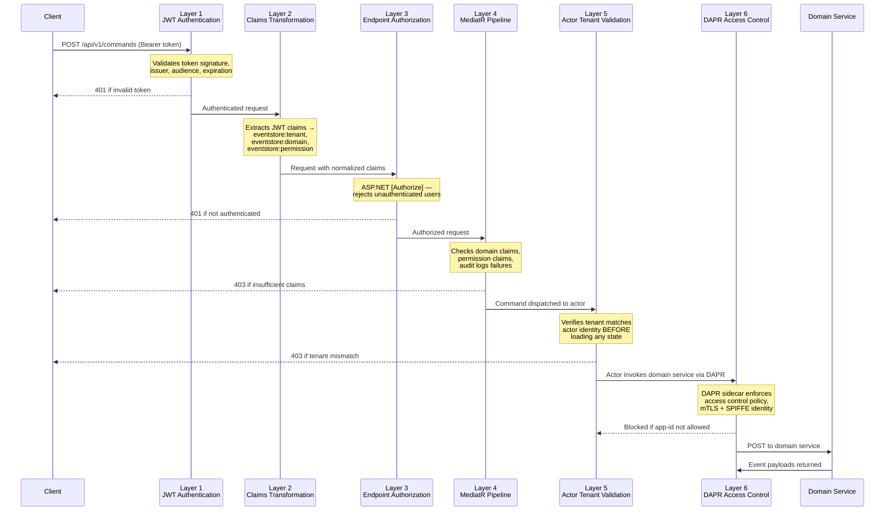

[<- Back to Hexalith.EventStore](../../README.md)

# Security Model

Hexalith.EventStore uses a six-layer defense-in-depth architecture where every layer independently rejects unauthorized requests. This page documents the complete security model — from JWT authentication at the API gateway to DAPR access control between sidecars — so you can configure authentication for your environment and understand exactly how the system protects multi-tenant data. Whether you are deploying to Docker Compose for local testing, Kubernetes for on-premise production, or Azure Container Apps for cloud hosting, this page is your single reference for the security architecture.

> **Prerequisites:**
>
> - [Prerequisites](../getting-started/prerequisites.md) — .NET 10 SDK, Docker Desktop, DAPR CLI
> - [Deployment Progression](deployment-progression.md) — understand the three deployment environments

## Security Architecture Overview

Every command request passes through six security layers before reaching your domain service code. Each layer enforces a specific concern, and each layer independently rejects unauthorized requests — a failure at any single layer stops the request. This deny-by-default-at-every-layer approach means that even if one layer is misconfigured, the remaining five still protect the system.

| Layer | Component                                  | What It Enforces                                              |
| ----- | ------------------------------------------ | ------------------------------------------------------------- |
| 1     | JWT Authentication                         | Token validity, issuer, audience, expiration                  |
| 2     | Claims Transformation                      | Extracts tenant/domain/permission from JWT custom claims      |
| 3     | Endpoint Authorization                     | ASP.NET Core `[Authorize]` — user must be authenticated       |
| 4     | MediatR Pipeline (`AuthorizationBehavior`) | Domain authorization, permission authorization, audit logging |
| 5     | Actor Tenant Validation                    | Tenant matches actor identity BEFORE state rehydration        |
| 6     | DAPR Access Control                        | Per-app-id allow list, deny-by-default, SPIFFE mTLS           |



<details>
<summary>Text description of the six-layer security flow</summary>

The diagram shows a command request flowing through six sequential security layers from left to right.

1. The client sends a POST request to /api/v1/commands with a Bearer token. Layer 1 (JWT Authentication) validates the token signature, issuer, audience, and expiration. If the token is invalid, a 401 Unauthorized response is returned immediately.

2. Layer 2 (Claims Transformation) extracts JWT custom claims and normalizes them into eventstore:tenant, eventstore:domain, and eventstore:permission claim types for downstream use.

3. Layer 3 (Endpoint Authorization) applies ASP.NET Core's [Authorize] attribute, rejecting any unauthenticated user with 401.

4. Layer 4 (MediatR Pipeline) runs the AuthorizationBehavior, which checks domain claims and permission claims against the submitted command. Failures return 403 Forbidden and are audit-logged with correlation ID, tenant, domain, command type, and source IP.

5. Layer 5 (Actor Tenant Validation) verifies that the command's tenant matches the actor identity before loading any state from the state store. This prevents tenant escape during actor rebalancing.

6. Layer 6 (DAPR Access Control) enforces service-to-service policies at the sidecar level. Only the eventstore app-id is allowed to invoke domain services, using mTLS with SPIFFE identity validation. Domain services return event payloads only.

Each layer independently rejects unauthorized requests — a failure at any layer stops the request from proceeding further.

</details>

## Layer 1: JWT Authentication

The API gateway validates every incoming request's JWT Bearer token before any business logic runs. The framework supports two authentication modes:

- **OIDC discovery (production):** When `Authority` is set, the gateway fetches signing keys from the identity provider's `/.well-known/openid-configuration` endpoint. This is the recommended mode for all production deployments.
- **Symmetric key (development):** When `SigningKey` is set (and `Authority` is not), the gateway validates tokens using an HS256 symmetric key. This mode is for local development and integration tests only.

### Configuration Options

All options are bound from the `Authentication:JwtBearer` configuration section:

| Option                 | Type      | Default         | Description                                                                                                   |
| ---------------------- | --------- | --------------- | ------------------------------------------------------------------------------------------------------------- |
| `Authority`            | `string?` | `null`          | OIDC authority URL for production (e.g., `https://login.example.com`). When set, enables OIDC discovery mode. |
| `Audience`             | `string`  | `""` (required) | Expected `aud` claim value in the JWT.                                                                        |
| `Issuer`               | `string`  | `""` (required) | Expected `iss` claim value in the JWT.                                                                        |
| `SigningKey`           | `string?` | `null`          | HS256 symmetric key for development. Must be at least 32 characters (256 bits).                               |
| `RequireHttpsMetadata` | `bool`    | `true`          | Whether OIDC metadata discovery requires HTTPS. Set to `false` for local Keycloak.                            |

Startup validation enforces that either `Authority` or `SigningKey` is configured, and that `Issuer` and `Audience` are always set. If both `Authority` and `SigningKey` are present, the runtime takes the OIDC path (`Authority` takes precedence), so you should still clear `SigningKey` when switching to production OIDC to avoid ambiguous configuration.

### Per-Environment Configuration

#### Local Docker Compose (Keycloak)

```yaml
# appsettings.Docker.json (or environment variables)
Authentication__JwtBearer__Authority: "http://localhost:8180/realms/hexalith"
Authentication__JwtBearer__Audience: "hexalith-eventstore"
Authentication__JwtBearer__Issuer: "http://localhost:8180/realms/hexalith"
Authentication__JwtBearer__RequireHttpsMetadata: "false"
# SigningKey must NOT be set — leave it empty for OIDC mode
```

See the [Docker Compose Deployment Guide](deployment-docker-compose.md) for full Keycloak setup instructions.

#### Kubernetes (External OIDC)

```yaml
# appsettings.Production.json or ConfigMap
Authentication__JwtBearer__Authority: "https://keycloak.example.com/realms/hexalith"
Authentication__JwtBearer__Audience: "hexalith-eventstore"
Authentication__JwtBearer__Issuer: "https://keycloak.example.com/realms/hexalith"
Authentication__JwtBearer__RequireHttpsMetadata: "true"
# CRITICAL: SigningKey must be empty/unset for OIDC mode
```

See the [Kubernetes Deployment Guide](deployment-kubernetes.md) for OIDC provider setup and secret management.

#### Azure Container Apps (Entra ID)

```yaml
# Application settings
Authentication__JwtBearer__Authority: "https://login.microsoftonline.com/{tenant-id}/v2.0"
Authentication__JwtBearer__Audience: "api://hexalith-eventstore"
Authentication__JwtBearer__Issuer: "https://login.microsoftonline.com/{tenant-id}/v2.0"
Authentication__JwtBearer__RequireHttpsMetadata: "true"
# CRITICAL: SigningKey must be empty string for OIDC mode
```

See the [Azure Container Apps Deployment Guide](deployment-azure-container-apps.md) for Entra ID app registration and managed identity setup.

### Token Validation Parameters

The gateway validates every token with these parameters:

- **Issuer validation:** Token `iss` must match configured `Issuer`
- **Audience validation:** Token `aud` must match configured `Audience`
- **Signing key validation:** Signature verified against OIDC-discovered keys or symmetric key
- **Lifetime validation:** Token must not be expired (with 1-minute clock skew tolerance)
- **Claim mapping disabled:** Original JWT claim names are preserved (`MapInboundClaims = false`) — no Microsoft namespace remapping

Authentication failures return [RFC 9457](https://tools.ietf.org/html/rfc9457) ProblemDetails responses with `401 Unauthorized` status. Security-relevant events are logged with `SecurityEvent`, `CorrelationId`, `SourceIp`, and `FailureLayer` fields — the JWT token itself is never logged.

## Layer 2: Claims Transformation

After JWT validation, `EventStoreClaimsTransformation` extracts custom claims from the JWT and normalizes them into `eventstore:*` claim types used by downstream authorization checks. The transformation is idempotent — if `eventstore:*` claims already exist, it skips processing.

### JWT Claim Mapping

| Source JWT Claim | Format                                                            | Target Claim                            | Example                            |
| ---------------- | ----------------------------------------------------------------- | --------------------------------------- | ---------------------------------- |
| `tenants`        | JSON array `["acme","globex"]` or space-delimited `"acme globex"` | `eventstore:tenant` (one per value)     | `eventstore:tenant` = `acme`       |
| `tenant_id`      | Single string                                                     | `eventstore:tenant`                     | `eventstore:tenant` = `acme`       |
| `tid`            | Single string (Azure AD format)                                   | `eventstore:tenant`                     | `eventstore:tenant` = `acme`       |
| `domains`        | JSON array or space-delimited                                     | `eventstore:domain` (one per value)     | `eventstore:domain` = `counter`    |
| `permissions`    | JSON array or space-delimited                                     | `eventstore:permission` (one per value) | `eventstore:permission` = `submit` |

The transformer tries JSON array parsing first (e.g., `["acme","globex"]`), then falls back to space-delimited parsing (e.g., `"acme globex"`). Both formats produce multiple individual claims. Singular claims (`tenant_id`, `tid`) are also supported — the transformer checks all formats to maximize compatibility with different identity providers.

### OIDC Protocol Mapper Configuration

Your identity provider must emit these custom claims in the JWT. Here is how to configure them:

**Keycloak:** Create protocol mappers on the `hexalith-eventstore` client:

- Type: "User Attribute" or "User Client Role" mapper
- Claim name: `tenants` (JSON array), `domains`, `permissions`
- Add to ID token: Yes
- Add to access token: Yes

**Entra ID (Azure AD):** Configure optional claims in the app registration manifest:

- Add `tid` (tenant ID) — included by default in v2.0 tokens
- Add custom claims for `domains` and `permissions` via claims mapping policies or app roles

## Layer 3: Endpoint Authorization

ASP.NET Core authorization middleware protects all command endpoints. The behavior is straightforward: any request without a valid, authenticated identity is rejected.

| Endpoint                                       | Authentication | Required Claims                                                    |
| ---------------------------------------------- | -------------- | ------------------------------------------------------------------ |
| `POST /api/v1/commands`                        | Required       | Valid JWT (any authenticated user)                                 |
| `GET /api/v1/commands/status/{correlationId}`  | Required       | Valid JWT + tenant claims (results filtered by authorized tenants) |
| `POST /api/v1/commands/replay/{correlationId}` | Required       | Valid JWT + tenant claims (tenant-scoped lookup before replay)     |
| `GET /health`                                  | Not required   | None (excluded from auth)                                          |
| `GET /ready`                                   | Not required   | None (excluded from auth)                                          |

Response codes:

- **401 Unauthorized:** Missing token, expired token, invalid signature, or unrecognized issuer/audience. Returns RFC 9457 ProblemDetails.
- **403 Forbidden:** Token is valid but the user lacks required claims (enforced in Layer 4).

## Layer 4: MediatR Pipeline Authorization

The `AuthorizationBehavior` runs as a MediatR pipeline behavior for every `SubmitCommand`. It performs three sequential authorization checks:

1. **Authentication check:** Verifies `user.Identity.IsAuthenticated == true`. Rejects with `CommandAuthorizationException` if not authenticated.

2. **Domain authorization:** If the user has `eventstore:domain` claims, the command's domain must match at least one claim (case-insensitive). If the user has no domain claims, all domains are allowed — domain scoping is opt-in.

3. **Permission authorization:** If the user has `eventstore:permission` claims, the command must match one of these patterns (case-insensitive):
    - `*` — wildcard, allows all operations
    - `submit` — allows all command submissions
    - Specific command type (e.g., `IncrementCounter`) — allows only that command type

    If the user has no permission claims, all commands are allowed — permission scoping is opt-in.

### Audit Logging

Every authorization decision is logged with structured fields:

- **Success:** `Debug` level with `CorrelationId`, `CausationId`, `Tenant`, `Domain`, `CommandType`
- **Failure:** `Warning` level with `SecurityEvent=AuthorizationDenied`, `CorrelationId`, `CausationId`, `TenantClaims`, `Tenant`, `Domain`, `CommandType`, `Reason`, `SourceIp`, `FailureLayer=MediatR.AuthorizationBehavior`

These structured log fields integrate with OpenTelemetry for security monitoring and alerting.

## Layer 5: Actor Tenant Validation

When a command reaches the `AggregateActor`, the actor verifies that the command's tenant matches the actor's identity **before loading any state from the state store**. This is security constraint SEC-2: tenant validation occurs before state rehydration.

Why this matters: DAPR actors can be rebalanced across nodes during scaling events. If tenant validation happened after state loading, a rebalanced actor could theoretically load state for the wrong tenant before discovering the mismatch. By validating first, the actor rejects the command immediately without touching the state store.

Additionally, command status queries (SEC-3) are tenant-scoped: the status key pattern `{tenant}:{correlationId}:status` ensures that tenant `acme` cannot query the status of a command submitted by tenant `globex`, even if they know the correlation ID.

## Layer 6: DAPR Access Control Policies

DAPR access control policies restrict which services can communicate with each other, enforced at the sidecar (network proxy) level. Each DAPR sidecar evaluates incoming service invocation requests against the access control configuration before forwarding them to the application.

### Production Access Control Configuration

Production uses one access-control file per receiving sidecar:

- `deploy/dapr/accesscontrol.yaml` — EventStore inbound policy
- `deploy/dapr/accesscontrol.eventstore-admin.yaml` — Admin.Server inbound policy
- `deploy/dapr/accesscontrol.sample.yaml` — sample domain-service inbound policy

The EventStore sidecar config is:

```yaml
# DAPR Access Control Configuration for the EventStore sidecar -- Production
# Bound ONLY to the EventStore sidecar.
#
# Security Posture: defaultAction: deny (secure by default)
apiVersion: dapr.io/v1alpha1
kind: Configuration
metadata:
    name: accesscontrol
spec:
    accessControl:
        # Deny-by-default: any service invocation not explicitly allowed is blocked
        defaultAction: deny

        # SPIFFE trust domain for mTLS identity validation.
        # All sidecars must present certificates from this trust domain.
        # Mismatched trust domains are rejected at TLS handshake.
        trustDomain: "{env:DAPR_TRUST_DOMAIN|hexalith.io}"

        policies:
            # eventstore-admin: trusted caller for EventStore admin passthrough.
            - appId: eventstore-admin
              defaultAction: deny
              trustDomain: "{env:DAPR_TRUST_DOMAIN|hexalith.io}"
              namespace: "{env:DAPR_NAMESPACE|hexalith}"
              operations:
                  # Admin.Server delegates reads and writes through EventStore.
                  - name: /**
                    httpVerb: ["GET", "POST", "PUT"]
                    action: allow
```

`accesscontrol.eventstore-admin.yaml` sets `defaultAction: deny` with `policies: []`, because no peer workload should invoke Admin.Server over DAPR.

`accesscontrol.sample.yaml` contains the POST-only `eventstore` caller policy that allows EventStore to invoke the sample domain service.

### Key Security Properties

- **Deny-by-default (D4):** The `defaultAction: deny` at the top level blocks any service invocation not explicitly listed in a policy.
- **SPIFFE trust domain:** mTLS (mutual TLS) is enforced between all sidecars. The `trustDomain` field configures which SPIFFE identity certificates are accepted. Sidecars with certificates from a different trust domain are rejected at the TLS handshake — before any application-level policy evaluation.
- **POST-only domain invocation:** The sample/domain-service sidecar policy allows only POST requests from `eventstore`. GET, PUT, and DELETE are blocked.
- **Admin passthrough isolation:** The EventStore sidecar allows only `eventstore-admin` to call its admin passthrough surface with the exact verbs currently required: GET, POST, and PUT.
- **Domain service isolation:** Domain services have zero allowed operations — they cannot invoke any other service, access the state store, or publish to pub/sub. They receive commands from `eventstore` and return event payloads. Nothing else.

### Azure Container Apps Difference

Azure Container Apps does not support DAPR `accesscontrol.yaml`. Instead, equivalent security is achieved through DAPR component scoping — restricting which app-ids can access each DAPR component (state store, pub/sub). Only the `eventstore` app-id is listed in component scopes. See the [Azure Container Apps Deployment Guide](deployment-azure-container-apps.md) for component scoping configuration.

## Multi-Tenant Isolation

Multi-tenancy is a first-class concern in Hexalith.EventStore — it is enforced through four complementary layers, each providing defense-in-depth:

1. **Input validation:** Colons, control characters, and non-ASCII are rejected in all identity components at construction time. This makes tenant key spaces structurally disjoint — no tenant can craft an identity that produces keys overlapping with another tenant's key space.

2. **Composite key prefixing:** Every state store key starts with `{tenant}:` (e.g., `acme:counter:counter-1:events:1`). A query for `acme:*` will never return data belonging to `globex`. This is a structural property of the [Identity Scheme](../concepts/identity-scheme.md), not a runtime filter.

3. **DAPR Actor scoping:** Each actor instance's state is scoped by the DAPR runtime to its actor ID, which embeds the tenant. Two actors with different tenant prefixes cannot read each other's state.

4. **JWT tenant enforcement:** The Command API validates JWT tenant claims at entry (Layer 4), and the AggregateActor re-validates tenant ownership as defense-in-depth (Layer 5). Even if a request bypasses the API gateway, the actor-level check prevents cross-tenant command processing.

### Topic Naming

Pub/sub topics use dot separators with the tenant prefix:

| Purpose           | Pattern                               | Example                          |
| ----------------- | ------------------------------------- | -------------------------------- |
| Event topic       | `{tenant}.{domain}.events`            | `acme.counter.events`            |
| Dead-letter topic | `deadletter.{tenant}.{domain}.events` | `deadletter.acme.counter.events` |

Topics are structurally isolated by tenant — tenant `acme`'s events go to `acme.counter.events`, while tenant `globex`'s events go to `globex.counter.events`. No subscription configuration overlap is possible.

For the complete key derivation patterns and validation rules, see the [Identity Scheme](../concepts/identity-scheme.md) documentation.

## Input Validation and Sanitization

Input validation happens at two layers: the HTTP request validator (`SubmitCommandRequestValidator`) at the API boundary, and the extension metadata sanitizer (`ExtensionMetadataSanitizer`) for injection prevention.

### Command Field Validation

All command fields are validated at the API gateway before entering the MediatR pipeline:

| Field           | Validation Rules                                                                                 | Max Length |
| --------------- | ------------------------------------------------------------------------------------------------ | ---------- |
| `Tenant`        | Required, lowercase alphanumeric + hyphens (`^[a-z0-9]([a-z0-9-]*[a-z0-9])?$`)                   | 128 chars  |
| `Domain`        | Required, lowercase alphanumeric + hyphens (`^[a-z0-9]([a-z0-9-]*[a-z0-9])?$`)                   | 128 chars  |
| `AggregateId`   | Required, alphanumeric + dots/hyphens/underscores (`^[a-zA-Z0-9]([a-zA-Z0-9._-]*[a-zA-Z0-9])?$`) | 256 chars  |
| `CommandType`   | Required, no dangerous characters (`<`, `>`, `&`, `'`, `"`)                                      | 256 chars  |
| `Payload`       | Required, valid JSON                                                                             | —          |
| `CorrelationId` | Required                                                                                         | —          |

Dangerous characters (`<`, `>`, `&`, `'`, `"`) are rejected in `CommandType` and all extension metadata keys and values to prevent injection attacks.

### Request Body Constraints

Command submission payload size is capped at **1 MB**:

- Endpoint-level cap via `[RequestSizeLimit(1_048_576)]` on command submission and replay endpoints
- Host-level cap via Kestrel `MaxRequestBodySize = 1_048_576`

Requests exceeding this limit are rejected before command processing.

### Extension Metadata Limits

Extension metadata is validated at two levels for defense-in-depth:

| Limit            | Request Validator | Sanitizer (Configurable) |
| ---------------- | ----------------- | ------------------------ |
| Max entries      | 50                | 32 (default)             |
| Max key length   | 100 chars         | 128 chars (default)      |
| Max value length | 1,000 chars       | 2,048 chars (default)    |
| Max total size   | 64 KB             | 4,096 bytes (default)    |

Extension keys must match `[a-zA-Z0-9][a-zA-Z0-9._-]*` — only alphanumeric characters, dots, hyphens, and underscores are allowed. Values cannot contain control characters (below 0x20, except tab, newline, carriage return).

### Injection Prevention Patterns (SEC-4)

The `ExtensionMetadataSanitizer` scans all extension values for known injection patterns:

| Category       | Patterns Detected                                                |
| -------------- | ---------------------------------------------------------------- |
| XSS            | `<script`, `javascript:`, `on*=`, `<iframe`, `<object`, `<embed` |
| SQL injection  | `'; DROP`, `UNION SELECT`, `--` (end of line)                    |
| LDAP injection | `)(`, `*)(`, `\|(`, `&(`                                         |
| Path traversal | `../`, `..\`                                                     |

Any extension containing a detected pattern is rejected with a specific rejection reason. The sanitizer configuration is bound from the `EventStore:ExtensionMetadata` section and can be tuned per deployment.

### Payload Security (SEC-5)

Command payloads (the business data inside each command) are never logged anywhere in the system. Only envelope metadata fields (tenant, domain, aggregate ID, command type, correlation ID) appear in structured logs and OpenTelemetry traces. This prevents accidental exposure of sensitive business data through logging infrastructure.

## Rate Limiting

Per-tenant rate limiting uses ASP.NET Core's `SlidingWindowRateLimiter`, partitioned by the `eventstore:tenant` claim (the normalized claim produced by claims transformation in Layer 2). Each tenant gets an independent rate limit window — one tenant's traffic spike does not affect other tenants.

### Configuration

Options are bound from the `EventStore:RateLimiting` configuration section:

| Option              | Default | Description                                                    |
| ------------------- | ------- | -------------------------------------------------------------- |
| `PermitLimit`       | 100     | Maximum requests per window per tenant                         |
| `WindowSeconds`     | 60      | Sliding window duration in seconds                             |
| `SegmentsPerWindow` | 6       | Number of window segments (10-second granularity at defaults)  |
| `QueueLimit`        | 0       | Requests to queue when limit reached (0 = immediate rejection) |

```json
{
    "EventStore": {
        "RateLimiting": {
            "PermitLimit": 200,
            "WindowSeconds": 60,
            "SegmentsPerWindow": 6,
            "QueueLimit": 0
        }
    }
}
```

### Behavior

- Tenant extraction uses the `eventstore:tenant` claim (after Layer 2 claims transformation) for rate limit partitioning. If no tenant claim is present, the partition key defaults to `"anonymous"`
- Health (`/health`) and readiness (`/ready`) endpoints are excluded from rate limiting
- When a tenant exceeds their limit, the API returns **HTTP 429 Too Many Requests** immediately (no queuing with default `QueueLimit: 0`)
- The sliding window with 6 segments provides 10-second granularity — burst traffic within a segment counts against the window total, but the window slides smoothly rather than resetting at fixed intervals

### Tuning for Production

Adjust `PermitLimit` based on your expected per-tenant command volume. For high-throughput tenants, increase the limit. For shared environments with many tenants, consider lower limits to ensure fair resource allocation. The `QueueLimit` option allows queuing excess requests instead of rejecting them immediately — set it to a small positive value (e.g., 10) if you prefer graceful degradation over immediate rejection.

## Secrets Management

Secrets must never be stored in application code or committed to source control. Each deployment environment has its own secrets management approach.

### Per-Environment Secrets Management

| Secret                         | Docker Compose             | Kubernetes                            | Azure Container Apps           |
| ------------------------------ | -------------------------- | ------------------------------------- | ------------------------------ |
| JWT signing key (dev only)     | `.env` file (gitignored)   | N/A (use OIDC)                        | N/A (use OIDC)                 |
| OIDC client secret             | `.env` file (gitignored)   | `kubectl create secret`               | Managed Identity (recommended) |
| Database connection string     | `.env` file (gitignored)   | `secretKeyRef` in DAPR component YAML | Managed Identity or Key Vault  |
| Message broker credentials     | `.env` file (gitignored)   | `secretKeyRef` in DAPR component YAML | Managed Identity or Key Vault  |
| DAPR trust domain certificates | Auto-generated (local dev) | DAPR Sentry auto-managed              | DAPR managed by ACA            |

#### Docker Compose

Store secrets in a `.env` file at the project root (already in `.gitignore`). Reference them in `docker-compose.yaml` via environment variable injection:

```yaml
services:
    eventstore:
        environment:
            - Authentication__JwtBearer__SigningKey=${JWT_SIGNING_KEY}
```

See the [Docker Compose Deployment Guide](deployment-docker-compose.md) for the complete `.env` template.

#### Kubernetes

Use `kubectl create secret` to create Kubernetes secrets, then reference them in DAPR component YAML using `secretKeyRef`:

```yaml
# DAPR component referencing a Kubernetes secret
spec:
    metadata:
        - name: connectionString
          secretKeyRef:
              name: redis-secret
              key: connection-string
```

DAPR supports `{env:VAR_NAME}` substitution in component YAML for environment-variable-based secrets. See the [Kubernetes Deployment Guide](deployment-kubernetes.md) for secret management details.

#### Azure Container Apps

Use **Managed Identity** (recommended) to eliminate connection strings entirely — Azure services authenticate via identity without shared secrets. For non-Azure services, store secrets in **Azure Key Vault** and reference them as ACA secrets:

```bash
az containerapp secret set \
  --name eventstore \
  --resource-group hexalith-rg \
  --secrets "redis-password=keyvaultref:<key-vault-uri>/secrets/redis-password,identityref:<managed-identity-id>"
```

See the [Azure Container Apps Deployment Guide](deployment-azure-container-apps.md) for managed identity and Key Vault configuration.

### Critical Secrets Checklist

Never commit these values to source control:

- JWT signing keys (development HS256 keys)
- OIDC client secrets
- Database connection strings (Redis, PostgreSQL, Cosmos DB)
- Message broker credentials (Redis Streams, Azure Service Bus, Kafka)
- DAPR trust domain private keys and certificates

## Security Checklist for Production

Verify every item before deploying to production:

| Item                           | Check                                                       | Notes                                                      |
| ------------------------------ | ----------------------------------------------------------- | ---------------------------------------------------------- |
| OIDC authority configured      | `Authority` set, `SigningKey` empty                         | Never use symmetric keys in production                     |
| Issuer and audience validated  | `Issuer` and `Audience` match identity provider             | Startup validation will fail if missing                    |
| HTTPS metadata required        | `RequireHttpsMetadata: true`                                | Only `false` for local Keycloak                            |
| DAPR access control applied    | `accesscontrol.yaml` deployed with `defaultAction: deny`    | K8s only; ACA uses component scoping                       |
| SPIFFE trust domain configured | `trustDomain` matches deployment environment                | Mismatched domains block all sidecar communication         |
| Secrets injected securely      | All secrets via env vars, K8s secrets, or Key Vault         | No hardcoded values in config files or source              |
| TLS 1.2+ enforced              | HTTPS on all external endpoints                             | Required by NFR9                                           |
| Rate limiting configured       | `PermitLimit` tuned per tenant load expectations            | Default: 100 requests/60 seconds                           |
| Payload redaction verified     | No event payloads in structured logs                        | Required by NFR12/SEC-5                                    |
| Component scoping configured   | State store and pub/sub scoped to `eventstore` only         | Prevents domain services from direct infrastructure access |
| Custom claims configured       | Identity provider emits `tenants`, `domains`, `permissions` | Required for domain/permission authorization               |
| Extension metadata limits set  | `EventStore:ExtensionMetadata` configured for production    | Defaults are conservative but review for your use case     |

## Next Steps

- [Troubleshooting Guide](troubleshooting.md) — common deployment and security issues
- [DAPR Component Configuration Reference](dapr-component-reference.md) — component scoping, state store and pub/sub configuration
- [Identity Scheme](../concepts/identity-scheme.md) — complete key derivation patterns and validation rules
- [Command API Reference](../reference/command-api.md) — endpoint authentication requirements and error responses
- [Docker Compose Deployment Guide](deployment-docker-compose.md) — Keycloak setup and local secrets
- [Kubernetes Deployment Guide](deployment-kubernetes.md) — OIDC provider setup and Kubernetes secrets
- [Azure Container Apps Deployment Guide](deployment-azure-container-apps.md) — Entra ID and managed identity
- [Deployment Progression](deployment-progression.md) — how security configuration changes across environments
