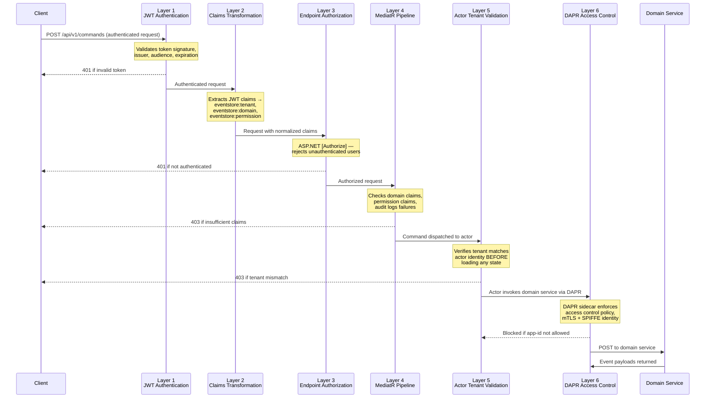

[<- Back to Hexalith.EventStore](../../README.md)

# Security Model

Hexalith.EventStore uses a six-layer defense-in-depth architecture where every layer independently rejects unauthorized requests. This page documents the complete security model — from JWT authentication at the API gateway to DAPR access control between sidecars — so you can configure authentication for your environment and understand exactly how the system protects multi-tenant data. Whether you are deploying to Docker Compose for local testing, Kubernetes for on-premise production, or Azure Container Apps for cloud hosting, this page is your single reference for the security architecture.

> **Prerequisites:**
>
> - [Prerequisites](../getting-started/prerequisites.md) — .NET 10 SDK, Docker Desktop, DAPR CLI
> - [Deployment Progression](deployment-progression.md) — understand the three deployment environments

## Security Architecture Overview

Every command request passes through six security layers before reaching your domain service code. Each layer enforces a specific concern, and each layer independently rejects unauthorized requests — a failure at any single layer stops the request. This deny-by-default-at-every-layer approach means that even if one layer is misconfigured, the remaining five still protect the system.

| Layer | Component                                  | What It Enforces                                              |
| ----- | ------------------------------------------ | ------------------------------------------------------------- |
| 1     | JWT Authentication                         | Token validity, issuer, audience, expiration                  |
| 2     | Claims Transformation                      | Extracts tenant/domain/permission from JWT custom claims      |
| 3     | Endpoint Authorization                     | ASP.NET Core `[Authorize]` — user must be authenticated       |
| 4     | MediatR Pipeline (`AuthorizationBehavior`) | Domain authorization, permission authorization, audit logging |
| 5     | Actor Tenant Validation                    | Tenant matches actor identity BEFORE state rehydration        |
| 6     | DAPR Access Control                        | Per-app-id allow list, deny-by-default, SPIFFE mTLS           |


```mermaid
sequenceDiagram
    participant Client
    participant L1 as Layer 1<br/>JWT Authentication
    participant L2 as Layer 2<br/>Claims Transformation
    participant L3 as Layer 3<br/>Endpoint Authorization
    participant L4 as Layer 4<br/>MediatR Pipeline
    participant L5 as Layer 5<br/>Actor Tenant Validation
    participant L6 as Layer 6<br/>DAPR Access Control
    participant DS as Domain Service

    Client->>L1: POST /api/v1/commands (authenticated request)
    Note over L1: Validates token signature,<br/>issuer, audience, expiration
    L1-->>Client: 401 if invalid token

    L1->>L2: Authenticated request
    Note over L2: Extracts JWT claims →<br/>eventstore:tenant,<br/>eventstore:domain,<br/>eventstore:permission

    L2->>L3: Request with normalized claims
    Note over L3: ASP.NET [Authorize] —<br/>rejects unauthenticated users
    L3-->>Client: 401 if not authenticated

    L3->>L4: Authorized request
    Note over L4: Checks domain claims,<br/>permission claims,<br/>audit logs failures
    L4-->>Client: 403 if insufficient claims

    L4->>L5: Command dispatched to actor
    Note over L5: Verifies tenant matches<br/>actor identity BEFORE<br/>loading any state
    L5-->>Client: 403 if tenant mismatch

    L5->>L6: Actor invokes domain service via DAPR
    Note over L6: DAPR sidecar enforces<br/>access control policy,<br/>mTLS + SPIFFE identity
    L6-->>L5: Blocked if app-id not allowed

    L6->>DS: POST to domain service
    DS->>L6: Event payloads returned
```

<details>
<summary>Text description of the six-layer security flow</summary>

The diagram shows a command request flowing through six sequential security layers from left to right.

1. The client sends a POST request to /api/v1/commands with a Bearer token. Layer 1 (JWT Authentication) validates the token signature, issuer, audience, and expiration. If the token is invalid, a 401 Unauthorized response is returned immediately.

2. Layer 2 (Claims Transformation) extracts JWT custom claims and normalizes them into eventstore:tenant, eventstore:domain, and eventstore:permission claim types for downstream use.

3. Layer 3 (Endpoint Authorization) applies ASP.NET Core's [Authorize] attribute, rejecting any unauthenticated user with 401.

4. Layer 4 (MediatR Pipeline) runs the AuthorizationBehavior, which checks domain claims and permission claims against the submitted command. Failures return 403 Forbidden and are audit-logged with correlation ID, tenant, domain, command type, and source IP.

5. Layer 5 (Actor Tenant Validation) verifies that the command's tenant matches the actor identity before loading any state from the state store. This prevents tenant escape during actor rebalancing.

6. Layer 6 (DAPR Access Control) enforces service-to-service policies at the sidecar level. Only the eventstore app-id is allowed to invoke domain services, using mTLS with SPIFFE identity validation. Domain services return event payloads only.

Each layer independently rejects unauthorized requests — a failure at any layer stops the request from proceeding further.

</details>

## Layer 1: JWT Authentication

The API gateway validates every incoming request's JWT Bearer token before any business logic runs. The framework supports two authentication modes:

- **OIDC discovery (production):** When `Authority` is set, the gateway fetches signing keys from the identity provider's `/.well-known/openid-configuration` endpoint. This is the recommended mode for all production deployments.
- **Symmetric key (development):** When `SigningKey` is set (and `Authority` is not), the gateway validates tokens using an HS256 symmetric key. This mode is for local development and integration tests only.

### Configuration Options

All options are bound from the `Authentication:JwtBearer` configuration section:

| Option                 | Type      | Default         | Description                                                                                                   |
| ---------------------- | --------- | --------------- | ------------------------------------------------------------------------------------------------------------- |
| `Authority`            | `string?` | `null`          | OIDC authority URL for production (e.g., `https://login.example.com`). When set, enables OIDC discovery mode. |
| `Audience`             | `string`  | `""`            | Primary accepted `aud` claim value. Optional when `ValidAudiences` supplies at least one non-blank value.     |
| `ValidAudiences`       | `string[]`| `[]`            | Alternative or additional accepted audiences; at least one audience is required across both settings.        |
| `AllowedAlgorithms`    | `string[]`| `[]` (required for authority mode) | Explicit supported asymmetric algorithm allow-list; no Production default is supplied.            |
| `Issuer`               | `string`  | `""` (required) | Expected `iss` claim value in the JWT.                                                                        |
| `SigningKey`           | `string?` | `null`          | HS256 symmetric key for development. Must be at least 32 UTF-8 bytes (256 bits).                              |
| `RequireHttpsMetadata` | `bool`    | `true`          | Whether OIDC metadata discovery requires HTTPS. Set to `false` for local Keycloak.                            |
| `AllowInsecureSymmetricKey` | `bool` | `false`       | Explicit exception for symmetric validation in non-Production, non-Development environments; emits a redacted warning. |

Startup validation requires exactly one of `Authority` or `SigningKey`, a non-blank `Issuer`, and at least one non-blank audience across `Audience` and `ValidAudiences`. Authority mode also requires a nonempty `AllowedAlgorithms` list containing only supported asymmetric algorithms. An authority must be absolute and contain no user information, query, or fragment. Outside Development it must use HTTPS and `RequireHttpsMetadata` must remain `true`. Production always rejects symmetric validation, including when the legacy exception flag is set.

### Per-Environment Configuration

#### Local Docker Compose (Keycloak)

```yaml
# appsettings.Docker.json (or environment variables)
DOTNET_ENVIRONMENT: "Development"
Authentication__JwtBearer__Authority: "http://security:8080/realms/hexalith"
Authentication__JwtBearer__Audience: "hexalith-eventstore"
Authentication__JwtBearer__Issuer: "http://security:8080/realms/hexalith"
Authentication__JwtBearer__AllowedAlgorithms__0: "RS256"
Authentication__JwtBearer__RequireHttpsMetadata: "false"
# SigningKey must NOT be set — leave it empty for OIDC mode
```

The HTTP Keycloak authority is a Development-only local topology. It is accepted only with
`DOTNET_ENVIRONMENT=Development` and `RequireHttpsMetadata=false`; never carry either setting into
a Production deployment.

See the [Docker Compose Deployment Guide](deployment-docker-compose.md) for full Keycloak setup instructions.

#### Kubernetes (External OIDC)

```yaml
# appsettings.Production.json or ConfigMap
Authentication__JwtBearer__Authority: "https://keycloak.example.com/realms/hexalith"
Authentication__JwtBearer__Audience: "hexalith-eventstore"
Authentication__JwtBearer__Issuer: "https://keycloak.example.com/realms/hexalith"
Authentication__JwtBearer__AllowedAlgorithms__0: "RS256"
Authentication__JwtBearer__RequireHttpsMetadata: "true"
# CRITICAL: SigningKey must be empty/unset for OIDC mode
```

See the [Kubernetes Deployment Guide](deployment-kubernetes.md) for OIDC provider setup and secret management.

#### Azure Container Apps (Entra ID)

```yaml
# Application settings
Authentication__JwtBearer__Authority: "https://login.microsoftonline.com/{tenant-id}/v2.0"
Authentication__JwtBearer__Audience: "api://hexalith-eventstore"
Authentication__JwtBearer__Issuer: "https://login.microsoftonline.com/{tenant-id}/v2.0"
Authentication__JwtBearer__AllowedAlgorithms__0: "RS256"
Authentication__JwtBearer__RequireHttpsMetadata: "true"
# CRITICAL: SigningKey must be empty string for OIDC mode
```

See the [Azure Container Apps Deployment Guide](deployment-azure-container-apps.md) for Entra ID app registration and managed identity setup.

### Token Validation Parameters

The gateway validates every token with these parameters:

- **Issuer validation:** Token `iss` must match configured `Issuer`
- **Audience validation:** Token `aud` must match any configured `Audience` or `ValidAudiences` value
- **Signing key validation:** Signature verified against OIDC-discovered keys or symmetric key
- **Lifetime validation:** Token must contain an expiry and be currently valid (with 1-minute clock skew tolerance)
- **Algorithm validation:** OIDC accepts only the explicit RSA/PSS/ECDSA allow-list; symmetric mode accepts only HS256
- **Claim mapping disabled:** Original JWT claim names are preserved (`MapInboundClaims = false`) — no Microsoft namespace remapping

Authentication failures return [RFC 9457](https://tools.ietf.org/html/rfc9457) ProblemDetails responses with `401 Unauthorized` status. Security-relevant events are logged with `SecurityEvent`, `CorrelationId`, `SourceIp`, and `FailureLayer` fields — the JWT token itself is never logged.

## Layer 2: Claims Transformation

After JWT validation, `EventStoreClaimsTransformation` extracts custom claims from the JWT and normalizes them into `eventstore:*` claim types used by downstream authorization checks. The transformation is idempotent — if `eventstore:*` claims already exist, it skips processing.

### JWT Claim Mapping

| Source JWT Claim | Format                                                            | Target Claim                            | Example                            |
| ---------------- | ----------------------------------------------------------------- | --------------------------------------- | ---------------------------------- |
| `tenants`        | JSON array `["acme","globex"]` or space-delimited `"acme globex"` | `eventstore:tenant` (one per value)     | `eventstore:tenant` = `acme`       |
| `tenant_id`      | Single string                                                     | `eventstore:tenant`                     | `eventstore:tenant` = `acme`       |
| `tid`            | Single string (Azure AD format)                                   | `eventstore:tenant`                     | `eventstore:tenant` = `acme`       |
| `domains`        | JSON array or space-delimited                                     | `eventstore:domain` (one per value)     | `eventstore:domain` = `counter`    |
| `permissions`    | JSON array or space-delimited                                     | `eventstore:permission` (one per value) | `eventstore:permission` = `submit` |

The transformer tries JSON array parsing first (e.g., `["acme","globex"]`), then falls back to space-delimited parsing (e.g., `"acme globex"`). Both formats produce multiple individual claims. Singular claims (`tenant_id`, `tid`) are also supported — the transformer checks all formats to maximize compatibility with different identity providers.

### OIDC Protocol Mapper Configuration

Your identity provider must emit these custom claims in the JWT. Here is how to configure them:

**Keycloak:** Create protocol mappers on the `hexalith-eventstore` client:

- Type: "User Attribute" or "User Client Role" mapper
- Claim name: `tenants` (JSON array), `domains`, `permissions`
- Add to ID token: Yes
- Add to access token: Yes

**Entra ID (Azure AD):** Configure optional claims in the app registration manifest:

- Add `tid` (tenant ID) — included by default in v2.0 tokens
- Add custom claims for `domains` and `permissions` via claims mapping policies or app roles

## Layer 3: Endpoint Authorization

ASP.NET Core authorization middleware protects all command endpoints. The behavior is straightforward: any request without a valid, authenticated identity is rejected.

| Endpoint                                       | Authentication | Required Claims                                                    |
| ---------------------------------------------- | -------------- | ------------------------------------------------------------------ |
| `POST /api/v1/commands`                        | Required       | Valid JWT (any authenticated user)                                 |
| `GET /api/v1/commands/status/{correlationId}`  | Required       | Valid JWT + tenant claims (results filtered by authorized tenants) |
| `POST /api/v1/commands/replay/{correlationId}` | Required       | Valid JWT + tenant claims (tenant-scoped lookup before replay)     |
| `GET /health`                                  | Not required   | None (excluded from auth)                                          |
| `GET /ready`                                   | Not required   | None (excluded from auth)                                          |

Response codes:

- **401 Unauthorized:** Missing token, expired token, invalid signature, or unrecognized issuer/audience. Returns RFC 9457 ProblemDetails.
- **403 Forbidden:** Token is valid but the user lacks required claims (enforced in Layer 4).

## Layer 4: Gateway Tenant and RBAC Authorization

EventStore owns command and query gateway tenant/RBAC enforcement before any domain service, projection actor, ETag, cache, replay, or read-model lookup can disclose resource existence. The request path resolves an immutable authorization context from the gateway contract and authenticated principal:

| Field | Source | Notes |
| --- | --- | --- |
| `tenantId` | Command/query DTO `tenant` | Missing or conflicting tenant sources fail closed before downstream invocation. |
| `subjectId` | JWT `sub` claim | `name` and other display claims are never identity authority. |
| `messageCategory` | Gateway path | `command` for command submit/validate, `query` for query submit/validate. |
| `messageType` | DTO `commandType` or `queryType` | Used for specific permission checks. |
| `aggregateId` | DTO `aggregateId` | Forwarded unchanged when present. |
| `correlationId` | Correlation middleware/request | Logged for diagnostics; payloads and tokens are not logged. |

The pipeline order is:

1. Authenticate the HTTP request.
2. Resolve tenant, subject, domain, message category, message type, aggregate/projection identity, correlation ID, and cancellation token.
3. Validate tenant lifecycle and membership through `ITenantValidator`.
4. Validate role/domain/permission through `IRbacValidator`.
5. Invoke the command handler, domain service, query router, projection actor, ETag/cache lookup, replay, or read-model path.

`ClaimsTenantValidator` and `ClaimsRbacValidator` are local/dev/test fallback implementations. They can prove claim membership, domain, and permission strings, but they cannot prove tenant lifecycle, stale data, ambiguous authority, or Tenants role hierarchy. Runtime deployments that need Hexalith.Tenants authority configure actor-backed validators through `EventStore:Authorization:TenantValidatorActorName` and `EventStore:Authorization:RbacValidatorActorName`; when those validators are configured, stale, unavailable, malformed, ambiguous, or null responses fail closed and never fall back to claims.

### Authorization Reason Codes

Authorization failures return stable machine-readable `reasonCode` values separate from human-readable `reason`/`detail` text:

| Reason code | HTTP/preflight behavior | Retry | Caller action |
| --- | --- | --- | --- |
| `authentication_required` | 401 ProblemDetails | No | Provide a valid token. |
| `subject_missing` | 401 or 403 depending on path | No | Fix token subject claim. |
| `tenant_missing` | 403 ProblemDetails or preflight denied | No | Provide tenant ID. |
| `tenant_mismatch` | 403 ProblemDetails or preflight denied | No | Align route/body/client tenant values. |
| `tenant_not_found` | 403 ProblemDetails or preflight denied | No | Verify tenant exists. |
| `tenant_disabled` | 403 ProblemDetails or preflight denied | No | Reactivate or choose another tenant. |
| `tenant_suspended` | 403 ProblemDetails or preflight denied | No | Resolve tenant suspension. |
| `tenant_stale` | 403 ProblemDetails or preflight denied | Yes | Retry after freshness recovers. |
| `tenant_unavailable` | 403 ProblemDetails or preflight denied | Yes | Retry or check Tenants authority. |
| `tenant_ambiguous` | 403 ProblemDetails or preflight denied | No | Fix duplicate/conflicting authority data. |
| `principal_not_member` | 403 ProblemDetails or preflight denied | No | Grant tenant membership. |
| `insufficient_role` | 403 ProblemDetails or preflight denied | No | Grant required role. |
| `insufficient_permission` | 403 ProblemDetails or preflight denied | No | Grant required permission. |
| `authorization_service_unavailable` | 503 ProblemDetails with `Retry-After: 30` | Yes | Retry after the specified interval. |

The approved Tenants-backed integration shape for this story is the existing DAPR actor adapter boundary. EventStore calls `ITenantValidatorActor.ValidateTenantAccessAsync(TenantValidationRequest)` and `IRbacValidatorActor.ValidatePermissionAsync(RbacValidationRequest)` through configured actor type names and tenant-scoped actor IDs. The adapter forwards subject, tenant, domain, message type/category, aggregate ID, and cancellation state without reading Hexalith.Tenants state-store keys, projection actor state, or internal aggregates. Actor responses must return `IsAuthorized`, optional safe `Reason`, and optional stable `ReasonCode`; legacy or malformed denied responses remain denied and map to fail-closed fallback reason codes.

### Audit Logging

Every authorization decision is logged with structured fields:

- **Success:** `Debug` level with `CorrelationId`, `CausationId`, `Tenant`, `Domain`, `CommandType`
- **Failure:** `Warning` level with `SecurityEvent=AuthorizationDenied`, `CorrelationId`, `CausationId`, `TenantClaims`, `Tenant`, `Domain`, `CommandType`, stable reason code/detail, `SourceIp`, `FailureLayer=MediatR.AuthorizationBehavior`

These structured log fields integrate with OpenTelemetry for security monitoring and alerting.

## Layer 5: Actor Tenant Validation

When a command reaches the `AggregateActor`, the actor verifies that the command's tenant matches the actor's identity **before loading any state from the state store**. This is security constraint SEC-2: tenant validation occurs before state rehydration.

Why this matters: DAPR actors can be rebalanced across nodes during scaling events. If tenant validation happened after state loading, a rebalanced actor could theoretically load state for the wrong tenant before discovering the mismatch. By validating first, the actor rejects the command immediately without touching the state store.

Additionally, command status queries (SEC-3) are tenant-scoped: the status key pattern `{tenant}:{correlationId}:status` ensures that tenant `acme` cannot query the status of a command submitted by tenant `globex`, even if they know the correlation ID.

## Layer 6: DAPR Access Control Policies

DAPR access control policies restrict which services can communicate with each other, enforced at the sidecar (network proxy) level. Each DAPR sidecar evaluates incoming service invocation requests against the access control configuration before forwarding them to the application.

### Production Access Control Configuration

Production uses one access-control file per receiving sidecar:

- `deploy/dapr/accesscontrol.yaml` — EventStore inbound policy
- `deploy/dapr/accesscontrol.eventstore-admin.yaml` — Admin.Server inbound policy
- `deploy/dapr/accesscontrol.sample.yaml` — sample domain-service inbound policy

The EventStore sidecar config is:

```yaml
# DAPR Access Control Configuration for the EventStore sidecar -- Production
# Bound ONLY to the EventStore sidecar.
#
# Security Posture: defaultAction: deny (secure by default)
apiVersion: dapr.io/v1alpha1
kind: Configuration
metadata:
    name: accesscontrol
spec:
    accessControl:
        # Deny-by-default: any service invocation not explicitly allowed is blocked
        defaultAction: deny

        # SPIFFE trust domain for mTLS identity validation.
        # All sidecars must present certificates from this trust domain.
        # Mismatched trust domains are rejected at TLS handshake.
        trustDomain: "{env:DAPR_TRUST_DOMAIN|hexalith.io}"

        policies:
            # eventstore-admin: trusted caller for EventStore admin passthrough.
            - appId: eventstore-admin
              defaultAction: deny
              trustDomain: "{env:DAPR_TRUST_DOMAIN|hexalith.io}"
              namespace: "{env:DAPR_NAMESPACE|hexalith}"
              operations:
                  # Admin.Server delegates reads and writes through EventStore.
                  - name: /**
                    httpVerb: ["GET", "POST", "PUT"]
                    action: allow
```

`accesscontrol.eventstore-admin.yaml` allows the `eventstore-admin-ui` caller to invoke Admin.Server over DAPR in the local topology. For production with mTLS, keep deny-by-default semantics and explicitly grant only approved Admin.Server callers.

`accesscontrol.sample.yaml` contains the POST-only `eventstore` caller policy that allows EventStore to invoke the sample domain service.

### Key Security Properties

- **Deny-by-default (D4):** The `defaultAction: deny` at the top level blocks any service invocation not explicitly listed in a policy.
- **SPIFFE trust domain:** mTLS (mutual TLS) is enforced between all sidecars. The `trustDomain` field configures which SPIFFE identity certificates are accepted. Sidecars with certificates from a different trust domain are rejected at the TLS handshake — before any application-level policy evaluation.
- **POST-only domain invocation:** The sample/domain-service sidecar policy allows only POST requests from `eventstore`. GET, PUT, and DELETE are blocked.
- **Admin passthrough isolation:** The EventStore sidecar allows only `eventstore-admin` to call its admin passthrough surface with the exact verbs currently required: GET, POST, and PUT.
- **Domain service isolation:** Domain services have zero allowed operations — they cannot invoke any other service, access the state store, or publish to pub/sub. They receive commands from `eventstore` and return event payloads. Nothing else.

### Internal App-Channel Token

`APP_API_TOKEN` authenticates only the Dapr sidecar-to-application channel. Where it is required, the receiving application compares exactly one inbound `dapr-api-token` header with its own startup secret `APP_API_TOKEN`, in constant time. In `Development`, a configured token is compared too; the header may be absent only when no token is configured. On a domain service, every route except `/health`, `/alive`, and `/ready` requires it: pub/sub deliveries, `/dapr/subscribe`, and actor callbacks need only this channel token, and every other route also needs a workload assertion. On the EventStore gateway, internal callers that present a workload assertion and the `/projections/changed` callback require it; the gateway's own `/dapr/subscribe` and Dapr actor routes are not yet protected by the channel token (a tracked follow-up), so they still rely on network isolation and Dapr access control. On the gateway, the `dapr-app-channel-token` readiness check (tag `ready`, Unhealthy on failure) fails outside `Development` while `Authentication:DaprInternal:AllowedCallers` is non-empty and `APP_API_TOKEN` is missing. A domain service fails startup outside `Development` without `APP_API_TOKEN` and the `Authentication:JwtBearer` contract, or when its workload audience cannot be resolved (`Authentication:Workload:Audience`, defaulting to `EventStore:DomainService:AppId`; `Authentication:Workload:AllowedCallers` defaults to `eventstore`).

The token never identifies the calling workload. The `dapr-caller-app-id` header, loopback addresses, Dapr access control, and mTLS grant nothing on their own; mTLS, deny-by-default access control, and a private application port remain required as defense in depth.

### Internal Workload Assertions

Every service invocation between applications also carries exactly one short-lived workload assertion in the `X-Hexalith-Workload-Assertion` header. It is a JWT validated with the same trusted issuer and contract as `Authentication:JwtBearer`. It must name an allow-listed caller in `azp`, target the receiver's audience, grant the requested operation in `eventstore:operation`, and live at most 300 seconds from `iat` to `exp`. The request is denied with `401 Unauthorized` before any work when the assertion is missing, duplicated, expired, issued for another audience or caller, or grants no operation at all; when an `Authorization` header accompanies it; or when `dapr-caller-app-id` names a different caller. A valid assertion that does not grant the route's operation is denied with `403 Forbidden` (reason `operation-not-granted`). When signing keys cannot be retrieved, the request is denied with `503 Service Unavailable`. Each denial logs a bounded reason code and the correlation ID (event `5501`), never the credential.

The resulting principal carries only the workload identity and its granted operations, never tenant, permission, or global-administrator claims, even when the assertion itself carries `sub`, `global_admin`, roles, or tenant claims. On the gateway, a plain `[Authorize]` endpoint authenticates the JwtBearer scheme only, so a workload principal never satisfies it; an internal operation names its own workload policy.

#### How workloads obtain assertions

Every internal caller is a workload with its own assertion: EventStore when it invokes a domain service, and a domain service when it submits a trusted effect to EventStore. Each obtains assertions through `Authentication:WorkloadIssuer`.

- **Authority mode (OIDC):** the workload uses the client-credentials grant and requests one token per (audience, operation) pair, with two scopes: `eventstore-audience.<audience>` and `eventstore-operation.<operation>`, where each `:` of the operation becomes `.` (for example `eventstore-operation.domain-service.process`). Before it attaches or caches a token, the workload checks that `aud` names exactly the requested audience and that `eventstore:operation` names exactly the requested operation; a broader or different token is discarded and the call goes out unasserted, so the receiver denies it. EventStore fails startup in authority mode without `Authentication:WorkloadIssuer:ClientId` and `ClientSecret`. The local Keycloak realm declares a confidential, service-account-only `eventstore` client that grants no audience or operation by default; every audience and every operation is an optional client scope with exactly one mapper.
- **Symmetric mode:** the shared `Authentication:JwtBearer:SigningKey` signs each assertion locally with the exact audience, operation, and bindings. Every holder of that key can mint any assertion for any caller, audience, or operation. The same key also signs and validates human `JwtBearer` tokens, so every holder can also impersonate any human user, including a global administrator. Symmetric mode is therefore for `Development` or an explicit non-Production break-glass environment only, never a production posture.

#### External identity provider constraints

An external OIDC authority that issues workload assertions must meet these constraints:

- Token lifetime (`exp` minus `iat`) must not exceed the receiver's `MaximumLifetimeSeconds` (default 300, configurable up to 900 seconds). Longer-lived tokens are denied as `assertion-stale`.
- Workload clients are confidential, service-account-only clients: no user login, no direct-access grants, and no standard or implicit flow. The `azp` claim must equal the workload identity the receiver allow-lists (EventStore's is `eventstore`; a domain service's is its Dapr application id).
- Declare one audience scope per domain service (`eventstore-audience.<app-id>`) and one operation scope per operation. Grant neither by default, and add both to the workload client only as optional scopes, so one token never covers two receivers or two operations. Operations travel in the `eventstore:operation` claim, as a string or an array.

#### Protected surfaces

- **Domain-service routes:** every SDK route requires its own operation (`domain-service:process`, `domain-service:replay-state`, `domain-service:query`, `domain-service:project`, or `domain-service:metadata`). A host's own `/project` mapping must require the same policy; a weaker or anonymous override fails startup. Sidecar-originated routes (`dapr/subscribe`, every pub/sub subscription, and the Dapr actor routes) must require the sidecar-channel policy, including routes a host maps itself, or startup fails. A fallback policy counts only when it denies anonymous callers. Only `/health`, `/alive`, and `/ready` are anonymous. Domain modules must keep their Dapr app-health check on an anonymous probe; the platform domain-module extension uses `/alive`.
- **Administrator hints:** the `actor:globalAdmin` command extension and `QueryEnvelope.IsGlobalAdmin` are untrusted. The domain-service SDK removes them on `/process` and `/query` unless every registered `IDomainServiceAdministratorVerifier` confirms the acting user is a current administrator; one refusal removes the hint. A verifier failure refuses the request before domain work with `503 Service Unavailable`, the bounded reason `administrator-verifier-unavailable`, and the correlation ID (event `5501`), never the exception text. Tenants verifies membership against its global-administrators read model. That read model is a projection, so administrator authority is eventually consistent: a newly set or bootstrapped administrator is verified once its event has been projected, and a removed one keeps authority until the removal is projected.
- **Trusted effects:** a domain service submits trusted effects with its own assertion for audience `eventstore` and operation `eventstore:trusted-effect` (see [Typed reminder reconciliation](typed-reminders.md#host-composition)). EventStore admits it only when `Authentication:DaprInternal:AllowedCallers` lists that domain service's workload identity; without the assertion the submission receives `401 Unauthorized` and nothing is admitted.
- **Projection notifications:** with the pub/sub transport, EventStore attaches a workload assertion granting `projection:notify` as the notification's `Provenance`, bound to its tenant, projection type, and topic. The gateway accepts it only from `EventStore:ProjectionChanges:AllowedPublishers` (default `eventstore`) and only when all three bindings are present and match the notification. Unsigned, unbound, forged, or mismatched notifications leave ETags and SignalR untouched. An OIDC authority cannot bind client-credentials tokens per notification, so in authority mode EventStore uses the default `Direct` transport and refuses `PubSub` at startup.

#### Global-administrator bootstrap credential

No internal caller is admitted by its Dapr application id, so the Tenants global-administrator bootstrap (`Tenants:BootstrapGlobalAdminUserId`) submits `BootstrapGlobalAdmin` with the configured administrator's own delegated credential:

- **Authority mode:** Tenants obtains the administrator's access token from `EventStore:Authentication:Authority` with `EventStore:Authentication:ClientId`, `Username`, and `Password`, and sends it only when its `sub` is the configured administrator. In production, supply the password from a secret store for the bootstrap run only, then remove it; or leave `Tenants:BootstrapGlobalAdminUserId` unset and have the designated administrator submit `BootstrapGlobalAdmin` once through the API with their own token. That token must carry the `global_admin` claim.
- **Symmetric Development mode:** Tenants signs a 120-second token for the configured administrator with the shared development key. It never does so outside `Development`.

Without either credential, Tenants logs event `2006` and does not send the command.

**Breaking upgrade step:** before you upgrade Staging or Production, give the gateway and every domain service a random `APP_API_TOKEN`, and configure each receiving sidecar with the same token: `dapr.io/app-token-secret` on Kubernetes, or `APP_API_TOKEN` on self-hosted `daprd`. Give domain services the shared `Authentication:JwtBearer` contract, give EventStore an `Authentication:WorkloadIssuer` client with the audience and operation scopes, and give every trusted-effect submitter its own client plus an `AllowedCallers` entry. Internal callers that present only `dapr-caller-app-id` now receive `401 Unauthorized`.

### Azure Container Apps Difference

Azure Container Apps does not support DAPR `accesscontrol.yaml`. Instead, equivalent security is achieved through DAPR component scoping — restricting which app-ids can access each DAPR component (state store, pub/sub). Only the `eventstore` app-id is listed in component scopes. See the [Azure Container Apps Deployment Guide](deployment-azure-container-apps.md) for component scoping configuration.

## Multi-Tenant Isolation

Multi-tenancy is a first-class concern in Hexalith.EventStore — it is enforced through four complementary layers, each providing defense-in-depth:

1. **Input validation:** Colons, control characters, and non-ASCII are rejected in all identity components at construction time. This makes tenant key spaces structurally disjoint — no tenant can craft an identity that produces keys overlapping with another tenant's key space.

2. **Composite key prefixing:** Every state store key starts with `{tenant}:` (e.g., `acme:counter:counter-1:events:1`). A query for `acme:*` will never return data belonging to `globex`. This is a structural property of the [Identity Scheme](../concepts/identity-scheme.md), not a runtime filter.

3. **DAPR Actor scoping:** Each actor instance's state is scoped by the DAPR runtime to its actor ID, which embeds the tenant. Two actors with different tenant prefixes cannot read each other's state.

4. **JWT tenant enforcement:** The Command API validates JWT tenant claims at entry (Layer 4), and the AggregateActor re-validates tenant ownership as defense-in-depth (Layer 5). Even if a request bypasses the API gateway, the actor-level check prevents cross-tenant command processing.

### Topic Naming

Pub/sub topics use dot separators with the tenant prefix:

| Purpose           | Pattern                               | Example                          |
| ----------------- | ------------------------------------- | -------------------------------- |
| Event topic       | `{tenant}.{domain}.events`            | `acme.counter.events`            |
| Dead-letter topic | `deadletter.{tenant}.{domain}.events` | `deadletter.acme.counter.events` |

Topics are structurally isolated by tenant — tenant `acme`'s events go to `acme.counter.events`, while tenant `globex`'s events go to `globex.counter.events`. No subscription configuration overlap is possible.

For the complete key derivation patterns and validation rules, see the [Identity Scheme](../concepts/identity-scheme.md) documentation.

## Input Validation and Sanitization

Input validation happens at two layers: the HTTP request validator (`SubmitCommandRequestValidator`) at the API boundary, and the extension metadata sanitizer (`ExtensionMetadataSanitizer`) for injection prevention.

### Command Field Validation

All command fields are validated at the API gateway before entering the MediatR pipeline:

| Field           | Validation Rules                                                                                 | Max Length |
| --------------- | ------------------------------------------------------------------------------------------------ | ---------- |
| `Tenant`        | Required, lowercase alphanumeric + hyphens (`^[a-z0-9]([a-z0-9-]*[a-z0-9])?$`)                   | 128 chars  |
| `Domain`        | Required, lowercase alphanumeric + hyphens (`^[a-z0-9]([a-z0-9-]*[a-z0-9])?$`)                   | 128 chars  |
| `AggregateId`   | Required, alphanumeric + dots/hyphens/underscores (`^[a-zA-Z0-9]([a-zA-Z0-9._-]*[a-zA-Z0-9])?$`) | 256 chars  |
| `CommandType`   | Required, no dangerous characters (`<`, `>`, `&`, `'`, `"`)                                      | 256 chars  |
| `Payload`       | Required, valid JSON                                                                             | —          |
| `CorrelationId` | Required                                                                                         | —          |

Dangerous characters (`<`, `>`, `&`, `'`, `"`) are rejected in `CommandType` and all extension metadata keys and values to prevent injection attacks.

### Request Body Constraints

Command submission payload size is capped at **1 MB**:

- Endpoint-level cap via `[RequestSizeLimit(1_048_576)]` on command submission and replay endpoints
- Host-level cap via Kestrel `MaxRequestBodySize = 1_048_576`

Requests exceeding this limit are rejected before command processing.

### Extension Metadata Limits

Extension metadata is validated at two levels for defense-in-depth:

| Limit            | Request Validator | Sanitizer (Configurable) |
| ---------------- | ----------------- | ------------------------ |
| Max entries      | 50                | 32 (default)             |
| Max key length   | 100 chars         | 128 chars (default)      |
| Max value length | 1,000 chars       | 2,048 chars (default)    |
| Max total size   | 64 KB             | 4,096 bytes (default)    |

Extension keys must match `[a-zA-Z0-9][a-zA-Z0-9._-]*` — only alphanumeric characters, dots, hyphens, and underscores are allowed. Values cannot contain control characters (below 0x20, except tab, newline, carriage return).

### Injection Prevention Patterns (SEC-4)

The `ExtensionMetadataSanitizer` scans all extension values for known injection patterns:

| Category       | Patterns Detected                                                |
| -------------- | ---------------------------------------------------------------- |
| XSS            | `<script`, `javascript:`, `on*=`, `<iframe`, `<object`, `<embed` |
| SQL injection  | `'; DROP`, `UNION SELECT`, `--` (end of line)                    |
| LDAP injection | `)(`, `*)(`, `\|(`, `&(`                                         |
| Path traversal | `../`, `..\`                                                     |

Any extension containing a detected pattern is rejected with a specific rejection reason. The sanitizer configuration is bound from the `EventStore:ExtensionMetadata` section and can be tuned per deployment.

### Payload Security (SEC-5)

Command payloads (the business data inside each command) are never logged anywhere in the system. Only envelope metadata fields (tenant, domain, aggregate ID, command type, correlation ID) appear in structured logs and OpenTelemetry traces. This prevents accidental exposure of sensitive business data through logging infrastructure.

## Rate Limiting

Per-tenant rate limiting uses ASP.NET Core's `SlidingWindowRateLimiter`, partitioned by the `eventstore:tenant` claim (the normalized claim produced by claims transformation in Layer 2). Each tenant gets an independent rate limit window — one tenant's traffic spike does not affect other tenants.

### Configuration

Options are bound from the `EventStore:RateLimiting` configuration section:

| Option              | Default | Description                                                    |
| ------------------- | ------- | -------------------------------------------------------------- |
| `PermitLimit`       | 100     | Maximum requests per window per tenant                         |
| `WindowSeconds`     | 60      | Sliding window duration in seconds                             |
| `SegmentsPerWindow` | 6       | Number of window segments (10-second granularity at defaults)  |
| `QueueLimit`        | 0       | Requests to queue when limit reached (0 = immediate rejection) |

```json
{
    "EventStore": {
        "RateLimiting": {
            "PermitLimit": 200,
            "WindowSeconds": 60,
            "SegmentsPerWindow": 6,
            "QueueLimit": 0
        }
    }
}
```

### Behavior

- Tenant extraction uses the `eventstore:tenant` claim (after Layer 2 claims transformation) for rate limit partitioning. If no tenant claim is present, the partition key defaults to `"anonymous"`
- Health (`/health`) and readiness (`/ready`) endpoints are excluded from rate limiting
- When a tenant exceeds their limit, the API returns **HTTP 429 Too Many Requests** immediately (no queuing with default `QueueLimit: 0`)
- The sliding window with 6 segments provides 10-second granularity — burst traffic within a segment counts against the window total, but the window slides smoothly rather than resetting at fixed intervals

### Tuning for Production

Adjust `PermitLimit` based on your expected per-tenant command volume. For high-throughput tenants, increase the limit. For shared environments with many tenants, consider lower limits to ensure fair resource allocation. The `QueueLimit` option allows queuing excess requests instead of rejecting them immediately — set it to a small positive value (e.g., 10) if you prefer graceful degradation over immediate rejection.

## Secrets Management

Secrets must never be stored in application code or committed to source control. Each deployment environment has its own secrets management approach.

### Per-Environment Secrets Management

| Secret                         | Docker Compose             | Kubernetes                            | Azure Container Apps           |
| ------------------------------ | -------------------------- | ------------------------------------- | ------------------------------ |
| JWT signing key (dev only)     | `.env` file (gitignored)   | N/A (use OIDC)                        | N/A (use OIDC)                 |
| OIDC client secret             | `.env` file (gitignored)   | `kubectl create secret`               | Managed Identity (recommended) |
| Database connection string     | `.env` file (gitignored)   | `secretKeyRef` in DAPR component YAML | Managed Identity or Key Vault  |
| Message broker credentials     | `.env` file (gitignored)   | `secretKeyRef` in DAPR component YAML | Managed Identity or Key Vault  |
| DAPR trust domain certificates | Auto-generated (local dev) | DAPR Sentry auto-managed              | DAPR managed by ACA            |

#### Docker Compose

Store secrets in a `.env` file at the project root (already in `.gitignore`). Reference them in `docker-compose.yaml` via environment variable injection:

```yaml
services:
    eventstore:
        environment:
            - Authentication__JwtBearer__SigningKey=${JWT_SIGNING_KEY}
```

See the [Docker Compose Deployment Guide](deployment-docker-compose.md) for the complete `.env` template.

#### Kubernetes

Use `kubectl create secret` to create Kubernetes secrets, then reference them in DAPR component YAML using `secretKeyRef`:

```yaml
# DAPR component referencing a Kubernetes secret
spec:
    metadata:
        - name: connectionString
          secretKeyRef:
              name: redis-secret
              key: connection-string
```

DAPR supports `{env:VAR_NAME}` substitution in component YAML for environment-variable-based secrets. See the [Kubernetes Deployment Guide](deployment-kubernetes.md) for secret management details.

#### Azure Container Apps

Use **Managed Identity** (recommended) to eliminate connection strings entirely — Azure services authenticate via identity without shared secrets. For non-Azure services, store secrets in **Azure Key Vault** and reference them as ACA secrets:

```bash
az containerapp secret set \
  --name eventstore \
  --resource-group hexalith-rg \
  --secrets "redis-password=keyvaultref:<key-vault-uri>/secrets/redis-password,identityref:<managed-identity-id>"
```

See the [Azure Container Apps Deployment Guide](deployment-azure-container-apps.md) for managed identity and Key Vault configuration.

### Critical Secrets Checklist

Never commit these values to source control:

- JWT signing keys (development HS256 keys)
- OIDC client secrets
- Database connection strings (Redis, PostgreSQL, Cosmos DB)
- Message broker credentials (Redis Streams, Azure Service Bus, Kafka)
- DAPR trust domain private keys and certificates

## Security Checklist for Production

Verify every item before deploying to production:

| Item                           | Check                                                       | Notes                                                      |
| ------------------------------ | ----------------------------------------------------------- | ---------------------------------------------------------- |
| OIDC authority configured      | `Authority` set, `SigningKey` empty                         | Never use symmetric keys in production                     |
| Issuer and audience validated  | `Issuer` and `Audience` match identity provider             | Startup validation will fail if missing                    |
| HTTPS metadata required        | `RequireHttpsMetadata: true`                                | Only `false` for local Keycloak                            |
| DAPR access control applied    | `accesscontrol.yaml` deployed with `defaultAction: deny`    | K8s only; ACA uses component scoping                       |
| SPIFFE trust domain configured | `trustDomain` matches deployment environment                | Mismatched domains block all sidecar communication         |
| Secrets injected securely      | All secrets via env vars, K8s secrets, or Key Vault         | No hardcoded values in config files or source              |
| TLS 1.2+ enforced              | HTTPS on all external endpoints                             | Required by NFR9                                           |
| Rate limiting configured       | `PermitLimit` tuned per tenant load expectations            | Default: 100 requests/60 seconds                           |
| Payload redaction verified     | No event payloads in structured logs                        | Required by NFR12/SEC-5                                    |
| Component scoping configured   | State store and pub/sub scoped to `eventstore` only         | Prevents domain services from direct infrastructure access |
| Custom claims configured       | Identity provider emits `tenants`, `domains`, `permissions` | Required for domain/permission authorization               |
| Extension metadata limits set  | `EventStore:ExtensionMetadata` configured for production    | Defaults are conservative but review for your use case     |

## Next Steps

- [Troubleshooting Guide](troubleshooting.md) — common deployment and security issues
- [DAPR Component Configuration Reference](dapr-component-reference.md) — component scoping, state store and pub/sub configuration
- [Identity Scheme](../concepts/identity-scheme.md) — complete key derivation patterns and validation rules
- [Command API Reference](../reference/command-api.md) — endpoint authentication requirements and error responses
- [Docker Compose Deployment Guide](deployment-docker-compose.md) — Keycloak setup and local secrets
- [Kubernetes Deployment Guide](deployment-kubernetes.md) — OIDC provider setup and Kubernetes secrets
- [Azure Container Apps Deployment Guide](deployment-azure-container-apps.md) — Entra ID and managed identity
- [Deployment Progression](deployment-progression.md) — how security configuration changes across environments
