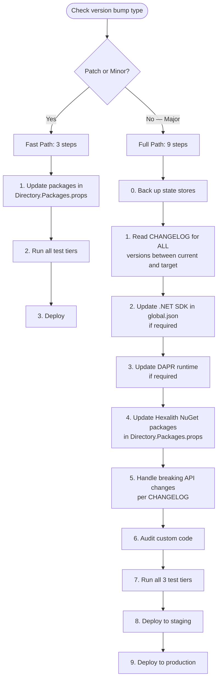

[← Back to Hexalith.EventStore](../../README.md)

# Upgrade Path

This guide documents the general procedure for upgrading between Hexalith.EventStore versions. It covers pre-upgrade checks, the step-by-step upgrade process, dependency compatibility, testing strategy, and rollback planning. For version-specific breaking changes and migration steps, see the [CHANGELOG](../../CHANGELOG.md). For event payload schema evolution strategies, see [Event Versioning & Schema Evolution](../concepts/event-versioning.md).

> **Prerequisites:**
>
> - [CHANGELOG](../../CHANGELOG.md) — version-specific breaking changes and migration steps
> - [Event Versioning & Schema Evolution](../concepts/event-versioning.md) — event payload evolution strategies
> - [Configuration Reference](configuration-reference.md) — all configurable settings

## TL;DR Quick Reference

For most upgrades, follow these five steps:

1. **Check your current Hexalith package versions:**
    - PowerShell: `dotnet list package --include-transitive | Select-String '^\s*>\s+Hexalith\.EventStore\.'`
    - Bash: `dotnet list package --include-transitive | grep -E '^\s*>\s+Hexalith\.EventStore\.'`

2. **Read the CHANGELOG** for your target version's breaking changes (if any)
3. **Update all installed Hexalith.EventStore packages together** in `Directory.Packages.props` — never mix versions
4. **Check `global.json`** SDK pin matches the [dependency compatibility matrix](#dependency-compatibility-matrix)
5. **Run tests:** `dotnet test` across all tiers and deploy

Each step is explained in detail in the sections below. For patch and minor upgrades, this is typically all you need. For major upgrades, read the [full upgrade path](#general-upgrade-procedure).

## Before You Upgrade

Run through this checklist before changing any package versions:

- [ ] **Check current versions:**

    ```bash
    dotnet --version
    dapr --version

    # PowerShell
    dotnet list package --include-transitive | Select-String '^\s*>\s+Hexalith\.EventStore\.'

    # Bash
    dotnet list package --include-transitive | grep -E '^\s*>\s+Hexalith\.EventStore\.'
    ```

- [ ] **Read the CHANGELOG** for your target version's breaking changes and migration steps
- [ ] **Check .NET SDK compatibility** — verify the `global.json` pin matches the target version's requirements (see [dependency matrix](#dependency-compatibility-matrix))
- [ ] **Verify DAPR SDK and runtime compatibility** — check whether the target Hexalith version requires a newer DAPR SDK or runtime
- [ ] **Review event envelope schema changes** — envelope schema changes between Hexalith major versions are treated as major version bumps (see [Event Versioning](../concepts/event-versioning.md))
- [ ] **Ensure all tests pass** on your current version before changing anything
- [ ] **Back up production state stores** before upgrading — see [Disaster Recovery](disaster-recovery.md) for backup procedures

## General Upgrade Procedure

Hexalith follows [Semantic Versioning](https://semver.org/): MAJOR for breaking changes, MINOR for backward-compatible features, PATCH for bug fixes. The upgrade procedure depends on the version bump type.



### Fast Path (Patch and Minor Upgrades)

No breaking changes by SemVer contract. Three steps:

1. Update all installed Hexalith package versions in `Directory.Packages.props`
2. Run all test tiers (see [Testing Your Upgrade](#testing-your-upgrade))
3. Deploy

### Full Path (Major Upgrades)

Major version bumps may introduce breaking changes in three categories:

- **Binary compatibility** — compiled assemblies may fail to load (requires recompilation)
- **Source compatibility** — code may fail to compile (requires code changes)
- **Behavioral compatibility** — code compiles and runs but produces different results (requires logic review)

Follow these steps in order:

0. **Back up state stores** per [Disaster Recovery](disaster-recovery.md)
1. **Read the CHANGELOG** for ALL versions between your current and target version — do not skip intermediate versions even when jumping multiple majors
2. **Update .NET SDK** in `global.json` if the target version requires a newer SDK
3. **Update DAPR runtime** if the target version requires a newer DAPR SDK (see [DAPR compatibility](#dapr-compatibility))
4. **Update Hexalith NuGet packages** in `Directory.Packages.props` — keep every installed Hexalith package on the same version
5. **Handle breaking API changes** per the CHANGELOG migration steps
6. **Audit custom code** (see [Auditing Custom Code](#auditing-custom-code))
7. **Run all 3 test tiers** (see [Testing Your Upgrade](#testing-your-upgrade))
8. **Deploy to staging** and verify end-to-end behavior
9. **Deploy to production**

> **Upgrade order matters.** Always upgrade in dependency order: .NET SDK first, then DAPR runtime, then Hexalith NuGet packages. Hexalith depends on DAPR SDK which depends on .NET — upgrading in reverse order may cause build failures (new Hexalith targets newer SDK) or runtime failures (new DAPR SDK calls APIs unavailable on older runtimes).

### Auditing Custom Code

For major upgrades, review these areas of your codebase for compatibility:

- [ ] Custom `ISerializedEventPayload` implementations — serialization behavior may have changed
- [ ] Custom `IDomainProcessor` implementations — the processor contract may have new requirements
- [ ] Custom validators extending Hexalith base classes — base class signatures may have changed
- [ ] Any code using internal or non-public types — these have no stability guarantee between major versions

> **Warning:** Custom implementations may rely on behavior that changed between major versions. The CHANGELOG documents public API changes, but behavioral changes in base classes may also affect derived types.

## NuGet Package Updates

Hexalith.EventStore publishes 6 NuGet packages, all versioned as a single unit via semantic-release using Conventional Commits. Each release is published under a `v`-prefixed Git tag:

| Package                         | Purpose                                             |
| ------------------------------- | --------------------------------------------------- |
| `Hexalith.EventStore.Contracts` | Domain types: commands, events, results, identities |
| `Hexalith.EventStore.Client`    | Client abstractions and DI registration             |
| `Hexalith.EventStore.Server`    | Server-side domain processors, DAPR integration     |
| `Hexalith.EventStore.SignalR`   | SignalR client helper for projection change signals |
| `Hexalith.EventStore.Testing`   | Testing utilities and helpers                       |
| `Hexalith.EventStore.Aspire`    | .NET Aspire hosting extensions                      |

All packages use centralized version management via [`Directory.Packages.props`](../../Directory.Packages.props). To update, change the version in that single file.

> **Warning:** All installed Hexalith packages **MUST** be updated together — mixed versions are unsupported and **WILL** cause runtime type mismatches. The packages are versioned as a single release unit. Mixing versions (for example, v1 Contracts with v2 Server) means serialized types will not match because packages share contract types such as `EventEnvelope`, `AggregateIdentity`, and `DomainResult` across Client, Server, SignalR, and Testing.

## Dependency Compatibility Matrix

The following table shows which dependency versions are required for each Hexalith major version. For the authoritative version pins for any release, check [`Directory.Packages.props`](../../Directory.Packages.props) at the corresponding release tag.

| Hexalith Version | .NET SDK | DAPR SDK | .NET Aspire | MediatR | FluentValidation |
| ---------------- | -------- | -------- | ----------- | ------- | ---------------- |
| v1 (current)     | 10.0.x   | 1.17.x+  | 13.1.x+     | 14.x    | 12.x             |

> **Note:** This table currently has one row (v1) and is forward-looking — it will grow with each major release.

### DAPR Compatibility

When upgrading Hexalith, check whether the DAPR SDK version changed. If so, update the DAPR runtime **before** updating Hexalith packages — newer DAPR SDKs may call APIs not available on older runtimes.

- Check the DAPR SDK version in `Directory.Packages.props` (look for `Dapr.Client`, `Dapr.AspNetCore`, `Dapr.Actors`)
- If the SDK version increased, update the DAPR runtime first: see the [DAPR migration guides](https://docs.dapr.io/operations/support/support-release-policy/)
- See [DAPR Component Reference](dapr-component-reference.md) for component configuration details

## Event Envelope Schema Changes

Hexalith guarantees backward-compatible reading of all previously persisted event envelopes. Envelope schema changes between Hexalith major versions are treated as **major version bumps**.

> **Upgrading Hexalith does NOT require migrating existing event streams.** Old events are always readable by newer versions. Event sourcing is append-only: the existing stream is never modified.

For event _payload_ schema evolution (adding fields, renaming types, upcasting), see [Event Versioning & Schema Evolution](../concepts/event-versioning.md). This page covers the Hexalith _framework_ upgrade, not individual event schema changes within your domain.

### Snapshot Compatibility

Snapshots contain serialized aggregate state. When the aggregate state shape changes between major versions (for example, new fields added to your state class), old snapshots must remain deserializable. The Counter sample demonstrates the required pattern via the multi-format `RehydrateCount()` method that handles null, typed object, `JsonElement`, and enumerable representations.

For details on snapshot state evolution, see the [Multi-Representation State Handling](../concepts/event-versioning.md#multi-representation-state-handling) section of the Event Versioning guide.

## Testing Your Upgrade

Hexalith uses a 3-tier test strategy. Run all tiers before deploying an upgrade to production:

**Tier 1 — Unit tests (no external dependencies):**

```bash
dotnet test tests/Hexalith.EventStore.Contracts.Tests/
dotnet test tests/Hexalith.EventStore.Client.Tests/
dotnet test tests/Hexalith.EventStore.Sample.Tests/
dotnet test tests/Hexalith.EventStore.Testing.Tests/
```

**Tier 2 — Integration tests (requires DAPR slim init):**

```bash
dapr init --slim
dotnet test tests/Hexalith.EventStore.Server.Tests/
```

**Tier 3 — Aspire end-to-end contract tests (requires full DAPR init + Docker):**

```bash
dapr init
dotnet test tests/Hexalith.EventStore.IntegrationTests/
```

> **Warning:** Never skip Tier 2 tests, even for seemingly minor upgrades. Event stream and DAPR integration issues often only manifest with actual DAPR sidecars.

### What Test Failures Signal

| Failure Type       | Likely Cause                     | Action                                                          |
| ------------------ | -------------------------------- | --------------------------------------------------------------- |
| Compilation errors | API breaking change              | Check CHANGELOG migration steps, update calling code            |
| Tier 1 failures    | Logic or behavioral change       | Review CHANGELOG behavioral changes, update assertions or logic |
| Tier 2 failures    | DAPR or integration change       | Check DAPR SDK/runtime compatibility, review component configs  |
| Tier 3 failures    | Topology or orchestration change | Check Aspire hosting version, review AppHost configuration      |

## Rollback Strategy

If an upgrade fails after deployment:

1. **Revert NuGet packages** in `Directory.Packages.props` to the previous version
2. **Redeploy the previous version** of your application
3. **Existing event streams remain intact** — event sourcing is append-only, so no data is lost

Domain service version routing via the DAPR configuration store enables zero-downtime rollback: update the config store mapping back to the previous version without redeployment. See [Configuration Reference — Domain Services](configuration-reference.md) for the routing configuration format.

> **Note:** Events written by the newer version remain in the stream but are safe. The error-first philosophy (`UnknownEventException`) will surface them explicitly during rehydration rather than silently corrupting state. Redeploy the newer version to process those events, or add backward-compatible deserializers to the older version.

For full backup and restore procedures, see [Disaster Recovery](disaster-recovery.md).

## Next Steps

- **Related:** [CHANGELOG](../../CHANGELOG.md) — version-specific breaking changes and migration steps
- **Related:** [Event Versioning & Schema Evolution](../concepts/event-versioning.md) — event payload evolution strategies
- **Related:** [Configuration Reference](configuration-reference.md) — all configurable settings
- **Related:** [Troubleshooting](troubleshooting.md) — common issues and solutions
- **Related:** [Disaster Recovery](disaster-recovery.md) — backup and restore procedures
