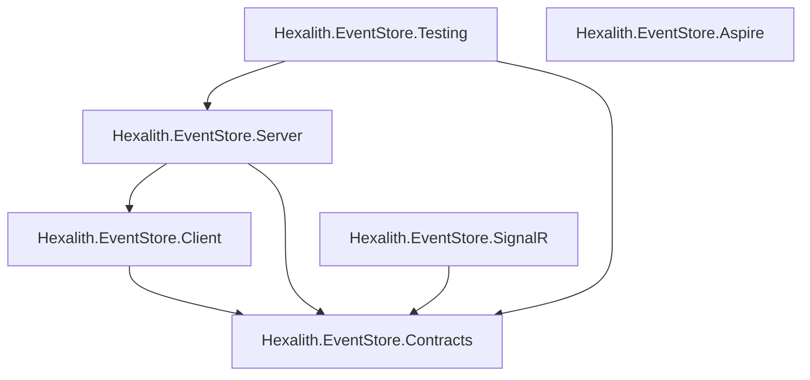

[← Back to Hexalith.EventStore](../../README.md)

# NuGet Packages Guide

Guide to the 6 published Hexalith.EventStore NuGet packages — their purposes, dependency relationships, and which ones to install for your use case. This page is for .NET developers integrating Hexalith.EventStore into their projects.

> **Prerequisites:** [Architecture Overview](../concepts/architecture-overview.md) — you should understand the system topology before choosing packages.

## Package Overview

| Package                       | Description                                                                     | Primary Use Case                                                              | When to Install                                                   |
| ----------------------------- | ------------------------------------------------------------------------------- | ----------------------------------------------------------------------------- | ----------------------------------------------------------------- |
| Hexalith.EventStore.Contracts | Domain types: commands, events, results, identities                             | Define shared command/event contracts and aggregate identity primitives       | Always required — foundational types for any Hexalith integration |
| Hexalith.EventStore.Client    | Client abstractions, domain processor contract, and DI registration             | Register and activate domain processors with fluent `AddEventStore` setup     | In your domain service project to register domain processors      |
| Hexalith.EventStore.Server    | Server-side domain processors, aggregate actors, DAPR state/pub-sub integration | Host command processing, state rehydration, persistence, and event publishing | In the hosting project that runs the event store server           |
| Hexalith.EventStore.SignalR   | SignalR client helper for projection change notifications                       | React to read-model invalidation signals in web or desktop clients            | In UI or integration clients that need live projection refresh    |
| Hexalith.EventStore.Testing   | In-memory fakes, builders, and test helpers for unit/integration testing        | Build deterministic tests for command/event flows without real infrastructure | In your test projects                                             |
| Hexalith.EventStore.Aspire    | .NET Aspire hosting extensions for DAPR topology orchestration                  | Compose the local distributed topology in an Aspire AppHost                   | In your AppHost project for local development orchestration       |

## Dependency Graph



<details>
<summary>Text description of the dependency graph</summary>

- **Contracts** is the root Hexalith package. It has no dependency on any other Hexalith.EventStore package, but it does depend on `Hexalith.Commons.UniqueIds` for ULID generation.
- **Client** depends on Contracts.
- **Server** depends on both Client and Contracts.
- **SignalR** depends on Contracts and adds a lightweight helper over `Microsoft.AspNetCore.SignalR.Client`.
- **Testing** depends on both Contracts and Server (it provides fake implementations of server-side components for integration testing).
- **Aspire** is fully independent — it has no dependency on any other Hexalith.EventStore package. It only depends on Aspire hosting libraries.

</details>

> **Note:** All 6 packages always ship at the same semantic version. Install matching versions to avoid compatibility issues.

## Which Packages Do I Need?

### Building a domain service

Install **Contracts** + **Client**.

Contracts gives you the domain types (commands, events, results). Client gives you the `AddEventStore` DI registration and the domain processor contract for wiring your domain logic into the event store pipeline.

```bash
$ dotnet add package Hexalith.EventStore.Contracts
$ dotnet add package Hexalith.EventStore.Client
```

### Running the event store server

Install **Contracts** + **Server**.

Server provides the aggregate actors, command routing, and DAPR state/pub-sub integration needed to host the event store processing pipeline.

```bash
$ dotnet add package Hexalith.EventStore.Contracts
$ dotnet add package Hexalith.EventStore.Server
```

### Testing your domain service

Install **Testing** (transitively pulls Contracts + Server).

Testing provides in-memory implementations, fake state stores, and test builders so you can unit-test and integration-test your domain logic without running DAPR.

```bash
$ dotnet add package Hexalith.EventStore.Testing
```

### Reacting to projection changes in a client

Install **SignalR**.

SignalR provides `EventStoreSignalRClient`, a small helper that connects to `/hubs/projection-changes`, joins projection groups, and automatically rejoins them after reconnects.

SignalR notifications are invalidation signals only. They do not contain projection data, ETags, command status, or a replay of missed signals. The Query API remains the authoritative source for current projection state.

Do:

- Query the HTTP Query API on initial load to establish baseline state.
- Re-query after known reconnect, browser resume, page restore, or known downtime.
- Treat `ProjectionChanged` as a refresh hint and use `If-None-Match` to keep unchanged cached UI state.

Do not:

- Treat SignalR notifications as projection data, command status, ETags, or replayed missed notifications.
- Rely on group rejoin to make a UI current after downtime.
- Document exact reconnect timing as an EventStore guarantee; timing comes from the configured SignalR retry policy.

```bash
$ dotnet add package Hexalith.EventStore.SignalR
```

### Local development with Aspire

Install **Aspire** in your AppHost project.

Aspire provides the `AddEventStore` hosting extension for orchestrating the full DAPR topology (event store server, sidecars, state stores, pub/sub) in your local Aspire development environment.

```bash
$ dotnet add package Hexalith.EventStore.Aspire
```

### Full stack (domain service + hosting + testing)

Install packages across your projects based on their role:

| Project                  | Packages          |
| ------------------------ | ----------------- |
| Domain service library   | Contracts, Client |
| Event store host         | Contracts, Server |
| UI or integration client | SignalR           |
| Test project             | Testing           |
| Aspire AppHost           | Aspire            |

## Package Details

### Hexalith.EventStore.Contracts

Pure domain types — `CommandEnvelope`, `EventEnvelope`, `DomainResult`, identity types. This package has no dependency on any other Hexalith.EventStore package and has a single external dependency for ULID generation.

**Key namespaces and types:**

- `Hexalith.EventStore.Contracts.Commands` — `CommandEnvelope`, `CommandStatus`, `ArchivedCommand`
- `Hexalith.EventStore.Contracts.Events` — `EventEnvelope`, `EventMetadata`, `IEventPayload`, `IRejectionEvent`
- `Hexalith.EventStore.Contracts.Identity` — `AggregateIdentity`, `IdentityParser`
- `Hexalith.EventStore.Contracts.Results` — `DomainResult`, `DomainServiceWireResult`

**External dependencies:**

| Package                    | Version |
| -------------------------- | ------- |
| Hexalith.Commons.UniqueIds | 2.13.0  |

```bash
$ dotnet add package Hexalith.EventStore.Contracts
```

### Hexalith.EventStore.Client

DI registration, domain processor abstractions, and the fluent `AddEventStore` extension method with assembly scanning and cascading configuration.

**Key namespaces and types:**

- `Hexalith.EventStore.Client.Registration` — `EventStoreServiceCollectionExtensions`, `EventStoreHostExtensions`
- `Hexalith.EventStore.Client.Handlers` — `IDomainProcessor`, `DomainProcessorBase`
- `Hexalith.EventStore.Client.Discovery` — `AssemblyScanner`, `DiscoveredDomain`
- `Hexalith.EventStore.Client.Conventions` — `NamingConventionEngine`
- `Hexalith.EventStore.Client.Configuration` — `EventStoreOptions`, `EventStoreDomainOptions`

**External dependencies:**

| Package                                   | Version |
| ----------------------------------------- | ------- |
| Dapr.Client                               | 1.17.7  |
| Microsoft.Extensions.Configuration.Binder | 10.0.0  |
| Microsoft.Extensions.Hosting.Abstractions | 10.0.0  |

```bash
$ dotnet add package Hexalith.EventStore.Client
```

### Hexalith.EventStore.Server

Aggregate actors, command routing, event persistence, state rehydration, and DAPR state/pub-sub integration. This package depends on both Client and Contracts because the server builds on the client-side registration and domain processor abstractions.

**Key namespaces and types:**

- `Hexalith.EventStore.Server.Actors` — `AggregateActor`, `ActorStateMachine`, `IdempotencyChecker`
- `Hexalith.EventStore.Server.Commands` — `CommandRouter`, `DaprCommandStatusStore`, `DaprCommandArchiveStore`
- `Hexalith.EventStore.Server.Events` — `EventPersister`, `EventStreamReader`, `SnapshotManager`, `EventPublisher`
- `Hexalith.EventStore.Server.DomainServices` — `DaprDomainServiceInvoker`, `DomainServiceResolver`
- `Hexalith.EventStore.Server.Configuration` — `ServiceCollectionExtensions`, `SnapshotOptions`

**External dependencies:**

| Package                | Version |
| ---------------------- | ------- |
| Dapr.Client            | 1.17.7  |
| Dapr.Actors            | 1.17.7  |
| Dapr.Actors.AspNetCore | 1.17.7  |
| MediatR                | 14.0.0  |

```bash
$ dotnet add package Hexalith.EventStore.Server
```

### Hexalith.EventStore.SignalR

Signal-only client helper for projection change notifications. This package is designed for read-model consumers that want to refresh cached or displayed projection data when the server announces a change. It wraps the hub connection and group membership mechanics, including internal group rejoin after reconnect. Applications still own current-state refresh by querying the HTTP Query API on initial load and after lifecycle events they can observe.

`EventStoreSignalRClientOptions.AccessTokenProvider` supplies bearer tokens for hub authentication. `RetryPolicy` controls SignalR reconnect behavior, and `ConfigureHttpConnection` customizes the underlying HTTP connection options. The current helper does not expose a public reconnected event or callback for consumer refresh logic.

When naming projection types, use short names for compact ETags — see [Projection Type Naming](query-api.md#projection-type-naming).

**Key namespace and types:**

- `Hexalith.EventStore.SignalR` — `EventStoreSignalRClient`, `EventStoreSignalRClientOptions`

**External dependencies:**

| Package                             | Version |
| ----------------------------------- | ------- |
| Microsoft.AspNetCore.SignalR.Client | 10.0.5  |

```bash
$ dotnet add package Hexalith.EventStore.SignalR
```

### Hexalith.EventStore.Testing

Test helpers, in-memory fakes, and builders for unit and integration testing. Depends on Server (not just Contracts) because it provides fake implementations of server-side components like state stores and test builders.

**Key namespaces and types:**

- `Hexalith.EventStore.Testing.Builders` — `CommandEnvelopeBuilder`, `EventEnvelopeBuilder`, `AggregateIdentityBuilder`
- `Hexalith.EventStore.Testing.Fakes` — `InMemoryStateManager`, `FakeDomainServiceInvoker`, `FakeEventPublisher`
- `Hexalith.EventStore.Testing.Assertions` — `DomainResultAssertions`, `EventEnvelopeAssertions`, `StorageKeyIsolationAssertions`

**External dependencies:**

| Package      | Version |
| ------------ | ------- |
| Shouldly     | 4.3.0   |
| NSubstitute  | 5.3.0   |
| xunit.assert | 2.9.3   |

```bash
$ dotnet add package Hexalith.EventStore.Testing
```

### Hexalith.EventStore.Aspire

.NET Aspire hosting extensions for DAPR topology orchestration. Fully independent — no dependency on any other Hexalith.EventStore package.

**Key namespace and types:**

- `Hexalith.EventStore.Aspire` — `HexalithEventStoreExtensions`, `HexalithEventStoreResources`

**External dependencies:**

| Package                              | Version |
| ------------------------------------ | ------- |
| Aspire.Hosting                       | 13.1.2  |
| CommunityToolkit.Aspire.Hosting.Dapr | 13.0.0  |

```bash
$ dotnet add package Hexalith.EventStore.Aspire
```

## Versioning

All 6 packages use automated semantic versioning via semantic-release. Release versions are derived from Conventional Commit history on `main`, then published under `v`-prefixed Git tags (for example, release `1.2.0` is tagged as `v1.2.0`).

All package versions are centralized in `Directory.Packages.props` at the repository root. Every package always ships at the same version — there is no mix-and-match between package versions.

Browse all published packages on [NuGet.org](https://www.nuget.org/packages?q=Hexalith.EventStore).

## Next Steps

**Next:** [Command API Reference](command-api.md) — look up write-side endpoints with request/response examples

**Related:** [Query & Projection API Reference](query-api.md) | [API Reference](api/index.md) — auto-generated type documentation for all public APIs | [Architecture Overview](../concepts/architecture-overview.md) | [First Domain Service](../getting-started/first-domain-service.md) | [Quickstart](../getting-started/quickstart.md)
