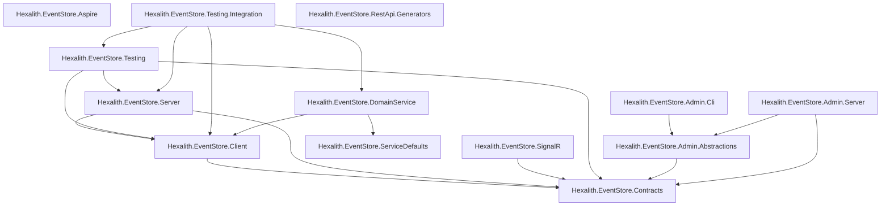

[← Back to Hexalith.EventStore](../../README.md)

# NuGet Packages Guide

Guide to the manifest-driven Hexalith.EventStore NuGet package set — their purposes, dependency relationships, and which ones to install for your use case. This page is for .NET developers integrating Hexalith.EventStore into their projects.

> **Prerequisites:** [Architecture Overview](../concepts/architecture-overview.md) — you should understand the system topology before choosing packages.

## Package Overview

| Package | Description | Primary Use Case | When to Install |
| --- | --- | --- | --- |
| Hexalith.EventStore.Contracts | Domain types plus public gateway wire DTOs, REST contract metadata, and ProblemDetails extension names | Define shared command/event/query contracts and build HTTP gateway request bodies | Foundational contract package for Hexalith integrations |
| Hexalith.EventStore.Client | Client abstractions, domain processor registration, read-model seams, and HTTP gateway client | Register domain processors or call the public command/query HTTP gateway | In UI, integration, external API host, or domain SDK consumer projects |
| Hexalith.EventStore.Server | Server-side domain processors, aggregate actors, DAPR state/pub-sub integration | Host command processing, state rehydration, persistence, and event publishing | In the hosting project that runs the event store server |
| Hexalith.EventStore.SignalR | SignalR client helper for projection change notifications | React to read-model invalidation signals in web or desktop clients | In clients that need live projection refresh |
| Hexalith.EventStore.Testing | In-memory fakes, gateway doubles, builders, and test helpers | Build deterministic tests for command/event and public gateway flows | In unit or integration test projects |
| Hexalith.EventStore.Testing.Integration | DAPR/Aspire integration-test harness for domain modules | Run repeatable topology-backed domain-service tests | In Docker/Aspire integration test projects |
| Hexalith.EventStore.Aspire | .NET Aspire hosting extensions for DAPR topology orchestration | Compose the local distributed topology in an Aspire AppHost | In your AppHost project for local development orchestration |
| Hexalith.EventStore.ServiceDefaults | Shared OpenTelemetry, health-check, HTTP-resilience, and service-discovery defaults | Apply the platform's observability/resilience defaults to a domain service or API host | Transitively via DomainService, or directly in dedicated API hosts |
| Hexalith.EventStore.DomainService | Domain-service host SDK — convention discovery, DAPR endpoints, query/projection seams, telemetry, health | Author a domain module with only domain code plus a two-line host | The single platform reference a new domain module needs |
| Hexalith.EventStore.RestApi.Generators | Roslyn source-generator/analyzer package distributed under `analyzers/dotnet/cs` | Generate typed REST controllers from `ICommandContract` and `IQueryContract` messages | As an analyzer reference in dedicated external API host projects |
| Hexalith.EventStore.Admin.Abstractions | Admin service DTOs and interfaces shared by admin clients and services | Build admin UI, CLI, MCP, or server integrations against the admin contract | In admin-facing clients or implementations |
| Hexalith.EventStore.Admin.Cli | Packaged `eventstore-admin` .NET tool | Manage streams, projections, snapshots, backups, tenants, and health from the terminal | Install as a .NET tool for operators or CI/CD |
| Hexalith.EventStore.Admin.Server | DAPR-backed admin service implementations | Host reusable admin backend services for UI, CLI, and MCP surfaces | In the admin server host |

## Dependency Graph



<details>
<summary>Text description of the dependency graph</summary>

- **Contracts** is the root Hexalith package. It has no dependency on any other Hexalith.EventStore package, and its only intentional external package dependency is `Hexalith.Commons.UniqueIds` for ULID generation. It owns the implementation-neutral projection query contract and wire DTOs without referencing DAPR, gRPC, or protobuf packages.
- **Client** depends on Contracts.
- **Server** depends on both Client and Contracts.
- **SignalR** depends on Contracts and adds a lightweight helper over `Microsoft.AspNetCore.SignalR.Client`.
- **Testing** depends on Client, Contracts, and Server (it provides gateway doubles plus fake implementations of server-side components for integration testing).
- **Testing.Integration** builds on Testing, Client, Server, and DomainService for DAPR/Aspire-backed integration fixtures.
- **Aspire** is fully independent — it has no dependency on any other Hexalith.EventStore package. It only depends on Aspire hosting libraries.
- **ServiceDefaults** is a shared service-configuration package (OpenTelemetry, health checks, HTTP resilience, service discovery). It is consumed transitively by the DomainService SDK.
- **DomainService** is the domain-service host SDK. It depends on Client and ServiceDefaults and bundles all hosting/DAPR-endpoint/discovery boilerplate so a domain module references only this one package.
- **RestApi.Generators** is an analyzer/source-generator package. It is consumed as an analyzer reference and does not expose runtime `lib/` assets.
- **Admin.Abstractions** depends on Contracts.
- **Admin.Cli** depends on Admin.Abstractions and is packed as the `eventstore-admin` tool.
- **Admin.Server** depends on Admin.Abstractions and Contracts and provides DAPR-backed admin service implementations.

</details>

> **Note:** Every package listed in `tools/release-packages.json` ships at the same semantic version. Install matching versions to avoid compatibility issues.

## Source vs Package Dependencies

Inside this repository, cross-repo Hexalith library dependencies are configuration-keyed:

- Debug builds use `ProjectReference` when the root-declared submodule source is present.
- Release builds and package publication use `PackageReference` versions pinned in `Directory.Packages.props`.

Use `-p:UseHexalithProjectReferences=true` only for intentional source-debug sessions. Published
`Hexalith.EventStore.*` packages must describe external Hexalith libraries as NuGet package dependencies, not
as source project edges.

## Which Packages Do I Need?

### Building a domain service

Install **DomainService**.

DomainService gives a domain module the SDK surface for convention discovery, DAPR endpoints, telemetry, health checks, query handlers, projections, read-model storage, and cursor seams. Domain modules should stay domain-centric and not re-implement hosting boilerplate.

```bash
$ dotnet add package Hexalith.EventStore.DomainService
```

### Running the event store server

Install **Contracts** + **Server**.

Server provides the aggregate actors, command routing, and DAPR state/pub-sub integration needed to host the event store processing pipeline.

```bash
$ dotnet add package Hexalith.EventStore.Contracts
$ dotnet add package Hexalith.EventStore.Server
```

### Calling the public HTTP gateway

Install **Contracts** + **Client**.

Contracts gives you the gateway request and response DTOs for `POST /api/v1/commands` and `POST /api/v1/queries`, including public query policy and response metadata types. Client gives you `IEventStoreGatewayClient`, which handles HTTP posting, `If-None-Match`, `304 Not Modified`, ProblemDetails mapping, typed query payloads, metadata propagation, and cancellation.

```bash
$ dotnet add package Hexalith.EventStore.Contracts
$ dotnet add package Hexalith.EventStore.Client
```

Do not reference `Hexalith.EventStore` or `Hexalith.EventStore.Server` just to call the gateway. Those assemblies are runtime/internal boundaries for hosting EventStore. The command wrappers under `Hexalith.EventStore.Models` are compatibility-only delegates to the Contracts DTOs and are not the preferred downstream integration surface.

### Generating typed REST controllers for a domain

Create a dedicated external API host. Reference **Contracts** for message metadata, **Client** for `IEventStoreGatewayClient`, **ServiceDefaults** for host defaults, and **RestApi.Generators** as an analyzer package.

REST controllers are generated from `ICommandContract` and `IQueryContract` messages into dedicated external-facing API hosts. Interactive UI hosts consume EventStore Client libraries and must not host generated or hand-written per-message MVC command/query controllers.

```bash
$ dotnet add package Hexalith.EventStore.Contracts
$ dotnet add package Hexalith.EventStore.Client
$ dotnet add package Hexalith.EventStore.ServiceDefaults
$ dotnet add package Hexalith.EventStore.RestApi.Generators
```

When using a project reference during local development, reference the generator with analyzer metadata:

```xml
<ProjectReference Include="..\..\src\Hexalith.EventStore.RestApi.Generators\Hexalith.EventStore.RestApi.Generators.csproj"
                  OutputItemType="Analyzer"
                  ReferenceOutputAssembly="false" />
```

### Serving projection queries

Install **Contracts** in the project that exposes a downstream projection query method contract. DAPR actor hosting projects add DAPR actor packages themselves; pure gateway, Contracts, and Parties-style downstream client projects do not need DAPR packages to consume Contracts or gateway DTOs.

Contracts contains the public generic query boundary:

- `IProjectionActor` - the implementation-neutral projection query method contract EventStore invokes by method name.
- `QueryEnvelope` - the actor wire envelope with tenant, domain, aggregate, query type, payload bytes, correlation, user, and optional entity ID.
- `QueryResult` - the actor response with success flag, UTF-8 JSON payload bytes, error message, and optional projection type metadata.
- `QueryAdapterFailureReason` - coarse adapter-edge categories such as `missing-payload`, `serialization-failure`, and `actor-response-mismatch`.

```bash
$ dotnet add package Hexalith.EventStore.Contracts
```

Do not reference `Hexalith.EventStore.Server` just to implement query serving. Server contains runtime implementations such as `CachingProjectionActor`, `EventReplayProjectionActor`, `QueryRouter`, and `QueryActorIdHelper`; those are EventStore internals or optional host-side helpers, not the downstream public adapter requirement.

Existing source that imported `QueryEnvelope`, `QueryResult`, or `IProjectionActor` from `Hexalith.EventStore.Server.Actors` should migrate to `Hexalith.EventStore.Contracts.Queries`. The data contract member names and order are preserved; the namespace move makes the public package boundary explicit.

Before ES9, documentation described projection query contracts as DAPR actor contracts. After ES9, `Hexalith.EventStore.Contracts` defines runtime-neutral query contracts and wire DTOs. DAPR actor packages are referenced only by hosting/adapter projects that execute those contracts through DAPR. Existing DAPR actor implementers should mirror the neutral `QueryAsync(QueryEnvelope)` method on their runtime-owned DAPR actor interface, because DAPR actor interface hierarchies must ultimately derive from `Dapr.Actors.IActor`. Removing `Dapr.Actors.IActor` inheritance from the public Contracts interface is source-compatible for consumers that only call or implement `QueryAsync(QueryEnvelope)`, but source/binary breaking for consumers that rely on `IProjectionActor` being assignable to `IActor`; release as a major-version change unless pre-1.0 compatibility rules explicitly apply.

Parties follow-up: after consuming an EventStore build with ES9, relax the Parties `ClientArchitecturalFitnessTests` leaked-set pin that expected the previous Contracts DAPR dependency.

### Testing your domain service or gateway caller

Install **Testing** (transitively pulls Client, Contracts, and Server).

Testing provides in-memory implementations, fake state stores, deterministic gateway doubles, and test builders so you can unit-test and integration-test your domain logic or gateway caller behavior without running DAPR, Aspire, or a live HTTP gateway.

```bash
$ dotnet add package Hexalith.EventStore.Testing
```

### Reacting to projection changes in a client

Install **SignalR**.

SignalR provides `EventStoreSignalRClient`, a small helper that connects to `/hubs/projection-changes`, joins projection groups, and automatically rejoins them after reconnects.

SignalR notifications are invalidation signals only. They do not contain projection data, ETags, command status, or a replay of missed signals. The Query API remains the authoritative source for current projection state.

Do:

- Query the HTTP Query API on initial load to establish baseline state.
- Re-query after known reconnect, browser resume, page restore, or known downtime.
- Treat `ProjectionChanged` as a refresh hint and use `If-None-Match` to keep unchanged cached UI state.

Do not:

- Treat SignalR notifications as projection data, command status, ETags, or replayed missed notifications.
- Rely on group rejoin to make a UI current after downtime.
- Document exact reconnect timing as an EventStore guarantee; timing comes from the configured SignalR retry policy.

```bash
$ dotnet add package Hexalith.EventStore.SignalR
```

### Local development with Aspire

Install **Aspire** in your AppHost project.

Aspire provides the `AddEventStore` hosting extension for orchestrating the full DAPR topology (event store server, sidecars, state stores, pub/sub) in your local Aspire development environment.

```bash
$ dotnet add package Hexalith.EventStore.Aspire
```

### Full stack (domain service + hosting + testing)

Install packages across your projects based on their role:

| Project                        | Packages          |
| ------------------------------ | ----------------- |
| Domain service host            | DomainService     |
| Downstream projection actor    | Contracts         |
| Event store host               | Contracts, Server |
| UI or integration client       | SignalR           |
| Dedicated external API host    | Contracts, Client, ServiceDefaults, RestApi.Generators (analyzer) |
| Test project                   | Testing           |
| Topology integration tests     | Testing.Integration |
| Aspire AppHost                 | Aspire            |

## Package Details

### Hexalith.EventStore.Contracts

Pure domain types plus stable public gateway wire contracts. This package contains `CommandEnvelope`, `EventEnvelope`, `DomainResult`, identity types, command/query gateway DTOs, validation DTOs, the implementation-neutral projection query contract, projection query wire DTOs, and stable ProblemDetails extension-name constants. It has no dependency on any other Hexalith.EventStore package and has a single external dependency for ULID generation.

**Key namespaces and types:**

- `Hexalith.EventStore.Contracts.Commands` — `SubmitCommandRequest`, `SubmitCommandResponse`, `CommandEnvelope`, `CommandStatus`, `ArchivedCommand`
- `Hexalith.EventStore.Contracts.Events` — `EventEnvelope`, `EventMetadata`, `IEventPayload`, `IRejectionEvent`
- `Hexalith.EventStore.Contracts.Identity` — `AggregateIdentity`, `IdentityParser`
- `Hexalith.EventStore.Contracts.Problems` — `GatewayProblemDetailsExtensions`
- `Hexalith.EventStore.Contracts.Queries` — `SubmitQueryRequest`, `SubmitQueryResponse`, `QueryPagingOptions`, `QueryFilter`, `QuerySort`, `QueryFreshnessPolicy`, `QueryResponseMetadata`, `QueryPagingMetadata`, `QueryProblemReasonCodes`, `QueryWarningCodes`, `IQueryContract`, `QueryContractMetadata`, `IProjectionActor`, `QueryEnvelope`, `QueryResult`, `QueryAdapterFailureReason`
- `Hexalith.EventStore.Contracts.Results` — `DomainResult`, `DomainServiceWireResult`

**External dependencies:**

| Package                    | Version |
| -------------------------- | ------- |
| Hexalith.Commons.UniqueIds | see `Directory.Packages.props` |

```bash
$ dotnet add package Hexalith.EventStore.Contracts
```

### Hexalith.EventStore.Client

DI registration, domain processor abstractions, the fluent `AddEventStore` extension method, and the high-level public gateway HTTP client.

**Key namespaces and types:**

- `Hexalith.EventStore.Client.Registration` — `EventStoreServiceCollectionExtensions`, `EventStoreHostExtensions`
- `Hexalith.EventStore.Client.Gateway` — `IEventStoreGatewayClient`, `EventStoreGatewayClient`, `EventStoreGatewayException`, `EventStoreQueryResult`
- `Hexalith.EventStore.Client.Handlers` — `IDomainProcessor`, `DomainProcessorBase`
- `Hexalith.EventStore.Client.Discovery` — `AssemblyScanner`, `DiscoveredDomain`
- `Hexalith.EventStore.Client.Conventions` — `NamingConventionEngine`
- `Hexalith.EventStore.Client.Configuration` — `EventStoreOptions`, `EventStoreDomainOptions`

**Gateway behavior:**

- `SubmitCommandAsync` posts Contracts `SubmitCommandRequest` to `/api/v1/commands` and returns typed `SubmitCommandResponse`.
- `SubmitQueryAsync` posts Contracts `SubmitQueryRequest` to `/api/v1/queries`, sends `If-None-Match` when supplied, maps `304` to `IsNotModified`, returns normalized unquoted ETag tokens, and exposes `QueryResponseMetadata` on typed and untyped query results.
- A query response envelope with `success: false` is treated as semantic gateway failure and throws `EventStoreGatewayException`.
- `EventStoreGatewayException` exposes `statusCode`, `title`, `type`, `detail`, `correlationId`, `tenantId`, `errors`, `reason`, `retryAfter`, and preserved ProblemDetails extensions.

**External dependencies:**

| Package                                   | Version |
| ----------------------------------------- | ------- |
| Dapr.Client                               | 1.17.9  |
| Microsoft.Extensions.Configuration.Binder | 10.0.0  |
| Microsoft.Extensions.Hosting.Abstractions | 10.0.0  |

```bash
$ dotnet add package Hexalith.EventStore.Client
```

### Hexalith.EventStore.Server

Aggregate actors, command routing, event persistence, state rehydration, and DAPR state/pub-sub integration. This package depends on both Client and Contracts because the server builds on the client-side registration and domain processor abstractions.

**Key namespaces and types:**

- `Hexalith.EventStore.Server.Actors` — `AggregateActor`, `ActorStateMachine`, `IdempotencyChecker`
- `Hexalith.EventStore.Server.Commands` — `CommandRouter`, `DaprCommandStatusStore`, `DaprCommandArchiveStore`
- `Hexalith.EventStore.Server.Events` — `EventPersister`, `EventStreamReader`, `SnapshotManager`, `EventPublisher`
- `Hexalith.EventStore.Server.DomainServices` — `DaprDomainServiceInvoker`, `DomainServiceResolver`
- `Hexalith.EventStore.Server.Configuration` — `ServiceCollectionExtensions`, `SnapshotOptions`

**External dependencies:**

| Package                | Version |
| ---------------------- | ------- |
| Dapr.Client            | 1.17.9  |
| Dapr.Actors            | 1.17.9  |
| Dapr.Actors.AspNetCore | 1.17.9  |
| MediatR                | 14.0.0  |

```bash
$ dotnet add package Hexalith.EventStore.Server
```

### Hexalith.EventStore.SignalR

Signal-only client helper for projection change notifications. This package is designed for read-model consumers that want to refresh cached or displayed projection data when the server announces a change. It wraps the hub connection and group membership mechanics, including internal group rejoin after reconnect. Applications still own current-state refresh by querying the HTTP Query API on initial load and after lifecycle events they can observe.

`EventStoreSignalRClientOptions.AccessTokenProvider` supplies bearer tokens for hub authentication. `RetryPolicy` controls SignalR reconnect behavior, and `ConfigureHttpConnection` customizes the underlying HTTP connection options. `ConfigureHttpConnection` runs after `AccessTokenProvider` is wired, so a delegate that sets `connectionOptions.AccessTokenProvider` will override the dedicated option — pick one place to supply the bearer token. The current helper does not expose a public reconnected event or callback for consumer refresh logic.

When naming projection types, use short names for compact ETags — see [Projection Type Naming](query-api.md#projection-type-naming).

**Key namespace and types:**

- `Hexalith.EventStore.SignalR` — `EventStoreSignalRClient`, `EventStoreSignalRClientOptions`

**External dependencies:**

| Package                             | Version |
| ----------------------------------- | ------- |
| Microsoft.AspNetCore.SignalR.Client | 10.0.5  |

```bash
$ dotnet add package Hexalith.EventStore.SignalR
```

### Hexalith.EventStore.Testing

Test helpers, in-memory fakes, deterministic gateway doubles, and builders for unit and integration testing. Depends on Server (not just Contracts) because it also provides fake implementations of server-side components like state stores and test builders. The public gateway fake APIs themselves reuse Contracts DTOs and Client result/exception types.

**Key namespaces and types:**

- `Hexalith.EventStore.Testing.Builders` — `CommandEnvelopeBuilder`, `EventEnvelopeBuilder`, `AggregateIdentityBuilder`, `EventStoreGatewayExceptionBuilder`
- `Hexalith.EventStore.Testing.Fakes` — `FakeEventStoreGatewayClient`, `InMemoryStateManager`, `FakeDomainServiceInvoker`, `FakeEventPublisher`
- `Hexalith.EventStore.Testing.Assertions` — `DomainResultAssertions`, `EventEnvelopeAssertions`, `StorageKeyIsolationAssertions`

`FakeEventStoreGatewayClient` records submitted command/query requests and supplied `If-None-Match` values. It can be configured for command accepted, command ProblemDetails failure, query success with metadata, query semantic failure, query ProblemDetails failure, not-modified with metadata, unavailable, stale/degraded, and deterministic cancellation paths.

`FakeProjectionActor` records public `QueryEnvelope` invocations and returns configurable public `QueryResult` values. Use it for downstream-style projection adapter tests without importing `Hexalith.EventStore.Server.Actors`. The broader Testing package still references Server for runtime test utilities such as aggregate actors, state stores, and pub/sub helpers; that dependency is not required by the public projection fake API surface.

**External dependencies:**

| Package      | Version |
| ------------ | ------- |
| Shouldly     | 4.3.0   |
| NSubstitute  | 5.3.0   |
| xunit.assert | 2.9.3   |

```bash
$ dotnet add package Hexalith.EventStore.Testing
```

### Hexalith.EventStore.Testing.Integration

DAPR/Aspire integration-test harness for EventStore-backed domain modules. It provides reusable sidecar/bootstrap helpers, Aspire topology fixtures, and support-safe diagnostics for tests that must verify real topology behavior.

Use it for Docker/Aspire-backed tests where a simple unit-test fake is insufficient.

```bash
$ dotnet add package Hexalith.EventStore.Testing.Integration
```

### Hexalith.EventStore.Aspire

.NET Aspire hosting extensions for DAPR topology orchestration. Fully independent — no dependency on any other Hexalith.EventStore package.

**Key namespace and types:**

- `Hexalith.EventStore.Aspire` — `HexalithEventStoreExtensions`, `HexalithEventStoreResources`

**External dependencies:**

| Package                              | Version |
| ------------------------------------ | ------- |
| Aspire.Hosting                       | 13.1.2  |
| CommunityToolkit.Aspire.Hosting.Dapr | 13.0.0  |

```bash
$ dotnet add package Hexalith.EventStore.Aspire
```

### Hexalith.EventStore.ServiceDefaults

Shared service configuration for domain services — OpenTelemetry observability, health checks, HTTP resilience, and service discovery defaults. Normally consumed transitively through the DomainService SDK rather than referenced directly.

**Key namespace and types:**

- `Microsoft.Extensions.Hosting` — `AddServiceDefaults`, `MapDefaultEndpoints`

**External dependencies:** OpenTelemetry (exporter/hosting/instrumentation), `Microsoft.Extensions.Http.Resilience`, `Microsoft.Extensions.ServiceDiscovery`.

```bash
$ dotnet add package Hexalith.EventStore.ServiceDefaults
```

### Hexalith.EventStore.DomainService

Domain-service host SDK. A domain module references only this package, writes its domain code (aggregates, commands, events, projections, query handlers, validators, contracts) and a two-line host, and gets all hosting, DAPR-endpoint, observability, discovery, and read-model/cursor seams from the platform. Depends on Client and ServiceDefaults.

**Key namespace and types:**

- `Microsoft.AspNetCore.Builder` — `AddEventStoreDomainService`, `UseEventStoreDomainService`, `MapEventStoreDomainService`
- `Hexalith.EventStore.DomainService` — `IDomainQueryHandler`, `IDomainProjectionHandler`, `EventStoreDomainTelemetry`, `DaprStateStoreHealthCheck`

**External dependencies:** `Dapr.AspNetCore`, `Microsoft.AspNetCore.App` (framework reference).

```bash
$ dotnet add package Hexalith.EventStore.DomainService
```

### Hexalith.EventStore.RestApi.Generators

Roslyn source-generator/analyzer package for typed REST controller generation. It discovers `[assembly: RestApi(...)]` plus `ICommandContract` and `IQueryContract` messages annotated with `[RestRoute]`, then emits gateway-backed ASP.NET Core controllers.

Generated controllers inject `IEventStoreGatewayClient` and call the EventStore gateway. They must not call MediatR, domain services, DAPR actors, state stores, projection actors, or domain query dispatchers directly.

The package is analyzer-only: the generator DLL is distributed under `analyzers/dotnet/cs`, and the NuGet package does not expose runtime `lib/` assets.

```bash
$ dotnet add package Hexalith.EventStore.RestApi.Generators
```

### Hexalith.EventStore.Admin.Abstractions

Admin service interfaces and DTOs shared by the admin Web UI, CLI, MCP surface, and server implementations.

```bash
$ dotnet add package Hexalith.EventStore.Admin.Abstractions
```

### Hexalith.EventStore.Admin.Cli

Packaged .NET tool for operating EventStore from the terminal. It supports stream, projection, snapshot, backup, tenant, and health operations with JSON/CSV/table output for humans and CI/CD.

```bash
$ dotnet tool install --global Hexalith.EventStore.Admin.Cli
```

### Hexalith.EventStore.Admin.Server

DAPR-backed admin service implementations shared by the admin server host and higher-level admin surfaces.

```bash
$ dotnet add package Hexalith.EventStore.Admin.Server
```

## Versioning

The release package inventory is manifest-driven by `tools/release-packages.json`. Every package in that manifest uses automated semantic versioning via semantic-release. Release versions are derived from Conventional Commit history on `main`, then published under `v`-prefixed Git tags (for example, release `1.2.0` is tagged as `v1.2.0`).

All package versions are centralized in `Directory.Packages.props` at the repository root. Every package always ships at the same version — there is no mix-and-match between package versions.

Browse all published packages on [NuGet.org](https://www.nuget.org/packages?q=Hexalith.EventStore).

## Next Steps

**Next:** [Command API Reference](command-api.md) — look up write-side endpoints with request/response examples

**Related:** [Query & Projection API Reference](query-api.md) | [API Reference](api/index.md) — auto-generated type documentation for all public APIs | [Architecture Overview](../concepts/architecture-overview.md) | [First Domain Service](../getting-started/first-domain-service.md) | [Quickstart](../getting-started/quickstart.md)
